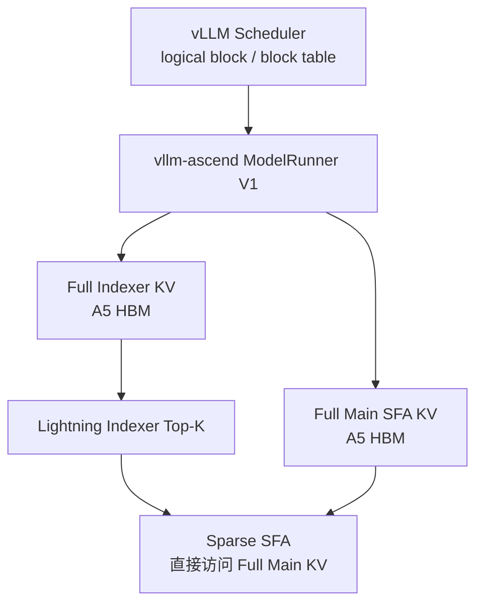
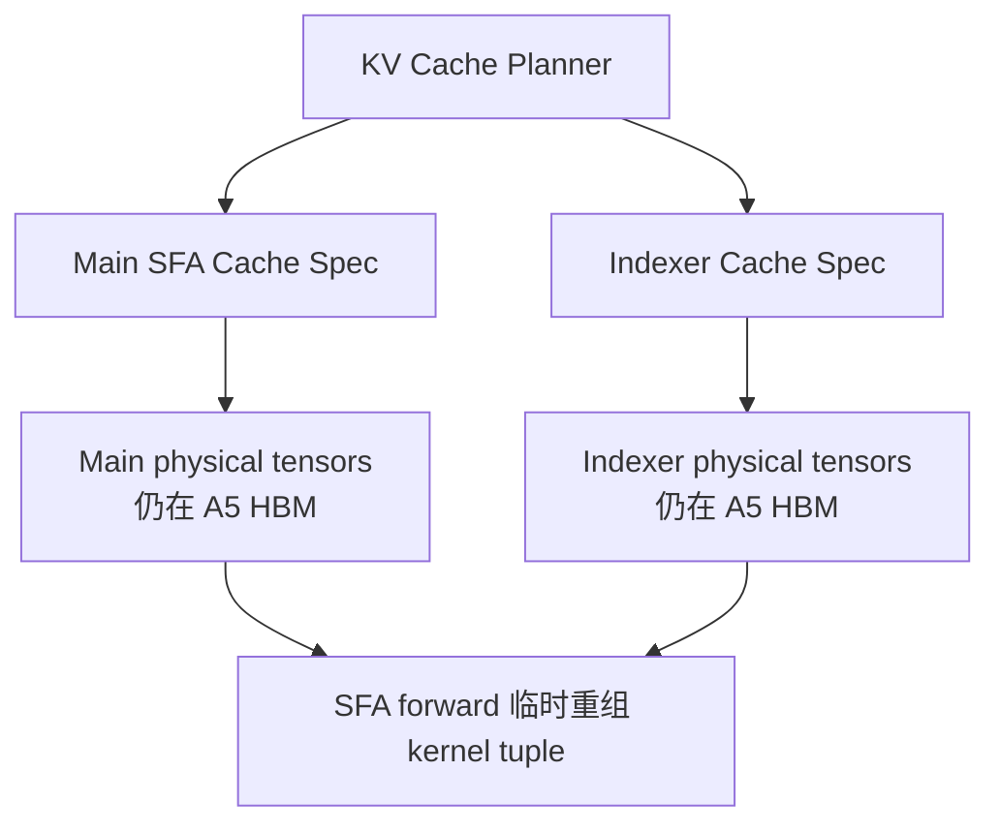
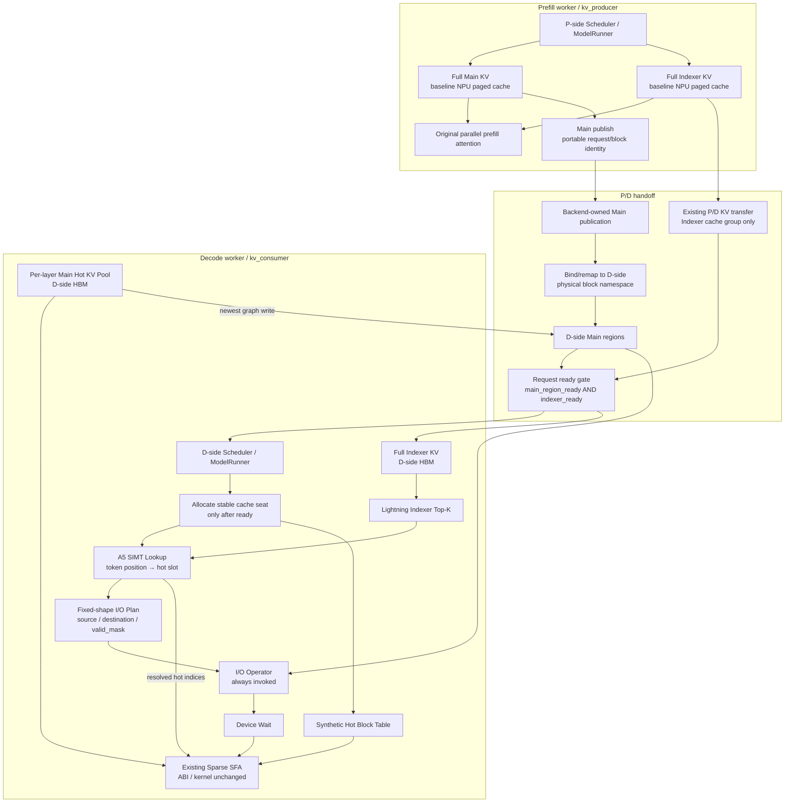
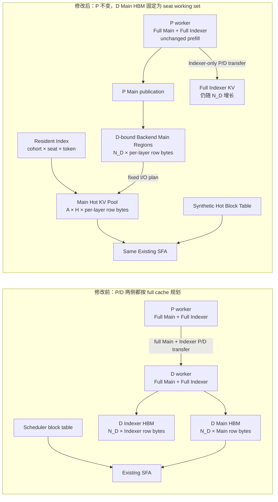
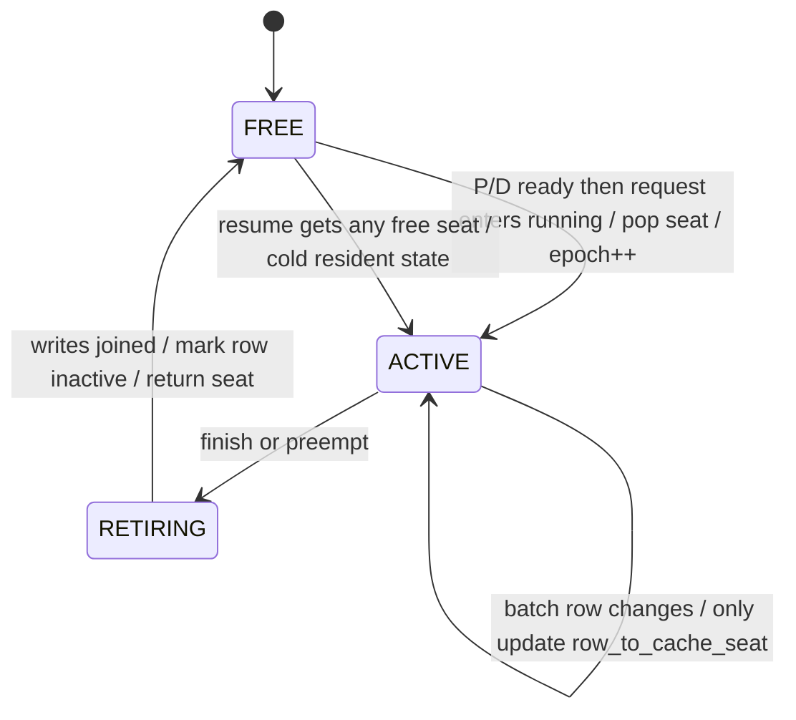

# GLM-5 Ascend A5 DSA Sparse KV Cache Offload 开发计划

> 状态：Task 0 部分完成；Task 1 代码已实现、完整验收待完成；Task 2–4、
> Task 6–7、Task 9 已进入 eager scaffold，Task 5 仅有调用接口打桩，
> Task 8 与 Task 10 尚未开始
>
> 编写日期：2026-07-24
>
> 本次修订：2026-07-27，更新 `dev/a5-glm5-dsa-sparse-eager` 的真实实现
> 状态；本轮只实现 eager scaffold，正式算子、ACL Graph 与 A5 验收后置
>
> 计划存放仓库：ASU-Ascend
>
> 产品代码目标仓库：vllm-ascend
>
> 当前产品分支：`dev/a5-glm5-dsa-sparse-eager`
>
> 当前已提交实现锚点：`923e2ae8`
>
> 当前里程碑：external Main + fixed-HBM eager scaffold

**Goal：** 以 `vllm-ascend v0.23.0rc1` 为唯一 baseline，在不修改
vLLM 的前提下，为 GLM-5 系列实现一套面向 Ascend A5 / Ascend 950、
首期只支持 Prefill/Decode 分离部署的 DSA Sparse KV Cache Offload 框架。

**Architecture：** Prefill worker 保留 baseline 的完整 Main/Indexer NPU
cache 和并行 prefill attention；prefill 完成后，Main KV 由外部 I/O backend
发布并绑定到 Decode worker 的 storage region，Indexer KV 通过 P/D KV
transfer 交付到 Decode worker 的完整 Indexer HBM。只有 Main region 与
Indexer KV 均 ready 后，请求才进入 decode 并领取 cache seat。Decode worker
启动时一次性预分配 `max_num_seqs` 个固定容量 Main Hot KV seats，不分配
full Main NPU payload。Lightning Indexer 的 Top-K token position 直接查询
token 粒度 resident index；查询结果始终形成固定形状 I/O plan，并固定执行
`lookup → I/O → wait → 现有 SFA`。I/O mask 全为 0 时仍保留 I/O 图节点，
只是不发生 payload transfer。SFA 算子、ABI 和 kernel 均不修改。

**Tech Stack：** vLLM-Ascend V1 Runner、Ascend 950、CANN 9.x、
AscendC SIMT、torch/torch-npu custom op、ACL Graph
`FULL_DECODE_ONLY`、GLM-5 Lightning Indexer / Sparse SFA。

---

## 0. 当前实现状态审计

本节记录 2026-07-27 对当前产品分支和 ASU-Ascend 的静态审计结果。状态只
表示代码和可核验验收证据，不表示设计章节是否已经写完。

产品分支满足：

```text
baseline:
    f4a08bddd0cc65a0bd8c3d377b158ae5ca7527db

split Main/Indexer prerequisite:
    a99b89abdb280a21320a482e041be7f66f6bf108

current branch:
    dev/a5-glm5-dsa-sparse-eager

current committed HEAD:
    923e2ae8

commits after release baseline:
    11

implementation commits after split prerequisite:
    10
```

当前 eager scaffold 已按重要节点形成以下产品提交：

```text
a99b89ab  refactor(attention): split SFA indexer KV cache
4b6ebc0d  feat(attention): add DSA sparse eager cache state
c9b09581  feat(attention): add DSA sparse eager I/O flow
e24f1aba  feat(config): gate DSA sparse eager P/D mode
ac089495  feat(attention): add DSA sparse P/D ready lifecycle
ac1440e1  feat(attention): add DSA sparse eager batch contexts
1647d61b  feat(attention): route DSA sparse eager through Hot Cache
83fbf7bf  feat(worker): add DSA sparse eager batch runtime
55eb3401  feat(worker): enter DSA sparse eager runtime
ce8c7902  fix(attention): constrain DSA sparse target eager flow
923e2ae8  feat(worker): externalize DSA sparse Decode Main cache
```

`923e2ae8` 已形成 external Main + fixed-HBM 里程碑：Decode
scheduler 视图只保留 Indexer spec；Main spec 由 worker-local immutable
sidecar 保存，并只在 worker 自有的 `KVCacheConfig` 副本中回填到原 Indexer
group。该回填只恢复 runner/layer metadata，不创建 Main full-size
`KVCacheTensor`。Main layer 的 zero-block layout placeholder 不进入
`KVCacheTensor`、runner 的 connector cache 字典或 connector 注册。固定 Hot
payload、resident state、最大 eager plan，以及 eager batch context/scratch
的最坏逻辑 HBM 峰值在 KV block profile 前统一扣除。

### 0.1 本轮 eager scaffold 范围

本轮是长期目标的可审查 Python/eager 骨架，不改变后续正式交付目标：

- 只允许 `enforce_eager=true`；ACL Graph、capture/replay、正式 A5 SIMT
  lookup 算子与 I/O bridge/build 均刻意后置；
- index 与 I/O 只提供 Protocol/调用接口和显式
  `NotImplementedError` stub，不提供能搬运真实 Main KV 的产品 backend；
- 当前 Decode consumer 仅支持 target-only normal decode，固定
  `max_query_tokens_per_request=1`；D 侧 `num_speculative_tokens != 0`
  在配置期 fail-fast。Prefill producer 保持 baseline speculative 配置与
  full Main/Indexer cache。长期目标中的 D 侧 MTP3/draft 仍保留，但必须在
  独立 target/draft Hot Cache runtime 完成后才能打开；
- eager 调用序列固定为
  `Top-K → lookup → read_async → wait_read → existing SFA`，不按 hit/miss
  建立 Python 控制流；全命中时仍调用 I/O 接口，只是 valid mask 全 0；
- 现有 SFA operator/schema/tiling/kernel 与 `DeviceOperator` 均未修改；
  当前改动只在 Python wrapper 上把 Hot Cache、local indices 和 synthetic
  block table 传给现有 SFA 调用；
- P/D ready lifecycle、seat/epoch、cohort、fixed plan 和 runner context 已有
  可独立测试的状态机，但尚未接到真实 Main publication、Indexer-only
  connector completion 或 scheduler admission；
- `bind_dsa_sparse_eager_runtime()` 目前没有生产调用方，标准启动路径不会
  构造 index/I/O/backend/runtime；若外部未显式绑定 runtime，首个 D decode
  会以 “no runtime is bound” fail-closed，而不是进入不可控 fallback；
- 当前环境只完成隔离的 Python 单测；完整项目测试受本机缺少 `vllm` /
  `torch_npu` 限制，A5 真机、accuracy、graph、performance 结果均不存在。

| Task | 当前状态 | 可核验证据 | 剩余门槛 |
| --- | --- | --- | --- |
| Task 0 | **部分完成** | baseline ancestry 与当前实现 commit 已固定；baseline GLM-5 YAML 存在 | A5 环境记录、baseline 真机结果、ABI/HBM/performance budget 评审 artifact 均未提交 |
| Task 1 | **代码已实现，验收待完成** | `a99b89ab`；独立 spec/backend/allocation/binding 与四 layout unit cases 已写入 | 目标单测、完整 baseline regression、A5 GLM-5/MTP/FULL_DECODE_ONLY 结果尚无可核验记录 |
| Task 2 | **eager adapter 部分完成** | `1647d61b`：Python wrapper 可把 Hot Cache/local indices/synthetic block table 送入现有 SFA；SFA operator/schema/tiling/kernel 零修改 | BF16/C8 真算子 parity、A5 与 graph 验证均未完成 |
| Task 3 | **eager 接口部分完成** | `c9b09581`：backend/operator Protocol、初始化 registry、固定 read/write plan 与显式 stub 已建立 | public C ABI/header、真实 bridge/provider、publication/bind、conformance 与 graph 均未实现 |
| Task 4 | **eager scaffold 部分完成** | `4b6ebc0d`、`923e2ae8`：Hot layout、resident state、seat/epoch、fixed plan；D scheduler 只见 Indexer，worker-local Main sidecar/zero-block placeholder 不分配 full Main；固定逻辑 HBM 预算已接入 | allocator granularity、真实 backend region、runtime factory/资源实例化、A5 allocation 与全模型 HBM 验证未完成 |
| Task 5 | **仅接口打桩** | `4b6ebc0d` 中有 `DSASparseIndexOperator` Protocol 与 fail-fast stub；ASU `d92a249` 仍是算法参考 | vllm-ascend custom op、binding/meta/build、oracle parity、A5 profile 均未实现 |
| Task 6 | **eager 生命周期部分完成** | `4b6ebc0d`、`ac089495`、`ac1440e1`、`83fbf7bf`：seat/epoch、cohort ownership、fixed plan、batch context、dual-ready 状态机 | NPU state op、真实 scheduler/connector bridge、prefix/preemption 集成、MTP/draft runtime 与 graph state 未完成 |
| Task 7 | **eager 数据流 scaffold 部分完成** | `c9b09581`、`1647d61b`、`55eb3401`：Main newest 写 Hot slot、无条件 lookup/I/O/wait、现有 SFA 调用和可注入 runner 入口已接线 | production runtime factory 未接；index/I/O 仍是 stub；真实 payload、newest backend write/join、四布局 A5 parity 与完整 accuracy 未完成 |
| Task 8 | **本轮刻意后置** | eager-only 配置门禁会拒绝 graph 路径 | graph-owned state、capture/replay、MTP descriptor、profile/soak 均未实现 |
| Task 9 | **生命周期 scaffold 部分完成** | `ac089495`：generation-bearing Main/Indexer dual-ready 与 seat admission 状态机；`923e2ae8` 建立 D scheduler Indexer-only 视图 | Main publish/bind、真实 Indexer-only connector projection/completion、scheduler 双-ready bridge、write/release lifecycle 均未实现 |
| Task 10 | **未开始** | 无系统验收 artifact | P/D E2E、profile、性能、soak、backend authoring guide 均不存在 |

本次审计在隔离导入环境中已通过 59 个 cache/index/I/O/eager/lifecycle/
runtime 单测、18 个配置门禁单测和 9 个固定逻辑 HBM 预算单测。完整项目
pytest 仍无法执行：当前审计环境未安装 `vllm`，加载
`tests/ut/conftest.py` 时因 `ModuleNotFoundError: vllm` 终止。因此这些
隔离结果只证明 Python/eager scaffold 的局部行为，不能替代完整 regression、
A5 allocation、P/D E2E 或 accuracy 验收；Task 1 Step 7 和 DoD 仍保持
未完成。

后续更新状态时遵循：

- `[x]` 只表示当前产品提交中已有对应实现；
- A5/CI/accuracy/performance 门槛必须有可定位的日志或 artifact 才能标记完成；
- ASU 原型不计作 vllm-ascend 产品 Task 完成；
- 设计评审通过不等于实现完成。

当前实现只证明 eager scaffold 的对象边界与调用顺序，不能据此声明 DSA
Sparse 功能可用。下一阶段应依次接真实 index operator、I/O
backend/runtime factory、Main publication、Indexer-only connector
projection 与 scheduler dual-ready bridge；graph 和 A5 系统验收继续保持
后置。

---

## 1. 基线与参考锚点

### 1.1 唯一开发 baseline

```text
repository: vllm-project/vllm-ascend
tag:        v0.23.0rc1
commit:     f4a08bddd0cc65a0bd8c3d377b158ae5ca7527db
```

开发分支必须从上述 commit 创建。不得改为基于 vLLM 或更新版
vllm-ascend `main` 开发后再回迁。

### 1.2 必须先迁移的前置实现

[vllm-ascend PR #11647](https://github.com/vllm-project/vllm-ascend/pull/11647)
负责将 Main SFA cache 与 Indexer cache 的 spec、物理 tensor、分配和绑定解耦。

本项目要求：

1. 将 PR #11647 的**语义**迁移到 `v0.23.0rc1`；
2. 形成独立、可审查、可单独验收的 PR；
3. 该 PR 全部测试通过后，才开始 DSA Sparse 数据面开发；
4. 不直接假设 PR 当前 head 与 baseline 接口完全兼容，不机械 cherry-pick；
5. 不在该 PR 中夹带 I/O、hot cache、SIMT lookup 或 SFA remap。

### 1.3 功能和分层参考

[vLLM PR #46326](https://github.com/vllm-project/vllm/pull/46326)
仅用于参考以下行为：

- Main full KV 与 device hot working set 分离；
- hot entry 使用 token position identity；
- Top-K resident lookup、miss 去重、LRU 与 slot remap；
- `FULL_DECODE_ONLY` 静态状态；
- IndexCache group 的 plan-once / follower reuse；
- newest row 不做 storage round-trip。

不得复制或继承其中的 CUDA、pinned-host、NIXL、CPU descriptor、Host pointer
array 和 `host_pool_gib` 实现。

`dev_lookup_maintain_integration` 只作为功能和验收行为参考，不作为实现来源。

### 1.4 A5 SIMT 算子参考

```text
repository: ASU-Ascend
commit:     d92a24971a3188d45659c1384a923e7121e125ef
path:       pta-ops/asu_hbm_index_lookup_simt
```

参考实现位于
[pta-ops/asu_hbm_index_lookup_simt](../../pta-ops/asu_hbm_index_lookup_simt)。

需要保留的是算法语义与 A5 并行映射，不是当前 `ctypes.CDLL` launcher：

- `token position -> hot slot` 双向映射；
- duplicate non-resident entry 的 CAS canonical occurrence；
- victim 双向失效；
- stable batch approximate LRU；
- one AIV core per active batch row，并通过 stable cache seat 访问长期状态；
- 256 SIMT threads；
- 固定 NPU workspace；
- `slot_ids + miss_mask` 固定输出。

正式集成必须成为 vllm-ascend 内可被 ACL Graph 建模的 custom op。

---

## 2. 强约束

以下约束不是可选优化项。

### 2.1 代码范围

- 所有产品代码修改只发生在 `vllm-ascend`。
- 不修改 vLLM 源码。
- ASU-Ascend 只保存本计划、参考算子和后续独立验证材料。
- 不扩展到 GLM-5 之外的模型。
- 不适配 Ascend 910、A2、A3 或其他非 A5 平台。

### 2.2 执行路径

- 首期只支持 P/D 分离部署：Prefill worker 的 `kv_role=kv_producer`，
  Decode worker 的 `kv_role=kv_consumer`；`kv_both`、单实例
  prefill+decode、Decode worker 本地 prefill 和 mixed prefill/decode batch
  均不进入支持矩阵。
- Decode worker 的正式交付路径为 `FULL_DECODE_ONLY`，并强制
  `ascend_compilation_config.enable_npugraph_ex=true`；不满足任一条件即
  启动失败。普通 ACL Graph replay 路径不进入 DSA Sparse 支持矩阵，避免其
  Host-side stream synchronize。
- Prefill worker 继续使用 baseline prefill 路径和完整 NPU Main/Indexer
  cache；首期不让 prefill attention 访问 Decode Hot Cache，也不新增
  layerwise/local prefill staging pool。
- GLM-5 baseline 的 `deepseek_mtp` 与 3 个 speculative tokens 必须保留。
- Decode worker 的 DSA Sparse 新增 token 数据路径中不得出现：
  - `.cpu()`、`.numpy()`、`.item()`；
  - D2H miss count 或 descriptor；
  - CPU pointer/length array；
  - Python 逐 token、逐 miss I/O dispatch；
  - Host callback、worker thread、polling；
  - stream/device synchronize；
  - replay 期间 tensor/workspace 动态分配。
- vLLM 原有 scheduler/control plane 仍负责调度和准备既有 graph input；
  它不得读取、compact、解释或搬运 DSA Sparse I/O plan 与 KV payload。
- row/request/block lifecycle metadata 只允许复用 ModelRunner 既有的固定
  graph-input copy 边界；禁止新增 Python 逐 row/逐 block pass、device value
  readback、同步点或独立 H2D stage。
- P/D handoff 可以在既有 request/block lifecycle control point 传递
  request handle、portable block identity、region handle 和 ready/release
  状态，但 KV payload 不得经过 Python/CPU；这些 control metadata 不得进入
  Decode replay 的逐 token 热路径。

### 2.3 I/O 边界

- vllm-ascend 只提供 I/O ABI、registry、图内状态和时序合同。
- 产品仓库不提供默认 I/O backend。
- 产品仓库不提供 Host、Mooncake、HIXL、NIXL、RDMA、KVIO 或其他存储实现。
- backend-specific 配置由插件拥有，core 不定义 `host_pool_gib`。
- Main KV 的 P→D publication/bind 与 Decode storage read/write 使用同一
  backend capability/region 合同；Indexer KV 继续走既有 P/D KV transfer
  框架，但 DSA Sparse 模式只注册和传输 Indexer cache group。
- P/D 两端的 scheduler physical block id 不要求相同，也不得作为跨实例
  identity。P 端必须按 portable request/block identity 发布，D 端完成到
  自身 physical block/region namespace 的 bind/remap 后才能报告 ready。
- ABI 测试只允许使用仓库外形态的 link-time fake provider fixture；fixture
  仅从安装后的 public header/library 构建，不进入 wheel、安装包、默认构建或
  产品 registry。
- 运行时 I/O 失败按 fail-stop 处理，不实现 retry、rollback 或 fallback。

### 2.4 代码风格

- 不做防御性编程。
- 不为非法状态添加慢速修复分支。
- 状态不变量在初始化、算子前置条件和测试中保证。
- 不提供 dense、full-device、CPU 或其他设备 fallback。
- 命名、日志、异常、custom-op schema、测试组织遵循 vllm-ascend 现有风格。

---

## 3. 目标与非目标

### 3.1 首期目标

1. 首期只支持独立 Prefill worker 与 Decode worker，不支持同一 worker
   同时执行 prefill 和 decode。
2. Prefill worker 保留 baseline 完整 Main/Indexer NPU cache 与并行 prefill，
   不改变 prefill attention 算法。
3. Prefill 完成后，将 Main KV 发布到 backend，将 Indexer KV 交付到
   Decode worker 的完整 Indexer HBM，并以双 ready gate 阻止提前 decode。
4. 只在 Decode worker 上把 Main full KV 从 NPU full-size paged allocation
   中移除；完整历史 Main KV 由 backend region 承载。
5. Decode worker 的 Indexer full KV 继续完整驻留 A5 HBM。
6. Decode worker 上每个 running request / sparse layer 持有固定容量 Main Hot KV；
   request 通过稳定 cache seat 绑定该显存，不能直接使用会被压缩重排的
   batch row 作为长期地址。
7. Top-K 到 hot slot 的所有决策在 NPU 完成。
8. backend read/write 直接消费固定形状 NPU plan。
9. IndexCache leader 生成一次 plan，follower layers 复用。
10. normal decode、MTP3、prefix/block identity、row reuse 均正确。
11. 整个 decode 数据链进入 `FULL_DECODE_ONLY` graph。
12. 外部 backend 无需修改 SFA 或 vLLM KV planner 即可接入。
13. SFA 前的数据路径固定为 `Top-K → lookup → I/O → wait → SFA`，不构造
    resident/non-resident 两条执行路径。

### 3.2 非目标

- 不交付任何生产存储 backend。
- 不承诺真实外部存储带宽、延迟或端到端吞吐。
- 不实现通用模型抽象。
- 不实现其他 SoC kernel。
- 不支持 `kv_both` 或单实例 prefill+decode。
- 不支持 Decode worker 本地 prefill、chunked prefill、mixed
  prefill/decode batch，也不实现 prefill staging pool。
- 不用 Decode Main Hot KV 执行 prefill attention。
- DSA Sparse 首期不支持 DCP；启用 DSA Sparse 时要求
  `decode_context_parallel_size=1`。
- 首期验收配置固定 `pipeline_parallel_size=1` 和
  `prefill_context_parallel_size=1`；本计划保留后续 PP 分层所有权设计，
  但不在首期声明 PP/PCP 已支持。
- 不实现 PIECEWISE 正式路径。
- 不使用 eager 作为生产路径。
- 不改 vLLM scheduler、BlockPool 或核心 KV cache API。
- 不复用 `simple_kv_offload`、`cpu_npu.py`、`swap_blocks_batch` 或现有
  Python storage worker 作为 token 数据面。
- 不实现 IO 失败后的 metadata rollback。

---

## 4. 原始、前置迁移与目标架构

### 4.1 原始 `v0.23.0rc1`



Top-K 已减少注意力计算量，但 Main full KV 仍随完整逻辑 KV block 数增长。

### 4.2 迁移 PR #11647 后



这一阶段只完成所有权与物理分配解耦，本身不是 Offload。

### 4.3 目标架构



这个架构有两个不同的 Main KV 显存所有权：

- Prefill worker 仍分配 full Main NPU cache，因为并行 prefill attention 会
  同时消费大量历史 token，不能用每请求固定长度 Decode Hot Cache 替代；
- Decode worker 不分配 full Main NPU cache，只分配固定 Hot KV pool；
- backend region 是两侧之间唯一的完整 Main KV 持久载体。P 端完成 prompt
  population，D 端继续追加每轮 decode/MTP 新生成的 Main KV。

Indexer KV 不进入 Decode Hot Cache，也不使用 token resident index。P 端
产生的完整 Indexer KV 经 P/D KV transfer 填入 D 端 full Indexer cache，
之后 D 端每轮 decode 继续按 baseline 写入新增 Indexer KV。

### 4.4 P/D handoff 与地址重绑定

P/D 两端的 `physical_block` 只在各自 scheduler 实例内有效。首期明确禁止
把 P 端 `global_slot` 原样当成 D 端 backend address。跨实例 handoff 使用：

```text
portable block identity =
    (request_transfer_id, logical_block_ordinal, optional_content_block_key)
```

其中 `optional_content_block_key` 用于 prefix block 去重/共享；它不能替代
request 内 token position 作为 Decode resident lookup key。

P/D handoff 顺序固定为：

```text
1. P worker 使用 baseline full Main/Indexer cache 完成并行 prefill。
2. P worker 按 layer/rank/plane 将 Main payload 发布到 backend publication。
3. P/D KV transfer 只传输 Indexer cache group。
4. D scheduler 为请求分配自己的 physical blocks，形成 D-side block table。
5. backend 将 publication bind/remap 到 D-side region namespace：
       portable block identity -> D physical block/global slot
6. D full Indexer cache load 完成，设置 indexer_ready。
7. 所有 Main layer/rank/plane bind 完成，设置 main_region_ready。
8. request_ready = main_region_ready && indexer_ready。
9. request_ready 后，请求才能进入 running 并领取 Decode cache seat。
```

步骤 2 和 3 可以并行，步骤 6 和 7 必须通过一个显式 fan-in gate。ready 只
表示 Decode worker 可观察到完整 prompt Main/Indexer KV；不得用“请求已发给
D scheduler”或“某一个 layer 已完成”提前代替。

P-side Main/Indexer source blocks 在相应 publication/transfer completion
之前不得释放或复用。双路 source read 完成后，P worker 才能按既有 P/D
lifecycle 释放请求的 full-cache blocks；这不会影响已建立的 D-side region
和 D full Indexer。

Decode 新生成的 Main KV 使用 D-side block table 生成 D `global_slot`，先写
reserved newest slot，再写回已绑定的 D-side backend region。因此进入 decode
后不再使用 P-side physical block identity。

若 preemption/resume、block eviction 或 prefix remap 导致 D-side block table
变化，旧 region binding 不能继续使用。请求先退出 running、join pending
write、归还 cache seat 并令 `request_ready=false`；随后 backend 将已保留的
portable payload/history 重新 bind 到新的 D physical blocks，同时 Indexer
KV transfer 恢复对应 D blocks。双 ready gate 再次成立后，request 以 cold
Hot Cache 重新领取 seat。只要 backend publication/history 尚未 release，
该过程不要求回到 P worker 重做 prefill。

首期要求 P/D 两侧 checkpoint、Main/Indexer dtype/layout、`block_size`、
TP/PP/DCP/PCP cache shard 方式一致，TP rank 一一对应。P/D 可以拥有不同的
physical block number；不支持跨 TP/PP 重分片。

### 4.5 Decode 图内时序

```text
01  写完整 NPU Indexer KV
02  写本轮 Main KV 到 reserved newest hot slots
03  backend.write_async(newest -> external region)
04  Lightning Indexer Top-K
05  A5 SIMT lookup：token position -> local hot slot，并生成固定形状 I/O plan
06  backend.read_async(plan, valid_mask)；每次都调用
07  device wait(read completion)；每次都调用
08  生成/选择 synthetic hot block table
09  现有 Sparse SFA 使用 resolved local hot indices
10  device wait(write completion) / secondary stream join
11  graph replay 结束
```

第 05 步内部必须判断一个 token 是否已经 resident，否则无法决定是否需要
payload transfer；但该判断只写入 `read_valid_mask`，不得改变后续算子序列。
不存在 Python/C++ 层的 all-resident fast path、non-resident slow path、
条件 I/O 或条件 SFA。全 resident 时第 06 步仍执行，`read_valid_mask` 全为
0，backend op 不提交任何 payload transfer。

任何 backend 辅助 stream 都必须在 graph 结束前通过 event 直接或间接回到
main stream。不得让未完成 payload write 脱离本次 graph 生命周期。

### 4.6 为什么首期只做 P/D

Decode Hot Cache 不能直接承担 prefill attention 的工作集。Decode 每个请求
每轮只有 `T<=4` 个 query，需保护的 Top-K union 上界为 `T*K`；prefill
可能同时有 `P` 个 query，工作集上界接近 `P*K`，并行计算时还会同时引用
大量不同历史 token。把它强行塞入固定 `S` 个可淘汰 slots 会造成同一轮
prefill 内频繁互相淘汰，无法维持当前 decode lookup/LRU 合同。

参考实现中的可选路线如下：

| 路线 | Prefill Main KV 工作集 | Decode Main KV 工作集 | 首期选择 |
| --- | --- | --- | --- |
| P/D 分离 | P worker 使用原 full NPU cache；完成后把 Main 发布到 backend | D worker 固定 Hot Cache | **采用** |
| D worker local/mixed prefill | 从 backend 按本轮唯一 blocks gather 到临时 NPU staging，再做 prefill | 同一 worker 另有 Decode Hot Cache | 不采用 |
| layerwise prefill offload | 2–4 个固定 layer buffers，逐层 onload/offload 并重叠传输 | Decode Hot Cache | 不采用 |

因此首期实现边界是：

- 不修改原始 prefill attention，也不尝试用 token Top-K Hot Cache 并行执行
  prefill；
- 不在 D worker 处理 prefill row，不实现 mixed-batch output stitch；
- 不预留 local prefill staging HBM，`HBM_after` 公式中也没有该项；
- 未来若支持 local prefill，必须设计独立的 per-layer staging pool、block
  remap 和 mixed-batch 调度，不能复用或侵占每请求 Decode cache seat。

该取舍与“Prefill 产生完整历史、Decode 只维护固定工作集”的职责边界一致，
也使首期显存收益可以明确归属到 Decode worker。

---

## 5. 核心术语与不变量

### 5.1 身份

| 名称 | 含义 |
| --- | --- |
| logical block | vLLM scheduler 管理的请求逻辑 block |
| P physical block | Prefill scheduler 实例内的物理 block，只用于 P-side full cache 寻址 |
| D physical block | Decode scheduler 实例内的物理 block，只用于 D-side Indexer/backend region 寻址 |
| D global slot | `D physical_block * block_size + token_offset` |
| portable block identity | P/D handoff identity，至少包含 request transfer id 与 request 内 logical block ordinal，可附带 prefix content key |
| token position | request 内的语义 token 下标；Lightning Indexer Top-K 与 resident lookup 的 key |
| cache seat | running request 在整个驻留期绑定的稳定 Hot Cache 行；不随 batch condense/reorder 改变 |
| batch row | 当前 replay 的临时 request 行号，通过 `row_to_cache_seat` 映射到 cache seat |
| seat epoch | cache seat 每次分配给新 request 时递增，用于清空旧 resident state |
| local hot slot | 单个 cache seat 内的 Main Hot KV slot |
| destination hot row | backend 使用的线性物理行，`cache_seat * H + local_hot_slot` |
| reserved newest slot | 本轮 decode/MTP 新生成 KV 的不可淘汰 slot |
| publication | P 端按 portable block identity 发布的完整 prompt Main KV |
| storage region | backend 为 D-side 单个 layer/rank 注册并绑定到 D physical blocks 的完整 Main KV 区域 |
| read plan | `read_global_slots + read_destination_hot_row_ids + read_valid_mask` |
| write plan | `write_global_slots + write_destination_hot_row_ids + write_valid_mask` |
| lookup group | 同一 residency cohort 内一个 IndexCache leader 及 followers 共享的 plan/state |
| residency cohort | payload 始终同步填充的一组 layer regions；cohort 间 resident state 隔离 |

Top-K token position 是 resident lookup identity，不先改成 global slot。
只有固定 I/O plan 需要通过当前 block table 生成 backend source address：

```text
valid =
    query_valid
    && topk_rank < valid_topk_count
    && 0 <= token_position < seq_len[row]

if valid:
    lookup_key = token_position
    d_physical_block =
        block_table[row, token_position // block_size]
    io_source_d_global_slot =
        d_physical_block * block_size + token_position % block_size
else:
    lookup_key = -1
    io_source_d_global_slot = -1
```

这样 Key 的语义不变：Indexer、resident index 和 LRU 都使用 request 内
token position；D global slot 只属于 Decode storage addressing。P/D handoff
在 request lifecycle 先完成 portable identity 到 D physical block 的 bind，
不能把 P physical block 混入上述公式。`seq_lens`、
query→row/lane、`row_to_cache_seat` 和 block table 均为固定 device graph
input，不得建立 Host location table 或在 CPU 清洗越界 Top-K。

### 5.2 状态不变量

对每个 active cache seat：

```text
token_to_hot[token_position] == local_hot_slot
    <=>
hot_to_token[local_hot_slot] == token_position
```

同时满足：

- P worker 的 full Main/Indexer cache 只服务 prefill 和 P/D publication；
  Decode Hot Cache 不参与 prefill attention；
- D request 在 `main_region_ready && indexer_ready` 之前不得进入 running，
  也不得领取 cache seat；
- P/D bind 后，D-side region 的 slot identity 只使用 D physical block；
  P physical block 不得进入 Decode lookup/I/O plan；
- 一个 running request 只绑定一个 cache seat，一个 cache seat 同时只属于
  一个 running request；
- request 在 batch row 间移动时只更新 `row_to_cache_seat`，不搬运 Hot KV、
  resident index 或 LRU；
- `lru_slots` 是所有可淘汰 hot slots 的无重复排列；
- reserved newest slots 不属于 `lru_slots`；
- `[managed_hot_width, hot_region_stride)` 是物理对齐 padding，永不进入
  lookup、LRU 或 SFA；
- 一轮 Top-K union 内的所有 selected slots 均受保护，不可互相淘汰；
- 同一个非 resident token 的重复 occurrence 只允许一个 canonical
  occurrence 设置 `read_valid_mask=True`；
- padding token position 为 `-1`，输出 `local_hot_slot=-1,
  read_valid_mask=False`；
- seat owner/epoch 变化时，由 NPU state op 重置整行；
- 同一个 lookup group 同时只允许一个 lookup/read/attention 闭环；
- backend read 完成前 Attention 不得消费新分配 hot slot；
- backend write completion 前 reserved slot 不得覆盖；
- graph replay 返回前，本轮 backend write 必须已经 join。

### 5.3 错误模型

只保留两类错误：

1. **初始化/捕获错误：** ABI、capability、layout、capacity 或 graph capture
   不满足时直接启动失败；
2. **执行错误：** backend/device op 失败时使 graph/worker 失败并停止本次推理。

不提供重试、回滚、降级和备用数据路径。

---

## 6. 支持矩阵与配置

> 以下为长期首期交付矩阵。本轮 eager scaffold 的临时实现门禁更窄：
> `enforce_eager=true`；D consumer 只允许 target normal decode 和
> `num_speculative_tokens=0`，P producer 仍保持 baseline MTP 配置；ACL
> Graph 和 D-side MTP/draft 均 fail-fast。这一临时门禁不删除长期目标。

### 6.1 首期支持矩阵

| 维度 | 首期范围 |
| --- | --- |
| SoC | Ascend A5 / Ascend 950 |
| Model | GLM-5 系列，首个验收 checkpoint 沿用 baseline GLM-5 YAML |
| Runner | V1 |
| Deployment | P/D-only；P=`kv_producer`，D=`kv_consumer`；拒绝 `kv_both` |
| Prefill | P worker 原始并行 prefill + full Main/Indexer NPU cache |
| P/D handoff | Main 经 backend publication/bind；Indexer 经既有 P/D KV transfer |
| Decode Graph | D worker `FULL_DECODE_ONLY` + `enable_npugraph_ex=true` |
| Decode | normal + `deepseek_mtp` 0..3 个实际 speculative tokens |
| Parallel | P/D 两侧同构 baseline TP16/EP；`pipeline_parallel_size=1`；DCP=1；PCP=1 |
| Main cache | BF16、A5 SFA C8 |
| Indexer cache | BF16、A5 LI C8 |
| IndexCache | independent 与 leader/follower plan-once |
| Lifecycle | prefix、batch row reorder、cache seat reuse、preemption/resume、eviction |
| I/O | 外部 provider ABI；测试仅 link-time fake provider fixture |

DSA Sparse 启动时若未配置一对 `kv_producer/kv_consumer`、任一侧
`pipeline_parallel_size != 1`、
`decode_context_parallel_size != 1` 或
`prefill_context_parallel_size != 1` 直接失败。前置迁移仍必须保证
DSA Sparse 关闭时 baseline PP/DCP/PCP 语义无回归，但数据面任务不设计跨
PP stage 的 seat ownership、DCP/PCP shard、Top-K gather 或跨 rank hot
state。P/D 两侧 cache layout、block size 或 TP shard 不同也直接失败。不得
为了扩大矩阵加入 fallback。

### 6.2 建议配置

P worker：

```json
{
  "kv_transfer_config": {
    "kv_role": "kv_producer",
    "kv_connector": "<indexer-capable-pd-connector>"
  },
  "dsa_sparse_config": {
    "io_backend": "vendor_backend_name",
    "io_backend_options": {
      "namespace": "shared-deployment-id"
    }
  }
}
```

D worker：

```json
{
  "kv_transfer_config": {
    "kv_role": "kv_consumer",
    "kv_connector": "<same-indexer-capable-pd-connector>"
  },
  "ascend_compilation_config": {
    "enable_npugraph_ex": true
  },
  "dsa_sparse_config": {
    "io_backend": "vendor_backend_name",
    "io_backend_options": {
      "namespace": "shared-deployment-id"
    },
    "device_buffer_size": 8192
  }
}
```

配置规则：

- `dsa_sparse_config` 的存在即启用，不再增加第二个 enable 开关；
- P/D 两侧都配置同一 backend namespace；角色从既有
  `kv_transfer_config.kv_role` 派生，不在 DSA Sparse 配置中重复定义；
- P 侧必须为 `kv_producer`，保留 full Main/Indexer cache，只启用 Main
  publication 与 Indexer transfer；
- D 侧必须为 `kv_consumer`，只在 D 侧分配 Hot Cache/resident index；
- D 侧 graph mode 必须为 `FULL_DECODE_ONLY`，且
  `ascend_compilation_config.enable_npugraph_ex` 必须为 `true`；
- `pipeline_parallel_size` 必须为 `1`；
- `decode_context_parallel_size` 必须为 `1`；
- `prefill_context_parallel_size` 必须为 `1`；
- `io_backend` 只在初始化时解析一次；
- `io_backend_options` 原样交给插件，core 不解释具体存储字段；
- P/D connector 必须声明 selective Indexer cache-group transfer capability；
- `device_buffer_size` 是每 running request/cache seat 的**可淘汰** hot slot 数；
- `device_buffer_size` 只在 D worker 必填并计入 D HBM，不改变 P worker
  prefill cache；
- reserved newest slots 单独追加，不计入 `device_buffer_size`；
- backend capacity 在初始化时查询，不从 core 的 GiB 配置推导。

### 6.3 MTP 容量约束

```text
max_query_tokens_per_request = 1 + max_num_speculative_tokens
                             = 4

actual_query_tokens_per_request ∈ [1, 4]

max_mtp_union_width = index_topk * max_query_tokens_per_request
```

首版一次保护整轮 MTP Top-K union，避免后一个 query 淘汰前一个 query 仍待
Sparse SFA 消费的 slot。因此初始化时要求：

```text
device_buffer_size >= max_mtp_union_width
```

不实现容量不足时的逐 query fallback。

每个 cache seat 追加 4 个 reserved newest slots。实际不足 4 个 query 的
normal/short-draft batch 由图内 `query_valid_mask` 屏蔽，不改变 state capacity：

```text
evictable slots: [0, device_buffer_size)
reserved slots:  [device_buffer_size,
                  device_buffer_size + max_query_tokens_per_request)
```

---

## 7. P/D 显存管理与固定 NPU 数据模型

令：

```text
A = max_num_seqs，即每个 graph role 预分配的 cache seat 数
L = max_model_len，即 token_to_hot 的 token position 上界
B = KV block_size
Q = graph descriptor 的 padded token capacity
R = graph descriptor 的 padded request-row capacity
T_max = 1 + max_num_speculative_tokens = 4
T = 当前 graph descriptor 的 query-lane capacity（normal=1，MTP target=4）
K = model index_topk
N_P = P_num_blocks * B，P-side full Main/Indexer token capacity
N_D = D_num_blocks * B，D-side full Indexer/backend region token capacity
S = device_buffer_size，每个 request 的可淘汰 hot slot 数
M = S + T_max，每个 request 实际受管理的 hot slot 数
H = round_up(M, B)，每个 cache seat 的物理 hot stride
C = 当前 rank 上的 residency cohort 数
```

以下 `A/S/M/H/C` 均描述 Decode worker。Prefill worker 不分配 cache seat，
仍由 baseline KV planner 管理 full Main/Indexer cache。

“为每个 running request 分配固定长度 MLA Cache”在实现上不是 request
到来后动态执行 `torch.empty`。Decode worker 启动/capture 前一次性分配
`A` 个等长 cache seats，且只在 P/D handoff ready 后让 running request
领取其中一个 seat。所有 Hot KV tensor、resident index、I/O plan、workspace、
block table 和 completion resource 地址在 replay 期间固定。

### 7.1 修改前后：保留、替代与新增



落实到前置迁移后的 vllm-ascend 对象：

```text
修改前：split prerequisite `a99b89ab`（P/D 两侧相同）
  AscendMLAAttentionSpec
    -> KVCacheTensor
    -> full Main raw tensor allocation
  AscendSFAIndexerCacheSpec
    -> KVCacheTensor
    -> full Indexer raw tensor allocation

修改后目标（其中 D-side external Main metadata/fixed budget 已进入 scaffold，
P publication/backend bind/runtime factory 尚未实现）
  P worker / kv_producer
    AscendMLAAttentionSpec
      -> 保持 full Main allocation/reshape/bind
      -> prefill attention 后按 layer/rank/plane 发布到 backend
    AscendSFAIndexerCacheSpec
      -> 保持 full Indexer allocation/reshape/bind
      -> 只把 Indexer cache group 交给 P/D KV transfer

  D worker / kv_consumer
    scheduler-facing KV spec
      -> 只返回 AscendSFAIndexerCacheSpec
      -> scheduler capacity/block table 只由 Indexer payload 驱动
    worker-local DSASparseExternalMainSpecs（immutable sidecar）
      -> 保存被 scheduler 视图省略的 AscendMLAAttentionSpec
      -> 只回填到 worker-owned KVCacheConfig 副本的原 Indexer group
      -> 保持原 group id，不产生 Main KVCacheTensor
    Main attention layer
      -> 初始化时绑定正确 BF16/C8 layout 的 zero-block placeholder
      -> eager forward 时由 DSASparse context 提供 per-layer Hot KV pool
      -> placeholder/Hot pool 均不注册为 connector KVCacheTensor
    AscendSFAIndexerCacheSpec
      -> 保持当前 full Indexer allocation/reshape/bind
      -> 接收 P/D transfer 并继续写入 decode 新 token
```

实现时不能全局删除 Main cache spec：P worker 的 prefill 依赖 full Main，
D worker 的 attention backend 仍需要 Main layout metadata。但 D scheduler
不需要、也不应看到 Main payload spec。本设计不新增 zero-byte 或
external-main marker `KVCacheSpec`，而是按 `kv_role` 投影两个视图：

- P 侧继续按 baseline 把 Main/Indexer full page bytes 计入 NPU HBM；
- D 侧 `get_kv_cache_spec()` 只向 scheduler 返回 Indexer；被省略的 Main
  specs 以 immutable sidecar 保存在 worker，不参与 scheduler page-size
  计算；
- scheduler 返回 `KVCacheConfig` 后，worker 先做私有副本，再把 Main
  metadata 回填到唯一 Indexer group，保持原 group id；该回填只供
  runner/layer metadata 使用，不新增或扩展 `kv_cache_tensors`；
- D 侧 raw tensor allocation/reshape 跳过 Main full tensor；Main layer
  初始化绑定 zero-block placeholder，真正计算 payload 由固定 Hot KV pool
  在 eager context 中提供；
- zero-block placeholder 不进入 `KVCacheTensor`、`self.kv_caches`、
  `KVCacheTensor` connector view 或 connector registration；
- D 侧先从可用于 KV blocks 的 HBM 中扣除固定 Hot payload、resident state、
  最大 eager plan、eager batch context/scratch 最坏逻辑峰值和 backend
  auxiliary reservation，再由 Full Indexer 和其他未 offload cache 决定
  NPU block capacity；
- 长期目标中，`kv_cache_config.num_blocks` 还需受 backend region capacity
  约束；P/D 两侧可有不同 physical block id，但 layout 必须同构。该 backend
  capacity/runtime factory 尚未在本轮 scaffold 中实现。

#### 保留

| 现有对象 | 目标状态 | 原因 |
| --- | --- | --- |
| vLLM Scheduler / BlockPool / logical blocks | 保留，不修改 | 继续决定请求生命周期、prefix block 复用和 block table |
| P/D 各自的 request block table | 保留 | P-side 用于 publication source；D-side 用于把 token position 转换为 D backend global slot |
| P-side full Main/Indexer KV | 完整保留在 P worker A5 HBM | 并行 prefill attention 不使用 Decode Hot Cache |
| D-side Full Indexer KV | 完整保留在 D worker A5 HBM | Lightning Indexer 必须查询完整历史 |
| Lightning Indexer Top-K 输出 | 保留原 token position 语义 | 它直接作为 Hot Cache resident index 的 key |
| BF16/C8 Sparse SFA 算子 | 原 ABI、tiling、kernel 全部保留 | DSA Sparse 只在算子前解析 Hot Cache |
| `actual_seq_lengths_query/kv`、`sparse_mode` | 保持 baseline | 不用 Hot Cache 容量伪造序列语义 |

#### 替代

下表描述最终目标态；“本轮”说明 `923e2ae8` 已达到的 eager scaffold 边界。

| 修改前 | 修改后 |
| --- | --- |
| P/D 两侧每个 Main layer 都分配 `[num_blocks, B, ...]` full-size NPU KV | P 侧仍 full-size；D 侧由 backend 持有 full Main region，NPU 只分配 `[A * H / B, B, ...]` Main Hot KV |
| P/D 两侧 Main page bytes 都参与 NPU `num_blocks` 容量计算 | P 侧不变；D 侧移除 Main full page bytes，先预留固定 Hot KV bytes，再由 Full Indexer 和其他未 offload cache 决定 D-side NPU capacity |
| P/D transfer 默认把同一 KV cache 集合送到 D 端 tensor | Main 由 backend publication/bind 到 D region；既有 P/D KV transfer 只注册 Indexer cache group |
| 假设 P/D physical block/global slot 可直接对应 | 使用 portable block identity handoff，再 bind/remap 到 D-side physical blocks |
| Scheduler block table 同时给 SFA 和 KV 写入寻址 | 原 block table 只给 backend I/O/newest storage write 寻址；SFA 改用 synthetic hot block table |
| Main KV 通过原 `slot_mapping` 写入 full NPU blocks | 目标为写入当前 seat 的 reserved newest slots，并以固定 write plan 同步到 backend；本轮只完成 Hot slot 写入和 write 接口/plan 骨架，未执行 backend write/join |
| 临时 batch row 隐含承担 cache owner 身份 | 稳定 `cache_seat` 成为长期 owner；`row_to_cache_seat` 仅是每次 replay 的地址翻译 |
| Top-K token position 直接寻址 full Main KV | Top-K 先查询 `token_to_hot`，得到 SFA 可用的 local hot slot |

#### 新增

下表是目标资源清单。当前提交已实现其中的数据结构与逻辑 HBM 预算，但由于
production runtime factory 未接，不能把“分配时机”理解为标准启动路径已经
实例化全部对象。

| 新增对象 | 分配时机 | 所有者 |
| --- | --- | --- |
| `CacheSeatManager` 与 `request_id -> cache_seat` | runner 初始化；request lifecycle 更新 | ModelRunner control plane |
| 每层 Main Hot KV pool | KV cache 初始化/capture 前 | local PP/TP rank 的 layer |
| token 粒度 resident index 与 LRU | KV cache 初始化/capture 前 | residency cohort leader |
| `row_to_cache_seat`、`seat_epoch` | 固定 tensor；既有 input update 边界刷新 | graph role / cohort |
| synthetic hot block table | capture 前固定分配；replay 更新有效 rows | graph key |
| 固定 read/write plan、workspace、completion/event | capture 前 | graph key × layer/region |
| backend full Main regions | backend 初始化 | layer × PP rank × TP rank |
| P-side publication 与 D-side bind/remap state | request P/D handoff | backend + P/D lifecycle adapter |
| `main_region_ready/indexer_ready/request_ready` fan-in | request P/D handoff | D-side control plane |

只有 Decode worker 的 Main Full KV **HBM allocation 被删除**，不是缩小后
继续交给原 KVCacheManager。Prefill worker 的 Main Full KV 保持 baseline。
D-side 原 KVCacheManager 仍管理逻辑 block 数和 Full Indexer。目标架构中，
D-side Main payload 的完整容量由 backend region 承担，Hot Cache 由
`CacheSeatManager` 管理；当前提交尚无 production backend/runtime factory，
因此只完成 D Main allocation 移除、metadata sidecar、逻辑预算与可注入
Hot Cache 数据结构，尚不能承载完整 Main payload。

### 7.2 HBM 预算与 `num_blocks` 计算

修改前 P/D 每个 rank 的主要 KV HBM 形式相同，但分别使用各自容量：

```text
HBM_full(N_X) =
    N_X * sum(local_main_layer_row_bytes)
  + N_X * sum(local_indexer_layer_row_bytes)
  + N_X * sum(other_npu_cache_row_bytes)
  + graph/runtime bytes
```

修改后 P worker 不变：

```text
P_HBM_after = HBM_full(N_P)
```

Decode worker 为：

```text
hot_payload_bytes =
    A * H * sum(local_main_layer_row_bytes)

resident_index_bytes =
    C * (
        A * L * sizeof(int32)        # token_to_hot
      + A * M * sizeof(int32)        # hot_to_token
      + A * S * sizeof(int32)        # lru_slots
      + A * sizeof(int32)            # state_seat_epoch
    )

eager_execution_reserve_bytes =
    C * (
        context_lifetime_bytes
      + max(begin_scratch_bytes, lookup_scratch_bytes)
    )

dsa_sparse_fixed_eager_bytes =
    hot_payload_bytes
  + resident_index_bytes
  + C * max_eager_plan_bytes
  + eager_execution_reserve_bytes
  + backend_auxiliary_bytes

D_HBM_current_eager =
    baseline_profiled_non_kv_runtime_bytes
  + N_D * sum(local_indexer_layer_row_bytes)
  + N_D * sum(other_npu_cache_row_bytes)
  + dsa_sparse_fixed_eager_bytes
```

其中 `hot_payload_bytes` 与完整上下文容量 `N_D` 无关，只与最大并发请求数
`A`、每请求固定 Hot Cache 长度 `H` 和当前 rank 上的 Main layers 数量有关。
因此首期节省的是 **Decode worker HBM**；Prefill worker HBM 不因本设计
下降。目标闭环后，完整 Main KV 的总容量转移到 backend，并覆盖 prompt 与
后续 decode 产生的历史；当前 scaffold 只移除了 D-side full Main allocation
并扣减固定逻辑预算，尚未建立实际 backend 容量。

`C` 是 residency cohort 数。当前提交按 logical tensor bytes 扣除 Hot
payload、resident state、每个 cohort 的最大 eager plan，以及
`DSASparseEagerBatchContext` 生命周期 tensor 加 begin/lookup 两阶段较大者
的临时峰值。当前 `backend_auxiliary_bytes=0`，且尚未覆盖 PyTorch allocator
alignment/fragmentation、真实 backend 内部 workspace 或未来自定义算子
workspace；这些不能被解读为“已预留但当前未使用”。

长期 graph 实现还必须在上述 eager 预算之外加入所有 graph bucket 的固定
workspace、completion/event backing 和 graph runtime bytes；本轮明确没有
实现或预留这些对象。

Decode worker 启动时按以下顺序计算，不允许先把全部剩余 HBM 交给原 KV
planner：

1. 计算每个 PP/TP rank 的 local Main layer layout 和 `main_row_bytes`；
2. 从可用 HBM 中预留 Main Hot KV pool；
3. 当前 eager 路径预留 resident index、最大 eager plan、eager batch
   context/scratch 逻辑峰值和 backend auxiliary bytes；
4. 长期 graph 路径再预留所有 graph buckets 的 plan/workspace、
   completion/event backing；模型和 runtime 固定开销继续由 baseline
   memory profile 计入；
5. 用剩余 HBM 计算 Full Indexer 和其他 NPU-resident cache 能支持的
   `npu_capacity_blocks`；
6. 长期目标向 backend 查询每个 Main region 的
   `backend_capacity_blocks`；当前 scaffold 尚未实现这一步；
7. 长期目标对所有相关 layer/rank 取最小值：

```text
D_num_blocks = min(
    npu_capacity_blocks,
    backend_capacity_blocks,
    other_kv_group_capacity_blocks,
)
```

8. 将统一 `D_num_blocks` 交还 D-side scheduler/KV cache config。

当前提交只实现固定逻辑 HBM 扣减后由 NPU-resident cache 计算
`npu_capacity_blocks`，backend capacity 尚不约束 `D_num_blocks`；在真实
backend capacity 查询接入前，不能据此声明外存容量闭环。

P worker 继续用 baseline 公式计算自己的 `P_num_blocks`。P/D 不要求
`P_num_blocks == D_num_blocks`，也不要求 physical block id 相同；handoff
只要求单个请求的 logical blocks 能完整 bind 到 D-side blocks。D capacity
不足时由既有调度/路由背压处理，不能把 P physical slots 直接借给 D。

Main Hot KV 和 resident index 的预算失败必须在初始化时失败；不得通过缩小
graph bucket、临时逐 request allocation 或 CPU map 兜底。

### 7.3 Stable Cache Seat 管理算法

`InputBatch` 会在 request 完成、异步调度和 batch condense 时改变 row。
因此长期状态不能使用 batch row 直接索引。只有 Decode worker 为每个 graph
role 建立一个固定 seat pool；Prefill worker 没有 seat pool：

```text
free_seats:       stack/queue of [0, A)
seat_owner[A]:    request handle or FREE
seat_epoch[A]:    monotonically increasing int32
request_to_seat:  control-plane map
row_to_cache_seat[R]: fixed NPU graph input
```



生命周期算法：

1. **初始化：** 一次性分配全部 Hot KV、index 和 LRU；所有 seats 进入
   `FREE`，不清零 payload。
2. **P/D handoff：** request 在 `main_region_ready && indexer_ready` 前停留
   在 waiting-for-KV 状态，不占用 seat。
3. **request 进入 running：** ready 后 control plane 从 `free_seats` 领取
   seat，写 `seat_owner`，递增 `seat_epoch`，并在既有 graph-input copy
   边界更新 `row_to_cache_seat`/epoch。
4. **首次 replay：** NPU state op 比较 epoch；不一致时把该 seat 的
   `token_to_hot`、`hot_to_token` 和 LRU 重置。旧 payload 不必清零，因为
   epoch mismatch 后不可寻址。
5. **batch reorder/condense：** 只改变 `row_to_cache_seat[row]`。Hot KV、
   token index 和 LRU 留在原 seat，零 payload copy。
6. **request finish/preempt：** 当前 graph 已 join read/write 后标记 inactive，
   删除 `request_to_seat` 并归还 seat。preempt/resume 不承诺保留 Hot Cache；
   resume 重新领取 seat，从 backend 按固定流水线恢复。
7. **seat reuse：** 新 owner 通过新 epoch 触发 device reset，不能观察旧
   request 的 mapping。payload 继续 lazy overwrite。

seat 分配/释放属于低频 request control plane；Top-K resident lookup、I/O
plan 和 payload transfer 仍完全在 NPU graph 内，不能把 seat lifecycle
扩展成逐 token Host 数据路径。

### 7.4 Token 粒度 Resident Index

该索引只存在于 Decode worker。Lightning Indexer 保持 baseline 扁平输出
`[Q, K]`。NPU pack op 使用
`token_to_row`、`token_to_lane`、`row_to_cache_seat` 和
`query_valid_mask` 构造内部 `[R, T, K]` union。

resident index 使用与既有 DSA Sparse lookup 相同的 dense direct table +
reverse table + approximate LRU：

| Tensor | Shape | Dtype | 所有权 |
| --- | ---: | --- | --- |
| `token_to_hot` | `[A, L]` | `int32` | residency cohort |
| `hot_to_token` | `[A, M]` | `int32` | residency cohort |
| `lru_slots` | `[A, S]` | `int32` | residency cohort |
| `state_seat_epoch` | `[A]` | `int32` | residency cohort |
| `workspace` | `[R, workspace_stride]` | `int32` | graph key |

正向和反向关系为：

```text
token_to_hot[seat, token_position] == local_hot_slot
    <=>
hot_to_token[seat, local_hot_slot] == token_position
```

这里不需要把 lookup key 改成 global physical slot，也不需要为 resident
mapping 保存 block generation。request 内 token position 是语义身份；
D-side backend global slot 只在构造 I/O source address 时由当前 D block
table 计算。
seat 复用、preempt/resume 和 speculative token position 重写分别通过
seat epoch、cold resume 和 newest mapping overwrite 处理。

索引的实际实例数由 residency cohort 决定：

- 独立产生 Top-K、独立做替换决策的 layer 拥有独立 cohort，即独立一套
  `token_to_hot/hot_to_token/LRU`；
- IndexCache leader/follower 使用同一 Top-K 且所有 layer payload 按同一
  plan 填入相同 local slot 时，只由 leader 维护一套 index；每个 follower
  layer 仍拥有自己的 Hot KV payload、backend region 和 completion；
- target 与 draft 使用独立 cohort，不能共享 resident index、LRU 或 payload。

因此“每层都能按 token 查询自己的 MLA Hot Cache”是成立的，但不要求
IndexCache followers 机械复制完全相同的 dense table。这样索引 HBM 从
`num_layers * A * L * 4` 降为 `num_cohorts * A * L * 4`，同时不改变每层
payload 隔离。

`workspace_stride` 由 operator tiling 按 `(S, T*K, 256 threads)` 计算，
按 CANN alignment 向上取整，并在 Task 0 冻结公式与上限。

### 7.5 固定 Graph Plan 与单一路径 Lookup 算法

同一个 `Q` 可以对应不同的 `(R, T)`，graph 资源 key 为：

```text
DSASparseGraphKey(
    token_capacity=Q,
    request_capacity=R,
    query_lane_capacity=T,
    graph_role=target | draft,
)
```

固定 plan：

| Tensor | Shape | Dtype |
| --- | ---: | --- |
| `row_active` | `[R]` | `uint8/bool` |
| `row_to_cache_seat` | `[R]` | `int32` |
| `row_seat_epoch` | `[R]` | `int32` |
| `seq_lens` | `[R]` | baseline dtype |
| `token_to_row` / `token_to_lane` | `[Q]` | `int32` |
| `query_valid_mask` | `[Q]` | `uint8/bool` |
| `valid_topk_counts` | `[Q]` | `int32` |
| `topk_positions` | `[Q, K]` | `int32` |
| `read_source_global_slots` | `[R, T, K]` | `int32` |
| `read_local_hot_slot_ids` | `[R, T, K]` | `int32` |
| `read_destination_hot_row_ids` | `[R, T, K]` | `int32` |
| `read_valid_mask` | `[R, T, K]` | `uint8/bool` |
| `resolved_hot_indices` | `[Q, K]` | `int32` |
| `hot_block_table` | `[R, H / B]` | baseline block-table dtype |
| `write_global_slots` | `[R, T]` | `int32` |
| `write_destination_hot_row_ids` | `[R, T]` | `int32` |
| `write_valid_mask` | `[R, T]` | `uint8/bool` |
| `completion_resources` | `[graph_key][region][direction][inflight_lane]` | opaque |

地址关系：

```text
read_destination_hot_row_id =
    cache_seat * H + local_hot_slot

hot_block_table[row, block_idx] =
    row_to_cache_seat[row] * (H / B) + block_idx

resolved_hot_indices[q, k] =
    local_hot_slot                         # [0, M)，不是 flattened row
```

每个 Top-K entry 在一个 lookup op 内产生相同结构的结果：

```text
(resolved local hot slot,
 backend source global slot,
 backend destination hot row,
 read_valid bit)
```

算法顺序固定：

1. validity gate 过滤 padding、无效 query lane 和越界 token position；
2. 查询 `token_to_hot[seat, token_position]`；
3. 对未 resident 的重复 token 做 canonicalization；
4. 从 free/LRU slots 中为 canonical entries 分配 local slots，同时保护本轮
   `[T,K]` union，避免本轮选择互相淘汰；
5. victim 同时清理 `token_to_hot` 和 `hot_to_token`；
6. 所有 occurrence 写 `resolved_hot_indices`；只有需要 payload transfer 的
   canonical occurrence 写 `read_valid_mask=1`；
7. 更新 `stale + newly allocated + selected resident` approximate LRU；
8. 无条件调用一次 I/O op；
9. 无条件调用 wait；
10. 无条件调用一次现有 SFA。

`read_valid_mask` 是 I/O op 的逐 entry 数据，不是框架控制流。禁止：

- Python/C++ 读取 resident 数或 transfer 数；
- `if all_resident: skip_io`；
- resident 和 non-resident 分别调用两次 SFA；
- compact 后按动态长度提交 backend；
- 为全 resident 和含 transfer 的输入捕获两张 graph。

全 resident 时固定 plan 仍完整产生，I/O op 接收全 0 mask 并完成 device-side
no-transfer，随后 wait 和 SFA 正常执行。

completion、I/O workspace 和 auxiliary event 的所有权粒度为：

```text
DSASparseGraphKey
× layer/region
× direction(read | write)
× max_inflight_lanes
```

首版每个 region 每个方向 `max_inflight_lanes=1`。leader/follower 只共享
plan，不共享 per-layer payload、region completion 或 event。

### 7.6 Hot Payload、Newest Slots 与 SFA 适配

| 数据 | 布局 |
| --- | --- |
| P-side Full Main BF16/C8 | baseline NPU paged cache；用于 prefill 与 publication |
| D-side Full Main BF16 | backend region 的 latent KV + key_rope 两个静态 plane |
| D-side Full Main SFA C8 | backend region 的一个 packed plane |
| D-side Main Hot BF16 | `[A * H / B, B, 1, D]` 的 latent KV + key_rope planes |
| D-side Main Hot SFA C8 | `[A * H / B, B, ...]` packed plane，完全复用现有 C8 layout |
| Full Indexer | P/D 两侧各自完整 NPU cache；handoff 后 D 侧继续追加 |

每个 seat：

```text
evictable slots: [0, S)
reserved newest: [S, S + T_max)
alignment pad:   [M, H)
```

- 当前最多 `T` 个有效 Main KV 直接写入 reserved newest slots；
- state op 将当前 token positions 安装到这些 slots；被 Top-K 选中时
  `read_valid_mask=0`，I/O op 仍被调用但不搬运这些 entry；
- newest payload 使用固定 write plan 写入 backend；
- 下一 replay 退休旧 reserved mappings；旧 token 再被选中时按普通
  token position 查询/加载；
- padding 区 `[M,H)` 永不进入 index、LRU、I/O plan 或 SFA。

SFA 算子不增加第二套索引，不创建 DSA Sparse 专用 SFA op。pre-SFA adapter
只替换输入 tensor/view：

```text
key/value                 = per-layer Main Hot KV pool
sparse_indices            = resolved_hot_indices
block_table               = hot_block_table
actual_seq_lengths_query  = baseline value
actual_seq_lengths_kv     = baseline value
sparse_mode               = baseline value
```

现有 A5 SFA 使用 `sparse_indices` 经过 `block_table` 计算 physical KV
offset，因此 local slot 配合 synthetic hot block table 可以寻址对应 cache
seat。Task 2 必须在真机验证 `actual_seq_lengths_kv/sparse_mode` 与 compact
hot block table 的组合；如果存在兼容问题，只允许调整 pre-SFA metadata 或
Hot Cache layout，不能修改 SFA schema、tiling 或 kernel。

### 7.7 TP、PP、Prefix Cache 与 IndexCache 适配

| 配置 | 显存/索引所有权 | 首期处理 |
| --- | --- | --- |
| P/D topology | P/D 两侧 cache dtype/layout、block size、TP/PP/DCP/PCP shard 方式相同；portable block identity 与 physical block id 分离 | 只支持同构一一对应，不支持跨 rank reshard |
| TP | P 的 TP rank 发布本 rank Main shard并传输本 rank Indexer shard；对应 D TP rank 绑定本 rank region，分配本 rank Hot payload；resident index 在 D TP ranks 复制 | 支持 baseline TP16；禁止跨 TP rank 共享 tensor pointer/completion |
| EP/DP | EP 不改变 MLA cache layer ownership；每个 DP replica 独立拥有 seat pool、index、Hot KV 和 backend context | 支持 baseline EP/DP1；DP>1 需按 replica 隔离 region namespace |
| PP | P stage 发布其 local layers，D stage 绑定对应 local layers；D 每个 stage 只为 local layers 分配 Hot KV/regions | 首期固定 PP=1；PP>1 后续需补 P/D stage mapping、seat ownership 和 MTP graph-role 传播 |
| Prefix cache | P/D scheduler 的 block sharing/refcount/block table 各自保留；handoff 用 content block key 可复用 backend payload，D 仍绑定自己的 physical blocks；每个 request 分配独立 seat/index | 支持语义正确性，不做跨 request Hot Cache sharing |
| IndexCache | leader/followers 的 per-layer payload 与 region 独立；相同 Top-K 的 layers 使用同一 local-slot plan 和 cohort index | 支持 plan-once；每层仍无条件执行自己的 I/O op/wait/SFA |
| DCP/PCP | 会改变 token ownership、Top-K gather、block-table locality 和 graph input layout | 首期 size 必须为 1，不实现 shard/replica fallback |

TP 和 P/D 下 backend region identity 至少包含：

```text
(deployment_id, decode_instance, graph_role,
 pp_rank, tp_rank, layer_name, plane)
```

P-side publication identity 另外包含 portable block identity。不同实例或
rank 即使 physical block number 相同，也不能默认指向相同 payload；P/D
两侧 physical block number 不同也不影响 bind。每个 D rank 独立执行固定
lookup/I/O/SFA 流水线；resident index 的值可以因输入一致而相同，但其存储
和生命周期不跨 rank 共享。

Prefix cache 下 lookup key 仍是“当前 request 的 token position”。只有 I/O
source address 使用当前 request block table 映射到共享 physical block。
因此 prefix 命中不会改变 resident index 数据结构，也不会让两个 request
共享同一 cache seat；它只可能使两个 portable content block keys 引用同一
backend payload，再分别 bind 到各自 D-side physical block namespace。

---

## 8. I/O Backend 合同

### 8.1 控制面 API

建议新增：

```text
vllm_ascend/attention/dsa_sparse_io.py
csrc/dsa_sparse_io/include/dsa_sparse_io_backend.h
csrc/dsa_sparse_io/bridge.cpp
```

Python 侧逻辑类型：

```python
@dataclass(frozen=True)
class DSASparseIOCapabilities:
    abi_version: int
    a5_graph_capture: bool
    device_plan: bool
    stable_address: bool
    direct_npu_source_destination: bool
    pd_publication: bool
    portable_block_identity: bool
    decode_block_bind: bool
    supported_layouts: frozenset[str]


@dataclass(frozen=True)
class DSASparseStorageLayout:
    layout_name: str
    block_size: int
    rows_per_block: int
    plane_dtypes: tuple[torch.dtype, ...]
    plane_row_shapes: tuple[tuple[int, ...], ...]


class DSASparseIOBackend(Protocol):
    def capabilities(self) -> DSASparseIOCapabilities: ...
    def query_capacity(self, layouts: tuple[DSASparseStorageLayout, ...]) -> int: ...
    def create_context(self, graph_shapes: tuple[DSASparseGraphShape, ...]): ...
    def register_region(self, layer_name: str, layout: DSASparseStorageLayout): ...
    def begin_publication(
        self,
        request_transfer_id: str,
        portable_blocks: tuple[DSASparsePortableBlock, ...],
    ) -> DSASparsePublication: ...
    def bind_publication(
        self,
        publication: DSASparsePublication,
        decode_block_table: torch.Tensor,
    ) -> DSASparseRequestRegion: ...
    def release_request(self, request_handle: int) -> None: ...
    def freeze(self) -> None: ...
    def close(self) -> None: ...
```

以上方法只在初始化、capture、request lifecycle control point 和退出阶段执行。
它们不接触逐 token plan/KV payload，registry 在 `freeze()` 后不可变。
`freeze()` 冻结 function table、layout、capacity 与 graph resources，不禁止
后续 request-scoped `begin_publication/bind_publication/release_request`。

`begin_publication/bind_publication` 的 metadata 可以由既有 P/D request
lifecycle 传递，但不得携带 KV bytes。`bind_publication` 必须以 D-side
block table 为目标建立 region mapping，不能假设 P/D physical block id 相同。

### 8.2 P/D population 与 ready 合同

Main 与 Indexer 使用不同的数据交付路径：

```text
Main:
    P full Main NPU cache
      -> backend publish_async(layer/rank/plane, portable blocks)
      -> publication completion
      -> D bind/remap(publication, D block table)
      -> D-side Main region

Indexer:
    P full Indexer NPU cache
      -> existing P/D KV transfer (Indexer cache group only)
      -> D full Indexer NPU cache
```

P-side Main publish 的逻辑 ABI 为：

```text
dsa_sparse_io_publish_main_async(
    context,
    publication,
    layer_region,
    portable_block_ids,
    p_source_global_slots,
    publish_valid_mask,
    p_full_main_planes,
    publish_completion!
)

dsa_sparse_io_wait_publish(
    context,
    publish_completion!
)
```

该路径可以按 layer/rank/plane 与 prefill 计算重叠，但 request 级
`main_publication_complete` 必须聚合所有有效 block、所有 local Main layers
和全部 layout planes。C8 scale/packed plane 与 BF16 latent/key-rope plane
不能分开报告 request ready。

D-side gate 定义为：

```text
main_region_ready =
    main_publication_complete
    && portable_to_d_block_bind_complete

indexer_ready =
    all_required_indexer_blocks_loaded_to_d_hbm

request_ready =
    main_region_ready && indexer_ready
```

`request_ready` 之前：

- D scheduler 可以持有 waiting-for-KV request/control metadata；
- 不得把请求加入 decode `InputBatch`；
- 不得分配 cache seat；
- 不得 capture/replay 该请求的 Top-K/lookup/I/O/SFA；
- 不得把部分 layer ready 当成整个请求 ready。

P/D KV transfer 的注册过滤必须发生在 cache-group/layer 级：P 和 D 都只向
既有 connector 暴露 `AscendSFAIndexerCacheSpec`，worker-local Main sidecar
及 zero-block placeholder 不得被当作普通 NPU source/destination。当前
eager scaffold 已建立 D scheduler 的 Indexer-only spec view，并保证
placeholder 不进入 connector cache 字典；面向具体 connector 的双端
Indexer-only config projection/completion bridge 仍未实现。若 connector
最终无法只传 Indexer cache group，DSA Sparse 初始化失败，不回退为 D-side
full Main allocation。

### 8.3 Decode 图内逻辑 ABI

```text
dsa_sparse_io_read_async(
    context,
    region,
    read_global_slots,
    read_destination_hot_row_ids,
    read_valid_mask,
    hot_planes!,
    read_completion!
)

dsa_sparse_io_wait_read(
    context,
    read_completion!,
    hot_planes!
)

dsa_sparse_io_write_async(
    context,
    region,
    write_global_slots,
    write_destination_hot_row_ids,
    write_valid_mask,
    hot_planes,
    write_completion!
)

dsa_sparse_io_wait_write(
    context,
    write_completion!,
    hot_planes
)
```

具体 Torch schema 在 Task 3 通过 fake/meta 与 mutation/alias 测试冻结。逻辑合同为：

- `context`、`region`、completion resource 和 workspace 地址在对应 graph
  生命周期内稳定；
- 读写 plan 全部是固定 shape NPU tensor；
- `read` 每个 replay 都调用，只对 `read_valid_mask=True` 的 canonical
  entries 提交 payload transfer；mask 全 0 时为 no-transfer；
- `wait_read` 建立编译器和 stream 都可见的 payload dependency；
- `write` 后同一 global slot 的未来 read 必须看到最新 payload；
- `wait_write` 在 reserved slot 覆盖和 graph 结束前完成；
- completion resource 是预创建、地址稳定的 opaque resource，可由 device token
  和/或 ACL event handle 组成；
- 不返回 per-replay CPU Future、Python integer，不允许 Host polling/callback；
- backend 不读取 device plan 到 Host。

### 8.4 外部 C ABI

建议由 vllm-ascend 提供版本化 header，外部 `.so` 导出 function table：

```cpp
struct DSASparseIOBackendV1 {
    uint32_t abi_version;
    uint32_t struct_size;
    uint64_t capability_bits;

    int (*create)(const DSASparseCreateArgsV1*, void** context);
    int (*query_capacity)(void* context,
                          const DSASparseLayoutV1*,
                          uint64_t* num_blocks);
    int (*register_region)(void* context,
                           const DSASparseRegionArgsV1*,
                           uint32_t* region_id);
    int (*begin_publication)(void* context,
                             const DSASparsePublicationArgsV1*,
                             uint64_t* publication_id);
    int (*bind_publication)(void* context,
                            const DSASparseBindArgsV1*,
                            uint64_t* request_region_id);
    int (*release_request)(void* context, uint64_t request_handle);
    int (*freeze)(void* context);

    int (*enqueue_publish)(void* context,
                           aclrtStream stream,
                           const DSASparsePublishArgsV1*);
    int (*enqueue_read)(void* context,
                        aclrtStream stream,
                        const DSASparseReadArgsV1*);
    int (*enqueue_write)(void* context,
                         aclrtStream stream,
                         const DSASparseWriteArgsV1*);
    int (*enqueue_wait)(void* context,
                        aclrtStream stream,
                        const DSASparseWaitArgsV1*);

    void (*destroy)(void* context);
};
```

`begin_publication/bind_publication` 是 request lifecycle control-plane
调用；其参数只包含 identity/layout/block mapping，不包含 Host KV payload。
`enqueue_publish` 在 P-side prefill/transfer stream 上异步提交，不属于
Decode replay graph；它必须直接读取 P NPU cache，不能把 KV payload 放到
Host，并以 publication completion 保护 P source block 生命周期。

Decode `enqueue_read/enqueue_write/enqueue_wait` 的硬合同：

- 只向 Decode capture stream 提交可入图 device operation；
- 不分配 host/device 内存；
- 不创建 Python worker；
- 不同步 stream/device；
- 不构造逐 entry Host pointer array；
- 不从 NPU 读取 miss count、mask 或 descriptor；
- 辅助 stream/event 必须由 backend 在 capture 前创建并在 graph 内 join；
- Decode `enqueue_read/enqueue_write/enqueue_wait` 只允许在 capture 时由
  bridge 调用；graph replay 不得重新进入 provider 的 Python/C function table；
- submission error 使 capture 失败，runtime device error 使 graph 失败。

框架不实现任何上述 function table 的生产实例。

### 8.5 Link-time fake provider fixture

为验证 ABI，可在 `tests/conformance/dsa_sparse_io_provider/` 提供一个仓库外形态
的 link-time fake provider：

- 只 include 安装后的 public header，只链接安装后的 bridge library；
- 用预分配 NPU tensor 模拟 external region，不实现独立存储语义；
- 同时模拟 P-side publication、portable identity 到不同 D physical blocks
  的 bind/remap，以及 D-side region；
- 能制造 device-side delay 以验证 event dependency；
- capture 后 poison `enqueue_*` 并记录 Host call count，replay 后计数必须不变；
- 不 import/include `vllm_ascend` private 路径；
- 不进入 wheel、安装包、默认构建或产品 registry；
- 不作为 fallback，其结果只证明 ABI/框架开销，不代表真实存储。

---

## 9. A5 SIMT 索引设计

### 9.1 从 ASU 参考实现保留的部分

| ASU 语义 | vllm-ascend 集成 |
| --- | --- |
| `token_to_slot` | `token_to_hot`，key 保持 request token position |
| `slot_to_token` | `hot_to_token` |
| `lru_slots` | 可淘汰 hot slots 的 LRU-to-MRU 排列 |
| duplicate non-resident CAS | 只产生一个 `read_valid_mask=True` entry |
| victim reverse invalidation | 同时清理两张映射 |
| batch approximate LRU | `stale + newly allocated + selected resident` |
| one AIV / request | one AIV / active batch row，通过 `row_to_cache_seat` 访问稳定状态 |
| 256 SIMT threads | A5 specialization 固定 |

### 9.2 不能照搬的部分

| ASU 原型 | 集成要求 |
| --- | --- |
| `128K` index | `L = max_model_len`，每个 cache seat 一行 |
| `10K` slots | `S = device_buffer_size` |
| `2K` query | flat `[Q,K]` 经 NPU pack 后形成 `[R,T,K]` union |
| Python `req_num` | `DSASparseGraphKey` 静态推导的 `(Q,R,T)` |
| Python 现场分配输出 | capture 前预分配输出 |
| `ctypes.CDLL` launcher | 正式 CANN/PTA custom op |
| 独立 kernel workspace | GraphParams/Coordinator 长期持有 |
| 固定 `int16` slot id | 集成统一使用 `int32` |
| 固定 `31492` workspace | tiling 按 `(S,T*K,256)` 计算 |
| IO 留给调用脚本 | 固定 device plan 直接进入 backend op |

### 9.3 建议 custom ops

```text
dsa_sparse_prepare_state
    row_to_cache_seat + row_seat_epoch + row_active
    -> reset changed seats, install newest token mappings

dsa_sparse_pack_lookup_input
    flat topk_positions + seq_lens + block_table + row_to_cache_seat
    + token_to_row/lane + query/Top-K valid masks
    -> token positions + read_source_global_slots

dsa_sparse_index_lookup
    token_to_hot! + hot_to_token! + lru_slots!
    + token positions + row_to_cache_seat + row_active + workspace!
    -> read_local_hot_slot_ids! + read_valid_mask!

dsa_sparse_linearize_and_unpack
    cache seat + local hot slot + H
    -> read_destination_hot_row_ids + resolved_hot_indices + hot_block_table
```

可在实现时合并算子，但必须保持：

- state/output/workspace 地址固定；
- mutation/alias schema 明确；
- fake/meta 路径完整；
- 仅构建 `ascend950 / arch35`；
- 沿用 A5 CANN custom OPP / `_C_ascend` 路径，不依赖通用
  `vllm_ascend_C` pybind 热路径；
- 不在 op 内动态分配；
- 不保留“外部 writer 并发修改同一 row”的防御分支。

### 9.4 MTP union

Lightning Indexer 的输入/输出仍是 baseline 扁平 shape：

```text
[Q, K]
```

图内 pack 使用 query→row/lane mapping 构成内部 `[R,T,K]`，其中
`query_valid_mask=False` 的 normal/short-draft/padding lanes 全部写 `-1`。
SIMT 算子随后为同一 request 的最多 `T*K` token positions 建立本轮
protected union：

1. 以 `(cache_seat, token_position)` 查询 `token_to_hot`；
2. 对 duplicate non-resident positions 执行 CAS canonicalization；
3. 从不在 protected union 中的 LRU slots 分配 victims；
4. 安装 `token_to_hot/hot_to_token` 双向映射；
5. 写回每个 query position 的 `read_local_hot_slot_ids`；
6. 只对需要 payload transfer 的 canonical entry 写
   `read_valid_mask=True`；
7. NPU 线性化 backend destination rows，并 unpack 为 `[Q,K]`
   `resolved_hot_indices`；
8. 更新 batch approximate LRU。

这样在 fused/batched Sparse SFA 执行前，MTP query 之间不会互相淘汰。

### 9.5 Newest slots

- 当前最多 `T` 个有效 Main KV 先写入 reserved slots；
- `dsa_sparse_prepare_state` 只由 lookup-group leader 执行一次，并将有效
  token positions 映射到 reserved slots；
- 若某 newest token position 先前位于 evictable slot，安装 reserved mapping 前
  必须清理该 slot 的 reverse entry，并将它保留为合法 free
  evictable slot；
- 若 Top-K 选中本轮 newest，直接返回 reserved slot，`read_valid_mask=False`；
- reserved slots 不参加 LRU；
- followers 只写各自 layer 的 reserved payload 和复用 leader plan，不重复
  修改共享 mapping/LRU；
- write completion 完成后，下一 replay 开始时退休旧 newest mapping；
- 旧 newest 若再次被选中，作为普通 token position 进入 LRU/read 路径。

---

## 10. vllm-ascend 模块改动矩阵

| 模块 | 计划改动 | 主要职责 |
| --- | --- | --- |
| `vllm_ascend/ascend_config.py` | 修改 | DSA Sparse core 配置与启动门禁 |
| `vllm_ascend/platform.py` | 修改 | A5、GLM-5、FULL_DECODE_ONLY 与 capability 校验 |
| `vllm_ascend/core/kv_cache_interface.py` | 前置迁移已完成 | Main/Indexer split spec；不新增 external Main marker |
| `vllm_ascend/attention/indexer.py` | PR #11647 新增 | cache-only Indexer backend/metadata builder |
| `vllm_ascend/patch/platform/patch_kv_cache_utils.py` | 后续按需修改 | backend region capacity 与 Indexer capacity 联合规划；本轮未修改 |
| `vllm_ascend/worker/model_runner_v1.py` | 修改 | D scheduler Indexer-only 投影、worker-local Main metadata、eager runtime 入口 |
| `vllm_ascend/worker/dsa_sparse_external_main.py` | `923e2ae8` 新增 | immutable Main sidecar 与 worker-owned KVCacheConfig metadata 回填 |
| `vllm_ascend/worker/dsa_sparse_memory.py` | `923e2ae8` 新增 | 固定 Hot/state/eager-plan、eager execution reserve 与 backend auxiliary HBM 预算 |
| `vllm_ascend/distributed/kv_transfer/` integration hook | 修改 | P/D 角色校验、只注册 Indexer cache group、Main/Indexer ready fan-in |
| `vllm_ascend/attention/sfa_v1.py` | 修改 | 固定 Top-K → lookup → I/O → wait → SFA 流水线 |
| `vllm_ascend/attention/utils.py` | 修改 | 固定 query/row-to-seat/lifecycle graph metadata |
| `vllm_ascend/device/device_op.py` | 本轮不修改 | 继续调用现有 A5 SFA；Hot 参数替换由 Python wrapper 完成 |
| `vllm_ascend/spec_decode/llm_base_proposer.py` | 修改 | target/draft residency cohort 接线 |
| `vllm_ascend/attention/dsa_sparse.py` | 新增 | cache seat manager、coordinator、lookup cohort、graph state |
| `vllm_ascend/attention/dsa_sparse_io.py` | 新增 | backend registry、layout、capability、binding |
| `vllm_ascend/ops/dsa_sparse.py` | 新增 | Python custom-op wrapper/meta |
| `vllm_ascend/ops/dsa_sparse_io.py` | 新增 | I/O bridge wrapper/meta |
| `vllm_ascend/compilation/acl_graph.py` | 修改 | 按 graph key 持有固定 plan/completion/event |
| `csrc/attention/dsa_sparse_index_lookup/` | 新增 | A5 SIMT 正式 custom op |
| `csrc/attention/sparse_flash_attention/` | **不修改** | 继续使用现有 BF16 SFA schema/tiling/kernel |
| `csrc/attention/kv_quant_sparse_flash_attention/` | **不修改** | 继续使用现有 C8 SFA schema/tiling/kernel |
| `csrc/torch_binding.cpp` | 修改 | 只注册 lookup/state/I/O bridge 所需 entrypoints |
| `csrc/torch_binding_meta.cpp` | 修改 | 只注册 lookup/state/I/O fake/meta |
| `csrc/dsa_sparse_io/` | 新增 | 版本化 ABI header 与 generic bridge |
| `CMakeLists.txt` | 修改 | 显式纳入 I/O bridge/include 与 public header install |
| `csrc/build_aclnn.sh` | 修改 | 注册 ascend950 operator build |
| `tests/conformance/dsa_sparse_io_provider/` | 新增 | public-ABI-only fake provider fixture |
| `tests/` | 新增/修改 | oracle、graph、GLM-5 E2E、profile |

不扩展：

```text
vllm_ascend/simple_kv_offload/*
vllm_ascend/kv_offload/cpu_npu.py
现有 Mooncake/AscendStore Python token data path
```

---

## 11. 分阶段开发任务

**交付硬门禁：** Task 1 的代码已作为独立 commit 落地，但 baseline/A5
验收尚未完成。本轮已经并行建立 Task 2–7、Task 9 的 eager Python scaffold，
用于冻结对象边界、显存公式和调用顺序；这些 scaffold 不算越过正式交付门禁，
也不能作为后续 Task 的验收依赖。正式算子与数据面合入仍须先由 Task 2 证明
现有 SFA 可直接消费 Hot Cache layout/local indices，再依次完成 I/O ABI、
SIMT、P/D lifecycle 与 A5 验证。该门禁的目标是验证兼容性，不是创建或修改
SFA 算子。

### Task 0：冻结 baseline、环境与 ABI 决策

**当前状态：部分完成。** baseline ancestry 和当前实现锚点已确认；环境、
真机 baseline、ABI review 与 performance artifact 未完成。

**Files（vllm-ascend）：**

- Create: `docs/source/developer_guide/Design_Documents/a5_dsa_sparse_baseline.md`
- No product code changes

**依赖：** A5/950 服务器、GLM-5 权重、baseline 软件栈。

- [x] **Step 1：确认开发分支以唯一 baseline 为祖先**

```bash
git switch <current-development-branch>
git merge-base HEAD f4a08bddd0cc65a0bd8c3d377b158ae5ca7527db
git rev-parse HEAD
```

Expected：

```text
f4a08bddd0cc65a0bd8c3d377b158ae5ca7527db
923e2ae8eaf9bbbb4239a94be4aef0050823d0d0
```

- [ ] **Step 2：记录 A5 环境**

记录服务器拓扑、NPU 数、SoC、driver、firmware、CANN、torch、
torch-npu、transformers、vLLM/vllm-ascend commit 与编译参数。

- [ ] **Step 3：跑通 GLM-5 baseline**

沿用：

```text
tests/e2e/weekly/single_node/configs/GLM-5.yaml
TP16 / EP
deepseek_mtp / 3 speculative tokens
FULL_DECODE_ONLY
capture sizes [4,8,16,32,64,128,256,512]
```

- [ ] **Step 4：冻结 ABI 与内存预算**

评审并冻结：

- request token position lookup key 与 D-side backend global slot address 的边界；
- `A/L/Q/R/T/T_max/K/N_P/N_D/S/M/H/C` 与 `DSASparseGraphKey`；
- MTP union；
- Main Hot KV、`token_to_hot`、plan/workspace 的逐 rank HBM 预算；
- stable cache seat、`row_to_cache_seat` 与 seat epoch 生命周期；
- hot paged-layout stride 与 destination linearization；
- backend C ABI；
- per-graph/per-region/per-direction completion/workspace/event topology；
- Main Hot KV、local sparse indices 与 synthetic block table 对现有 BF16/C8
  SFA 的输入合同；
- SFA source/schema/tiling/kernel 禁止修改规则；
- target/draft residency cohort 边界；
- P/D-only 角色门禁、同构 topology/layout 合同；
- P-side full Main/Indexer ownership 与 D-side external Main/Hot ownership；
- portable block identity、P publication、D-side block bind/remap；
- Indexer-only P/D transfer 与 `main_region_ready/indexer_ready` fan-in；
- ready 后才领取 cache seat；
- public-ABI-only fake provider fixture；
- 初始性能预算。

**DoD：**

- baseline accuracy、graph capture/replay、MTP 正常；
- BF16/C8 现有 SFA 的 Hot Cache adapter、原 sequence metadata 和 Task 2
  真机验收用例已评审冻结；
- 所有环境版本可复现；
- ABI review 通过；
- checked-in baseline/performance-budget artifact 已评审冻结，明确 SIMT
  绝对 p50/p95 数值、`A/L/N_D/S/Q/R/T/K`、初始 state、resident ratio、
  warmup/迭代数、
  计时 API、A5 软件栈与完整命令；该 artifact 必须先于 SIMT PR；
- vLLM 工作树无修改。

---

### Task 1：独立迁移 PR #11647

**当前状态：代码已实现，验收待完成。** 实现位于独立 commit
`a99b89abdb280a21320a482e041be7f66f6bf108`；Steps 1–6 有代码和测试用例，
Step 7 尚无可核验执行结果。

**Files：**

- Modify: `.github/workflows/scripts/test_config.yaml`
- Modify: `vllm_ascend/attention/sfa_v1.py`
- Create: `vllm_ascend/attention/indexer.py`
- Modify: `vllm_ascend/core/kv_cache_interface.py`
- Modify: `vllm_ascend/ops/mla.py`
- Modify: `vllm_ascend/utils.py`
- Modify: `vllm_ascend/worker/model_runner_v1.py`
- Modify/Create: `tests/ut/attention/a2/test_sfa_v1.py`
- Create: `tests/ut/attention/test_indexer.py`
- Modify: `tests/ut/ops/test_mla.py`
- Modify: `tests/ut/worker/a2/test_model_runner_v1.py`

- [x] **Step 1：新增 Main/Indexer 独立 spec 测试**
- [x] **Step 2：迁移 cache-only Indexer backend/metadata builder**
- [x] **Step 3：独立计算 page size、capacity 与 DCP replication**
- [x] **Step 4：独立 allocate、reshape、bind**
- [x] **Step 5：在现有 SFA kernel 前重组 tuple**
- [x] **Step 6：增加四种布局的行为测试**

| Main | Indexer | SFA kernel view |
| --- | --- | --- |
| BF16 | BF16 | `(k, v, indexer_k)` |
| C8 | BF16 | `(packed_main, indexer_k)` |
| BF16 | C8 | `(k, v, indexer_k, indexer_scale)` |
| C8 | C8 | `(packed_main, indexer_k, indexer_scale)` |

A5 保持：

```text
C8 cache dtype = torch.float8_e4m3fn
C8 scale dtype = torch.float32
```

- [ ] **Step 7：跑 baseline regression**

**DoD：**

- [x] PR #11647 语义形成独立 commit；
- [x] 四种布局 allocation/binding/forward 测试用例已写入；
- [x] DCP replication 只保留在 Indexer spec/allocation；
- [ ] 目标 CPU/CI 测试实际通过；
- [ ] GLM-5 full-NPU baseline、MTP、FULL_DECODE_ONLY 无回归；
- [x] diff 中无 DSA Sparse/I/O/SIMT 代码，SFA kernel 目录零修改；
- [ ] 独立 PR 合入并全绿。

---

### Task 2：冻结现有 A5 SFA 的 Hot Cache 兼容合同

**当前状态：eager adapter 部分完成。** `1647d61b` 已在 Python wrapper
中把 Main 写入 reserved Hot slot，并将 Hot KV、local indices 与 synthetic
hot block table 送给现有 SFA 调用；DSA Sparse context 下不再等待未注册的
Main connector cache。既有 SFA operator/schema/tiling/kernel 和
`DeviceOperator` 保持零修改。当前测试只覆盖 wrapper 调用合同，不等同于
BF16/C8 真算子输出 parity；A5 和 graph 测试仍未开始。

**Files：**

- Do not modify: `csrc/attention/sparse_flash_attention/**`
- Do not modify: `csrc/attention/kv_quant_sparse_flash_attention/**`
- Do not modify: existing SFA Torch schema/binding
- Modify: `vllm_ascend/attention/sfa_v1.py`（仅 Python adapter）
- Modify: `tests/ut/attention/a2/test_sfa_v1.py`
- Create: `tests/ut/attention/test_dsa_sparse_sfa_adapter.py`
- Create: `tests/e2e/nightly/single_node/ops/singlecard_ops/test_dsa_sparse_sfa_adapter.py`

- [ ] **Step 1：构造 full-resident Main KV 与随机 local-slot 置换的 Hot KV**
- [ ] **Step 2：构造 `resolved_hot_indices[Q,K]` 与
      `hot_block_table[R,H/B]`**
- [ ] **Step 3：使用现有 BF16 SFA 对比 full-resident 与 Hot Cache 输出**
- [ ] **Step 4：使用现有 C8 SFA 做相同逐输出对比**
- [ ] **Step 5：保持原 `actual_seq_lengths_query/kv` 和 `sparse_mode`，
      覆盖 normal、partial draft、MTP3**
- [ ] **Step 6：覆盖 newest、任意 history slot 置换、padding 和 eviction 后
      slot reuse**
- [ ] **Step 7：验证 `FULL_DECODE_ONLY + enable_npugraph_ex` capture/replay**
- [ ] **Step 8：静态检查 SFA schema/tiling/kernel diff 为零**

**DoD：**

- BF16/C8 在 resident、payload load、eviction、newest、normal、
  partial draft、MTP3 下与
  full-resident reference 一致；
- 现有两个 SFA op 可直接消费 Hot Cache、local sparse indices 和 synthetic
  block table；
- 原 BF16/C8 SFA schema、adapter entry、tiling、kernel 无任何修改；
- 无 Host gather、graph break 或动态 allocation；
- 该 PR 独立合入后，才允许开始 I/O、SIMT 与 runtime 集成。

---

### Task 3：定义 I/O ABI、registry 与 conformance fixture

**当前状态：eager 接口部分完成。** `c9b09581` 已提供
`DSASparseIOBackend` / `DSASparseIOOperator` Protocol、初始化期 registry、
layout/capability/portable identity 数据结构、固定形状 read/write 调用接口
以及显式 fail-fast stub；单测固定了 all-hit 也调用 read/wait 的顺序。它不是
真实 I/O 实现：public header、C bridge、operator binding/meta、provider
fixture、publication/bind 和 runtime factory 均不存在。

**Files：**

- Create: `vllm_ascend/attention/dsa_sparse_io.py`
- Create: `vllm_ascend/ops/dsa_sparse_io.py`
- Create: `csrc/dsa_sparse_io/include/dsa_sparse_io_backend.h`
- Create: `csrc/dsa_sparse_io/bridge.cpp`
- Modify: `CMakeLists.txt`
- Create: `tests/ut/attention/test_dsa_sparse_io.py`
- Create: `tests/conformance/dsa_sparse_io_provider/`
- Modify: `vllm_ascend/ascend_config.py`
- Modify: `vllm_ascend/platform.py`

本轮只完成 `vllm_ascend/attention/dsa_sparse_io.py` 和对应 eager unit
tests；`vllm_ascend/ops/`、`csrc/`、CMake 与 conformance 文件均后置。

- [ ] **Step 1：先写 ABI/version/capability/PP-DCP-PCP 启动失败测试**
- [ ] **Step 2：实现初始化 registry 与 freeze 生命周期**
- [ ] **Step 3：实现 layout、capacity、region registration、P-side
      publication、D-side bind/remap 与 request ready/release contract**
- [ ] **Step 4：实现 publish/read/write/wait bridge 与 fake/meta**
- [ ] **Step 5：实现 public-ABI-only link-time fake provider fixture**
- [ ] **Step 6：验证单 stream capture/replay**
- [ ] **Step 7：验证 secondary stream event capture/join**
- [ ] **Step 8：验证 all-zero `read_valid_mask` 仍执行 read/wait 节点，但
      provider payload transfer count 为 0**
- [ ] **Step 9：capture 后 poison provider function table，验证 replay 零 Host dispatch**
- [ ] **Step 10：验证 `kv_both`、非同构 P/D cache layout/topology 与不支持
      Indexer-only transfer 时初始化失败**

**DoD：**

- 产品代码无具体 backend；
- backend 不满足 A5/graph/device-plan/stable-address 时启动失败；
- PP、DCP 或 PCP size 不等于 1 时 DSA Sparse 启动失败；
- 只有 `kv_producer/kv_consumer` 配对可启动，P/D physical block id 不同的
  publication/bind case 正确；
- publish/read/write/wait 均保持 NPU-direct；Decode read/write/wait 可
  capture/replay；
- all-zero 与 mixed `read_valid_mask` 使用同一图节点序列；
- delayed fake provider 证明 wait dependency 生效；
- fixture 仅依赖安装后的 public header/library，且不进入产品 artifact；
- capture 后连续 replay 的 C/Python provider Host call count 不变；
- 产品配置中无 Host pool 字段；
- 无 runtime backend switch 或 fallback。

---

### Task 4：实现 external Main KV 规划与固定 Hot State

**当前状态：eager scaffold 部分完成。** `4b6ebc0d` 已建立固定 Hot
layout/payload、每 cohort resident index、seat/epoch、row mapping 和最大
eager plan。`923e2ae8` 进一步实现：

- P scheduler/worker 继续保留 full Main + full Indexer；
- D scheduler 只看到 Indexer spec，不使用 external-main/zero-byte marker；
- 被省略的 Main specs 保存为 worker-local immutable sidecar，并只回填到
  worker-owned `KVCacheConfig` 副本的原 Indexer group；
- Main full-size raw tensor allocation/reshape 被跳过；正确 layout 的
  zero-block placeholder 只用于初始化 binding，不进入 `KVCacheTensor`、
  runner connector cache 字典或 connector registration；
- 固定 Hot payload、resident state、最大 eager plan、eager batch
  context/scratch 最坏逻辑峰值和 backend auxiliary bytes 在自动/显式 KV
  memory profile 路径中只扣除一次。

尚未完成真实 backend region capacity/registration、运行时
backend/coordinator factory、Main payload 装载、A5 allocation 以及全模型 HBM
公式验证。当前预算按 logical tensor bytes 计算，尚未覆盖 PyTorch allocator
alignment/fragmentation、未来自定义算子 workspace 或 backend 内部
workspace；后两项必须通过 backend auxiliary/正式 runtime resource
description 补齐。由于 production runtime factory 尚未接入，当前“已预留”
只表示 KV block budget 已扣减，不表示 Hot Cache/state/plan 已由标准启动
路径完成 tensor 实例化。

**Files：**

- Modify: `vllm_ascend/worker/model_runner_v1.py`
- Create: `vllm_ascend/attention/dsa_sparse.py`
- Create: `vllm_ascend/worker/dsa_sparse_external_main.py`
- Create: `vllm_ascend/worker/dsa_sparse_memory.py`
- Modify: `vllm_ascend/worker/worker.py`
- Create/Modify: `tests/ut/worker/a2/test_model_runner_v1.py`
- Create: `tests/ut/worker/test_dsa_sparse_memory.py`

`vllm_ascend/core/kv_cache_interface.py` 与 vLLM planner 不新增 external Main
marker；backend capacity 若后续确需 planner hook，必须单独设计并验收。

- [ ] **Step 1：让 P/D scheduler 各自保持完整 logical block space**
- [ ] **Step 2：P worker 保持 full Main/Indexer allocation；只在 D worker
      停止分配 Main full-size NPU paged tensor**
- [ ] **Step 3：D worker 按 layer/rank 注册 backend Main regions**
- [ ] **Step 4：P/D 两侧完整分配 NPU Indexer**
- [ ] **Step 5：只在 D worker 预分配 `A=max_num_seqs` 个 cache seats 和每层
      `[A*H/B,B,...]` Main Hot KV pool**
- [ ] **Step 6：按 residency cohort 分配 `token_to_hot/hot_to_token/LRU`，
      按 graph key 分配 hot block table、plan 和 completion**
- [ ] **Step 7：先扣除固定 Hot State HBM，再联合计算 block 数**

```text
D_num_blocks = min(
    backend_reported_region_blocks,
    npu_full_indexer_capacity_blocks,
)
```

- [ ] **Step 8：实现 ready 后的 request→seat 分配/释放与
      `row_to_cache_seat` 固定输入**
- [ ] **Step 9：验证修改前后逐对象 HBM 公式**

**DoD：**

- P worker 的 Main/Indexer full KV 保持 baseline allocation；
- D worker 的 Main full KV 不出现在 NPU full-size allocation；
- D worker 的 Indexer full KV 保持 baseline 语义；
- Main Hot KV 不随 `D_num_blocks` 或 `max_model_len` 线性增长；
- 每个 running request 获得固定 `H` rows，但 request lifecycle 中不发生
  device allocation/free；
- batch condense/reorder 只更新 `row_to_cache_seat`，不搬运 Hot KV/index；
- local slot、destination row 与 aligned hot block table 逐项一致；
- target/draft cohort 的 mapping/LRU/hot planes 不共享；
- logical block、block table、prefix identity 不变；
- 不修改 vLLM planner。

---

### Task 5：迁入 Ascend 950 SIMT 索引算子

**当前状态：只有产品调用接口打桩，算子实现未开始。** `4b6ebc0d` 已定义
`DSASparseIndexOperator` Protocol 与 `UnimplementedDSASparseIndexOperator`，
使 eager pipeline 可以冻结输入/输出合同并在误用时 fail-fast。ASU commit
`d92a249` 仍只作为 direct-launch A5 SIMT lookup/LRU 参考；vllm-ascend 中
没有正式 custom op、Torch binding/meta、build integration 或扩展 oracle。

**Files：**

- Create: `csrc/attention/dsa_sparse_index_lookup/CMakeLists.txt`
- Create: `csrc/attention/dsa_sparse_index_lookup/dsa_sparse_index_lookup_torch_adpt.h`
- Create: `csrc/attention/dsa_sparse_index_lookup/op_host/CMakeLists.txt`
- Create: `csrc/attention/dsa_sparse_index_lookup/op_host/dsa_sparse_index_lookup_def.cpp`
- Create: `csrc/attention/dsa_sparse_index_lookup/op_host/dsa_sparse_index_lookup_infershape.cpp`
- Create: `csrc/attention/dsa_sparse_index_lookup/op_host/dsa_sparse_index_lookup_tiling.{h,cpp}`
- Create: `csrc/attention/dsa_sparse_index_lookup/op_host/op_api/aclnn_dsa_sparse_index_lookup.{h,cpp}`
- Create: `csrc/attention/dsa_sparse_index_lookup/op_kernel/dsa_sparse_index_lookup.cpp`
- Create: `csrc/attention/dsa_sparse_index_lookup/op_kernel/dsa_sparse_index_lookup_common.h`
- Create: `csrc/attention/dsa_sparse_index_lookup/op_kernel/arch35/*`
- Create: `vllm_ascend/ops/dsa_sparse.py`
- Modify: `csrc/build_aclnn.sh`
- Modify: 对应 Torch binding/meta 注册
- Create: `tests/ut/ops/test_dsa_sparse_index_reference.py`
- Create: `tests/e2e/nightly/single_node/ops/singlecard_ops/test_dsa_sparse_index_lookup.py`

- [ ] **Step 1：冻结 ASU-compatible lookup/LRU oracle，并新增项目扩展 oracle**
- [ ] **Step 2：先写 flat/pack、固定 shape、mutation、validity、
      seat epoch 与 MTP union 测试**
- [ ] **Step 3：实现 `dsa_sparse_prepare_state`**
- [ ] **Step 4：实现 flat pack、token-position lookup、I/O source
      global-slot map 与 local-index unpack**
- [ ] **Step 5：参数化并迁入 SIMT lookup/LRU**
- [ ] **Step 6：注册 proper custom op 与 fake/meta**
- [ ] **Step 7：接入 ascend950 build**
- [ ] **Step 8：A5 真机逐状态对比**
- [ ] **Step 9：单算子 profile**

必测（所有 case 的算子序列完全相同）：

- all resident / none resident / mixed resident；
- duplicate resident / duplicate non-resident；
- padding `-1`；
- empty-slot-first；
- real eviction；
- victim reverse invalidation；
- LRU stable order；
- seat epoch reset；
- batch row reorder 但 cache seat 不变；
- token position 对应的 physical block address 改变但 resident key 不变；
- newest reserved slots；
- MTP union；
- leader/follower plan reuse。

**DoD：**

- ASU-compatible core cases 在等价 shape/state、排除 reserved/lifecycle
  扩展后，与固定 ASU commit 的 output/state bit-exact；
- MTP/newest/seat lifecycle 与项目扩展 CPU oracle 逐元素一致；
- graph 内固定输出和 workspace；
- profile 区间无 H2D/D2H/Host callback；
- 不存在 ctypes/pybind direct launcher 热路径；
- 不存在 CPU/C++ fallback kernel。

---

### Task 6：生命周期与 device plan

**当前状态：eager 生命周期部分完成。** `4b6ebc0d`、`ac089495`、
`ac1440e1` 与 `83fbf7bf` 已实现 request-private stable seat、generation/epoch、
row mapping、leader/follower cohort ownership、固定 eager plan、batch
context/router，以及 Main+Indexer 双 ready 后才能领取 seat 的纯状态机。该
状态机尚未接 scheduler/connector/backend，index reset/lookup 仍是 stub；
prefix/preemption 的真实 runner 行为未验收。当前配置明确拒绝 MTP/draft，
因此只有 target/draft 类型边界，没有 draft Hot Cache 执行路径。

**Files：**

- Modify: `vllm_ascend/attention/dsa_sparse.py`
- Modify: `vllm_ascend/worker/model_runner_v1.py`
- Modify: `vllm_ascend/attention/utils.py`
- Modify: `vllm_ascend/compilation/acl_graph.py`
- Modify: `vllm_ascend/spec_decode/llm_base_proposer.py`
- Create: `tests/ut/attention/test_dsa_sparse_lifecycle.py`

- [ ] **Step 1：在既有 graph-input copy 边界写固定
      `row_to_cache_seat/row_seat_epoch/query mapping` tensor**
- [ ] **Step 2：NPU reset epoch changed seats**
- [ ] **Step 3：安装/退休 MTP newest mappings**
- [ ] **Step 4：NPU pack/unpack 并构造具名 read/write fixed plans**
- [ ] **Step 5：按 residency cohort 建立 leader-owned state**
- [ ] **Step 6：为 followers 建立只读 plan view**
- [ ] **Step 7：隔离 target/draft state，仅复用 baseline semantic Top-K buffer**
- [ ] **Step 8：覆盖 prefix、row reuse、preemption/resume**

**DoD：**

- seat 领取/归还在 request control plane 完成，token index reset/transition
  在 NPU 完成；
- forward 无 tensor value Python branch；
- follower 不二次更新 LRU；
- target/draft 相同 token position 不产生跨 cohort false residency；
- row reuse、seat reuse、long churn 无 stale mapping；
- batch row reorder、prefix、preemption/resume 不要求 Hot KV payload 搬家；
- state/workspace 地址跨 replay 稳定。

---

### Task 7：接入 GLM-5 SFA 数据路径

**当前状态：eager 数据流 scaffold 部分完成。** `c9b09581`、
`ac1440e1`、`1647d61b` 和 `55eb3401` 已把 target normal decode 的 Python
调用顺序接为 Main newest→reserved Hot slot、Top-K semantic token position
→lookup、无条件 read/wait、Hot KV/local indices/synthetic block table→现有
SFA，并提供可注入的 model runner 外层 context 进入/清理 batch runtime。
production runtime factory 尚无调用方，标准路径首个 D decode 会因 runtime
未绑定而 fail-closed。不存在
hit/miss 控制流拆分；all-hit 仍走 read/wait 接口。由于 index/I/O operator
都是 fail-fast stub，尚不能搬运真实 payload 或完成端到端 decode。

**Files：**

- Modify: `vllm_ascend/attention/sfa_v1.py`
- Modify: `vllm_ascend/attention/dsa_sparse.py`
- Do not modify in this milestone: `vllm_ascend/device/device_op.py`
- Modify: `vllm_ascend/worker/model_runner_v1.py`
- Modify: `vllm_ascend/spec_decode/llm_base_proposer.py`
- Create/Modify: `tests/ut/attention/test_dsa_sparse_sfa.py`
- Create: `tests/e2e/nightly/single_node/ops/singlecard_ops/test_dsa_sparse_sfa.py`

- [ ] **Step 1：保持完整 Indexer write**
- [ ] **Step 2：Main KV 写 reserved newest slots**
- [ ] **Step 3：提交 backend newest write**
- [ ] **Step 4：使用 Top-K token positions 调用 SIMT lookup，并同时生成
      I/O source global slots、destination rows、valid mask 与 local indices**
- [ ] **Step 5：每层无条件调用一次 backend read op**
- [ ] **Step 6：每层无条件调用 wait**
- [ ] **Step 7：以 Hot KV、local indices 和 synthetic block table 调用
      现有 Sparse SFA**
- [ ] **Step 8：graph 结束前 join write**
- [ ] **Step 9：实现 leader plan-once / follower reuse**
- [ ] **Step 10：覆盖四种 Main/Indexer layout**

**DoD：**

- 使用 synthetic pre-populated region 的单层输出与相同 Top-K 的
  test-only full-resident sparse reference 一致；
- newest 或全部 history 已 resident 时仍经过 I/O op，但对应 entry 不发生
  payload transfer；
- 每个 canonical non-resident token 只发生一次 payload transfer；
- follower 只读自己的 region，不修改 plan/LRU；
- target/draft 分别填充自己的 cohort，不能跨 role 复用 residency；
- SFA source/schema/tiling/kernel diff 为零；
- normal、MTP 的 causal/window 结果与 full-resident reference 一致；
- core 路径无 backend 类型分支；
- core 路径无 resident/non-resident 控制流分支；
- 不存在 full-NPU Main fallback。

Task 7 只接入 Decode worker 数据面，不给 Prefill worker 增加 Hot Cache，
也不宣称 P/D lifecycle 已闭环；完整模型 accuracy 严格依赖 Task 9 的
publication/bind/Indexer-transfer/ready/release contract。

---

### Task 8：ACL Graph 与 MTP3

**当前状态：本轮刻意后置，未实现。** `e24f1aba` 的配置门禁要求
`enforce_eager=true`，graph execution 会在初始化期失败，避免未完成路径被
误认为可用。当前没有 DSA Sparse graph-owned state、capture resource、
normal/MTP descriptor 或 replay 测试。长期 `FULL_DECODE_ONLY` 目标和以下
步骤保持不变。

**Files：**

- Modify: `vllm_ascend/compilation/acl_graph.py`
- Modify: `vllm_ascend/attention/dsa_sparse.py`
- Modify: `vllm_ascend/attention/sfa_v1.py`
- Modify: `vllm_ascend/worker/model_runner_v1.py`
- Create: `tests/e2e/nightly/single_node/ops/singlecard_ops/test_dsa_sparse_acl_graph.py`

- [ ] **Step 1：按 `graph key × region × direction × inflight lane`
      预分配 plan/workspace/completion/event collection**
- [ ] **Step 2：将 backend auxiliary stream 纳入 capture**
- [ ] **Step 3：分别绑定 `_graph_params`/`_draft_graph_params` 与各自
      residency cohort ownership**
- [ ] **Step 4：保持 `update_graph_params()` 无 DSA Sparse CPU task patch**
- [ ] **Step 5：验证 normal `[Q,K] -> [R,1,K]` pack/unpack**
- [ ] **Step 6：验证 partial draft 与 MTP3 `[Q,K] -> [R,4,K]` union**
- [ ] **Step 7：证明 replay 走 `enable_npugraph_ex` 路径且无 Host synchronize**
- [ ] **Step 8：验证所有 baseline capture sizes**
- [ ] **Step 9：连续 replay soak**

验证 sizes：

```text
[4, 8, 16, 32, 64, 128, 256, 512]
```

**DoD：**

- 图内可见：

```text
newest write
→ Top-K token-position lookup
→ fixed I/O plan
→ backend read op（always）
→ wait
→ existing Sparse SFA
→ write join
```

- 无 graph break；
- 无 replay allocation；
- 所有 graph-owned address 不变；
- synthetic pre-populated region 下 normal、partial draft 与 MTP3 graph
  output/state 通过；
- all-resident 与 mixed-resident replay 使用同一张 graph、相同节点序列；
- 每个 bucket 的 mini-graph 1,000 次 replay，named DSA Sparse buffer 数量和
  地址不变；
- `Q=128` 的 normal `(R=128,T=1)` 与 MTP3 `(R=32,T=4)` descriptor
  各 10,000 次 soak，无归因到 DSA Sparse 的 alloc/free event 或死锁；
- 每 100 次 replay 抽样，在 profile 区间外与扩展 oracle 对比，无 stale state。

---

### Task 9：P/D-only population、handoff 与 region lifecycle

**当前状态：生命周期 scaffold 部分完成。** `ac089495` 已实现
generation-bearing Main/Indexer dual-ready 状态机、late completion 过滤、
fail/finish/preempt release 与 ready 后 seat admission。`923e2ae8` external
Main 里程碑已把 D scheduler spec 投影为 Indexer-only，并确保 worker-local
Main sidecar/zero-block placeholder 不进入 connector cache 字典。

这仍不是 P/D handoff 闭环：P-side Main publication、D-side bind/remap、
双端 connector 的 Indexer-only `KVCacheConfig` projection/completion、
scheduler waiting→running 的 dual-ready bridge、Decode newest Main
publication/write join 与 region refcount 均未实现。不能仅凭 D scheduler
只见 Indexer 就声明任意现有 connector 已完成适配。

**Files：**

- Modify: `vllm_ascend/attention/dsa_sparse_io.py`
- Modify: `vllm_ascend/attention/dsa_sparse.py`
- Modify: `vllm_ascend/worker/model_runner_v1.py`
- Modify: `vllm_ascend/distributed/kv_transfer/` 对应 cache registration hook
- Create: `tests/ut/attention/test_dsa_sparse_pd_lifecycle.py`
- Create: `tests/e2e/weekly/multi_node/test_dsa_sparse_pd.py`
- Create: `tests/e2e/weekly/multi_node/configs/GLM-5-DSA-Sparse-PD.yaml`

- [ ] **Step 1：P worker 保持 baseline full Main/Indexer cache 与原始并行
      prefill attention，不创建 Hot Cache/resident index**
- [ ] **Step 2：按 layer/rank/plane 把 P full Main KV 发布到 backend，
      publication 使用 portable block identity，不暴露 P physical block id
      给 Decode lookup**
- [ ] **Step 3：P/D KV transfer 只注册和传输 Indexer cache group，并填入
      D full Indexer HBM**
- [ ] **Step 4：D scheduler 分配自身 physical blocks 后，将 Main
      publication bind/remap 到 D-side region namespace**
- [ ] **Step 5：实现
      `request_ready = main_region_ready && indexer_ready` fan-in**
- [ ] **Step 6：只在 request ready 后加入 D `InputBatch` 并领取 cache seat**
- [ ] **Step 7：Decode 新生成 Main KV 按 D global slot 追加到同一 region，
      新生成 Indexer KV 按 baseline 写入 D full Indexer**
- [ ] **Step 8：P source blocks 在 Main publication 与 Indexer transfer
      source read 完成后才释放；D finish/preempt/release 前 join pending
      Main writes，seat release 与 backend region/publication refcount 分离**
- [ ] **Step 9：用 public-ABI fake provider 验证 P physical blocks 与 D
      physical blocks 不同的 P→D round trip**
- [ ] **Step 10：验证 prefix shared block 的 portable content identity、
      D-side rebind 与 request-private Hot Cache**

约束：

- 不在 core 中写 Mooncake/HIXL/NIXL 特例；
- 不把 KV payload 交给 CPU；
- 不支持 `kv_both`、D-side local/chunked prefill 或 mixed
  prefill/decode batch；
- 不创建 prefill staging pool，不让 prefill attention 使用 Decode Hot Cache；
- P/D 两侧 dtype/layout/block size/TP shard 必须同构，不做 reshard；
- P physical block/global slot 不得作为 D storage identity；
- backend 不支持 lifecycle 时初始化失败；
- 不提供 full-NPU fallback。

**DoD：**

- P worker 的 prefill logits/KV 与 baseline 一致；
- public-ABI fake provider 的双角色 P→D framework round trip 正确；
- Main publication 和 Indexer transfer 任一未完成时 request 都不进入 decode，
  且不占用 cache seat；
- P/D physical block id 刻意不同时，D-side Top-K lookup/I/O/SFA 仍正确；
- D worker 未分配 full Main NPU cache，P worker 保留 full Main NPU cache；
- region release 不留下 pending write；
- GLM-5 normal/MTP3 完整模型 accuracy 在 fixture 上闭环；
- out-of-tree conformance fixture 仅依赖 public header/library，可独立 build/load。

本任务验收 P/D 双角色、portable identity、ready/release 和数据正确性，
但不声称 fake provider 代表真实存储性能。真实 provider 的远端 ownership
transfer、带宽、故障语义和跨机部署必须在 provider certification 中独立
验收，不属于本计划的框架性能声明。

---

### Task 10：系统验收、性能与交付

**当前状态：未开始。** eager scaffold 的隔离 unit tests 不构成系统验收。
P/D E2E、A5 accuracy/profile、performance/soak artifact 和 backend
authoring guide 均不存在。

**Files：**

- Modify: `tests/e2e/weekly/multi_node/configs/GLM-5-DSA-Sparse-PD.yaml`
- Create: `tests/e2e/weekly/multi_node/models/test_dsa_sparse_glm5_pd.py`
- Create: `benchmarks/dsa_sparse/benchmark_glm5_a5.py`
- Create: `docs/source/developer_guide/Design_Documents/dsa_sparse_io_backend.md`
- Modify: `docs/source/developer_guide/Design_Documents/index.md`
- Create: `benchmarks/dsa_sparse/results/a5_glm5_dsa_sparse.md`

- [ ] **Step 1：跑分层测试矩阵**
- [ ] **Step 2：跑 GLM-5 同构 P/D TP16 + EP 正确性**
- [ ] **Step 3：跑 normal decode + MTP3**
- [ ] **Step 4：跑 prefix/row reuse/preemption/eviction**
- [ ] **Step 5：跑 no-CPU replay profile**
- [ ] **Step 6：验证 replay provider Host call counter 不变**
- [ ] **Step 7：跑性能矩阵**
- [ ] **Step 8：完成 10,000 replay soak**
- [ ] **Step 9：发布 ABI 与 backend authoring guide**

**DoD：** 见第 15 节。

---

## 12. PR 与提交拆分

| 顺序 | PR | 内容 | 当前状态 | 合入门槛 |
| ---: | --- | --- | --- | --- |
| 1 | PR1 | PR #11647 语义迁移 | commit `a99b89ab` 已实现；PR/回归待完成 | 四布局、DCP、baseline 全绿 |
| 2 | PR2 | 现有 A5 BF16/C8 SFA Hot Cache 兼容验证 | eager wrapper scaffold 已有；真算子验证未开始 | SFA operator 零修改 + 真算子 parity |
| 3 | PR3 | I/O ABI、registry、public fake-provider conformance | Python Protocol/registry/stub 已有；public ABI 未开始 | mini-graph capture/replay |
| 4 | PR4 | external Main 规划、cache seat 与固定 Hot State | eager scaffold 已提交至 `923e2ae8` | 容量/HBM/seat/cohort UT；真实 runtime/A5 待完成 |
| 5 | PR5 | A5 SIMT 正式 custom op | 产品调用接口打桩；算子仍只有 ASU 原型 | 双 oracle + microbench |
| 6 | PR6 | lifecycle、MTP union、cohort leader plan | target eager lifecycle scaffold 已有；MTP/draft 未开始 | state transition 全绿 |
| 7 | PR7 | GLM-5 SFA runtime 集成 | target eager 调用链 scaffold 已有；真实算子/backend 未接 | synthetic-region 单层 parity |
| 8 | PR8 | FULL_DECODE_ONLY graph | 本轮刻意后置 | 全 graph key + profile |
| 9 | PR9 | P/D-only publication/bind、Indexer handoff 与 ready lifecycle | dual-ready 纯状态机与 D scheduler 投影已有；真实 bridge 未接 | P/D block-id-remap round trip |
| 10 | PR10 | A5 真机验收、性能、文档 | 未开始 | 最终 DoD |

每个 PR：

- 只包含一个可独立审查职责；
- 不用临时兼容层掩盖前一 PR 的失败；
- 不修改 vLLM；
- 不引入 fallback；
- 必须包含对应 unit/A5 tests 与文档。

---

## 13. 验证计划

### 13.1 分层矩阵

| 层级 | 内容 | 运行位置 | 硬结果 |
| --- | --- | --- | --- |
| L0 | PR #11647 split spec | CPU CI + A5 | 四布局、DCP、baseline |
| L1 | 现有 SFA Hot Cache adapter | A5 | SFA operator/schema/tiling/kernel 零修改 + BF16/C8 parity |
| L2 | SIMT 双 oracle | CPU + A5 | ASU core + project extension bit-exact |
| L3 | I/O ABI | A5 public fake provider | publish/read/write/wait + no replay dispatch |
| L4 | ACL Graph | A5 | 无 graph break/地址变化 |
| L5 | GLM-5 P/D E2E | A5 TP16 P/D workers | P→D handoff + full-resident sparse parity |
| L6 | No-CPU profile | A5 | 新增路径无 Host data stage |
| L7 | Performance | A5 | 达到冻结预算 |

### 13.2 SIMT oracle cases

所有项目扩展 case 比较：

- `read_local_hot_slot_ids`；
- `read_destination_hot_row_ids`；
- `read_source_global_slots`；
- `resolved_hot_indices`；
- `read_valid_mask`；
- `token_to_hot`；
- `hot_to_token`；
- `state_seat_epoch`；
- `lru_slots`。

必测：

```text
all resident
none resident
mixed resident
duplicate resident
duplicate non-resident
padding -1
empty slot first
real eviction
victim invalidation
seat epoch reset
batch row reorder with stable seat
token position to storage block remap
newest selected
normal/short-draft validity
MTP union
leader/follower reuse
target/draft cohort isolation
```

随机验证使用固定 seed。每个 graph key 与代表性 resident ratio 至少 100 个
seed。CPU oracle 的 D2H 只允许出现在测试断言阶段，不得进入被 profile 的
replay 区间。

ASU-compatible 的 all-resident/none-resident/mixed/duplicate/eviction/LRU
core cases，在等价 shape/state 且排除 reserved slots、seat lifecycle 扩展后，
必须与 `d92a24971a3188d45659c1384a923e7121e125ef` bit-exact。其余 case
与本项目扩展 oracle bit-exact，不对 ASU 原型提出其未实现的语义要求。

### 13.3 Graph tests

每个 `DSASparseGraphKey` 验证：

- capture 前完成全部 allocation/registration/freeze；
- replay 前后 graph-owned tensor 地址不变；
- 同一 `Q` 下 normal 与 MTP descriptor 使用不同 plan/workspace/completion；
- target `_graph_params` 与 draft `_draft_graph_params` ownership 正确；
- target/draft 不共享 resident mapping/LRU/hot payload；
- batch row 重排后 `row_to_cache_seat` 改变但 Hot KV/index 地址不变；
- 每个 region/direction/inflight lane 使用独立 completion/workspace/event；
- padding 通过 NPU mask 表示；
- 连续不同输入 replay 不出现 stale buffer；
- lookup、I/O、wait、SFA、write 均属于 captured graph；
- secondary stream 通过 event 回到 main stream；
- replay 内无动态 allocation/free；
- normal、short draft、MTP3 shape 与 dependency 一并捕获；
- replay 实际进入 `enable_npugraph_ex` 路径，无 Host stream synchronize。

### 13.4 GLM-5 E2E reference

Reference 使用：

```text
相同 Top-K
+ 相同 Sparse SFA
+ Full Main KV 常驻 NPU
```

不使用 dense attention reference。这样只验证 offload/index/plan 是否改变
Sparse SFA 语义。

该 full-resident reference 只能存在于 `tests/` 或 benchmark harness，
不得注册为 backend、进入产品配置或形成运行时可选分支。静态扫描必须证明
产品路径无法选择它。

覆盖：

- baseline checkpoint；
- 同构 P/D TP16 / EP；
- P 侧原始并行 prefill 与 full-cache baseline parity；
- Main publication + Indexer-only transfer + D ready fan-in；
- P/D physical block id 不同；
- 任一 Main layer 或 Indexer transfer 延迟时，D 不提前运行且不占 seat；
- normal decode；
- MTP3；
- 四种 Main/Indexer layout；
- long decode 超过 hot capacity；
- prefix；
- batch row reorder / cache seat reuse；
- preemption/resume；
- leader/follower；
- 至少 256 个连续 decode steps。

logit tolerance 复用 vllm-ascend 同 dtype 现有阈值，不另设更宽容阈值。

### 13.5 No-CPU token path 证明

P→D handoff 允许既有 request/block lifecycle control metadata，但 Main/
Indexer KV payload 必须保持 device/backend direct transfer，不能落到 Python
或 CPU buffer。Decode warmup 和 capture 完成后，仅 profile replay：

- 不存在 miss count、mask、descriptor 或 plan 的 D2H；
- 不存在由框架 Host 代码逐 miss 调度的 H2D/D2D；
- backend 自身捕获的 storage I/O graph node 单独归类，不将设备发起的合法
  payload transfer 误判为 CPU 数据面；
- lookup 到 SFA 之间无 Host callback；
- 无 Python backend 调用；
- capture 后 fake provider 的 C/Python `enqueue_*` Host call counter 不变；
- 无 CPU descriptor/pointer array；
- 无 `.cpu/.numpy/.item`；
- 无 stream/device synchronize；
- 无 DSA Sparse-owned allocation/free；
- graph trace 可见完整 dependency chain。

代码静态扫描、provider poison/counter 和 A5 profiler trace 必须同时通过。

### 13.6 初始性能预算

以下预算在 Task 0 评审后冻结：

- SIMT 只比较相同 `N_D/S/Q/R/T/K`、相同初始 state/input 下的 **device
  kernel duration**；若无法生成同 shape ASU kernel，则在 A5 上冻结集成
  kernel 的绝对 p50/p95 budget，不使用 direct-launch 比值验收；
- checked-in flat Top-K/device-plan trace-replay fixture 分别构造精确 100%
  resident 和 10% canonical payload-transfer workload；NPU counter 在
  timed replay 后只读取一次并断言实际比例，readback 不进入测量区间；
- 100% resident integration graph 的 post-warmup per-step p50/p95 相对 test-only
  full-resident sparse graph regression 分别不超过 `5%/10%`；
- 10% payload-transfer case 分别报告各 device node duration 与
  critical-path wall time；
  不从 wall time 算术减去异步 copy duration；
- framework-only A/B 使用完全相同 graph node/event topology：A 为 fake
  payload copy，B 为 device no-op payload；A/B 的门槛值在 Task 0 artifact
  中冻结；
- 完整 GLM-5 另用固定 checkpoint、同构 P/D TP16/EP、MTP3、seed、
  checked-in prompt token ids、512 decode tokens，排除 capture 与 50-step
  warmup，至少 5 次独立 run；分别报告 prefill、P/D handoff ready latency、
  实际 canonical transfer ratio 与 Decode ITL，不把它伪装成精确
  100%/10% workload；
- capture 后 named DSA Sparse buffer 的数量与地址不变，replay trace 中归因到
  DSA Sparse 的 alloc/free event 为 0；
- 每 100 次 replay 在测量区间外抽样与 oracle 对比；
- `Q=128` normal 与 MTP3 descriptor 各完成 10,000 次 soak；
- checkpoint 外执行必要 synchronize 后，`memory_allocated` 回到 capture 后
  基线的 allocator granularity 范围内；granularity 在 Task 0 记录。

若实测表明预算需要修改，必须先更新计划并评审；不得加入 CPU 快路径或 fallback。

fake provider 的指标不代表 I/O backend。真实存储 backend 必须单独认证，
本阶段不为其设定或宣称带宽/延迟/P-D SLO。

---

## 14. 风险与处置

| 风险 | 最早暴露阶段 | 处置原则 |
| --- | --- | --- |
| I/O op 无法被 ACL Graph 捕获 | Task 3 mini-graph | 修正 ABI/op，不做 graph break |
| secondary stream 无法正确 join | Task 3 delayed fake provider | 固定 event topology，不回退单步 CPU |
| P physical block 被误当作 D address | Task 3/9 block-id-remap case | portable identity + D-side bind，禁止透传 P global slot |
| Main/Indexer 任一未完成就提前 decode | Task 9 delayed handoff | 显式双 ready fan-in，ready 前不入 batch、不领 seat |
| P/D cache layout 或 TP shard 不同 | Task 3/9 initialization | 首期要求同构并 fail fast，不做 reshard |
| prefix payload 在 P/D bind 时错误复用 | Task 9 shared-prefix case | content identity 管 payload，D block identity 管 address |
| SIMT state 已提交但 payload 未完成 | Task 3/7 delayed read | 强制 wait；失败终止 graph |
| `token_to_hot[A,L]` HBM 预算过大 | Task 0/4 | 编码前重审 cohort 数或索引结构 |
| MTP union 超出 hot capacity | Task 0 config budget | 提高明确配置，不做逐 query fallback |
| MTP query 内互相淘汰 | Task 5 oracle | union protection |
| row/seat reuse 产生 stale mapping | Task 6 lifecycle | stable seat + epoch reset |
| follower 读取错误 layer region | Task 7 marker payload | per-layer/rank region isolation |
| C8 plane/scale 错配 | Task 1/2/7 | layout ABI 与四组合测试 |
| pending write 遇到 block reuse | Task 7/9 | graph 结束前 write join |
| backend 性能未知 | Task 10 后续认证 | 框架指标与 backend 指标分开 |
| 意外引入 Host data stage | 全阶段 | 静态扫描 + replay profiler 阻止合入 |

风险处置不得引入 dense、CPU、eager 或其他设备 fallback。

---

## 15. 最终完成定义

只有同时满足以下条件，A5 DSA Sparse 框架侧才视为完成：

- [ ] 基于 `v0.23.0rc1@f4a08bddd0cc65a0bd8c3d377b158ae5ca7527db`；
- [ ] PR #11647 已完成独立语义迁移并验收；
- [ ] vLLM 仓库零修改；
- [ ] 产品范围仅 GLM-5 + Ascend A5/950；
- [ ] 仅支持 `kv_producer/kv_consumer` P/D 部署，拒绝 `kv_both`、D-side
      local/chunked prefill 和 mixed prefill/decode batch；
- [ ] P/D 两侧 checkpoint、dtype/layout/block size 与 TP/PP/DCP/PCP
      cache shard 同构，不支持 reshard；
- [ ] DSA Sparse 要求 PP=1、DCP=1、PCP=1，其他值启动失败；
- [ ] P worker 保留 baseline full Main/Indexer NPU cache 和原始并行 prefill；
- [ ] D worker 不分配 full Main NPU cache，完整 Main 历史只由 D-bound
      backend region 承载；
- [ ] Indexer full KV 经 Indexer-only P/D transfer 完整位于 D worker A5 HBM；
- [ ] P publication 使用 portable block identity，并正确 bind/remap 到不同的
      D physical block namespace；
- [ ] `request_ready = main_region_ready && indexer_ready`，ready 前请求不入
      Decode batch、不占 cache seat；
- [ ] D-side Main Hot KV 固定容量、固定地址；
- [ ] `A=max_num_seqs` 个 cache seats 启动时一次性分配，请求运行期无显存
      allocation/free；
- [ ] batch row reorder 只更新 `row_to_cache_seat`，不搬运 Hot KV/index；
- [ ] aligned hot stride/local slot/destination row 映射正确；
- [ ] `token_to_hot/hot_to_token/LRU` 使用 token position key 并通过
      seat lifecycle/eviction oracle；
- [ ] BF16/C8 现有 SFA schema/tiling/kernel 零修改，使用 Hot KV、local
      sparse indices、synthetic block table 通过 causal/window parity；
- [ ] target/draft residency cohort 隔离，仅共享 baseline semantic Top-K；
- [ ] ASU-compatible lookup/LRU core 与固定 ASU commit bit-exact；
- [ ] MTP3 union、newest、seat epoch/lifecycle 与扩展 oracle bit-exact；
- [ ] I/O 只通过统一公开 ABI 接入；
- [ ] 产品仓库没有具体 I/O backend；
- [ ] core + public conformance fixture 的 I/O plan/KV payload 不经过 CPU；
- [ ] 全部 graph key/capture sizes 可在
      `FULL_DECODE_ONLY + enable_npugraph_ex` replay；
- [ ] graph 中无 break、Host callback、CPU synchronize 或动态 allocation；
- [ ] all-resident 与 mixed-resident 输入固定执行
      `lookup → I/O → wait → existing SFA`，不存在分支 graph；
- [ ] GLM-5 P/D TP16/EP、prefill handoff、normal decode、MTP3、prefix、
      row reuse、eviction 通过；
- [ ] 四种 Main/Indexer layout 通过；
- [ ] 静态扫描、provider counter 与 A5 profiler 共同证明新增路径无 CPU data stage；
- [ ] 性能预算、1,000/bucket replay 与 10,000 soak 通过；
- [ ] out-of-tree fixture 只依赖安装后的 public ABI 可独立 build/load；
- [ ] out-of-tree public-ABI fixture 在不修改 SFA、runner 或 planner 下通过；
- [ ] 第三方 provider 需独立通过 conformance/certification 后才可作同等声明；
- [ ] 不存在 fallback、retry 或 rollback 路径。

---

## 16. 参考资料

- [vllm-ascend PR #11647：Decouple SFA KV and Indexer cache](https://github.com/vllm-project/vllm-ascend/pull/11647)
- [vLLM PR #46326：DSA Sparse host-resident sparse-MLA decode](https://github.com/vllm-project/vllm/pull/46326)
- [SGLang PR #20343：P/D KV cache offload reference](https://github.com/sgl-project/sglang/pull/20343)
- [vLLM RFC #48203：Layerwise prefill offload proposal](https://github.com/vllm-project/vllm/issues/48203)
- [ASU-Ascend A5 SIMT lookup README](../../pta-ops/asu_hbm_index_lookup_simt/README.md)
- [ASU-Ascend DSA Sparse community research](../baseline/vllm-hisparse-community-research.md)
- [CANN 9.0 Release Notes](https://www.hiascend.com/document/detail/en/CANNCommunityEdition/900/releasenote/release-notes.md)
- [ACL Graph 跨 Stream 捕获](https://www.hiascend.com/document/detail/zh/CANNCommunityEdition/910beta3/programug/acldevg/runtime_doc_dev_0031.html)
- [TorchAir 自定义算子入图概述](https://www.hiascend.com/document/detail/zh/Pytorch/2600/modthirdparty/torchairuseguide/docs/zh/custom_op_graph/overview.md)
