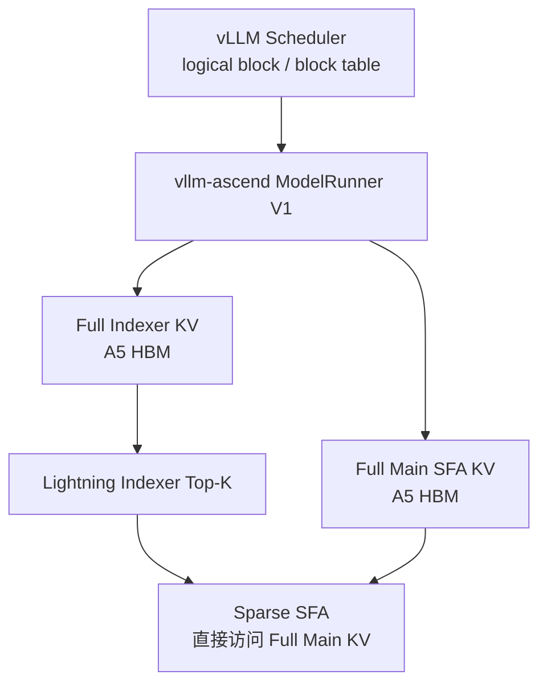
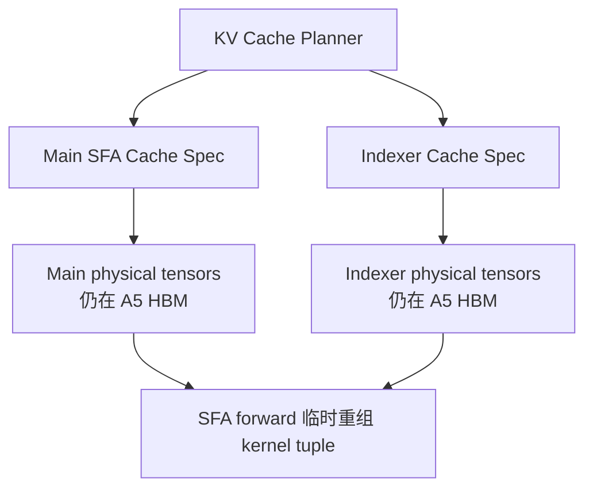
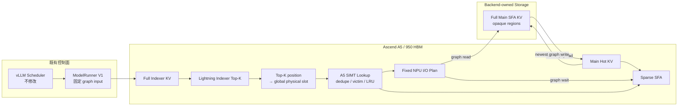

# GLM-5 Ascend A5 HiSparse KV Cache Offload 开发计划

> 状态：待评审
>
> 编写日期：2026-07-24
>
> 计划存放仓库：ASU-Ascend
>
> 产品代码目标仓库：vllm-ascend

**Goal：** 以 `vllm-ascend v0.23.0rc1` 为唯一 baseline，在不修改
vLLM 的前提下，为 GLM-5 系列实现一套面向 Ascend A5 / Ascend 950 的
HiSparse KV Cache Offload 框架。

**Architecture：** 完整 Main SFA KV 由外部 I/O backend 持有，完整
Indexer KV 与固定容量 Main Hot KV 常驻 A5 HBM。Lightning Indexer 的
Top-K 在 NPU 上转换为 global physical KV slot，A5 SIMT 算子在 NPU 上完成
resident lookup、重复 miss 去重、victim 失效和近似 LRU，固定形状的 device
I/O plan 直接进入可插拔 backend 图算子，随后由 Sparse SFA 消费 hot cache。

**Tech Stack：** vLLM-Ascend V1 Runner、Ascend 950、CANN 9.x、
AscendC SIMT、torch/torch-npu custom op、ACL Graph
`FULL_DECODE_ONLY`、GLM-5 Lightning Indexer / Sparse SFA。

---

## 1. 基线与参考锚点

### 1.1 唯一开发 baseline

```text
repository: vllm-project/vllm-ascend
tag:        v0.23.0rc1
commit:     f4a08bddd0cc65a0bd8c3d377b158ae5ca7527db
```

开发分支必须从上述 commit 创建。不得改为基于 vLLM 或更新版
vllm-ascend `main` 开发后再回迁。

### 1.2 必须先迁移的前置实现

[vllm-ascend PR #11647](https://github.com/vllm-project/vllm-ascend/pull/11647)
负责将 Main SFA cache 与 Indexer cache 的 spec、物理 tensor、分配和绑定解耦。

本项目要求：

1. 将 PR #11647 的**语义**迁移到 `v0.23.0rc1`；
2. 形成独立、可审查、可单独验收的 PR；
3. 该 PR 全部测试通过后，才开始 HiSparse 数据面开发；
4. 不直接假设 PR 当前 head 与 baseline 接口完全兼容，不机械 cherry-pick；
5. 不在该 PR 中夹带 I/O、hot cache、SIMT lookup 或 SFA remap。

### 1.3 功能和分层参考

[vLLM PR #46326](https://github.com/vllm-project/vllm/pull/46326)
仅用于参考以下行为：

- Main full KV 与 device hot working set 分离；
- hot entry 使用 global KV slot identity；
- Top-K resident lookup、miss 去重、LRU 与 slot remap；
- `FULL_DECODE_ONLY` 静态状态；
- IndexCache group 的 plan-once / follower reuse；
- newest row 不做 storage round-trip。

不得复制或继承其中的 CUDA、pinned-host、NIXL、CPU descriptor、Host pointer
array 和 `host_pool_gib` 实现。

`dev_lookup_maintain_integration` 只作为功能和验收行为参考，不作为实现来源。

### 1.4 A5 SIMT 算子参考

```text
repository: ASU-Ascend
commit:     d92a24971a3188d45659c1384a923e7121e125ef
path:       pta-ops/asu_hbm_index_lookup_simt
```

参考实现位于
[pta-ops/asu_hbm_index_lookup_simt](../../pta-ops/asu_hbm_index_lookup_simt)。

需要保留的是算法语义与 A5 并行映射，不是当前 `ctypes.CDLL` launcher：

- `token/global slot -> hot slot` 双向映射；
- duplicate miss 的 CAS canonical occurrence；
- victim 双向失效；
- stable batch approximate LRU；
- one AIV core per request row；
- 256 SIMT threads；
- 固定 NPU workspace；
- `slot_ids + miss_mask` 固定输出。

正式集成必须成为 vllm-ascend 内可被 ACL Graph 建模的 custom op。

---

## 2. 强约束

以下约束不是可选优化项。

### 2.1 代码范围

- 所有产品代码修改只发生在 `vllm-ascend`。
- 不修改 vLLM 源码。
- ASU-Ascend 只保存本计划、参考算子和后续独立验证材料。
- 不扩展到 GLM-5 之外的模型。
- 不适配 Ascend 910、A2、A3 或其他非 A5 平台。

### 2.2 执行路径

- 正式交付路径为 `FULL_DECODE_ONLY`，并强制
  `ascend_compilation_config.enable_npugraph_ex=true`。
- 启动时不满足上述两项任一条件即失败；普通 ACL Graph replay 路径不进入
  HiSparse 支持矩阵，避免其 Host-side stream synchronize。
- GLM-5 baseline 的 `deepseek_mtp` 与 3 个 speculative tokens 必须保留。
- HiSparse 新增 token 数据路径中不得出现：
  - `.cpu()`、`.numpy()`、`.item()`；
  - D2H miss count 或 descriptor；
  - CPU pointer/length array；
  - Python 逐 token、逐 miss I/O dispatch；
  - Host callback、worker thread、polling；
  - stream/device synchronize；
  - replay 期间 tensor/workspace 动态分配。
- vLLM 原有 scheduler/control plane 仍负责调度和准备既有 graph input；
  它不得读取、compact、解释或搬运 HiSparse miss plan 与 KV payload。
- row/request/block lifecycle metadata 只允许复用 ModelRunner 既有的固定
  graph-input copy 边界；禁止新增 Python 逐 row/逐 block pass、device value
  readback、同步点或独立 H2D stage。

### 2.3 I/O 边界

- vllm-ascend 只提供 I/O ABI、registry、图内状态和时序合同。
- 产品仓库不提供默认 I/O backend。
- 产品仓库不提供 Host、Mooncake、HIXL、NIXL、RDMA、KVIO 或其他存储实现。
- backend-specific 配置由插件拥有，core 不定义 `host_pool_gib`。
- ABI 测试只允许使用仓库外形态的 link-time fake provider fixture；fixture
  仅从安装后的 public header/library 构建，不进入 wheel、安装包、默认构建或
  产品 registry。
- 运行时 I/O 失败按 fail-stop 处理，不实现 retry、rollback 或 fallback。

### 2.4 代码风格

- 不做防御性编程。
- 不为非法状态添加慢速修复分支。
- 状态不变量在初始化、算子前置条件和测试中保证。
- 不提供 dense、full-device、CPU 或其他设备 fallback。
- 命名、日志、异常、custom-op schema、测试组织遵循 vllm-ascend 现有风格。

---

## 3. 目标与非目标

### 3.1 首期目标

1. 在 A5 上把 Main full KV 从 NPU full-size paged allocation 中移除。
2. Indexer full KV 继续完整驻留 A5 HBM。
3. 每个 request row / sparse layer 持有固定容量 Main Hot KV。
4. Top-K 到 hot slot 的所有决策在 NPU 完成。
5. backend read/write 直接消费固定形状 NPU plan。
6. IndexCache leader 生成一次 plan，follower layers 复用。
7. normal decode、MTP3、prefix/block identity、row reuse 均正确。
8. 整个 decode 数据链进入 `FULL_DECODE_ONLY` graph。
9. 外部 backend 无需修改 SFA、ModelRunner 或 KV planner 即可接入。

### 3.2 非目标

- 不交付任何生产存储 backend。
- 不承诺真实外部存储带宽、延迟或端到端吞吐。
- 不实现通用模型抽象。
- 不实现其他 SoC kernel。
- HiSparse 首期不支持 DCP；启用 HiSparse 时要求
  `decode_context_parallel_size=1`。
- 不实现 PIECEWISE 正式路径。
- 不使用 eager 作为生产路径。
- 不改 vLLM scheduler、BlockPool 或核心 KV cache API。
- 不复用 `simple_kv_offload`、`cpu_npu.py`、`swap_blocks_batch` 或现有
  Python storage worker 作为 token 数据面。
- 不实现 IO 失败后的 metadata rollback。

---

## 4. 原始、前置迁移与目标架构

### 4.1 原始 `v0.23.0rc1`



Top-K 已减少注意力计算量，但 Main full KV 仍随完整逻辑 KV block 数增长。

### 4.2 迁移 PR #11647 后



这一阶段只完成所有权与物理分配解耦，本身不是 Offload。

### 4.3 目标架构



### 4.4 Decode 图内时序

```text
01  写完整 NPU Indexer KV
02  写本轮 Main KV 到 reserved newest hot slots
03  backend.write_async(newest -> external region)
04  Lightning Indexer Top-K
05  Top-K position -> global physical KV slot
06  A5 SIMT lookup / duplicate miss dedupe / victim / LRU
07  backend.read_async(unique miss -> Main Hot KV)
08  device wait(read completion)
09  Sparse SFA 使用 remapped hot slots
10  device wait(write completion) / secondary stream join
11  graph replay 结束
```

任何 backend 辅助 stream 都必须在 graph 结束前通过 event 直接或间接回到
main stream。不得让未完成 payload write 脱离本次 graph 生命周期。

---

## 5. 核心术语与不变量

### 5.1 身份

| 名称 | 含义 |
| --- | --- |
| logical block | vLLM scheduler 管理的请求逻辑 block |
| physical block | vLLM block table 中的全局物理 block |
| global slot | `physical_block * block_size + token_offset` |
| block generation | physical block 每次释放并复用时递增的 payload 代次 |
| local hot slot | 单个 request row 内的 Main Hot KV slot |
| destination hot row | backend 使用的线性物理行，`row * hot_region_stride + local_hot_slot` |
| reserved newest slot | 本轮 decode/MTP 新生成 KV 的不可淘汰 slot |
| storage region | backend 为单个 layer/rank 注册的完整 Main KV 区域 |
| read plan | `read_global_slots + read_destination_hot_row_ids + read_valid_mask` |
| write plan | `write_global_slots + write_destination_hot_row_ids + write_valid_mask` |
| lookup group | 同一 residency cohort 内一个 IndexCache leader 及 followers 共享的 plan/state |
| residency cohort | payload 始终同步填充的一组 layer regions；cohort 间 resident state 隔离 |

Top-K token position 必须在 SIMT lookup 前经 NPU validity gate 转换为
global physical slot：

```text
valid =
    query_valid
    && topk_rank < valid_topk_count
    && 0 <= token_position < seq_len[row]

if valid:
    physical_block =
        block_table[row, token_position // block_size]
    global_slot =
        physical_block * block_size + token_position % block_size
    generation =
        block_generation[row, token_position // block_size]
else:
    global_slot = -1
```

`(global_slot, generation)` 是 resident lookup identity，global slot 是
backend storage row identity。`seq_lens`、query→row/lane 映射和 generation
均为固定 device graph input/state，不得建立 Host location table 或在 CPU
清洗越界 Top-K。

### 5.2 状态不变量

对每个 active request row：

```text
global_to_hot[global_slot] == local_hot_slot
    <=>
hot_to_global[local_hot_slot] == global_slot
    &&
hot_generation[local_hot_slot] == current_generation(global_slot)
```

同时满足：

- `lru_slots` 是所有可淘汰 hot slots 的无重复排列；
- reserved newest slots 不属于 `lru_slots`；
- `[managed_hot_width, hot_region_stride)` 是物理对齐 padding，永不进入
  lookup、LRU 或 SFA；
- 一轮 Top-K union 内的所有 selected slots 均受保护，不可互相淘汰；
- duplicate miss 只允许一个 canonical occurrence 设置 `read_valid_mask=True`；
- padding global slot 为 `-1`，输出 `local_hot_slot=-1, miss=False`；
- row owner/epoch 变化时，由 NPU state op 重置整行；
- physical block generation 变化时，旧 hot mapping 必须在 NPU 上失效；
- 同一个 lookup group 同时只允许一个 lookup/read/attention 闭环；
- backend read 完成前 Attention 不得消费新分配 hot slot；
- backend write completion 前 reserved slot 不得覆盖；
- graph replay 返回前，本轮 backend write 必须已经 join。

### 5.3 错误模型

只保留两类错误：

1. **初始化/捕获错误：** ABI、capability、layout、capacity 或 graph capture
   不满足时直接启动失败；
2. **执行错误：** backend/device op 失败时使 graph/worker 失败并停止本次推理。

不提供重试、回滚、降级和备用数据路径。

---

## 6. 支持矩阵与配置

### 6.1 首期支持矩阵

| 维度 | 首期范围 |
| --- | --- |
| SoC | Ascend A5 / Ascend 950 |
| Model | GLM-5 系列，首个验收 checkpoint 沿用 baseline GLM-5 YAML |
| Runner | V1 |
| Graph | `FULL_DECODE_ONLY` + `enable_npugraph_ex=true` |
| Decode | normal + `deepseek_mtp` 0..3 个实际 speculative tokens |
| Parallel | baseline TP16/EP；`decode_context_parallel_size=1` |
| Main cache | BF16、A5 SFA C8 |
| Indexer cache | BF16、A5 LI C8 |
| IndexCache | independent 与 leader/follower plan-once |
| Lifecycle | prefix、request row reuse、preemption/resume、eviction |
| I/O | 外部 provider ABI；测试仅 link-time fake provider fixture |

HiSparse 启动时若 `decode_context_parallel_size != 1` 直接失败。PR #11647
迁移仍必须保证 HiSparse 关闭时 baseline DCP 语义无回归，但 Task 2–10 不设计
DCP region shard/replica、rank identity、Top-K gather 或跨 rank hot state。
不得为了扩大矩阵加入 fallback。

### 6.2 建议配置

```json
{
  "ascend_compilation_config": {
    "enable_npugraph_ex": true
  },
  "hisparse_config": {
    "io_backend": "vendor_backend_name",
    "io_backend_options": {},
    "device_buffer_size": 8192
  }
}
```

配置规则：

- `hisparse_config` 的存在即启用，不再增加第二个 enable 开关；
- graph mode 必须为 `FULL_DECODE_ONLY`，且
  `ascend_compilation_config.enable_npugraph_ex` 必须为 `true`；
- `decode_context_parallel_size` 必须为 `1`；
- `io_backend` 只在初始化时解析一次；
- `io_backend_options` 原样交给插件，core 不解释具体存储字段；
- `device_buffer_size` 是每 request row 的**可淘汰** hot slot 数；
- reserved newest slots 单独追加，不计入 `device_buffer_size`；
- backend capacity 在初始化时查询，不从 core 的 GiB 配置推导。

### 6.3 MTP 容量约束

```text
max_query_tokens_per_request = 1 + max_num_speculative_tokens
                             = 4

actual_query_tokens_per_request ∈ [1, 4]

max_mtp_union_width = index_topk * max_query_tokens_per_request
```

首版一次保护整轮 MTP Top-K union，避免后一个 query 淘汰前一个 query 仍待
Sparse SFA 消费的 slot。因此初始化时要求：

```text
device_buffer_size >= max_mtp_union_width
```

不实现容量不足时的逐 query fallback。

每个 request row 追加 4 个 reserved newest slots。实际不足 4 个 query 的
normal/short-draft batch 由图内 `query_valid_mask` 屏蔽，不改变 state capacity：

```text
evictable slots: [0, device_buffer_size)
reserved slots:  [device_buffer_size,
                  device_buffer_size + max_query_tokens_per_request)
```

---

## 7. 固定 NPU 数据模型

令：

```text
Q = graph descriptor 的 padded token capacity
R = graph descriptor 的 padded request-row capacity
T_max = 1 + max_num_speculative_tokens = 4
T = 当前 graph descriptor 的 query-lane capacity（normal=1，MTP target=4）
K = model index_topk
N = num_blocks * block_size
S = device_buffer_size
M = S + T_max
H = round_up(M, block_size)  # hot_region_stride
```

Lightning Indexer 保持 baseline 的扁平 token 输出 `[Q, K]`。NPU pack op
使用 `token_to_row`、`token_to_lane` 和 `query_valid_mask` 转成内部
`[R, T, K]` union；lookup 后再 unpack 为 SFA 消费的 `[Q, K]`。

同一个 `Q` 可以对应不同的 `(R, T)`，因此 HiSparse graph 资源不得只以
`num_tokens` 建键。固定 key 为：

```text
HiSparseGraphKey(
    token_capacity=Q,
    request_capacity=R,
    query_lane_capacity=T,
    graph_role=target | draft,
)
```

target 的 graph 资源随 `_graph_params` 持有，MTP/draft graph 资源随
`_draft_graph_params` 持有。长期 mapping/LRU/hot planes 按
`ResidencyCohortKey(graph_role, index_cache_group_id)` 隔离：

- target leader/followers 只有在每次 miss 都填充 cohort 内全部 layer regions
  后才共享一套 resident state；
- draft layer/group 使用独立 resident state/hot planes，不与 target 共享 hit；
- target/draft 只按 baseline 共享语义 Top-K buffer，不共享 resolved address、
  mapping、LRU、payload 或 completion。

所有 tensor/resource 在 capture 前分配，replay 期间地址不变。

### 7.1 Lookup group 状态

| Tensor | Shape | Dtype | 所有权 |
| --- | ---: | --- | --- |
| `global_to_hot` | `[max_rows, N]` | `int32` | lookup group |
| `hot_to_global` | `[max_rows, M]` | `int32` | lookup group |
| `hot_generation` | `[max_rows, M]` | `int32` | lookup group |
| `lru_slots` | `[max_rows, S]` | `int32` | lookup group |
| `state_row_lifecycle_id` | `[max_rows]` | `int32` | lookup group |
| `workspace` | `[R, workspace_stride]` | `int32` | graph key |

`global_to_hot` HBM 预算必须在 P0 固定并评审：

```text
bytes = max_rows * N * sizeof(int32)
```

若该预算不可接受，必须在编码前重新评审索引结构；不得在实现阶段偷偷加入
CPU map 或 hash fallback。

`workspace_stride` 由 operator tiling 函数按 `(S, T*K, 256 threads)` 计算，
按 CANN workspace alignment 向上取整，并在 Task 0 冻结公式与上限。不得沿用
ASU 原型固定的 `31492`。

### 7.2 Graph plan

| Tensor | Shape | Dtype |
| --- | ---: | --- |
| `row_active` | `[R]` | `uint8/bool` |
| `row_lifecycle_id` | `[R]` | `int32` |
| `seq_lens` | `[R]` | baseline dtype |
| `block_generations` | `[R, max_blocks_per_req]` | `int32` |
| `token_to_row` / `token_to_lane` | `[Q]` | `int32` |
| `query_valid_mask` | `[Q]` | `uint8/bool` |
| `valid_topk_counts` | `[Q]` | `int32` |
| `topk_positions` | `[Q, K]` | `int32` |
| `read_global_slots` | `[R, T, K]` | `int32` |
| `read_generations` | `[R, T, K]` | `int32` |
| `read_local_hot_slot_ids` | `[R, T, K]` | `int32` |
| `read_destination_hot_row_ids` | `[R, T, K]` | `int32` |
| `read_valid_mask` | `[R, T, K]` | `uint8/bool` |
| `semantic_sparse_indices` | `[Q, K]` | `int32` |
| `resolved_hot_row_ids` | `[Q, K]` | `int32` |
| `write_global_slots` | `[R, T]` | `int32` |
| `write_destination_hot_row_ids` | `[R, T]` | `int32` |
| `write_valid_mask` | `[R, T]` | `uint8/bool` |
| `completion_resources` | `[graph_key][region][direction][inflight_lane]` | opaque |

其中：

```text
destination_hot_row_id =
    request_row * H + local_hot_slot_id
```

`semantic_sparse_indices` 保留 Lightning Indexer 的 original logical token
position；`resolved_hot_row_ids` 是 unpack 后的物理 hot row。SFA 前者只用于
causal/window/sequence 语义，后者只用于 KV gather；backend 使用
`*_destination_hot_row_ids`。`read_valid_mask` 严格等于 canonical miss
mask，write mask 只描述本轮有效 newest rows。

`semantic_sparse_indices` 是 `topk_positions` 的 graph-stable view/copy；
`read_global_slots/read_generations` 由 pack/global-map op 直接产生并原样
传给 I/O ABI，不再存在未命名的 Host descriptor 转换。

`row_lifecycle_id`、block-table generation 与 query mapping 复用 runner
已有 graph-input 更新边界一次写入固定 tensor。NPU state op 完成 compare、
row reset、generation validation 和 mask；Python 不逐 row/逐 block 派生，
也不读取 device 结果。

`row_lifecycle_id` 在 request 绑定新 runner row 或 preemption/resume 时递增；
`block_generations` 由 vllm-ascend 在既有 block-table metadata packing
边界跟踪 physical block ownership/reuse 并批量写入。该 control metadata
不要求修改 vLLM，不根据 miss 生成，也不新增独立 Host stage/H2D；所有
resident 判定、失效与状态变更仍在 NPU 图内完成。

completion、I/O workspace 和 auxiliary event 使用同一静态所有权粒度：

```text
HiSparseGraphKey
× layer/region
× direction(read | write)
× max_inflight_lanes
```

首版每个 region 每个方向 `max_inflight_lanes=1`：每层每 replay 最多提交一次
read 和一次 write，并在 graph 结束前 join 后才可复用。leader/follower
只共享 plan，不共享 region completion。若 P0 发现 backend 必须切分单次 plan，
必须在 capture 前提高并冻结 lane 数；不得 replay 时复用尚未 join 的 resource。
GraphParams 保存 resource collection，不保存单个全局 ticket。

### 7.3 Payload

| 数据 | 布局 |
| --- | --- |
| Full Main BF16 | backend region 的 latent KV + key_rope 两个静态 plane |
| Full Main SFA C8 | backend region 的一个 packed plane |
| Main Hot BF16 | `[max_rows, H, ...]` 的 latent KV + key_rope planes |
| Main Hot SFA C8 | `[max_rows, H, ...]` packed plane |
| Full Indexer | PR #11647 拆分后的完整 NPU cache |

Main Hot KV 大小与 `N` 无关：

```text
O(sparse_main_layers * max_rows * H * main_row_bytes)
```

每个 request 的 hot block table 恰好包含 `H / block_size` 个物理 block。
`[M, H)` 仅用于 paged-layout 对齐，任何 plan 都不得指向这些 rows。

### 7.4 Sparse SFA 双索引 ABI

baseline SFA 的单个 `sparse_indices` 同时承担语义 token position 与 paged-KV
寻址，不能直接替换为 local hot slot。HiSparse 为 A5 BF16/C8 冻结双输入：

```text
semantic_sparse_indices[Q,K]  # original Top-K token positions
resolved_hot_row_ids[Q,K]     # physical flattened rows in Main Hot KV
```

唯一适配方式：

- `semantic_sparse_indices` 保持 baseline 值，继续参与 `sparse_mode=3`、
  causal/window 与原始 `actual_seq_lengths_query/kv`；
- `resolved_hot_row_ids` 只参与 latent KV/key_rope 或 C8 packed payload gather；
- `hot_block_table[row, b] = row * (H / block_size) + b`，固定 shape
  `[R, H / block_size]`，用于描述每个 request 的 identity paged layout；
- query length、原始 sequence length 与 query ordering 全部保持 baseline，
  不用 `M/H/local_hot_slot` 伪造语义长度；
- padding query 的两个 index 都为 `-1`，且不读取 hot payload。

正式实现修改 vllm-ascend A5 SFA ABI/kernel：

```text
BF16: Create csrc/attention/hisparse_sparse_flash_attention/
      -> torch.ops._C_ascend.npu_hisparse_sparse_flash_attention
C8:   Create csrc/attention/hisparse_kv_quant_sparse_flash_attention/
      -> torch.ops._C_ascend.npu_hisparse_kv_quant_sparse_flash_attention
```

两个 HiSparse 专用 op 可复用 baseline kernel 内部模板，但 schema、Torch
adapter、tiling entry 与 op name 独立。原 `npu_sparse_flash_attention` 和
`npu_kv_quant_sparse_flash_attention` ABI/caller 保持不变。`device_op.py`
在 HiSparse 启用时只调用专用双索引 ABI，不存在换回原单索引 op 的运行时
fallback；HiSparse 关闭时仍走未经修改的 baseline 路径。Task 2 必须用真
A5 op 验证 reserved-newest、MTP lane causal mask、history eviction 与原
full-resident SFA 一致；该 ABI 未通过时不得进入后续 HiSparse 数据面任务。

---

## 8. I/O Backend 合同

### 8.1 控制面 API

建议新增：

```text
vllm_ascend/attention/hisparse_io.py
csrc/hisparse_io/include/hisparse_io_backend.h
csrc/hisparse_io/bridge.cpp
```

Python 侧逻辑类型：

```python
@dataclass(frozen=True)
class HiSparseIOCapabilities:
    abi_version: int
    a5_graph_capture: bool
    device_plan: bool
    stable_address: bool
    direct_npu_source_destination: bool
    supported_layouts: frozenset[str]


@dataclass(frozen=True)
class HiSparseStorageLayout:
    layout_name: str
    block_size: int
    rows_per_block: int
    plane_dtypes: tuple[torch.dtype, ...]
    plane_row_shapes: tuple[tuple[int, ...], ...]


class HiSparseIOBackend(Protocol):
    def capabilities(self) -> HiSparseIOCapabilities: ...
    def query_capacity(self, layouts: tuple[HiSparseStorageLayout, ...]) -> int: ...
    def create_context(self, graph_shapes: tuple[HiSparseGraphShape, ...]): ...
    def register_region(self, layer_name: str, layout: HiSparseStorageLayout): ...
    def mark_request_ready(self, request_handle: int) -> None: ...
    def release_request(self, request_handle: int) -> None: ...
    def freeze(self) -> None: ...
    def close(self) -> None: ...
```

以上方法只在初始化、capture、request lifecycle control point 和退出阶段执行。
它们不接触 miss plan/KV payload，registry 在 `freeze()` 后不可变。

### 8.2 图内逻辑 ABI

```text
hisparse_io_read_async(
    context,
    region,
    read_global_slots,
    read_destination_hot_row_ids,
    read_valid_mask,
    hot_planes!,
    read_completion!
)

hisparse_io_wait_read(
    context,
    read_completion!,
    hot_planes!
)

hisparse_io_write_async(
    context,
    region,
    write_global_slots,
    write_destination_hot_row_ids,
    write_valid_mask,
    hot_planes,
    write_completion!
)

hisparse_io_wait_write(
    context,
    write_completion!,
    hot_planes
)
```

具体 Torch schema 在 Task 3 通过 fake/meta 与 mutation/alias 测试冻结。逻辑合同为：

- `context`、`region`、completion resource 和 workspace 地址在对应 graph
  生命周期内稳定；
- 读写 plan 全部是固定 shape NPU tensor；
- `read` 只处理 `read_valid_mask=True` 的 canonical miss；
- `wait_read` 建立编译器和 stream 都可见的 payload dependency；
- `write` 后同一 global slot 的未来 read 必须看到最新 payload；
- `wait_write` 在 reserved slot 覆盖和 graph 结束前完成；
- completion resource 是预创建、地址稳定的 opaque resource，可由 device token
  和/或 ACL event handle 组成；
- 不返回 per-replay CPU Future、Python integer，不允许 Host polling/callback；
- backend 不读取 device plan 到 Host。

### 8.3 外部 C ABI

建议由 vllm-ascend 提供版本化 header，外部 `.so` 导出 function table：

```cpp
struct HiSparseIOBackendV1 {
    uint32_t abi_version;
    uint32_t struct_size;
    uint64_t capability_bits;

    int (*create)(const HiSparseCreateArgsV1*, void** context);
    int (*query_capacity)(void* context,
                          const HiSparseLayoutV1*,
                          uint64_t* num_blocks);
    int (*register_region)(void* context,
                           const HiSparseRegionArgsV1*,
                           uint32_t* region_id);
    int (*mark_request_ready)(void* context, uint64_t request_handle);
    int (*release_request)(void* context, uint64_t request_handle);
    int (*freeze)(void* context);

    int (*enqueue_read)(void* context,
                        aclrtStream stream,
                        const HiSparseReadArgsV1*);
    int (*enqueue_write)(void* context,
                         aclrtStream stream,
                         const HiSparseWriteArgsV1*);
    int (*enqueue_wait)(void* context,
                        aclrtStream stream,
                        const HiSparseWaitArgsV1*);

    void (*destroy)(void* context);
};
```

`enqueue_*` 的硬合同：

- 只向 capture stream 提交可入图 device operation；
- 不分配 host/device 内存；
- 不创建 Python worker；
- 不同步 stream/device；
- 不构造逐 entry Host pointer array；
- 不从 NPU 读取 miss count、mask 或 descriptor；
- 辅助 stream/event 必须由 backend 在 capture 前创建并在 graph 内 join；
- `enqueue_*` 只允许在 capture 时由 bridge 调用；graph replay 不得重新进入
  provider 的 Python/C function table；
- submission error 使 capture 失败，runtime device error 使 graph 失败。

框架不实现任何上述 function table 的生产实例。

### 8.4 Link-time fake provider fixture

为验证 ABI，可在 `tests/conformance/hisparse_io_provider/` 提供一个仓库外形态
的 link-time fake provider：

- 只 include 安装后的 public header，只链接安装后的 bridge library；
- 用预分配 NPU tensor 模拟 external region，不实现独立存储语义；
- 能制造 device-side delay 以验证 event dependency；
- capture 后 poison `enqueue_*` 并记录 Host call count，replay 后计数必须不变；
- 不 import/include `vllm_ascend` private 路径；
- 不进入 wheel、安装包、默认构建或产品 registry；
- 不作为 fallback，其结果只证明 ABI/框架开销，不代表真实存储。

---

## 9. A5 SIMT 索引设计

### 9.1 从 ASU 参考实现保留的部分

| ASU 语义 | vllm-ascend 集成 |
| --- | --- |
| `token_to_slot` | `global_to_hot` |
| `slot_to_token` | `hot_to_global` |
| `lru_slots` | 可淘汰 hot slots 的 LRU-to-MRU 排列 |
| duplicate miss CAS | 只产生一个 canonical I/O |
| victim reverse invalidation | 同时清理两张映射 |
| batch approximate LRU | `stale + new miss + hit` |
| one AIV / request | one AIV / fixed request row |
| 256 SIMT threads | A5 specialization 固定 |

### 9.2 不能照搬的部分

| ASU 原型 | 集成要求 |
| --- | --- |
| `128K` index | `N = num_blocks * block_size` |
| `10K` slots | `S = device_buffer_size` |
| `2K` query | flat `[Q,K]` 经 NPU pack 后形成 `[R,T,K]` union |
| Python `req_num` | `HiSparseGraphKey` 静态推导的 `(Q,R,T)` |
| Python 现场分配输出 | capture 前预分配输出 |
| `ctypes.CDLL` launcher | 正式 CANN/PTA custom op |
| 独立 kernel workspace | GraphParams/Coordinator 长期持有 |
| 固定 `int16` slot id | 集成统一使用 `int32` |
| 固定 `31492` workspace | tiling 按 `(S,T*K,256)` 计算 |
| IO 留给调用脚本 | 固定 device plan 直接进入 backend op |

### 9.3 建议 custom ops

```text
hisparse_prepare_state
    row_lifecycle_id + block_generations + row_active
    -> reset/validate changed rows, install newest mappings

hisparse_pack_global_slot_map
    flat topk_positions + seq_lens + block_table/generation
    + token_to_row/lane + query/Top-K valid masks
    -> read_global_slots + read_generations

hisparse_index_lookup
    global_to_hot! + hot_to_global! + hot_generation! + lru_slots!
    + read_global_slots/read_generations + row_active + workspace!
    -> read_local_hot_slot_ids! + read_valid_mask!

hisparse_linearize_and_unpack
    request row + local hot slot + H
    -> read_destination_hot_row_ids + resolved_hot_row_ids
```

可在实现时合并算子，但必须保持：

- state/output/workspace 地址固定；
- mutation/alias schema 明确；
- fake/meta 路径完整；
- 仅构建 `ascend950 / arch35`；
- 沿用 A5 CANN custom OPP / `_C_ascend` 路径，不依赖通用
  `vllm_ascend_C` pybind 热路径；
- 不在 op 内动态分配；
- 不保留“外部 writer 并发修改同一 row”的防御分支。

### 9.4 MTP union

Lightning Indexer 的输入/输出仍是 baseline 扁平 shape：

```text
[Q, K]
```

图内 pack 使用 query→row/lane mapping 构成内部 `[R,T,K]`，其中
`query_valid_mask=False` 的 normal/short-draft/padding lanes 全部写 `-1`。
SIMT 算子随后为同一 request 的最多 `T*K` global slots 建立本轮
protected union：

1. 以 `(global_slot, block_generation)` 校验并标记 resident hits；
2. 对 duplicate misses 执行 CAS canonicalization；
3. 从不在 protected union 中的 LRU slots 分配 victims；
4. 安装新双向映射与 `hot_generation`；
5. 写回每个 query position 的 `read_local_hot_slot_ids`；
6. 输出仅 canonical miss 为 true 的 `read_valid_mask`；
7. NPU 线性化 backend destination rows，并 unpack 为 `[Q,K]`
   `resolved_hot_row_ids`；
8. 更新 batch approximate LRU。

这样在 fused/batched Sparse SFA 执行前，MTP query 之间不会互相淘汰。

### 9.5 Newest slots

- 当前最多 `T` 个有效 Main KV 先写入 reserved slots；
- `hisparse_prepare_state` 只由 lookup-group leader 执行一次，并将有效
  `(global_slot,generation)` 映射到 reserved slots；
- 若某 newest global slot 先前位于 evictable slot，安装 reserved mapping 前
  必须清理该 slot 的 reverse/generation entry，并将它保留为合法 free
  evictable slot；
- 若 Top-K 选中本轮 newest，直接返回 reserved slot，`read_valid_mask=False`；
- reserved slots 不参加 LRU；
- followers 只写各自 layer 的 reserved payload 和复用 leader plan，不重复
  修改共享 mapping/LRU；
- write completion 完成后，下一 replay 开始时退休旧 newest mapping；
- 旧 newest 若再次被选中，作为普通 global slot 进入 LRU/read 路径。

---

## 10. vllm-ascend 模块改动矩阵

| 模块 | 计划改动 | 主要职责 |
| --- | --- | --- |
| `vllm_ascend/ascend_config.py` | 修改 | HiSparse core 配置与启动门禁 |
| `vllm_ascend/platform.py` | 修改 | A5、GLM-5、FULL_DECODE_ONLY 与 capability 校验 |
| `vllm_ascend/core/kv_cache_interface.py` | 先迁移后扩展 | Main/Indexer split spec、external Main 标识 |
| `vllm_ascend/attention/indexer.py` | PR #11647 新增 | cache-only Indexer backend/metadata builder |
| `vllm_ascend/patch/platform/patch_kv_cache_utils.py` | 修改 | external capacity 与 Indexer capacity 联合规划 |
| `vllm_ascend/worker/model_runner_v1.py` | 修改 | region/hot/state 初始化、固定 graph input |
| `vllm_ascend/attention/sfa_v1.py` | 修改 | Top-K → plan → I/O → SFA → write |
| `vllm_ascend/attention/utils.py` | 修改 | 固定 query/row/lifecycle graph metadata |
| `vllm_ascend/device/device_op.py` | 修改 | semantic/address 双索引进入 A5 Sparse SFA |
| `vllm_ascend/spec_decode/llm_base_proposer.py` | 修改 | target/draft residency cohort 接线 |
| `vllm_ascend/attention/hisparse.py` | 新增 | coordinator、lookup group、graph state |
| `vllm_ascend/attention/hisparse_io.py` | 新增 | backend registry、layout、capability、binding |
| `vllm_ascend/ops/hisparse.py` | 新增 | Python custom-op wrapper/meta |
| `vllm_ascend/ops/hisparse_io.py` | 新增 | I/O bridge wrapper/meta |
| `vllm_ascend/compilation/acl_graph.py` | 修改 | 按 graph key 持有固定 plan/completion/event |
| `csrc/attention/hisparse_index_lookup/` | 新增 | A5 SIMT 正式 custom op |
| `csrc/attention/hisparse_sparse_flash_attention/` | 新增 | BF16 HiSparse 专用双索引 op |
| `csrc/attention/hisparse_kv_quant_sparse_flash_attention/` | 新增 | C8 HiSparse 专用双索引 op |
| `csrc/torch_binding.cpp` | 修改 | 注册两个 HiSparse 专用 Torch entrypoints |
| `csrc/torch_binding_meta.cpp` | 修改 | 注册双索引 fake/meta |
| `csrc/hisparse_io/` | 新增 | 版本化 ABI header 与 generic bridge |
| `CMakeLists.txt` | 修改 | 显式纳入 I/O bridge/include 与 public header install |
| `csrc/build_aclnn.sh` | 修改 | 注册 ascend950 operator build |
| `tests/conformance/hisparse_io_provider/` | 新增 | public-ABI-only fake provider fixture |
| `tests/` | 新增/修改 | oracle、graph、GLM-5 E2E、profile |

不扩展：

```text
vllm_ascend/simple_kv_offload/*
vllm_ascend/kv_offload/cpu_npu.py
现有 Mooncake/AscendStore Python token data path
```

---

## 11. 分阶段开发任务

**串行硬门禁：** Task 1 必须先作为独立 PR 合入并全绿；Task 2–10 不得
提前建立产品实现依赖。Task 2 的 dual-index SFA ABI 也必须独立合入后，
Task 3–10 才进入 I/O/SIMT/runtime 数据面。

### Task 0：冻结 baseline、环境与 ABI 决策

**Files（vllm-ascend）：**

- Create: `docs/source/developer_guide/Design_Documents/a5_hisparse_baseline.md`
- No product code changes

**依赖：** A5/950 服务器、GLM-5 权重、baseline 软件栈。

- [ ] **Step 1：创建精确开发分支**

```bash
git switch --create dev/a5-glm5-hisparse v0.23.0rc1
git rev-parse HEAD
```

Expected：

```text
f4a08bddd0cc65a0bd8c3d377b158ae5ca7527db
```

- [ ] **Step 2：记录 A5 环境**

记录服务器拓扑、NPU 数、SoC、driver、firmware、CANN、torch、
torch-npu、transformers、vLLM/vllm-ascend commit 与编译参数。

- [ ] **Step 3：跑通 GLM-5 baseline**

沿用：

```text
tests/e2e/weekly/single_node/configs/GLM-5.yaml
TP16 / EP
deepseek_mtp / 3 speculative tokens
FULL_DECODE_ONLY
capture sizes [4,8,16,32,64,128,256,512]
```

- [ ] **Step 4：冻结 ABI 与内存预算**

评审并冻结：

- global slot key；
- `Q/R/T/T_max/K/N/S/M/H` 与 `HiSparseGraphKey`；
- MTP union；
- `global_to_hot` HBM 预算；
- block-generation/lifecycle identity 来源；
- hot paged-layout stride 与 destination linearization；
- backend C ABI；
- per-graph/per-region/per-direction completion/workspace/event topology；
- Main Hot KV 对现有 SFA kernel 的 block-table/slot ABI；
- BF16/C8 SFA semantic/address 双索引与真算子 causal ABI；
- target/draft residency cohort 边界；
- public-ABI-only fake provider fixture；
- 初始性能预算。

**DoD：**

- baseline accuracy、graph capture/replay、MTP 正常；
- BF16/C8 SFA dual-index schema、mask/address ownership 与 Task 2
  真机验收用例已评审冻结；
- 所有环境版本可复现；
- ABI review 通过；
- checked-in baseline/performance-budget artifact 已评审冻结，明确 SIMT
  绝对 p50/p95 数值、`N/S/Q/R/T/K`、初始 state、hit ratio、warmup/迭代数、
  计时 API、A5 软件栈与完整命令；该 artifact 必须先于 SIMT PR；
- vLLM 工作树无修改。

---

### Task 1：独立迁移 PR #11647

**Files：**

- Modify: `vllm_ascend/attention/sfa_v1.py`
- Create: `vllm_ascend/attention/indexer.py`
- Modify: `vllm_ascend/core/kv_cache_interface.py`
- Modify: `vllm_ascend/ops/mla.py`
- Modify: `vllm_ascend/utils.py`
- Modify: `vllm_ascend/worker/model_runner_v1.py`
- Modify/Create: 对应 unit tests

- [ ] **Step 1：新增 Main/Indexer 独立 spec 测试**
- [ ] **Step 2：迁移 cache-only Indexer backend/metadata builder**
- [ ] **Step 3：独立计算 page size、capacity 与 DCP replication**
- [ ] **Step 4：独立 allocate、reshape、bind**
- [ ] **Step 5：在现有 SFA kernel 前重组 tuple**
- [ ] **Step 6：验证四种布局**

| Main | Indexer | SFA kernel view |
| --- | --- | --- |
| BF16 | BF16 | `(k, v, indexer_k)` |
| C8 | BF16 | `(packed_main, indexer_k)` |
| BF16 | C8 | `(k, v, indexer_k, indexer_scale)` |
| C8 | C8 | `(packed_main, indexer_k, indexer_scale)` |

A5 保持：

```text
C8 cache dtype = torch.float8_e4m3fn
C8 scale dtype = torch.float32
```

- [ ] **Step 7：跑 baseline regression**

**DoD：**

- PR #11647 语义形成独立 PR；
- 四种布局 allocation/binding/forward 通过；
- DCP 只作用于 Indexer；
- GLM-5 full-NPU baseline、MTP、FULL_DECODE_ONLY 无回归；
- diff 中无 HiSparse/I/O/SIMT 代码。

---

### Task 2：实现 A5 SFA semantic/address 双索引 ABI

**Files：**

- Create: `csrc/attention/hisparse_sparse_flash_attention/CMakeLists.txt`
- Create: `csrc/attention/hisparse_sparse_flash_attention/hisparse_sparse_flash_attention_torch_adpt.h`
- Create: `csrc/attention/hisparse_sparse_flash_attention/op_host/CMakeLists.txt`
- Create: `csrc/attention/hisparse_sparse_flash_attention/op_host/hisparse_sparse_flash_attention_def.cpp`
- Create: `csrc/attention/hisparse_sparse_flash_attention/op_host/hisparse_sparse_flash_attention_infershape.cpp`
- Create: `csrc/attention/hisparse_sparse_flash_attention/op_host/hisparse_sparse_flash_attention_tiling.{h,cpp}`
- Create: `csrc/attention/hisparse_sparse_flash_attention/op_host/op_api/aclnn_hisparse_sparse_flash_attention.{h,cpp}`
- Create: `csrc/attention/hisparse_sparse_flash_attention/op_kernel/hisparse_sparse_flash_attention.cpp`
- Create: `csrc/attention/hisparse_sparse_flash_attention/op_kernel/arch35/*`
- Create: `csrc/attention/hisparse_kv_quant_sparse_flash_attention/CMakeLists.txt`
- Create: `csrc/attention/hisparse_kv_quant_sparse_flash_attention/hisparse_kv_quant_sparse_flash_attention_torch_adpt.h`
- Create: `csrc/attention/hisparse_kv_quant_sparse_flash_attention/op_host/CMakeLists.txt`
- Create: `csrc/attention/hisparse_kv_quant_sparse_flash_attention/op_host/hisparse_kv_quant_sparse_flash_attention_def.cpp`
- Create: `csrc/attention/hisparse_kv_quant_sparse_flash_attention/op_host/hisparse_kv_quant_sparse_flash_attention_infershape.cpp`
- Create: `csrc/attention/hisparse_kv_quant_sparse_flash_attention/op_host/hisparse_kv_quant_sparse_flash_attention_tiling.{h,cpp}`
- Create: `csrc/attention/hisparse_kv_quant_sparse_flash_attention/op_kernel/hisparse_kv_quant_sparse_flash_attention.cpp`
- Create: `csrc/attention/hisparse_kv_quant_sparse_flash_attention/op_kernel/arch35/*`
- Modify: `csrc/torch_binding.cpp`
- Modify: `csrc/torch_binding_meta.cpp`
- Modify: `csrc/build_aclnn.sh`
- Modify: `vllm_ascend/device/device_op.py`
- Create: `tests/ut/ops/test_hisparse_sparse_flash_attention.py`
- Create: `tests/e2e/nightly/single_node/ops/singlecard_ops/test_hisparse_sparse_flash_attention.py`

- [ ] **Step 1：先写 semantic/address alias、shape、padding 与 fake/meta 测试**
- [ ] **Step 2：实现专用 BF16 A5 SFA schema/adapter/tiling/kernel**
- [ ] **Step 3：实现同合同的专用 C8 A5 op**
- [ ] **Step 4：保持 original semantic index/seq length/sparse mode mask 语义**
- [ ] **Step 5：验证 reserved newest 在 MTP lane 中的 causal ordering**
- [ ] **Step 6：验证 history local slot 任意置换不改变 attention output**
- [ ] **Step 7：注册 Torch binding/meta 与 ascend950 OPP build**
- [ ] **Step 8：与 full-resident BF16/C8 真算子逐输出对比并 profile**

**DoD：**

- semantic index 改变只影响 causal/window mask，resolved row 改变只影响
  payload gather；
- BF16/C8 在 hit、eviction、newest、normal、partial draft、MTP3 下与
  full-resident reference 一致；
- 两个 op 可在 A5 `FULL_DECODE_ONLY + enable_npugraph_ex` capture/replay；
- 原 BF16/C8 单索引 op schema/caller 与关闭 HiSparse 的 baseline regression
  保持不变；
- 无 Host gather、graph break、动态 allocation 或单索引 fallback；
- 该 PR 独立合入后，才允许开始 I/O、SIMT 与 runtime 集成。

---

### Task 3：定义 I/O ABI、registry 与 conformance fixture

**Files：**

- Create: `vllm_ascend/attention/hisparse_io.py`
- Create: `vllm_ascend/ops/hisparse_io.py`
- Create: `csrc/hisparse_io/include/hisparse_io_backend.h`
- Create: `csrc/hisparse_io/bridge.cpp`
- Modify: `CMakeLists.txt`
- Create: `tests/ut/attention/test_hisparse_io.py`
- Create: `tests/conformance/hisparse_io_provider/`
- Modify: `vllm_ascend/ascend_config.py`
- Modify: `vllm_ascend/platform.py`

- [ ] **Step 1：先写 ABI/version/capability/DCP 启动失败测试**
- [ ] **Step 2：实现初始化 registry 与 freeze 生命周期**
- [ ] **Step 3：实现 layout、capacity、region registration 与最小
      request ready/release contract**
- [ ] **Step 4：实现 read/write/wait bridge 与 fake/meta**
- [ ] **Step 5：实现 public-ABI-only link-time fake provider fixture**
- [ ] **Step 6：验证单 stream capture/replay**
- [ ] **Step 7：验证 secondary stream event capture/join**
- [ ] **Step 8：capture 后 poison provider function table，验证 replay 零 Host dispatch**

**DoD：**

- 产品代码无具体 backend；
- backend 不满足 A5/graph/device-plan/stable-address 时启动失败；
- `decode_context_parallel_size != 1` 时 HiSparse 启动失败；
- read/write/wait 全部可 capture/replay；
- delayed fake provider 证明 wait dependency 生效；
- fixture 仅依赖安装后的 public header/library，且不进入产品 artifact；
- capture 后连续 replay 的 C/Python provider Host call count 不变；
- 产品配置中无 Host pool 字段；
- 无 runtime backend switch 或 fallback。

---

### Task 4：实现 external Main KV 规划与固定 Hot State

**Files：**

- Modify: `vllm_ascend/core/kv_cache_interface.py`
- Modify: `vllm_ascend/patch/platform/patch_kv_cache_utils.py`
- Modify: `vllm_ascend/worker/model_runner_v1.py`
- Create: `vllm_ascend/attention/hisparse.py`
- Create: `tests/ut/core/test_hisparse_kv_planner.py`
- Create: `tests/ut/worker/test_hisparse_cache_init.py`

- [ ] **Step 1：让 scheduler 保持完整 logical block space**
- [ ] **Step 2：停止分配 Main full-size NPU paged tensor**
- [ ] **Step 3：按 layer/rank 注册 backend Main regions**
- [ ] **Step 4：完整分配 NPU Indexer**
- [ ] **Step 5：按 residency cohort 与 `H` 分配固定 Main Hot KV/hot block
      table，并按 graph key 分配 plan buffers**
- [ ] **Step 6：联合计算 block 数**

```text
num_blocks = min(
    backend_reported_region_blocks,
    npu_full_indexer_capacity_blocks,
)
```

- [ ] **Step 7：验证 HBM 公式**

**DoD：**

- Main full KV 不出现在 NPU full-size allocation；
- Indexer full KV 保持 baseline 语义；
- Main Hot KV 不随 `num_blocks` 或 `max_model_len` 线性增长；
- local slot、destination row 与 aligned hot block table 逐项一致；
- target/draft cohort 的 mapping/LRU/hot planes 不共享；
- logical block、block table、prefix identity 不变；
- 不修改 vLLM planner。

---

### Task 5：迁入 Ascend 950 SIMT 索引算子

**Files：**

- Create: `csrc/attention/hisparse_index_lookup/CMakeLists.txt`
- Create: `csrc/attention/hisparse_index_lookup/hisparse_index_lookup_torch_adpt.h`
- Create: `csrc/attention/hisparse_index_lookup/op_host/CMakeLists.txt`
- Create: `csrc/attention/hisparse_index_lookup/op_host/hisparse_index_lookup_def.cpp`
- Create: `csrc/attention/hisparse_index_lookup/op_host/hisparse_index_lookup_infershape.cpp`
- Create: `csrc/attention/hisparse_index_lookup/op_host/hisparse_index_lookup_tiling.{h,cpp}`
- Create: `csrc/attention/hisparse_index_lookup/op_host/op_api/aclnn_hisparse_index_lookup.{h,cpp}`
- Create: `csrc/attention/hisparse_index_lookup/op_kernel/hisparse_index_lookup.cpp`
- Create: `csrc/attention/hisparse_index_lookup/op_kernel/hisparse_index_lookup_common.h`
- Create: `csrc/attention/hisparse_index_lookup/op_kernel/arch35/*`
- Create: `vllm_ascend/ops/hisparse.py`
- Modify: `csrc/build_aclnn.sh`
- Modify: 对应 Torch binding/meta 注册
- Create: `tests/ut/ops/test_hisparse_index_reference.py`
- Create: `tests/e2e/nightly/single_node/ops/singlecard_ops/test_hisparse_index_lookup.py`

- [ ] **Step 1：冻结 ASU-compatible lookup/LRU oracle，并新增项目扩展 oracle**
- [ ] **Step 2：先写 flat/pack、固定 shape、mutation、validity、
      generation 与 MTP union 测试**
- [ ] **Step 3：实现 `hisparse_prepare_state`**
- [ ] **Step 4：实现 flat pack/global slot/generation map 与 unpack**
- [ ] **Step 5：参数化并迁入 SIMT lookup/LRU**
- [ ] **Step 6：注册 proper custom op 与 fake/meta**
- [ ] **Step 7：接入 ascend950 build**
- [ ] **Step 8：A5 真机逐状态对比**
- [ ] **Step 9：单算子 profile**

必测：

- all hit / all miss / mixed；
- duplicate hit / duplicate miss；
- padding `-1`；
- empty-slot-first；
- real eviction；
- victim reverse invalidation；
- LRU stable order；
- row reset；
- physical block generation reuse；
- newest reserved slots；
- MTP union；
- leader/follower plan reuse。

**DoD：**

- ASU-compatible core cases 在等价 shape/state、排除 reserved/lifecycle
  扩展后，与固定 ASU commit 的 output/state bit-exact；
- MTP/newest/generation/row lifecycle 与项目扩展 CPU oracle 逐元素一致；
- graph 内固定输出和 workspace；
- profile 区间无 H2D/D2H/Host callback；
- 不存在 ctypes/pybind direct launcher 热路径；
- 不存在 CPU/C++ fallback kernel。

---

### Task 6：生命周期与 device plan

**Files：**

- Modify: `vllm_ascend/attention/hisparse.py`
- Modify: `vllm_ascend/worker/model_runner_v1.py`
- Modify: `vllm_ascend/attention/utils.py`
- Modify: `vllm_ascend/compilation/acl_graph.py`
- Modify: `vllm_ascend/spec_decode/llm_base_proposer.py`
- Create: `tests/ut/attention/test_hisparse_lifecycle.py`

- [ ] **Step 1：在既有 graph-input copy 边界写固定 row lifecycle/block
      generation/query mapping tensor**
- [ ] **Step 2：NPU reset changed rows，并使 stale generation mapping 失效**
- [ ] **Step 3：安装/退休 MTP newest mappings**
- [ ] **Step 4：NPU pack/unpack 并构造具名 read/write fixed plans**
- [ ] **Step 5：按 residency cohort 建立 leader-owned state**
- [ ] **Step 6：为 followers 建立只读 plan view**
- [ ] **Step 7：隔离 target/draft state，仅复用 baseline semantic Top-K buffer**
- [ ] **Step 8：覆盖 prefix、row reuse、preemption/resume**

**DoD：**

- 所有 lifecycle state transition 在 NPU 完成；
- forward 无 tensor value Python branch；
- follower 不二次更新 LRU；
- target/draft 相同 global slot 不产生跨 cohort false hit；
- row reuse、long churn 无 stale hit；
- 同 row block remap、physical block reuse/preemption-resume 无 stale hit；
- state/workspace 地址跨 replay 稳定。

---

### Task 7：接入 GLM-5 SFA 数据路径

**Files：**

- Modify: `vllm_ascend/attention/sfa_v1.py`
- Modify: `vllm_ascend/attention/hisparse.py`
- Modify: `vllm_ascend/device/device_op.py`
- Modify: `vllm_ascend/worker/model_runner_v1.py`
- Modify: `vllm_ascend/spec_decode/llm_base_proposer.py`
- Create/Modify: `tests/ut/attention/test_hisparse_sfa.py`
- Create: `tests/e2e/nightly/single_node/ops/singlecard_ops/test_hisparse_sfa.py`

- [ ] **Step 1：保持完整 Indexer write**
- [ ] **Step 2：Main KV 写 reserved newest slots**
- [ ] **Step 3：提交 backend newest write**
- [ ] **Step 4：Top-K 转 global slots**
- [ ] **Step 5：调用 SIMT lookup**
- [ ] **Step 6：提交每层 backend read**
- [ ] **Step 7：wait 后以 semantic/address 双索引调用 Sparse SFA**
- [ ] **Step 8：graph 结束前 join write**
- [ ] **Step 9：实现 leader plan-once / follower reuse**
- [ ] **Step 10：覆盖四种 Main/Indexer layout**

**DoD：**

- 使用 synthetic pre-populated region 的单层输出与相同 Top-K 的
  test-only full-resident sparse reference 一致；
- newest 被选中时不触发 backend read；
- 每个 unique miss 只读一次；
- follower 只读自己的 region，不修改 plan/LRU；
- target/draft 分别填充自己的 cohort，不能跨 role 复用 residency；
- original semantic index 的 causal/window 结果与 full-resident reference 一致；
- core 路径无 backend 类型分支；
- 不存在 full-NPU Main fallback。

Task 7 不宣称完整模型 prefill/decode lifecycle 已闭环；完整模型 accuracy
严格依赖 Task 9 的 region population/ready/release contract。

---

### Task 8：ACL Graph 与 MTP3

**Files：**

- Modify: `vllm_ascend/compilation/acl_graph.py`
- Modify: `vllm_ascend/attention/hisparse.py`
- Modify: `vllm_ascend/attention/sfa_v1.py`
- Modify: `vllm_ascend/worker/model_runner_v1.py`
- Create: `tests/e2e/nightly/single_node/ops/singlecard_ops/test_hisparse_acl_graph.py`

- [ ] **Step 1：按 `graph key × region × direction × inflight lane`
      预分配 plan/workspace/completion/event collection**
- [ ] **Step 2：将 backend auxiliary stream 纳入 capture**
- [ ] **Step 3：分别绑定 `_graph_params`/`_draft_graph_params` 与各自
      residency cohort ownership**
- [ ] **Step 4：保持 `update_graph_params()` 无 HiSparse CPU task patch**
- [ ] **Step 5：验证 normal `[Q,K] -> [R,1,K]` pack/unpack**
- [ ] **Step 6：验证 partial draft 与 MTP3 `[Q,K] -> [R,4,K]` union**
- [ ] **Step 7：证明 replay 走 `enable_npugraph_ex` 路径且无 Host synchronize**
- [ ] **Step 8：验证所有 baseline capture sizes**
- [ ] **Step 9：连续 replay soak**

验证 sizes：

```text
[4, 8, 16, 32, 64, 128, 256, 512]
```

**DoD：**

- 图内可见：

```text
newest write
→ Top-K/global map
→ A5 SIMT
→ backend read
→ wait
→ Sparse SFA
→ write join
```

- 无 graph break；
- 无 replay allocation；
- 所有 graph-owned address 不变；
- synthetic pre-populated region 下 normal、partial draft 与 MTP3 graph
  output/state 通过；
- 每个 bucket 的 mini-graph 1,000 次 replay，named HiSparse buffer 数量和
  地址不变；
- `Q=128` 的 normal `(R=128,T=1)` 与 MTP3 `(R=32,T=4)` descriptor
  各 10,000 次 soak，无归因到 HiSparse 的 alloc/free event 或死锁；
- 每 100 次 replay 抽样，在 profile 区间外与扩展 oracle 对比，无 stale state。

---

### Task 9：Prefill 与 region lifecycle 框架合同

**Files：**

- Modify: `vllm_ascend/attention/hisparse_io.py`
- Modify: `vllm_ascend/attention/hisparse.py`
- Modify: `vllm_ascend/worker/model_runner_v1.py`
- Create: `tests/ut/attention/test_hisparse_region_lifecycle.py`
- Create: `tests/e2e/weekly/single_node/configs/GLM-5-HiSparse.yaml`

- [ ] **Step 1：完成 prefill/local producer 的 backend write/population 语义**
- [ ] **Step 2：完成 request region-ready gate**
- [ ] **Step 3：定义 Indexer NPU 与 Main region 的请求完成聚合**
- [ ] **Step 4：用 public-ABI fake provider 验证 prefill-write → decode-read**
- [ ] **Step 5：验证 region release 前 write 已 join**

约束：

- 不在 core 中写 Mooncake/HIXL/NIXL 特例；
- 不把 KV payload 交给 CPU；
- local/chunked prefill 需要历史 Main KV 时，使用固定 NPU staging 与同一
  backend ABI；
- backend 不支持 lifecycle 时初始化失败；
- 不提供 full-NPU fallback。

**DoD：**

- public-ABI fake provider 的单进程 framework round trip 正确；
- region ready 前 request 不进入 decode；
- region release 不留下 pending write；
- GLM-5 normal/MTP3 完整模型 accuracy 在 fixture 上闭环；
- out-of-tree conformance fixture 仅依赖 public header/library，可独立 build/load。

本任务只验收框架 lifecycle hook/state machine，不声称验证跨进程、跨设备 P/D
或真实存储。真实 provider 的 ownership transfer、remote ready/release、
带宽和故障语义必须在 provider certification 中独立验收，不属于本计划的
框架完成条件。

---

### Task 10：系统验收、性能与交付

**Files：**

- Modify: `tests/e2e/weekly/single_node/configs/GLM-5-HiSparse.yaml`
- Create: `tests/e2e/weekly/single_node/models/test_hisparse_glm5.py`
- Create: `benchmarks/hisparse/benchmark_glm5_a5.py`
- Create: `docs/source/developer_guide/Design_Documents/hisparse_io_backend.md`
- Modify: `docs/source/developer_guide/Design_Documents/index.md`
- Create: `benchmarks/hisparse/results/a5_glm5_hisparse.md`

- [ ] **Step 1：跑分层测试矩阵**
- [ ] **Step 2：跑 GLM-5 TP16 + EP 正确性**
- [ ] **Step 3：跑 normal decode + MTP3**
- [ ] **Step 4：跑 prefix/row reuse/preemption/eviction**
- [ ] **Step 5：跑 no-CPU replay profile**
- [ ] **Step 6：验证 replay provider Host call counter 不变**
- [ ] **Step 7：跑性能矩阵**
- [ ] **Step 8：完成 10,000 replay soak**
- [ ] **Step 9：发布 ABI 与 backend authoring guide**

**DoD：** 见第 15 节。

---

## 12. PR 与提交拆分

| 顺序 | PR | 内容 | 合入门槛 |
| ---: | --- | --- | --- |
| 1 | PR1 | PR #11647 语义迁移 | 四布局、DCP、baseline 全绿 |
| 2 | PR2 | A5 BF16/C8 SFA semantic/address 双索引 | 真算子 causal parity |
| 3 | PR3 | I/O ABI、registry、public fake-provider conformance | mini-graph capture/replay |
| 4 | PR4 | external Main 规划与固定 Hot State | 容量/HBM/cohort UT |
| 5 | PR5 | A5 SIMT 正式 custom op | 双 oracle + microbench |
| 6 | PR6 | lifecycle、MTP union、cohort leader plan | state transition 全绿 |
| 7 | PR7 | GLM-5 SFA runtime 集成 | synthetic-region 单层 parity |
| 8 | PR8 | FULL_DECODE_ONLY graph | 全 graph key + profile |
| 9 | PR9 | Prefill/region lifecycle 框架合同 | public fake-provider round trip |
| 10 | PR10 | A5 真机验收、性能、文档 | 最终 DoD |

每个 PR：

- 只包含一个可独立审查职责；
- 不用临时兼容层掩盖前一 PR 的失败；
- 不修改 vLLM；
- 不引入 fallback；
- 必须包含对应 unit/A5 tests 与文档。

---

## 13. 验证计划

### 13.1 分层矩阵

| 层级 | 内容 | 运行位置 | 硬结果 |
| --- | --- | --- | --- |
| L0 | PR #11647 split spec | CPU CI + A5 | 四布局、DCP、baseline |
| L1 | SFA dual-index ABI | A5 | BF16/C8 causal/address parity |
| L2 | SIMT 双 oracle | CPU + A5 | ASU core + project extension bit-exact |
| L3 | I/O ABI | A5 public fake provider | read/write/wait + no replay dispatch |
| L4 | ACL Graph | A5 | 无 graph break/地址变化 |
| L5 | GLM-5 E2E | A5 TP16 | full-resident sparse parity |
| L6 | No-CPU profile | A5 | 新增路径无 Host data stage |
| L7 | Performance | A5 | 达到冻结预算 |

### 13.2 SIMT oracle cases

所有项目扩展 case 比较：

- `read_local_hot_slot_ids`；
- `read_destination_hot_row_ids`；
- `semantic_sparse_indices`；
- `resolved_hot_row_ids`；
- `read_valid_mask`；
- `global_to_hot`；
- `hot_to_global`；
- `hot_generation`；
- `lru_slots`。

必测：

```text
all hit
all miss
mixed hit/miss
duplicate resident hit
duplicate miss
padding -1
empty slot first
real eviction
victim invalidation
row reset
same-row block remap
physical block generation reuse
newest selected
normal/short-draft validity
MTP union
leader/follower reuse
target/draft cohort isolation
```

随机验证使用固定 seed。每个 graph key 与代表性 hit ratio 至少 100 个
seed。CPU oracle 的 D2H 只允许出现在测试断言阶段，不得进入被 profile 的
replay 区间。

ASU-compatible 的 all-hit/all-miss/mixed/duplicate/eviction/LRU core cases，
在等价 shape/state 且排除 reserved slots、generation、row lifecycle 扩展后，
必须与 `d92a24971a3188d45659c1384a923e7121e125ef` bit-exact。其余 case
与本项目扩展 oracle bit-exact，不对 ASU 原型提出其未实现的语义要求。

### 13.3 Graph tests

每个 `HiSparseGraphKey` 验证：

- capture 前完成全部 allocation/registration/freeze；
- replay 前后 graph-owned tensor 地址不变；
- 同一 `Q` 下 normal 与 MTP descriptor 使用不同 plan/workspace/completion；
- target `_graph_params` 与 draft `_draft_graph_params` ownership 正确；
- target/draft 不共享 resident mapping/LRU/hot payload；
- 每个 region/direction/inflight lane 使用独立 completion/workspace/event；
- padding 通过 NPU mask 表示；
- 连续不同输入 replay 不出现 stale buffer；
- lookup、I/O、wait、SFA、write 均属于 captured graph；
- secondary stream 通过 event 回到 main stream；
- replay 内无动态 allocation/free；
- normal、short draft、MTP3 shape 与 dependency 一并捕获；
- replay 实际进入 `enable_npugraph_ex` 路径，无 Host stream synchronize。

### 13.4 GLM-5 E2E reference

Reference 使用：

```text
相同 Top-K
+ 相同 Sparse SFA
+ Full Main KV 常驻 NPU
```

不使用 dense attention reference。这样只验证 offload/index/plan 是否改变
Sparse SFA 语义。

该 full-resident reference 只能存在于 `tests/` 或 benchmark harness，
不得注册为 backend、进入产品配置或形成运行时可选分支。静态扫描必须证明
产品路径无法选择它。

覆盖：

- baseline checkpoint；
- TP16 / EP；
- normal decode；
- MTP3；
- 四种 Main/Indexer layout；
- long decode 超过 hot capacity；
- prefix；
- request row reuse；
- preemption/resume；
- leader/follower；
- 至少 256 个连续 decode steps。

logit tolerance 复用 vllm-ascend 同 dtype 现有阈值，不另设更宽容阈值。

### 13.5 No-CPU token path 证明

warmup 和 capture 完成后，仅 profile replay：

- 不存在 miss count、mask、descriptor 或 plan 的 D2H；
- 不存在由框架 Host 代码逐 miss 调度的 H2D/D2D；
- backend 自身捕获的 storage I/O graph node 单独归类，不将设备发起的合法
  payload transfer 误判为 CPU 数据面；
- lookup 到 SFA 之间无 Host callback；
- 无 Python backend 调用；
- capture 后 fake provider 的 C/Python `enqueue_*` Host call counter 不变；
- 无 CPU descriptor/pointer array；
- 无 `.cpu/.numpy/.item`；
- 无 stream/device synchronize；
- 无 HiSparse-owned allocation/free；
- graph trace 可见完整 dependency chain。

代码静态扫描、provider poison/counter 和 A5 profiler trace 必须同时通过。

### 13.6 初始性能预算

以下预算在 Task 0 评审后冻结：

- SIMT 只比较相同 `N/S/Q/R/T/K`、相同初始 state/input 下的 **device
  kernel duration**；若无法生成同 shape ASU kernel，则在 A5 上冻结集成
  kernel 的绝对 p50/p95 budget，不使用 direct-launch 比值验收；
- checked-in flat Top-K/device-plan trace-replay fixture 分别构造精确 100% hit
  和 10% canonical unique-miss workload；NPU counter 在 timed replay 后只读取
  一次并断言实际比例，readback 不进入测量区间；
- 100% hit integration graph 的 post-warmup per-step p50/p95 相对 test-only
  full-resident sparse graph regression 分别不超过 `5%/10%`；
- 10% miss case 分别报告各 device node duration 与 critical-path wall time；
  不从 wall time 算术减去异步 copy duration；
- framework-only A/B 使用完全相同 graph node/event topology：A 为 fake
  payload copy，B 为 device no-op payload；A/B 的门槛值在 Task 0 artifact
  中冻结；
- 完整 GLM-5 另用固定 checkpoint、TP16/EP、MTP3、seed、checked-in prompt
  token ids、512 decode tokens，排除 capture 与 50-step warmup，至少 5 次
  独立 run；报告实际 canonical miss ratio 与端到端 ITL，不把它伪装成精确
  100%/10% workload；
- capture 后 named HiSparse buffer 的数量与地址不变，replay trace 中归因到
  HiSparse 的 alloc/free event 为 0；
- 每 100 次 replay 在测量区间外抽样与 oracle 对比；
- `Q=128` normal 与 MTP3 descriptor 各完成 10,000 次 soak；
- checkpoint 外执行必要 synchronize 后，`memory_allocated` 回到 capture 后
  基线的 allocator granularity 范围内；granularity 在 Task 0 记录。

若实测表明预算需要修改，必须先更新计划并评审；不得加入 CPU 快路径或 fallback。

fake provider 的指标不代表 I/O backend。真实存储 backend 必须单独认证，
本阶段不为其设定或宣称带宽/延迟/P-D SLO。

---

## 14. 风险与处置

| 风险 | 最早暴露阶段 | 处置原则 |
| --- | --- | --- |
| I/O op 无法被 ACL Graph 捕获 | Task 3 mini-graph | 修正 ABI/op，不做 graph break |
| secondary stream 无法正确 join | Task 3 delayed fake provider | 固定 event topology，不回退单步 CPU |
| SIMT state 已提交但 payload 未完成 | Task 3/7 delayed read | 强制 wait；失败终止 graph |
| global map HBM 预算过大 | Task 0/4 | 编码前重审索引结构 |
| MTP union 超出 hot capacity | Task 0 config budget | 提高明确配置，不做逐 query fallback |
| MTP query 内互相淘汰 | Task 5 oracle | union protection |
| row/block reuse 产生 stale hit | Task 6 lifecycle | lifecycle reset + generation validation |
| follower 读取错误 layer region | Task 7 marker payload | per-layer/rank region isolation |
| C8 plane/scale 错配 | Task 1/2/7 | layout ABI 与四组合测试 |
| pending write 遇到 block reuse | Task 7/9 | graph 结束前 write join |
| backend 性能未知 | Task 10 后续认证 | 框架指标与 backend 指标分开 |
| 意外引入 Host data stage | 全阶段 | 静态扫描 + replay profiler 阻止合入 |

风险处置不得引入 dense、CPU、eager 或其他设备 fallback。

---

## 15. 最终完成定义

只有同时满足以下条件，A5 HiSparse 框架侧才视为完成：

- [ ] 基于 `v0.23.0rc1@f4a08bddd0cc65a0bd8c3d377b158ae5ca7527db`；
- [ ] PR #11647 已完成独立语义迁移并验收；
- [ ] vLLM 仓库零修改；
- [ ] 产品范围仅 GLM-5 + Ascend A5/950；
- [ ] HiSparse 要求 `decode_context_parallel_size=1`，其他值启动失败；
- [ ] Main full KV 只由 backend region 承载；
- [ ] Indexer full KV 完整位于 A5 HBM；
- [ ] Main Hot KV 固定容量、固定地址；
- [ ] aligned hot stride/local slot/destination row 映射正确；
- [ ] BF16/C8 SFA 使用 semantic/address 双索引并通过 causal/window parity；
- [ ] target/draft residency cohort 隔离，仅共享 baseline semantic Top-K；
- [ ] ASU-compatible lookup/LRU core 与固定 ASU commit bit-exact；
- [ ] MTP3 union、newest、generation、row lifecycle 与扩展 oracle bit-exact；
- [ ] I/O 只通过统一公开 ABI 接入；
- [ ] 产品仓库没有具体 I/O backend；
- [ ] core + public conformance fixture 的 miss plan/KV payload 不经过 CPU；
- [ ] 全部 graph key/capture sizes 可在
      `FULL_DECODE_ONLY + enable_npugraph_ex` replay；
- [ ] graph 中无 break、Host callback、CPU synchronize 或动态 allocation；
- [ ] GLM-5 TP16/EP、normal decode、MTP3、prefix、row reuse、eviction 通过；
- [ ] 四种 Main/Indexer layout 通过；
- [ ] 静态扫描、provider counter 与 A5 profiler 共同证明新增路径无 CPU data stage；
- [ ] 性能预算、1,000/bucket replay 与 10,000 soak 通过；
- [ ] out-of-tree fixture 只依赖安装后的 public ABI 可独立 build/load；
- [ ] out-of-tree public-ABI fixture 在不修改 SFA、runner 或 planner 下通过；
- [ ] 第三方 provider 需独立通过 conformance/certification 后才可作同等声明；
- [ ] 不存在 fallback、retry 或 rollback 路径。

---

## 16. 参考资料

- [vllm-ascend PR #11647：Decouple SFA KV and Indexer cache](https://github.com/vllm-project/vllm-ascend/pull/11647)
- [vLLM PR #46326：HiSparse host-resident sparse-MLA decode](https://github.com/vllm-project/vllm/pull/46326)
- [ASU-Ascend A5 SIMT lookup README](../../pta-ops/asu_hbm_index_lookup_simt/README.md)
- [ASU-Ascend HiSparse community research](../baseline/vllm-hisparse-community-research.md)
- [CANN 9.0 Release Notes](https://www.hiascend.com/document/detail/en/CANNCommunityEdition/900/releasenote/release-notes.md)
- [ACL Graph 跨 Stream 捕获](https://www.hiascend.com/document/detail/zh/CANNCommunityEdition/910beta3/programug/acldevg/runtime_doc_dev_0031.html)
- [TorchAir 自定义算子入图概述](https://www.hiascend.com/document/detail/zh/Pytorch/2600/modthirdparty/torchairuseguide/docs/zh/custom_op_graph/overview.md)
