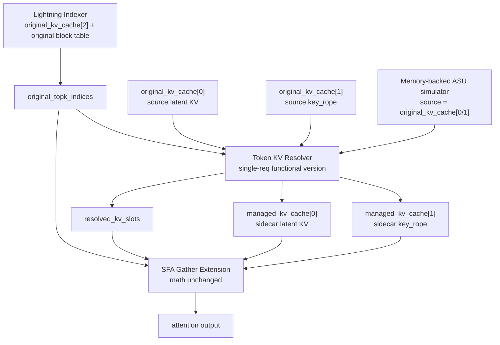

# ASU-backed DSA Decode KVCache 初版功能设计方案

## 1. 背景与目标

本文基于 `docs/draft` 下的总纲和设计草稿，定义 ASU-backed DSA decode KVCache 的初版功能方案。

初版只用于功能性测试，目标是跑通单请求下的完整数据语义：

```text
Lightning Indexer original topK token ids
  -> Token KV Resolver
  -> resolved_kv_slots
  -> sidecar SFA gather 读取 managed HBM KV slot
  -> SFA attention 语义保持不变
```

初版必须满足：

1. 支持单 req。
2. 支持 128K 以上 token 输入规模。
3. 保证功能语义正确：topK token 能解析到正确 full KV，SFA 仍按 original token id 做 attention 语义判断。
4. 本地只做静态检查，不在本地编译或运行 Ascend/CANN 测试。
5. ASU 接口使用普通内存访问模拟，不依赖真实 ASU 设备或驱动 IO。

初版不考虑：

1. 性能优化。
2. 稳定性增强。
3. 多 req 并发。
4. 异常 fallback。
5. 复杂 eviction、LRU、水位线和 admission control。
6. 真实 ASU 设备接入、驱动 IO、DMA 队列和 completion 处理。

## 2. 核心设计结论

当前 SFA 的 `sparse_indices` 不是纯地址 id。它表示 req 内 original logical token id，并参与 causal/window/seq length 等语义判断。

因此初版不把 HBM slot 重新编码成新的 sparse id：

```text
禁止:
  resolved_hbm_loc -> remapped sparse id -> SFA
```

初版采用双输入语义：

```text
sparse_indices[topk_i] = original token id
resolved_kv_slots[topk_i] = managed_kv_cache token pair slot
```

SFA 内部保持：

```text
original token id:
  继续服务 causal/window/actual_seq_lengths_kv 语义。

resolved_kv_slot:
  只服务 managed_kv_cache[0] 与 managed_kv_cache[1] 的 gather 地址生成。
```

这意味着初版必须修改 SFA 的 KV gather / MergeKv 寻址逻辑，但不修改 SFA attention 数学主体。

## 3. 初版范围

### 3.1 单 req 固定边界

初版显式限定：

```text
req_num = 1
```

所有状态表可以省略 req 维度：

```text
token_state[token_id]
hbm_slot_of_token[token_id]
asu_record_addr[token_id]
```

输入 token id 必须满足：

```text
0 <= original_token_id < actual_seq_len
actual_seq_len >= 128 * 1024
```

`actual_seq_len` 由上层 metadata 提供。实现中不应把 `128K` 写死为唯一上限；初版默认容量可以是 `max_seq_len >= actual_seq_len`，并至少覆盖 128K。

### 3.2 KV 数据边界

初版显式保留两套 KV cache：

| Cache | Tensor | 用途 | 初版是否管理 |
| --- | --- | --- | --- |
| 原始 vLLM cache | `original_kv_cache[0]` | vLLM 原始 full KV latent key/value，作为 sidecar 源数据和 baseline | 否 |
| 原始 vLLM cache | `original_kv_cache[1]` | vLLM 原始 key_rope，作为 sidecar 源数据和 baseline | 否 |
| 原始 vLLM cache | `original_kv_cache[2]` | Lightning Indexer key cache | 否 |
| sidecar managed cache | `managed_kv_cache[0]` | 初版自行管理的 latent KV HBM slot | 是 |
| sidecar managed cache | `managed_kv_cache[1]` | 初版自行管理的 key_rope HBM slot | 是 |

初版不替换原始 vLLM KV cache，不改原始写入路径，也不要求原始 SFA baseline 改用 sidecar cache。sidecar managed cache 是外挂功能测试缓冲区，用于验证 token 解析、KV 安装和 SFA gather 改造链路。

初版以 token pair slot 管理 sidecar full KV：

```text
full_kv_pair(token):
  managed_kv_cache[0][slot]
  managed_kv_cache[1][slot]
```

同一个 token 的 `managed_kv_cache[0]` 与 `managed_kv_cache[1]` 必须始终使用同一个 `resolved_kv_slot`。

`managed_kv_cache[0/1]` 是 per-layer sidecar tensor，不追加到原始 `kv_cache` tuple 中。原始 tuple 继续保持 `kv_cache[0/1/2(/3)]` 的既有语义，只有 ASU decode-only 分支通过 ASU manager 显式取得 sidecar tensor 并传给 Resolver 与 sidecar SFA。

物理 tensor 的创建不发生在 attention forward 中，也不发生在每个 decode step 中。初版要求在 vLLM-Ascend 初始化原始 KV cache 的同一阶段，如果 ASU 功能开启，则为每个目标 SFA attention layer 预先创建对应的 `managed_kv_cache[0]` 与 `managed_kv_cache[1]`。request 初始化阶段只初始化或重置逻辑管理状态。

### 3.3 token 域

初版沿用草稿中的连续边界：

```text
managed_prefix_len

[0, managed_prefix_len):
  managed historical domain

[managed_prefix_len, actual_seq_len):
  decode tail domain
```

managed historical token 由 ASU-backed token state 管理。

decode tail token 保持 vLLM 原始写入路径，使用原始 block table 定位 HBM full KV slot。

进入 sidecar SFA gather 前，Resolver 必须保证每个 topK token 都已经安装到 `managed_kv_cache[0/1]`。因此初版不在 SFA 中混合读取原始 cache 和 managed cache，也不引入 per-entry cache selector。

### 3.4 ASU 接口模拟边界

初版所有 ASU 行为都由 memory-backed simulator 提供。Resolver 仍通过 `asu_read_full_kv_pair(...)` 抽象接口读取 full KV pair，但接口实现只能执行普通内存访问或 tensor copy，不发起真实 ASU 设备访问、驱动 IO、DMA 队列或 completion 轮询。

模拟实现不引入额外 ASU KV store。ASU 源数据直接来自原始 `original_kv_cache[0]` 与 `original_kv_cache[1]` 中已经写好的 full KV slot，目标写入 sidecar `managed_kv_cache[0/1]`：

```text
original_kv_cache[0][source_slot] -> managed_kv_cache[0][managed_slot]
original_kv_cache[1][source_slot] -> managed_kv_cache[1][managed_slot]
```

`record_addr` 在初版中只表示原始 `original_kv_cache[0/1]` 的 `source_slot`，不表示真实硬件地址或驱动句柄。

## 4. 总体架构



初版新增两个关键能力：

1. `Token KV Resolver`：把 indexer topK original token id 安装到 sidecar managed cache，并解析为 managed HBM token pair slot。
2. `SFA Gather Extension`：SFA gather 使用 `resolved_kv_slots` 读取 `managed_kv_cache[0/1]`，但仍使用 `sparse_indices` 做原始语义判断。

## 5. 核心数据结构

### 5.1 token state

初版使用直接 token 粒度状态表。性能不是目标，因此不引入 block meta、bitset、UB cache 或分层索引。

```text
token_state[max_seq_len]
```

状态枚举：

| 状态 | 含义 |
| --- | --- |
| `ASU_ONLY` | token 的 full KV 已在原始 `original_kv_cache[0/1]` source slot 中，当前不在 sidecar managed HBM slot |
| `HBM_RESIDENT` | token 的 full KV pair 当前在 sidecar managed HBM slot |
| `TAIL_HBM` | token 属于 decode tail，仍只在原始 vLLM HBM slot |
| `INVALID` | 未使用 token entry |

初版采用同步模拟 ASU read，因此不需要 `LOADING` 状态。

### 5.2 ASU 模拟地址表

初版 ASU full KV record 不另设存储。它复用原始 vLLM 写入路径中的 `original_kv_cache[0]` 与 `original_kv_cache[1]`：

```text
original_kv_cache[0][source_slot]
original_kv_cache[1][source_slot]
```

语义：

| 数据 | 作用 |
| --- | --- |
| `original_kv_cache[0][source_slot]` | token 的 latent KV 源数据 |
| `original_kv_cache[1][source_slot]` | token 的 key_rope 源数据 |

同一个 `source_slot` 必须同时定位 `original_kv_cache[0]` 与 `original_kv_cache[1]` 中属于同一个 token 的 full KV pair。

```text
asu_record_addr[max_seq_len]
```

`asu_record_addr[token_id]` 表示该 token 的 full KV record 在原始 `original_kv_cache[0/1]` 中的 `source_slot`。

`source_slot` 可以由 `original_block_table` 按 token id 计算得到，也可以在 req init 时预先写入 `asu_record_addr`。初版保留 `asu_record_addr` 是为了保持 ASU read 抽象接口稳定，并避免 Resolver 在 miss load 路径重复推导 source slot。

初版只要求功能测试输入保证 managed token 的 `asu_record_addr` 能访问有效原始 KV slot。不设计 ASU 读失败、超时或 record 缺失后的处理路径。

### 5.3 HBM slot 表

```text
hbm_slot_of_token[max_seq_len]
slot_owner_token[managed_slot_count]
free_slot_stack[managed_slot_count]
free_slot_count
```

语义：

| 数据 | 作用 |
| --- | --- |
| `hbm_slot_of_token[token_id]` | token 当前 sidecar resident slot，状态为 `HBM_RESIDENT` 时有效 |
| `slot_owner_token[slot]` | sidecar managed HBM slot 当前归属 token |
| `free_slot_stack` | 初版简单 LIFO free slot 池 |
| `free_slot_count` | 当前可用 free slot 数 |

slot 分配单位始终是 full KV pair：

```text
slot -> managed_kv_cache[0][slot] + managed_kv_cache[1][slot]
```

初版不做 step 内 victim 选择。功能测试应配置足够的 `managed_slot_count`，保证需要加载到 sidecar 的 topK token 有 slot 可用。

### 5.4 tail 定位元数据

decode tail 使用原始 vLLM block table 定位：

```text
logical_block = original_token_id / block_size
offset = original_token_id % block_size
physical_block = original_block_table[logical_block]
slot = physical_block * block_size + offset
```

初版单 req 下 `original_block_table` 可以是一维表：

```text
original_block_table[max_logical_blocks]
```

其中：

```text
max_logical_blocks = ceil(max_seq_len / block_size)
block_size = vLLM KV cache block size, 当前通常为 128
```

### 5.5 resolved slots

Resolver 输出：

```text
resolved_kv_slots.shape == original_topk_indices.shape
resolved_kv_slots.dtype = int32
```

当前 DSA decode 路径中，`original_topk_indices` 通常包含 query token、kv head 和 topK 维度：

```text
[query_tokens, kv_heads, sparse_count]
```

初版不假设 topK 按 token id 排序，也不要求去重。Resolver 顺序遍历每个 topK entry；若同一 token 在同一步内重复出现，第一次 miss load 后更新状态，后续 entry 直接返回同一 slot。

## 6. Token KV Resolver

### 6.1 输入

```text
original_topk_indices
actual_seq_len
managed_prefix_len
token_state
asu_record_addr
hbm_slot_of_token
slot_owner_token
free_slot_stack
free_slot_count
original_block_table
original_kv_cache[0]
original_kv_cache[1]
managed_kv_cache[0]
managed_kv_cache[1]
memory-backed ASU read interface
```

### 6.2 输出

```text
resolved_kv_slots
token_state updates
hbm_slot_of_token updates
slot_owner_token updates
free_slot_count updates
```

初版可以额外输出调试统计：

```text
managed_hits
managed_misses
asu_loads
tail_hits
```

这些统计只用于功能确认，不作为性能指标。

### 6.3 单 token 解析逻辑

```text
token_id = original_topk_indices[i]

if token_state[token_id] == HBM_RESIDENT:
    slot = hbm_slot_of_token[token_id]
    resolved_kv_slots[i] = slot
    continue

if token_state[token_id] == ASU_ONLY:
    source_slot = asu_record_addr[token_id]
    slot = pop(free_slot_stack)
    asu_read_full_kv_pair(
        original_kv_cache[0],
        original_kv_cache[1],
        source_slot,
        managed_kv_cache[0][slot],
        managed_kv_cache[1][slot],
    )
    token_state[token_id] = HBM_RESIDENT
    hbm_slot_of_token[token_id] = slot
    slot_owner_token[slot] = token_id
    resolved_kv_slots[i] = slot
    continue

if token_state[token_id] == TAIL_HBM:
    source_slot = resolve_tail_slot(original_block_table, token_id)
    slot = pop(free_slot_stack)
    asu_read_full_kv_pair(
        original_kv_cache[0],
        original_kv_cache[1],
        source_slot,
        managed_kv_cache[0][slot],
        managed_kv_cache[1][slot],
    )
    token_state[token_id] = HBM_RESIDENT
    hbm_slot_of_token[token_id] = slot
    slot_owner_token[slot] = token_id
    resolved_kv_slots[i] = slot
    continue
```

初版假设输入合法：

```text
token_id < actual_seq_len
managed token 的 ASU 模拟 source slot 有效
original_block_table 覆盖 tail token
free_slot_stack 有足够 slot 覆盖所有未 resident 的 topK token
```

不为非法输入设计恢复路径。

### 6.4 ASU read 语义

初版只依赖一个阻塞式 full KV pair 读取语义。该语义由 memory-backed ASU simulator 实现，不访问真实 ASU 设备：

```text
asu_read_full_kv_pair(
    original_kv_cache_0,
    original_kv_cache_1,
    source_slot,
    dst_managed_kv_cache_0_slot,
    dst_managed_kv_cache_1_slot,
)
```

初版实现等价于：

```text
copy original_kv_cache_0[source_slot] -> dst_managed_kv_cache_0_slot
copy original_kv_cache_1[source_slot] -> dst_managed_kv_cache_1_slot
```

该调用返回后，`managed_kv_cache[0][slot]` 与 `managed_kv_cache[1][slot]` 对应 token pair 必须已经对 sidecar SFA gather 可见。

初版不要求：

1. 异步 IO。
2. completion queue。
3. retry。
4. IO overlap。
5. load job table。
6. 真实 ASU 驱动调用。

## 7. SFA Gather Extension

### 7.1 ABI 变化

在现有 SFA 调用中新增：

```text
managed_kv_cache[0]
managed_kv_cache[1]
resolved_kv_slots
```

现有输入保持原语义：

```text
sparse_indices = original_topk_indices
actual_seq_lengths_query = 原始 query seq length
actual_seq_lengths_kv = 原始 KV seq length
query_rope = 原语义
key_rope = managed_kv_cache[1]
sparse_mode = 3
```

`block_table` 仍传给 indexer 和 Resolver 的 source slot 定位路径使用。进入 sidecar SFA full KV gather 后，所有 token 的地址都由 `resolved_kv_slots` 在 `managed_kv_cache[0/1]` 中定位，不再由 `block_table` 推导，也不直接读取原始 vLLM KV cache。

### 7.2 MergeKv 地址生成

旧路径：

```text
realS2Idx = sparse_indices[topk_i]
logical_block = realS2Idx / block_size
offset = realS2Idx % block_size
physical_block = block_table[logical_block]
slot = physical_block * block_size + offset
copy original_kv_cache[0/1][slot] -> kvMergeGm_
```

初版新路径：

```text
realS2Idx = sparse_indices[topk_i]
semantic checks use realS2Idx

slot = resolved_kv_slots[topk_i]
copy managed_kv_cache[0/1][slot] -> kvMergeGm_
```

不修改：

1. topK 排序。
2. causal/window 判断。
3. `actual_seq_lengths_kv` 语义。
4. QK。
5. softmax。
6. PV。
7. 输出 layout。

## 8. Decode 生命周期

### 8.1 engine / KV cache init

在 vLLM-Ascend 初始化原始 KV cache 时，如果 ASU 功能开启，同步创建 sidecar 管理资源：

```text
1. 保留 vLLM 原始 KV cache 与 original_block_table，供原始路径、baseline、original_kv_cache[2] 和 indexer 使用。
2. 为每个目标 SFA attention layer 创建 managed_kv_cache[0]。
3. 为每个目标 SFA attention layer 创建 managed_kv_cache[1]。
4. 为每个目标 SFA attention layer 创建 token_state / asu_record_addr / hbm_slot_of_token。
5. 为每个目标 SFA attention layer 创建 slot_owner_token / free_slot_stack / free_slot_count。
6. 记录 managed_slot_count、max_seq_len、block_size 与 sidecar tensor layout。
```

该阶段完成后，任何 ASU decode-only attention step 执行前都已经存在可写的 `managed_kv_cache[0/1]`。attention forward、Indexer、Resolver 和 SFA 调用路径中不再动态分配 `managed_kv_cache`。

初版不做淘汰，因此 `managed_slot_count` 必须由配置或 `max_seq_len` 保证足够覆盖功能测试所需 resident token。容量不足时直接报错，不回退到原始 SFA 路径，也不做 victim 选择。

### 8.2 req ASU state init

单 req 初始化：

```text
1. 复用 engine / KV cache init 阶段已经创建好的 per-layer managed_kv_cache[0/1]。
2. 重置 token_state / asu_record_addr / hbm_slot_of_token。
3. 重置 slot_owner_token / free_slot_stack / free_slot_count。
4. 设置 managed_prefix_len。
5. 准备原始 original_kv_cache[0] / original_kv_cache[1] source slots，作为 memory-backed ASU simulator 的源数据。
6. 对 [0, managed_prefix_len) token:
     token_state = ASU_ONLY
     asu_record_addr = valid source slot
7. 对 [managed_prefix_len, actual_seq_len) token:
     token_state = TAIL_HBM
```

初版可以直接把 prompt historical token 初始化为 `ASU_ONLY`，以强制功能测试覆盖 ASU miss load 路径。

### 8.3 append decode token

新 decode token 写入原始 vLLM HBM slot：

```text
1. vLLM 为 token 分配 original block + offset。
2. 写 original_kv_cache[0][original_slot]。
3. 写 original_kv_cache[1][original_slot]。
4. 写 original_kv_cache[2][original_slot] 给 indexer。
5. token_state[token_id] = TAIL_HBM。
```

初版不设计 tail 异步写 ASU 的完成状态。如果功能测试需要把 tail 纳入 sidecar managed cache，可以在 topK 命中时由 Resolver 通过 `original_block_table` 找到原始 source slot，并同步拷贝到 `managed_kv_cache[0/1]`。

如果功能测试需要把 tail 永久迁入 managed historical domain，可以在 step 边界由测试驱动显式确认原始 `original_kv_cache[0/1]` source slot 已准备好，并完成状态切换：

```text
1. 确认 original_kv_cache[0] / original_kv_cache[1] 中的 source slot 已由测试环境准备好。
2. token_state[token_id] = ASU_ONLY。
3. managed_prefix_len 前移。
```

### 8.4 attention step

```text
1. Lightning Indexer 读取 original_kv_cache[2] 和 original_block_table。
2. Indexer 输出 original_topk_indices。
3. Token KV Resolver 读取 original_topk_indices。
4. Resolver 从 original_kv_cache[0/1] 把未 resident 的 topK token 同步安装到 managed_kv_cache[0/1]。
5. Resolver 输出 resolved_kv_slots，所有 slot 都属于 sidecar managed cache。
6. Sidecar SFA 接收 original_topk_indices、managed_kv_cache[0/1] 和 resolved_kv_slots。
7. Sidecar SFA 使用 original_topk_indices 做语义判断。
8. Sidecar SFA 使用 resolved_kv_slots gather managed_kv_cache[0/1]。
9. Sidecar SFA attention 主体完成输出，并与原始 cache baseline 对齐。
```

## 9. 与 vLLM-Ascend 集成点

### 9.1 Python / metadata

新增一个初版管理对象：

```text
ASUFullKVCacheManagerFunctional
```

职责：

```text
1. 在 engine / KV cache init 阶段创建 per-layer sidecar managed_kv_cache[0/1]。
2. 维护 managed_prefix_len。
3. 在 req ASU state init 阶段重置单 req token state。
4. 维护原始 original_kv_cache source slot 与 record 地址映射。
5. 维护 managed HBM slot pool。
6. 暴露 resolver op 和 sidecar SFA 所需 tensor。
7. 在 attention 前准备 resolved_kv_slots 输出 tensor。
```

`attn_metadata` 需要新增或携带：

```text
managed_prefix_len
actual_seq_len
token_state
asu_record_addr
hbm_slot_of_token
free_slot_stack
free_slot_count
slot_owner_token
managed_kv_cache[0]
managed_kv_cache[1]
resolved_kv_slots
```

### 9.2 Resolver custom op

新增 NPU op：

```text
asu_resolve_kv_slots_single_req(
    original_topk_indices,
    actual_seq_len,
    managed_prefix_len,
    token_state,
    asu_record_addr,
    hbm_slot_of_token,
    slot_owner_token,
    free_slot_stack,
    free_slot_count,
    original_block_table,
    original_kv_cache_0,
    original_kv_cache_1,
    managed_kv_cache_0,
    managed_kv_cache_1,
    resolved_kv_slots,
)
```

初版 op 可以采用最直接的顺序语义实现。性能不是目标，重点是确保每个 topK token 最终写出正确 slot。

### 9.3 SFA custom op

扩展 `npu_sparse_flash_attention` 或新增内部变体，使其能接收：

```text
managed_kv_cache[0]
managed_kv_cache[1]
resolved_kv_slots
```

Sidecar SFA kernel 只在 gather / MergeKv 地址生成处切换为 managed cache + resolved slot。

## 10. 功能测试设计

本地环境不进行编译和运行。以下测试应在具备 Ascend/CANN 的目标环境执行，其中 ASU read 由 memory-backed simulator 提供，不依赖真实 ASU 后端。

### 10.1 基础 ASU miss load

输入：

```text
req_num = 1
actual_seq_len = 128K
managed_prefix_len = 128K
所有 token_state = ASU_ONLY
topK 从 [0, 128K) 中选择
```

期望：

```text
1. Resolver 为每个 topK token 分配 managed slot。
2. 每个 miss token 从 original_kv_cache[0/1] 同步拷贝到 managed_kv_cache[0/1]。
3. resolved_kv_slots 全部有效，且全部指向 managed_kv_cache。
4. Sidecar SFA 输出与原始全 KV 常驻 HBM baseline 一致。
```

### 10.2 重复 topK token

输入包含重复 token id。

期望：

```text
1. 同一 token 只安装到一个 HBM slot。
2. 重复 entry 的 resolved_kv_slots 相同。
3. Sidecar SFA 输出与 baseline 一致。
```

### 10.3 mixed managed + tail

输入：

```text
actual_seq_len > managed_prefix_len
topK 同时包含 managed token 和 tail token
```

期望：

```text
1. managed token 经 ASU_ONLY/HBM_RESIDENT 路径解析。
2. tail token 经 original_block_table 解析 source slot，并同步安装到 managed_kv_cache。
3. resolved_kv_slots 对 managed token 和 tail token 都指向 managed_kv_cache。
4. sparse_indices 保持 original token id，不被改写。
5. Sidecar SFA 输出与 baseline 一致。
```

### 10.4 128K 边界以上输入

输入：

```text
actual_seq_len = 128K + N
N >= 1
topK 覆盖 token_id = 128K - 1 和 token_id = 128K
```

期望：

```text
1. 状态表和 block table 覆盖 128K 边界后的 token。
2. token_id = 128K 不发生截断或越界。
3. Sidecar SFA 输出与 baseline 一致。
```

### 10.5 kv head 维度

输入 topK shape 保持当前 DSA 形态：

```text
[query_tokens, kv_heads, sparse_count]
```

期望：

```text
1. resolved_kv_slots shape 与 original_topk_indices 完全一致。
2. 每个 kv head 的 topK entry 都被解析。
3. Sidecar SFA 输出与 baseline 一致。
```

## 11. 本地静态检查

本地只做文档和源码级静态检查：

```text
1. 检查文档中没有未完成标记。
2. 检查初版范围没有引入多 req、性能优化、异常 fallback 作为必需路径。
3. 检查接口命名和数据结构语义与 draft 保持一致。
4. 检查 `sparse_indices` 与 `resolved_kv_slots` 的职责没有混淆。
5. 检查原始 vLLM cache 与 sidecar managed cache 的职责没有混淆。
```

不得在本地执行：

```text
1. Ascend custom op 编译。
2. CANN 运行测试。
3. NPU profiler。
4. 需要目标硬件或真实 ASU 后端的集成测试。
```

## 12. 后续不纳入初版的事项

以下内容属于后续版本，不进入本初版功能方案：

1. 多 req 支持。
2. CPU LRU eviction。
3. free slot watermark。
4. step 间 touch ring。
5. 异步 ASU read。
6. completion queue。
7. load job table。
8. block 粒度 metadata 优化。
9. bitset token state。
10. topK grouping。
11. PA-compatible staging 过渡路径。
12. 异常 fallback。
13. 真实 ASU 设备和驱动 IO 接入。
14. SFA 内 per-entry cache selector。

## 13. 初版交付判断

初版设计完成后，功能实现只需要证明：

```text
1. original_topk_indices 始终保持 original token id。
2. Resolver 能为单 req、128K+ token 输入生成正确 resolved_kv_slots。
3. 原始 vLLM KV cache 不被 sidecar 路径替换或破坏。
4. ASU_ONLY managed token 能通过 memory-backed ASU simulator 从 original_kv_cache 同步安装 full KV pair 到 managed_kv_cache 的同一个 HBM slot。
5. tail token 能通过 original block table 找到原始 source slot，并在需要时安装到 managed_kv_cache。
6. Sidecar SFA gather 能使用 resolved_kv_slots 读取 managed_kv_cache[0/1]。
7. Sidecar SFA attention 输出能与原始全 KV 常驻 HBM baseline 对齐。
```

只要上述条件成立，即认为初版功能链路通过。
