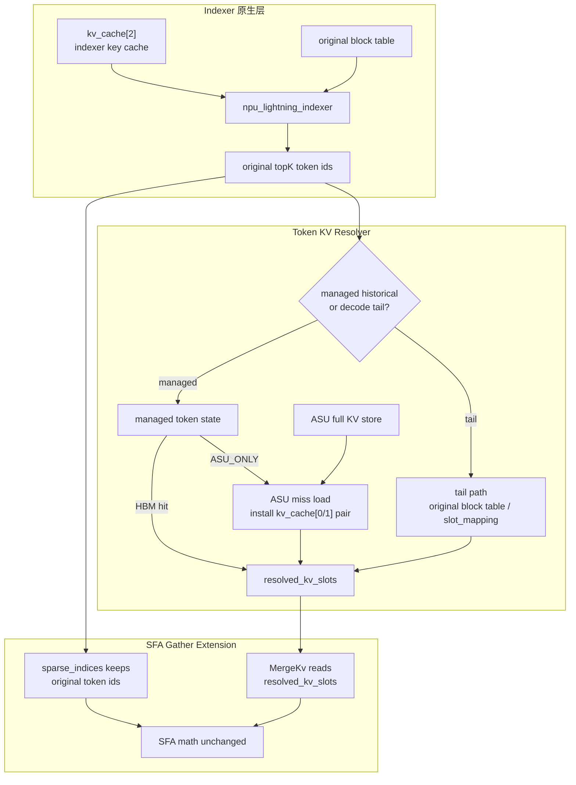

# ASU-backed DSA Decode KVCache 管理设计草稿

本文定义 Ascend NPU + ASU 存储后端下的 DSA decode KVCache 管理机制。

核心目标是：承接 Lightning Indexer 输出的 topK original token ids，在 NPU 侧完成 token 粒度 HBM resident / ASU miss 解析与加载，并把 full KV 以不破坏 SFA attention 语义的形式交给 SFA。

## 0. 当前结论

当前 SFA 的 `sparse_indices` 不是纯地址 id。它表示 original logical token id，并参与 causal/window/seq length 语义判断。

因此，本设计不再采用：

```text
resolved_hbm_loc -> remapped sparse id -> SFA
```

最终路径改为：

```text
sparse_indices[topk_i] = original token id      # 保留 SFA 语义
resolved_kv_slots[topk_i] = real HBM token slot # 只用于 KV 地址
```

SFA 数学主体不变，只扩展 KV gather / MergeKv 的地址生成：

```text
old:
  sparse_indices -> block_table -> PA KV address

new:
  sparse_indices -> attention semantic checks
  resolved_kv_slots -> KV address
```

## 1. 目标与边界

### 1.1 目标

1. 在 Ascend 910B 单卡 HBM 受限条件下，降低 decode 节点 full KV 常驻 HBM 量。
2. 面向后续 950DT 组网，构建可承接 ASU 存储后端的 KVCache 管理路径，对标 Nvidia G2.5 生态位。
3. 在 DSA 注意力架构下，使用 indexer topK 直接检索 HBM 常驻 KV。
4. HBM miss 时，由 NPU 直驱 ASU 读取 full KV，并安装到 HBM token slot。
5. 支持 token 粒度动态加载和淘汰，提高 req 并发。
6. 将解析后的 KV 地址交给 SFA，不影响 SFA attention 算法正确性。

### 1.2 不负责的部分

```text
ASU read 接口内部机制:
  由其他团队实现。
  本设计只假设 NPU 侧有可用的批量读接口和 completion 语义。

Lightning Indexer:
  不改 indexer 算法。
  不改 kv_cache[2] 的 PA_BSND layout。
  indexer 继续使用原始 vLLM block table。

SFA 数学主体:
  不改 QK / softmax / PV / rope 语义。
  不改 sparse_indices 的 original token id 语义。
```

### 1.3 需要改的部分

```text
Token KV management:
  新增 ASU-backed token state。
  按 token 粒度管理 kv_cache[0] + kv_cache[1] full KV pair。
  HBM hit 返回 resident slot。
  HBM miss 通过 ASU load 到 free HBM token slot。

SFA gather:
  新增 resolved_kv_slots 输入或等价机制。
  只修改 KV gather / MergeKv 的地址生成。
  sparse_indices 继续作为 original token ids 使用。
```

## 2. 当前代码事实

### 2.1 DSA KVCache 组成

当前 DSA decode 路径下，`kv_cache` 至少包含三类数据：

| cache tensor | 用途 | 本设计是否管理 |
| --- | --- | --- |
| `kv_cache[0]` | `k_nope` / MLA latent cache；SFA 中同时作为 key 和 value | 是 |
| `kv_cache[1]` | `k_pe` / `key_rope`；与 query_rope 参与 attention score | 是 |
| `kv_cache[2]` | Lightning Indexer key cache | 否，保持原 PA layout |

本设计中的 full KV record 指：

```text
full_kv_record(token) =
    kv_cache[0] token fragment
  + kv_cache[1] token fragment
```

`kv_cache[2]` 只服务 indexer，不进入 ASU-backed full KV token slot pool。

### 2.2 `kv_cache[0]` 与 `kv_cache[1]` 必须同 slot

当前 SFA 使用同一份 sparse id / block table 寻址 key/value 和 key_rope。即使修改 gather 地址生成，也必须保持：

```text
resolved_kv_slot(token)
  -> kv_cache[0][slot]
  -> kv_cache[1][slot]
```

不能为同一个 token 的 `kv_cache[0]` 与 `kv_cache[1]` 维护两套独立地址。

### 2.3 SFA sparse id 语义

当前 SFA PA 寻址模型是：

```text
token_id = sparse_indices[topk_i]
logical_block = token_id / block_size
offset = token_id % block_size
physical_block = block_table[req, logical_block]
addr = physical_block * block_size + offset
```

但 `token_id` 不只用于地址。`sparse_mode=3` 下，它还参与 causal/window 边界判断。

因此：

```text
sparse_indices 必须保持 original logical token id。
actual_seq_lengths_kv 必须继续表示原始 KV 序列语义。
不能把 access namespace 长度伪装成 seq length。
```

### 2.4 block table 与 token 粒度重排冲突

原始 SFA `block_table` 是 logical block -> physical block 的映射。它只能表达 block 粒度布局，不能表达：

```text
token_id -> arbitrary HBM token slot
```

若 full KV 以 token 粒度动态加载到任意 HBM slot，仅靠 remap block table 无法表达正确地址。必须扩展 SFA gather，使其接受 token-level resolved slot。

## 3. 三个坐标系

| 坐标系 | 含义 | 使用者 |
| --- | --- | --- |
| `original_token_id` | req 内原始 logical token position，即 indexer topK 输出 | SFA 语义、domain 判断、tail 定位 |
| `managed_token_uid` | managed historical token 的管理身份 | token state / ASU record / hotness |
| `resolved_kv_slot` | token 当前真实 HBM full KV pair slot | SFA gather 地址生成 |

必须避免把 `resolved_kv_slot` 编码回新的 sparse id。

```text
original_token_id:
  代表原始序列位置。
  传给 SFA sparse_indices。

managed_token_uid:
  只在 token 属于 managed historical domain 时存在。

resolved_kv_slot:
  表示 kv_cache[0] 与 kv_cache[1] 的同一个 HBM token pair slot。
  只服务 KV 地址生成。
```

## 4. 总体架构



### 4.1 主要路径

```text
1. indexer 输出 original_topk_indices。
2. Token KV Resolver 对每个 topK token 判断 domain。
3. tail token 走原始 vLLM block table / slot_mapping，得到原始 full KV slot。
4. managed token 查 token state。
5. HBM hit 直接返回 resident slot。
6. HBM miss 通过 ASU load 到 free HBM token pair slot，再返回 slot。
7. SFA 接收 original_topk_indices 和 resolved_kv_slots。
8. SFA 保留 original_topk_indices 做语义判断，用 resolved_kv_slots 读取 kv_cache[0/1]。
```

## 5. 核心数据结构

### 5.1 domain 判断元数据

第一版使用连续边界：

```text
managed_prefix_len[req]

if original_token_id < managed_prefix_len[req]:
    managed historical domain
else:
    decode tail domain
```

含义：

```text
[0, managed_prefix_len):
  已纳入 ASU-backed managed token state。

[managed_prefix_len, seq_len):
  decode tail，仍按 vLLM 原始 block layout 定位 full KV。
```

若后续需要非连续迁移，再升级为 membership bitmap。

### 5.2 managed token state

managed token uid 可用 base + token id：

```text
managed_token_uid = managed_token_base[req] + original_token_id
```

主状态：

```text
managed_token_state[layer, managed_token_uid]
```

字段：

| 字段 | 含义 |
| --- | --- |
| `state` | `HBM_CLEAN` / `ASU_ONLY` / `LOADING` / `INVALID` |
| `hbm_slot` | 当前 HBM token pair slot，线性 slot 或 `(block, offset)` |
| `asu_record_addr` | ASU full KV record 地址 |
| `token_epoch` | 防止 req/token 复用后的 stale IO |
| `req_id` | 所属请求 |
| `logical_token_id` | req 内 original token id |

`HBM_CLEAN` 的前提是 ASU 中已有完整 full KV record，且 HBM slot 中 `kv_cache[0]` 与 `kv_cache[1]` pair 均有效。

### 5.3 decode tail 元数据

tail token 不进入 managed token state。它使用原始 vLLM 信息：

| 数据结构 | 作用 |
| --- | --- |
| `original_block_table` | indexer 使用，也可定位 tail full KV |
| `slot_mapping` | 若可按 token 查询，直接得到 tail HBM slot |
| `tail_dirty_bitmap` | 标记 tail token ASU write 是否完成 |
| `tail_protect_until_step` | 防止过早迁入 managed 或释放 |

tail 查询：

```text
slot = slot_mapping[req, original_token_id]
```

或：

```text
logical_block = original_token_id / block_size
offset = original_token_id % block_size
block = original_block_table[req, logical_block]
slot = block * block_size + offset
```

在 DCP/PCP 或 hybrid block 模式下，优先复用 vLLM 已计算的 `slot_mapping`，避免重新实现复杂 rank-local 映射。

### 5.4 HBM token pair slot pool

managed full KV 使用 token pair slot：

```text
hbm_token_slot:
  kv_cache[0][slot] = latent key/value fragment
  kv_cache[1][slot] = key_rope fragment
```

辅助结构：

| 数据结构 | 作用 |
| --- | --- |
| `free_slot_buffer[layer]` | NPU miss load 消费的 free HBM token slots |
| `slot_owner_token[layer, slot]` | 当前 slot 属于哪个 managed token |
| `slot_state[layer, slot]` | `FREE` / `RESIDENT` / `LOADING` / `PROTECTED` |
| `load_job_table[layer]` | ASU -> HBM load job |
| `touch_ring[layer]` | NPU 上报 touch / hit / miss / source |
| `cache_stats[layer]` | hit rate、miss、load latency |

slot 分配、释放、覆盖必须以 pair 为粒度。

### 5.5 resolved slots

Resolver 输出：

```text
resolved_kv_slots[layer, query_token, kv_head, topk_i]
```

或与 SFA topK tensor 等价的压缩布局。

每个 entry 表示一个 full KV pair slot：

```text
resolved_kv_slot = hbm_block_id * block_size + hbm_offset
```

SFA gather 使用：

```text
key row  = kv_cache[0][resolved_kv_slot]
rope row = kv_cache[1][resolved_kv_slot]
```

如果底层实现需要 `(block, offset)`，可将 `resolved_kv_slot` 拆成两个 tensor；语义上仍是 per-token physical slot。

## 6. Decode 流程

### 6.1 req init

```text
1. vLLM 初始化 original block table，供 kv_cache[2] / indexer 使用。
2. ASUFullKVCacheManager 初始化 managed_prefix_len。
3. prompt historical token 默认进入 managed domain:
     state = ASU_ONLY
     asu_record_addr = ASU full KV record address
4. predicted topK 可提前 load 到 HBM token slots。
5. decode tail 初始为空。
```

### 6.2 append new token

新生成 token 属于 tail domain：

```text
1. vLLM 为新 token 分配 original block + offset。
2. 写 kv_cache[0] 和 kv_cache[1] full KV 到原始 slot。
3. 写 kv_cache[2] indexer key 到原始 slot。
4. 设置 tail dirty bit。
5. 异步写 ASU。
6. ASU write 完成后清 dirty bit。
```

### 6.3 每步 attention 前

```text
1. indexer 输出 original_topk_indices。
2. Token KV Resolver 生成 resolved_kv_slots。
3. SFA 调用:
     sparse_indices = original_topk_indices
     resolved_kv_slots = Resolver 输出
     actual_seq_lengths_kv = 原始 KV seq length
4. SFA gather 按 resolved_kv_slots 读取 kv_cache[0/1]。
5. SFA 数学主体不变。
```

### 6.4 tail 迁入 managed domain

CPU step 间可将 tail contiguous prefix 转入 managed domain，条件：

```text
1. ASU write 已完成。
2. token 超出 tail protect window。
3. CPU 决定释放或复用 original full-KV HBM backing。
```

第一版建议：

```text
tail -> managed 时默认 state = ASU_ONLY。
释放 original full-KV HBM backing。
后续 topK 命中再从 ASU load 到 managed token slot。
```

若复用当前 HBM 内容作为 managed slot，必须把 pair ownership 从 vLLM original allocator 转移给 managed slot pool，且不能再被原 allocator 复用。

## 7. Token KV Resolver

### 7.1 输入

```text
original_topk_indices
managed_prefix_len
managed_token_base or managed_uid_table
managed_token_state
original_block_table / slot_mapping
free_slot_buffer
kv_cache[0], kv_cache[1]
ASU read interface
```

### 7.2 输出

```text
resolved_kv_slots
touch_ring events
miss/load stats
load_job_table updates
managed_token_state updates
```

### 7.3 单 token 逻辑

```text
token_id = original_topk_indices[...]

if token_id >= managed_prefix_len[req]:
    slot = tail_slot_mapping_or_original_block_table_lookup(req, token_id)
    source = TAIL_ORIGINAL_HBM

else:
    uid = managed_token_base[req] + token_id
    state = managed_token_state[layer, uid]

    if state == HBM_CLEAN:
        slot = state.hbm_slot
        source = MANAGED_HBM

    elif state == ASU_ONLY:
        slot = pop(free_slot_buffer[layer])
        issue_asu_read_pair(state.asu_record_addr, kv_cache[0][slot], kv_cache[1][slot])
        wait_or_pipeline_load_completion()
        managed_token_state[layer, uid] = HBM_CLEAN(slot, state.asu_record_addr)
        source = MANAGED_ASU_LOAD

    elif state == LOADING:
        wait_or_reuse_load_job()
        slot = loaded slot
        source = MANAGED_LOADING

    else:
        invalid token state

resolved_kv_slots[...] = slot
write_touch_ring(req, token_id, source, slot)
```

### 7.4 NPU step 内不做的事

```text
victim 选择
LRU 链表维护
free list 链表遍历
tail token 迁入 managed index
dirty tail token 释放
```

## 8. SFA Gather Extension

### 8.1 ABI 变化

SFA 增加输入：

```text
resolved_kv_slots
```

现有输入保持：

```text
sparse_indices = original topK token ids
actual_seq_lengths_query = 原语义
actual_seq_lengths_kv = 原语义
query_rope / key_rope = 原语义
```

`block_table` 可保留为兼容参数或 fallback 参数，但在 token-level resolved slot 路径中，SFA full KV gather 不再依赖 `block_table` 生成 `kv_cache[0/1]` 地址。

### 8.2 内部修改范围

只改 KV gather / MergeKv 地址生成。

旧路径：

```text
realS2Idx = sparse_indices[topk_i]
block = block_table[req, realS2Idx / block_size]
offset = realS2Idx % block_size
slot = block * block_size + offset
copy kv_cache[0/1][slot] -> merge workspace
```

新路径：

```text
realS2Idx = sparse_indices[topk_i]
semantic checks use realS2Idx

slot = resolved_kv_slots[topk_i]
copy kv_cache[0/1][slot] -> merge workspace
```

不改：

```text
topK ordering
causal/window 判断
actual seq length 语义
QK matmul
softmax
PV matmul
output layout
```

## 9. Eviction 与 CPU 管理

eviction 只作用于 managed historical domain。

```text
CPU:
  consume_touch_ring()
  update_hotness_or_lru()
  choose HBM_CLEAN victims()
  evict_clean_managed_tokens()
  advance_tail_to_managed_boundary()
  refill_free_slot_buffer()
  publish_next_step_metadata()

NPU:
  consume current metadata snapshot
  resolve topK token slots
  issue ASU read on miss
  install loaded KV pair
  write touch/miss events
```

managed eviction：

```text
require state == HBM_CLEAN
require asu_record_addr valid

old_slot = state.hbm_slot
state = ASU_ONLY
state.hbm_slot = INVALID
slot_owner_token[old_slot] = INVALID
slot_state[old_slot] = FREE
append old_slot to next free_slot_buffer
```

tail token 不由 managed eviction 淘汰。dirty tail token 在 ASU write 完成前禁止释放。

## 10. free slot 不足

NPU step 内不做 emergency victim 选择。

| 方式 | 行为 |
| --- | --- |
| watermark | CPU 提前准备足够 free slots |
| host slow path | NPU 上报不足，host refill 后重放 |
| admission control | 降低并发或限制 managed miss 预算 |

第一版：

```text
free_slot_buffer >= expected_managed_miss_tokens + reserve_margin
```

## 11. 内存预算

HBM 常驻内容：

```text
必留:
  model weights
  activations / workspace
  kv_cache[2] indexer key cache
  metadata

可控:
  managed full-KV HBM token slots
  decode tail original full-KV slots
  resolved_kv_slots / load metadata
```

Full KV HBM：

```text
full_kv_hbm =
    managed_slot_count * per_token_full_kv_bytes
  + tail_resident_token_count * per_token_full_kv_bytes
```

其中：

```text
per_token_full_kv_bytes =
    bytes(kv_cache[0] token fragment)
  + bytes(kv_cache[1] token fragment)
```

如果启用 PA-compatible staging 过渡方案，还必须额外计算 staging scratch HBM。

## 12. 过渡方案：PA-compatible staging

若短期完全不改 SFA，可在 SFA 前构造临时 PA staging：

```text
1. Resolver 解析 topK token。
2. 将 topK token 的 kv_cache[0/1] pair copy 到 temporary PA staging blocks。
3. sparse_indices 仍保持 original token ids。
4. temporary block_table 指向 staging blocks。
5. actual_seq_lengths_kv 仍保持原始 seq length 语义。
6. 调用未改 SFA。
```

该方案只适合作为 correctness / ASU offload / cache policy 验证路径，不是最终目标：

```text
问题:
  额外 KV 搬运成本高。
  block table 是 block 粒度，会浪费 scratch HBM。
  无法自然表达 token 粒度任意重排。
```

## 13. 与 vLLM 集成点

### 13.1 Python / 调度层

新增：

```text
ASUFullKVCacheManager
  managed_prefix_len 管理
  managed token uid 分配
  managed_token_state 管理
  ASU full-KV record addr 管理
  HBM token pair slot pool
  CPU eviction
  tail -> managed migration
```

`attn_metadata` 扩展：

```text
managed_prefix_len
managed_token_state pointers
free_slot_buffer pointers
resolved_kv_slots
load_job_table pointers
touch_ring pointers
```

Indexer 继续使用：

```text
block_table = original vLLM block table
```

SFA 使用：

```text
sparse_indices = original_topk_indices
resolved_kv_slots = Token KV Resolver output
actual_seq_lengths_kv = original seq length metadata
```

### 13.2 NPU custom op

新增：

```text
asu_resolve_kv_slots_for_sfa(
    original_topk_indices,
    managed_prefix_len,
    managed_token_base_or_uid_table,
    managed_token_state,
    original_block_table_or_slot_mapping,
    free_slot_buffer,
    kv_cache_0,
    kv_cache_1,
    resolved_kv_slots,
    load_job_table,
    touch_ring,
)
```

职责：

```text
1. 判断 topK token domain。
2. tail token: 得到 original HBM slot。
3. managed token: 查 state。
4. HBM hit: 输出 resident slot。
5. HBM miss: 通过 ASU load kv_cache[0/1] pair 到 free slot。
6. 输出 resolved_kv_slots。
7. 写 touch/miss/load stats。
```

不负责：

```text
victim 选择
LRU 更新
tail -> managed migration
free slot victim refill
indexer key cache 管理
SFA 数学计算
```

### 13.3 SFA kernel

修改：

```text
MergeKv / gather:
  用 resolved_kv_slots 生成 kv_cache[0/1] GM 地址。
```

保持：

```text
sparse_indices original token id 语义
sparse_mode=3 边界判断
actual_seq_lengths 语义
matmul / softmax / output
```

## 14. 风险与待验证项

| 风险 | 说明 | 验证方式 |
| --- | --- | --- |
| SFA gather 扩展正确性 | `sparse_indices` 语义保留，KV 地址改为 resolved slot | SFA 对拍 |
| `resolved_kv_slots` shape | topK 实际 shape 包含 query token 和 kv head 维度 | shape 单测 + trace |
| ASU miss latency | miss 会阻塞或重放 attention | profiler + miss budget |
| free slot 不足 | NPU 不做 victim 选择 | watermark / admission test |
| tail dirty 释放 | ASU write 未完成前释放会丢 KV | dirty bitmap + epoch |
| stale IO | req/token 复用后旧 IO 写回 | epoch 校验 |
| pair slot 约束 | kv_cache[0] 与 kv_cache[1] 必须同 slot | pair load/evict 单测 |
| hit rate 不达标 | topK 分布可能更散 | trace replay |

## 15. 当前路线

主线：

```text
original topK token ids
  -> Token KV Resolver
  -> resolved_kv_slots
  -> SFA Gather Extension
  -> SFA math unchanged
```

保留：

```text
kv_cache[2] + original block table -> indexer
decode tail original write path
managed historical token state
CPU eviction and migration
```

不再作为主线：

```text
resolved_hbm_loc -> remapped sparse id
access namespace seq length
仅靠 remap block table 表达 token 粒度任意重排
```

这条路线才能同时满足 token 粒度动态加载、降低 HBM 常驻 KV、提高 req 并发，以及不破坏 SFA 算法正确性。
