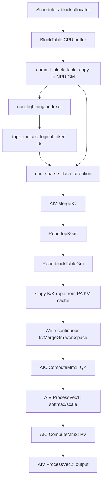

# vLLM-Ascend DSA/SFA 实现分析

本文记录当前本地 `vllm-ascend` 源码中 DeepSeek DSA 相关路径的实现拆解，重点解释 indexer 输出、`block_table` 查询、Sparse Flash Attention kernel 的数据流、并行方式，以及为什么 attention 中的 metadata 查询和独立 lookup 算子的性能表现会不同。

## 结论摘要

1. 当前 vllm-ascend 的 DSA decode 路径中，`npu_lightning_indexer` 输出的是 token 粒度的 topK sparse index，`sparse_count=2048`。
2. `npu_sparse_flash_attention` 显式传入 `sparse_block_size=1`。这里的 `sparse_block_size` 是 sparse index 粒度，不是 paged KV cache 的物理 block size。
3. vllm-ascend 的 KV cache block size 通常是 128。`block_table[req, logical_block_id]` 保存 logical block 到 physical block 的映射。
4. 在 `sparse_block_size=1` 时，SFA host tiling 选择 `V_TEMPLATE`。该路径不是让 AIC/Cube 直接按 topK 随机读取 KV，而是由 AIV 先执行 `MergeKv`，完成 topK -> block table -> physical KV 的 gather，并写入连续的 `kvMergeGm_` workspace。
5. AIC/Cube 在同一个 tile 上必须等待 AIV merge 完成，因此 block table 查询不能被完全隐藏；它只能通过跨 tile 的 pipeline 和 AIV/AIC 分工被部分摊薄。
6. 独立 HBM lookup 算子只做 `GetValue -> 写 state`，没有后续 K/V 搬运和 matmul 可以摊销随机 scalar GM load，因此它暴露出的 350us 量级不是简单离谱，而是 token 粒度 data-dependent scalar GM lookup 的真实风险信号。

## Python 调用链

DSA 路径在 `vllm_ascend/attention/sfa_v1.py` 中完成两步：

1. 调用 `npu_lightning_indexer` 生成 topK sparse indices。
2. 将 topK indices 传给 `npu_sparse_flash_attention` 做稀疏 attention。

关键源码：

- `../../vllm-ascend/vllm_ascend/attention/sfa_v1.py:1010`
- `../../vllm-ascend/vllm_ascend/attention/sfa_v1.py:878`

调用形态如下：

```python
topk_indices = torch.ops._C_ascend.npu_lightning_indexer(
    query=q,
    key=kv_cache[2],
    weights=weights,
    actual_seq_lengths_query=actual_seq_lengths_query,
    actual_seq_lengths_key=actual_seq_lengths_key,
    block_table=block_table,
    layout_query="TND",
    layout_key="PA_BSND",
    sparse_count=2048,
    sparse_mode=3)
```

```python
attn_output = torch.ops._C_ascend.npu_sparse_flash_attention(
    query=ql_nope,
    key=kv_cache[0],
    value=kv_cache[0],
    sparse_indices=topk_indices,
    scale_value=self.scale,
    sparse_block_size=1,
    block_table=attn_metadata.block_tables,
    actual_seq_lengths_query=actual_seq_lengths_query,
    actual_seq_lengths_kv=actual_seq_lengths_key,
    query_rope=q_pe,
    key_rope=kv_cache[1],
    layout_query="TND",
    layout_kv="PA_BSND",
    sparse_mode=3,
)
```

需要特别区分两个概念：

| 名称 | 当前典型值 | 含义 |
| --- | --- | --- |
| `sparse_block_size` | 1 | topK sparse index 粒度。1 表示每个 sparse index 对应 1 个 logical token。 |
| KV cache `block_size` | 128 | paged KV cache 的物理块大小。`block_table` 以这个粒度记录 logical block -> physical block。 |

`vllm_ascend/utils.py:1089` 会在 `cache_config.block_size is None` 时设置为 128。`vllm_ascend/ascend_config.py:269` 也要求 Xlite graph mode 下 `block_size == 128`。

## Indexer 输出语义

`csrc/torch_binding.cpp` 和 `csrc/torch_binding_meta.cpp` 定义了 `npu_lightning_indexer` 的输出 shape。对于 `layout_query="TND"` 且 `layout_key="PA_BSND"` 的路径，输出维度为：

```text
[query_tokens, kv_heads, sparse_count]
```

源码依据：

- `../../vllm-ascend/csrc/torch_binding.cpp:755`
- `../../vllm-ascend/csrc/torch_binding_meta.cpp:212`

输出 dtype 是 `int32`。因此 `topk_indices[t, h, k]` 是第 `t` 个 query token、第 `h` 个 kv head 的第 `k` 个 sparse logical token/block index。当前 `sparse_block_size=1`，所以它就是 logical token id。

Indexer 内部会生成逻辑 token 序号并与 score 一起排序：

- `lightning_indexer_service_vector.h:290` 用 `globalTopkIndice_ + cuBaseS2Idx` 构造逻辑 index。
- `lightning_indexer_service_vector.h:293` 到 `:321` 对 score/index pair 做 sort、merge sort、sparse topK。
- `lightning_indexer_service_vector.h:335` 调用 `ExtractIndex` 取出 index。
- `lightning_indexer_vector.h:311` 到 `:321` 的 `GatherMask` 负责从交错的 score/index pair 中抽出 index。

这说明 topK 输出是按 score/topK 排名组织的，不是按 token id 或 block id 排序。当前源码没有看到在 indexer 输出后按 logical token id 做重排序。

## Block Table 语义

`block_table` 是每个 req 一行的 logical block -> physical block 映射。`BlockTable.append_row` 会把 scheduler/allocator 给出的 physical block ids 写入 CPU side buffer，然后 `commit_block_table` 拷贝到 NPU：

- `../../vllm-ascend/vllm_ascend/worker/block_table.py:96`
- `../../vllm-ascend/vllm_ascend/worker/block_table.py:198`
- `../../vllm-ascend/vllm_ascend/worker/model_runner_v1.py:531`

slot mapping 的 CPU 侧计算也是同一个逻辑：

```text
logical_block_idx = position / block_size
block_number = block_table[req, logical_block_idx]
slot = block_number * block_size + offset_in_block
```

见 `../../vllm-ascend/vllm_ascend/worker/block_table.py:181` 到 `:196`。

对被 attention 访问的 token 来说，`block_table` 必须有有效 physical block id。未使用的尾部 entry 可能是 0 或无意义值，但 attention 依赖 `actual_seq_lengths` 和 indexer 保证不会访问无效 logical token。

## SFA Host Tiling

SFA host tiling 根据 `sparseBlockSize` 选择性能模板：

- `../../vllm-ascend/csrc/sparse_flash_attention/op_host/sparse_flash_attention_tiling.cpp:256`

```cpp
if (sfaInfo_->s2Size != 0 && sfaInfo_->sparseBlockSize <= 4) {
    perfMode_ = SFAPerfMode::V_TEMPLATE_MODE;
} else {
    perfMode_ = SFAPerfMode::C_TEMPLATE_MODE;
}
```

当前 `sparse_block_size=1`，所以进入 `V_TEMPLATE`。这点非常关键：它决定了随机 PA gather 不在 AIC matmul 主路径里直接完成，而是被拆到 AIV 的 merge 阶段。

Paged attention 还要求 KV cache block size 合法：

- `../../vllm-ascend/csrc/sparse_flash_attention/op_host/sparse_flash_attention_tiling.cpp:1229`
- `../../vllm-ascend/csrc/sparse_flash_attention/op_host/sparse_flash_attention_tiling.cpp:1635`

约束包括：

```text
blockSize > 0
blockSize 16-aligned
blockSize % sparseBlockSize == 0
```

其中 `blockSize` 来自 key tensor 的 `Bs` 轴，即 paged KV cache 的物理 block size。

## Kernel 全局数据结构

SFA kernel 初始化时把输入和 workspace 设置为 `GlobalTensor`：

- `../../vllm-ascend/csrc/sparse_flash_attention/op_kernel/sparse_flash_attention_kernel_mla.h:404`
- `../../vllm-ascend/csrc/sparse_flash_attention/op_kernel/sparse_flash_attention_kernel_mla.h:419`
- `../../vllm-ascend/csrc/sparse_flash_attention/op_kernel/sparse_flash_attention_kernel_mla.h:440`

关键 buffer：

| Buffer | 位置 | 作用 |
| --- | --- | --- |
| `queryGm` | GM input | q/nope query |
| `keyGm` | GM input | MLA latent KV，Python 中 key/value 都传 `kv_cache[0]` |
| `kRopeGm` | GM input | rope 部分 KV |
| `blockTableGm` | GM input | logical block -> physical block |
| `topKGm` | GM input | indexer 输出的 topK sparse indices |
| `mm1ResGm` | workspace | QK matmul 中间结果 |
| `vec1ResGm` | workspace | softmax/scale 后中间结果 |
| `mm2ResGm` | workspace | PV matmul 中间结果 |
| `kvMergeGm_` | workspace | `V_TEMPLATE` 下 AIV 预先 gather 后的连续 KV/rope 工作区 |
| `kvValidSizeGm_` | workspace | merge 后有效长度信息 |

`kvMergeGm_` 是理解 SFA 掩盖机制的核心。

## V_TEMPLATE 数据流

当前 DSA 路径的核心流水在 `PreloadPipeline`：

- `../../vllm-ascend/csrc/sparse_flash_attention/op_kernel/sparse_flash_attention_kernel_mla.h:804`

简化后是：

```text
loop N:
  AIV: MergeKv(extraInfo0)
       topK -> block_table -> physical KV -> UB -> kvMergeGm_
       CrossCoreSetFlag(syncV0C1)

  AIC: CrossCoreWaitFlag(syncV0C1)
       ComputeMm1(extraInfo0)
       从 kvMergeGm_ 连续读取 K/K-rope，做 QK

  AIV: ProcessVec1L(extraInfo2)
       softmax / scale / 中间处理

  AIC: ComputeMm2(extraInfo2)
       从 kvMergeGm_ 或相关 workspace 读 V/latent，做 PV

  AIV: ProcessVec2L(extraInfo1)
       输出处理
```

同一个 tile 上，AIC 必须等 AIV `MergeKv` 完成，不能在 block id 尚未读出时开始算该 tile。所谓“掩盖”不是消除依赖，而是：

1. 把随机 topK/block_table/KV gather 放在 AIV；
2. 把 AIC/Cube 的输入变成连续 workspace；
3. 通过 `extraInfo0/1/2` 把 merge、mm1、vec1、mm2、vec2 跨 loop 交错；
4. 如果 AIV merge 比 AIC matmul 慢，AIC 仍然会等待，merge 阶段就成为瓶颈。

### AIV MergeKv

`MergeKv` 的主要逻辑在：

- `../../vllm-ascend/csrc/sparse_flash_attention/op_kernel/sparse_flash_attention_service_vector_mla.h:876`

它按两个 sparse index 一组处理：

1. `GetRealS2Idx` 从 `topKGm_` 读出 sparse index，并乘 `sparseBlockSize` 得到 real logical token id。
2. `GetKeyGmOffset` 根据 logical token id 访问 `blockTableGm_`，得到 physical block id，再换算出 KV 的 GM offset。
3. `CopyInKv` 用 `DataCopyPad` 把 key/rope 搬入 UB。
4. `CopyOutMrgeResult` 把 UB 中整理好的连续数据写入 `kvMergeGm_`。

关键代码：

- `GetRealS2Idx`: `../../vllm-ascend/csrc/sparse_flash_attention/op_kernel/sparse_flash_attention_service_vector_mla.h:712`
- `GetKeyGmOffset`: `../../vllm-ascend/csrc/sparse_flash_attention/op_kernel/sparse_flash_attention_service_vector_mla.h:725`
- `CopyInKv`: `../../vllm-ascend/csrc/sparse_flash_attention/op_kernel/sparse_flash_attention_service_vector_mla.h:787`
- `MergeKv`: `../../vllm-ascend/csrc/sparse_flash_attention/op_kernel/sparse_flash_attention_service_vector_mla.h:876`

`GetKeyGmOffset` 的核心等价于：

```cpp
blkTableIdx = realS2Idx / kvCacheBlockSize;
blkTableOffset = realS2Idx % kvCacheBlockSize;
physical = blockTableGm[req * maxBlockNumPerBatch + blkTableIdx];
realKeyGmOffset = physical * kvCacheBlockSize * kvHeadNum + blkTableOffset;
```

也就是说，SFA 确实会执行 data-dependent scalar GM 读取 `blockTableGm_.GetValue(...)`。

### AIC ComputeMm1 / ComputeMm2

在 `V_TEMPLATE` 下，AIC 的 `ComputeMm1` 不再直接走 `DataCopyPA`，而是从 `kvMergeGm_` 连续读：

- `../../vllm-ascend/csrc/sparse_flash_attention/op_kernel/sparse_flash_attention_service_cube_mla.h:599`

```cpp
if constexpr (TEMPLATE_MODE == V_TEMPLATE) {
    DataCopy(bL1Tensor, kvMergeGm_[...], nd2nzPara);
}
```

`ComputeMm2` 的 `V_TEMPLATE` 分支也从 `kvMergeGm_` 读连续数据：

- `../../vllm-ascend/csrc/sparse_flash_attention/op_kernel/sparse_flash_attention_service_cube_mla.h:874`

这就是 attention 与独立 lookup 最大的实现差异：attention 将随机 metadata 查询和实际 KV 搬运融合到 AIV merge 阶段，然后让 Cube 面对连续数据。

### C_TEMPLATE / 非 V_TEMPLATE 对照

源码中仍有 `DataCopyPA` 路径：

- `../../vllm-ascend/csrc/sparse_flash_attention/op_kernel/sparse_flash_attention_service_cube_mla.h:61`

它直接在 AIC 搬 KV 时读取 block table：

```cpp
blockIdOffset = curS2Idx / shape.blockSize;
idInBlockTable = blockTableGm.GetValue(blockTableBaseOffset + blockIdOffset);
offset = idInBlockTable * shape.blockSize * shape.headNum * shape.headDim + ...
DataCopyGmNDToL1(...)
```

但是当前 `sparse_block_size=1` 的 DSA 路径选择 `V_TEMPLATE`，所以主要随机 gather 由 AIV `MergeKv` 承担。`DataCopyPA` 更适合理解 fallback/非 V_TEMPLATE 路径，以及 SFA 对 PA block table 的基本寻址方式。

## Block Table 查询次数与独立 Lookup 的关系

如果只看“topK logical token -> block table -> physical block id”的 scalar GM 读取，SFA 和当前 HBM lookup prototype 很接近。当前 prototype 的热点是：

- `../simu/hbm_lookup_update/src/hbm_lookup_update_kernel.cpp:112`

```cpp
key = queryTile.GetValue(i);
outVal = tableStatesGm_.GetValue(indexBase + key);
```

SFA 的 AIV merge 热点形态是：

```cpp
realS2Idx = topKGm_.GetValue(...)
physical = blockTableGm_.GetValue(reqBase + realS2Idx / kvCacheBlockSize)
DataCopyPad(... keyGm_[physical...])
```

二者的共同点：

1. offset 由输入 key/topK 动态决定；
2. GM 读取是 scalar `GetValue`；
3. topK 输出没有按 block id 排序；
4. `sparse_block_size=1` 时，单个 sparse index 对应单 token，天然连续复用很弱。

二者的不同点：

1. prototype lookup 只读 4B state 并写 4B output，随机 scalar load 的 latency 完全暴露；
2. SFA 在读 block id 后立即搬一整行 K/K-rope，并把结果写成连续 workspace；
3. SFA 有 AIV/AIC pipeline，可以跨 loop 交错 merge、matmul、vector 后处理；
4. SFA 的 block table 是 block 粒度，128K token / 128 = 1024 个 entry；prototype token state 是 token 粒度，128K 个 entry；
5. 如果 topK 多个 token 落在同一 KV block，block table entry 可能被 cache 命中，但源码没有显式 unique/group/reorder，不能把它作为确定收益。

因此，当前 50 req * 2048 topK 的独立 lookup 看到 350us，不能简单推导出 attention 也额外增加 350us；但它明确说明：如果新增一个纯 metadata lookup 前置算子，会把 SFA 内部已经存在的 metadata 查询成本再单独支付一次，这条路线风险很高。

## 数据流图



## 对 HBM 管理项目的含义

1. 不能把 SFA 内部的 block table 查询成本当作不存在。它在 `MergeKv` 中真实发生。
2. 也不能把独立 lookup 的 350us 直接等价到 attention 总时延。SFA 把 metadata 查询和 KV 搬运、matmul pipeline 绑定在一起，纯 lookup 没有这个摊销条件。
3. 任何新增 HBM resident/miss 查询，如果作为 SFA 前置独立 kernel，都可能把 token 粒度 scalar GM load 成本放大成不可接受的额外开销。
4. 更合理的方向是把 resident state、physical block id、backend load 状态尽量融合到 KV gather / merge 阶段，而不是先输出一份 state tensor 再交给后续 kernel。
