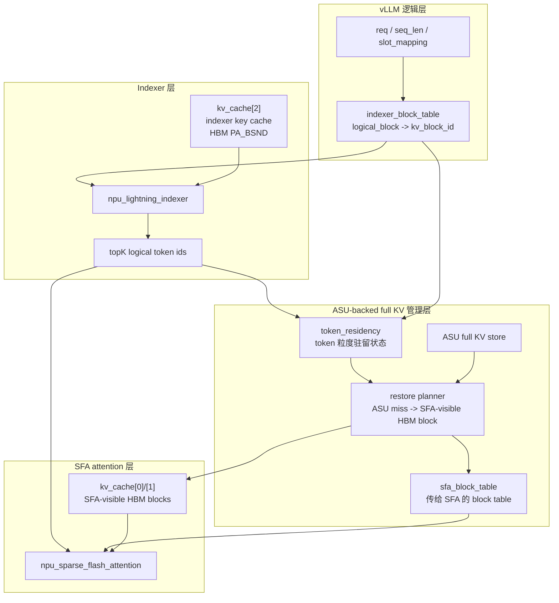
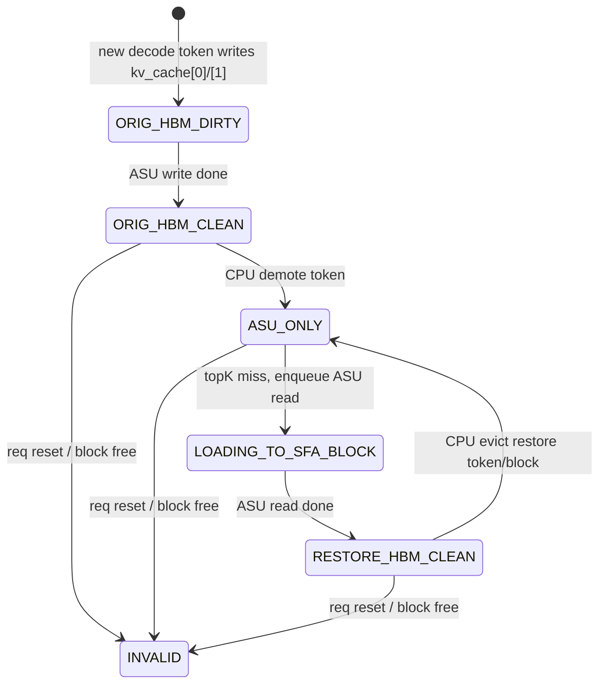
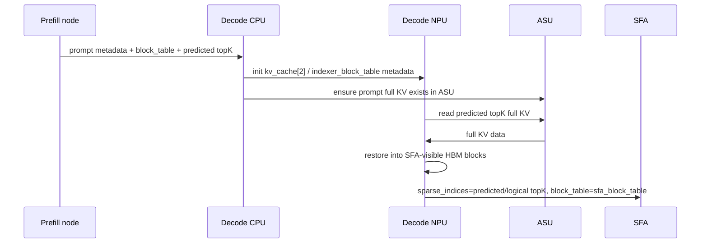
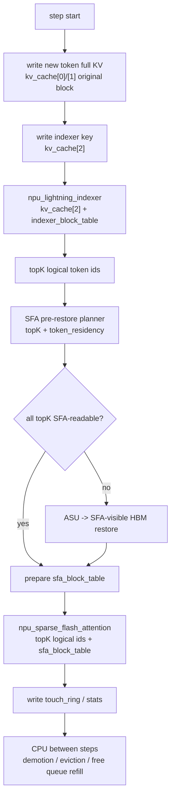
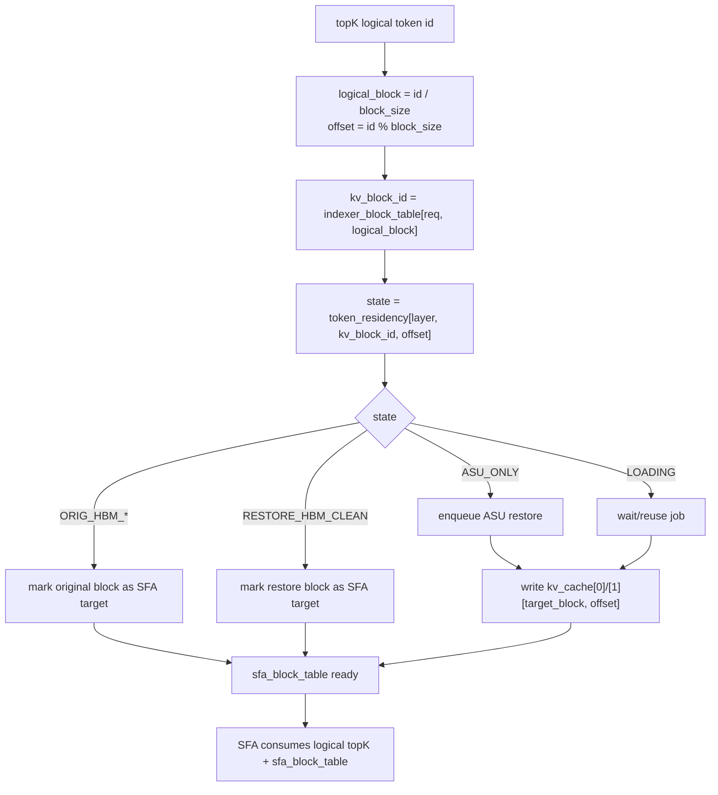
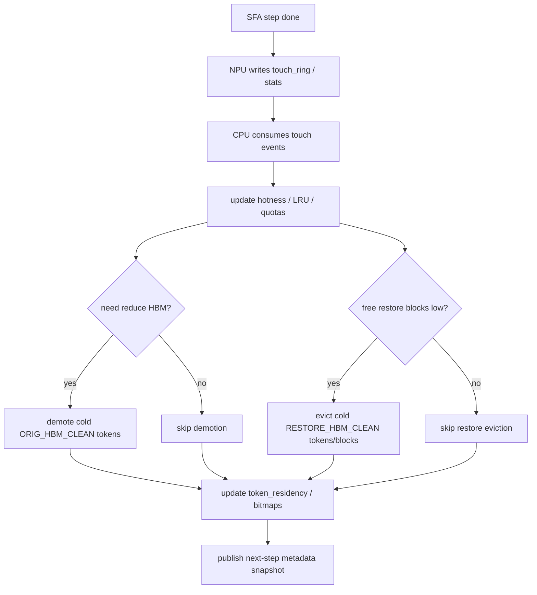
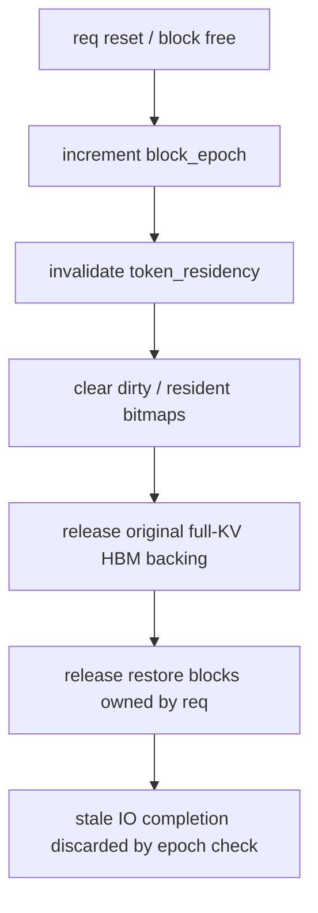

# 基于 vLLM Block Table 的 ASU-backed Decode KVCache 管理设计草稿

本文重写此前关于 HBM KVCache 管理的设计草稿。

此前草稿的错误前提是：在 NPU HBM 上完全重写一套 token 粒度 KVCache 索引，并让 attention 直接消费新的 managed slot 或 compact workspace。这个边界与当前 vLLM-Ascend 的 SFA/DSA 机制不匹配。当前 Lightning Indexer 依赖 `kv_cache[2]` 的 PA_BSND HBM block layout 和 vLLM block table；SFA operator 最终也应继续使用 logical token id + block table 自行访存。

本版设计采用新的边界：

```text
保留:
  vLLM request / block allocation / block table 语义
  indexer key cache: kv_cache[2]
  Lightning Indexer 输出 logical topK token id
  SFA operator 通过 sparse_indices + block_table 访问 full KV

增强:
  full attention KV: kv_cache[0] / kv_cache[1]
  在 ASU 保存完整 full KV
  在 HBM 只维护 SFA 当前和近期需要的 full KV resident subset
  使用 token 粒度 residency overlay 记录每个 token 的 full KV 驻留状态
```

核心原则：

```text
我们的索引不返回 physical slot。
我们的索引不让 SFA 读 compact workspace。
我们的索引最终只保证:
  topK logical token id 不变；
  传给 SFA 的 block table 能定位到这些 token 的 full KV；
  kv_cache[0]/[1] 中对应 block + offset 已经可读。
```

## 1. 目标与约束

### 1.1 目标

1. 在 Ascend 910B 单卡约 64 GB HBM 的限制下，降低 decode 节点 full KV 常驻 HBM 量。
2. 在相同显存限制下支持更高并发，当前目标约 50 req，可根据模型、topK、seq len 和 SLA 调整。
3. 保持 HBM 命中率尽量高，目标 hit rate 约 95%。
4. HBM miss 时由 NPU 通过参数面直接从 ASU 读取 full KV，并在 SFA 计算前补齐到 SFA 可访问位置。

### 1.2 非目标

1. 不重写 Lightning Indexer。
2. 不把 `kv_cache[2]` 改成 ASU-backed token cache。
3. 不让 SFA operator 直接理解 ASU 地址、managed token slot、source type 或 compact workspace。
4. 不在 NPU step 内做 victim 选择、复杂链表维护或淘汰策略决策。

### 1.3 关键边界

```text
kv_cache[2]:
  indexer key cache。
  必须保持 HBM PA_BSND block layout。
  继续由现有 block table 定位。

kv_cache[0]/[1]:
  sparse attention 使用的 full KV。
  可以由 ASU + HBM resident subset 管理。
  但在 SFA 调用前，topK token 必须已经位于 block-table 可寻址的 HBM block + offset。
```

## 2. 当前代码事实

### 2.1 indexer key cache 与 full attention KV 是两套数据

当前 Ascend SFA 路径中，indexer key 的生成路径是：

```python
k_proj, _ = self.wk(x)
k = self.k_norm(k_proj)
q, k = rope_forward_triton(...)
```

随后写入：

```python
torch_npu.npu_scatter_nd_update_(
    kv_cache[2].view(-1, k.shape[-1]),
    attn_metadata.slot_mapping.view(-1, 1),
    k.view(-1, k.shape[-1])
)
```

Lightning Indexer 调用：

```python
topk_indices = torch.ops._C_ascend.npu_lightning_indexer(
    query=q,
    key=kv_cache[2],
    weights=weights,
    actual_seq_lengths_query=actual_seq_lengths_query,
    actual_seq_lengths_key=actual_seq_lengths_key,
    block_table=attn_metadata.block_tables,
    layout_query="TND",
    layout_key="PA_BSND",
    sparse_count=2048,
    sparse_mode=3,
)
```

SFA 实际消费：

```python
attn_output = torch.ops._C_ascend.npu_sparse_flash_attention(
    query=ql_nope,
    key=kv_cache[0],
    value=kv_cache[0],
    sparse_indices=topk_indices,
    block_table=attn_metadata.block_tables,
    key_rope=kv_cache[1],
    layout_kv="PA_BSND",
)
```

因此：

| 数据 | 当前张量 | 用途 | 本设计是否替换 |
| --- | --- | --- | --- |
| indexer key cache | `kv_cache[2]` | Lightning Indexer 计算 topK | 不替换 |
| full attention latent/value KV | `kv_cache[0]` | SFA 真实计算 | 增加 ASU/HBM 驻留管理 |
| full attention rope KV | `kv_cache[1]` | SFA 真实计算 | 增加 ASU/HBM 驻留管理 |

### 2.2 Lightning Indexer 依赖 block table 地址语义

当前 indexer kernel 读取 PA_BSND key 时使用类似逻辑：

```cpp
s2BlkId = logical_pos / kCacheBlockSize;
s2BlkOffset = logical_pos % kCacheBlockSize;
keyGmOffset =
    block_table[batch, s2BlkId] * kCacheBlockSize * kHeadNum * headDim
    + s2BlkOffset * headDim;
```

这说明 indexer 认为：

```text
block_table[req, logical_block_idx] 指向 kv_cache[2] 中连续可读的 HBM block。
```

所以 `kv_cache[2]` 和 indexer 使用的 block table 不能被 ASU-backed token layout 替换。

### 2.3 indexer 输出是 logical token position

Lightning Indexer 输出的 `topk_indices` 是逻辑 token 位置，不是 HBM physical slot。

这正好是本设计的接入点：

```text
indexer 输出 logical token id
  -> 根据 block table 转成 logical block + offset
  -> 查询 full KV token residency
  -> 对 HBM miss 的 token 做 ASU -> HBM restore
  -> SFA 仍消费 logical topK token id + block table
```

## 3. 总体架构

### 3.1 三层结构



### 3.2 两张 block table

需要明确区分两类 block table：

| 名称 | 使用者 | 作用 |
| --- | --- | --- |
| `indexer_block_table` | vLLM / Lightning Indexer / `kv_cache[2]` | 保持现有语义，定位 indexer key cache |
| `sfa_block_table[layer]` | SFA / `kv_cache[0]/[1]` | 每层 SFA 前生成或修补，保证 topK token 的 full KV 可按 block + offset 读取 |

第一版可以让当前 layer 的 `sfa_block_table` 默认拷贝 `indexer_block_table`，只在某个 logical block 的 full KV 不在原始 HBM block 时，把该 logical block entry 改成 restore block id。

```text
topK logical token id 不变。
logical_block_idx = topK / block_size。
offset = topK % block_size。
SFA 使用:
  physical_block = sfa_block_table[layer, req, logical_block_idx]
  full_kv = kv_cache[0]/[1][physical_block, offset]
```

这样既利用 vLLM block table 的逻辑，又允许 full KV 的 HBM backing 与 `kv_cache[2]` 解耦。

### 3.3 token 粒度管理与 block-table 访存载体的关系

这是本设计最重要的折中：

```text
管理粒度:
  token。
  每个 token 独立记录是否 resident、是否 dirty、是否 ASU-only、是否在 restore block 中。

SFA 访存粒度:
  block table entry + block offset。
  SFA operator 不理解 token slot，只能按 PA_BSND block 地址生成访存。
```

因此，HBM restore 的物理载体必须是 SFA 可识别的 block-shaped HBM block。restore block 中不要求整块 token 都有效；只要求本次 topK 会访问的 offset 已经被填好。

```text
token 粒度:
  决定哪些 token 需要 resident。
  决定哪些 token 可以 demote / evict。
  统计 hit / miss / hotness。

block-shaped restore carrier:
  只为满足 SFA block table 访存。
  一个 logical block 在一次 SFA 调用中只能映射到一个 physical full-KV block。
  该 physical block 内只有 topK 需要的 offsets 必须有效。
```

## 4. 核心数据结构

### 4.1 元数据总表

| 数据结构 | 粒度 | 推荐位置 | NPU step 内是否读取 | 作用 |
| --- | --- | --- | --- | --- |
| `indexer_block_table[req, logical_block_idx]` | block | vLLM / NPU GM | 是 | 现有 block table，供 indexer 和 residency lookup 使用 |
| `sfa_block_table[layer, req, logical_block_idx]` | block | NPU GM | 是 | SFA 使用的 full-KV block table，可在当前 layer 按 topK 修补 |
| `asu_block_base[layer, kv_block_id]` | block | NPU GM / Host mirrored | 是 | full KV 在 ASU 中的 block 起始地址 |
| `block_epoch[layer, kv_block_id]` | block | NPU GM / Host mirrored | 是 | 防止 block id 复用后的 stale IO 污染 |
| `orig_block_backing_state[layer, kv_block_id]` | block | NPU GM / Host mirrored | 是 | 原始 full-KV HBM block backing 是否仍可作为 SFA target |
| `token_residency[layer, kv_block_id, offset]` | token | NPU GM / Host mirrored | 是 | full KV 主驻留状态 |
| `sfa_resident_bitmap[layer, kv_block_id]` | token bitset | NPU GM / Host mirrored | 是 | 哪些 token 当前在 SFA-visible HBM 中有效 |
| `dirty_bitmap[layer, kv_block_id]` | token bitset | NPU GM / Host mirrored | 是 | 哪些 token 的 ASU write 尚未完成 |
| `restore_block_table[layer, kv_block_id]` | block | NPU GM / Host mirrored | 是 | logical kv block 当前对应的 restore block，避免 NPU 扫描 restore pool |
| `restore_block_state[layer, restore_block_id]` | SFA-visible full-KV block | NPU GM / Host mirrored | 是 | FREE / ACTIVE / LOADING / PROTECTED |
| `restore_block_owner[layer, restore_block_id]` | SFA-visible full-KV block | NPU GM / Host mirrored | 是 | restore block 当前承载哪个 logical kv block |
| `restore_valid_bitmap[layer, restore_block_id]` | token bitset | NPU GM / Host mirrored | 是 | restore block 内哪些 offsets 有效 |
| `restore_job_table[layer]` | IO job | NPU GM | 是 | ASU -> SFA-visible HBM block 的读任务 |
| `free_restore_block_queue[layer]` | block id array | NPU GM | 是 | CPU step 间准备好的空闲 restore blocks |
| `touch_ring[layer]` | token/block touch event | NPU GM -> CPU | 写入 | NPU 上报 topK hit/miss/touch |
| `cache_stats[layer]` | global / req / layer | NPU GM / Host readable | 写入 | hit rate、miss count、restore latency、demotion 统计 |

说明：

1. `token_residency` 是主索引，粒度是 token。
2. `restore_block_*` 是为了适配 SFA 的 block-table 访存，不是 attention 直接消费的 managed slot。
3. `restore_block_table` 是 NPU-friendly 的反向索引，查 existing restore block 时不扫描 restore pool。
4. `free_restore_block_queue` 只是 NPU step 内分配 restore block 的连续数组，不是链表，不在 NPU 上做淘汰。

### 4.2 token_residency 状态

| 状态 | 含义 | SFA 前需要做什么 |
| --- | --- | --- |
| `ORIG_HBM_DIRTY` | token full KV 在原始 vLLM full-KV HBM block，ASU 副本未完成 | 可直接用于 SFA，但不可 demote |
| `ORIG_HBM_CLEAN` | token full KV 在原始 vLLM full-KV HBM block，ASU 已有副本 | 可直接用于 SFA，可由 CPU demote |
| `RESTORE_HBM_CLEAN(block_id)` | token full KV 已在某个 SFA-visible restore block 的相同 offset 中 | 确保 `sfa_block_table` 指向该 restore block |
| `ASU_ONLY` | token full KV 只在 ASU，HBM 不保证有效 | SFA 前必须从 ASU restore |
| `LOADING_TO_SFA_BLOCK(job)` | ASU -> SFA-visible HBM restore 正在进行 | 等待或复用 inflight job |
| `INVALID` | token 不存在，或 block 已被 vLLM 释放/复用 | 不可访问 |

状态图：



### 4.3 block epoch

vLLM block id 会被复用。所有异步 ASU IO 和 restore metadata 都必须携带 epoch：

```text
owner = (layer, kv_block_id, block_epoch, offset)
```

IO 完成时必须校验：

```text
if job.epoch != block_epoch[layer, kv_block_id]:
    discard stale job
else:
    apply residency update
```

## 5. Decode 阶段流程

### 5.1 第一轮 decode

第一轮 decode 的特殊性是：prefill 节点会把预测 topK 传输到 decode 节点，decode 节点可以提前从 ASU 读取这些 token 的 full KV。



初始化规则：

```text
prompt 历史 token:
  token_residency 默认 ASU_ONLY。

prefill predicted topK:
  decode 节点在第一轮 SFA 前 restore。
  restore 完成后 token_residency = RESTORE_HBM_CLEAN(block_id)。

new decode token:
  按原有 vLLM 写入原始 full-KV HBM block。
  token_residency = ORIG_HBM_DIRTY。
```

### 5.2 后续 decode step



NPU step 内只做：

```text
1. 计算 topK logical token 的 logical_block_idx 和 offset。
2. 通过 indexer_block_table 找 kv_block_id。
3. 查 token_residency。
4. 对 ASU_ONLY token 发起 ASU read。
5. 将 full KV 写到 SFA-visible HBM block 的相同 offset。
6. 修补当前 layer 的 sfa_block_table。
7. 调用 SFA。
```

NPU step 内不做：

```text
victim 选择
LRU 链表维护
restore block 淘汰
dirty token writeback 决策
req 级 quota 决策
```

## 6. SFA 前检索与 Restore

### 6.1 输入输出

输入：

```text
topk_indices[req, k]              # indexer 输出的 logical token id
indexer_block_table[req, block]   # vLLM 原始逻辑 block table
token_residency[layer, block, offset]
asu_block_base[layer, block]
free_restore_block_queue[layer]
```

输出：

```text
topk_indices 原样传给 SFA
sfa_block_table[layer, req, logical_block_idx] 可供 SFA 定位 full KV
kv_cache[0]/[1][sfa_block_table entry, offset] 已包含 topK full KV
```

### 6.2 每个 topK token 的寻址

```text
logical_pos = topk_indices[req, i]
logical_block_idx = logical_pos / block_size
offset = logical_pos % block_size
kv_block_id = indexer_block_table[req, logical_block_idx]
state = token_residency[layer, kv_block_id, offset]
```

然后按状态处理：

| state | 处理 |
| --- | --- |
| `ORIG_HBM_DIRTY` / `ORIG_HBM_CLEAN` | `sfa_block_table[layer, req, logical_block_idx] = kv_block_id`，无需 ASU read |
| `RESTORE_HBM_CLEAN(block_id)` | `sfa_block_table[layer, req, logical_block_idx] = block_id`，无需 ASU read |
| `ASU_ONLY` | 为该 logical block 选择 SFA-visible target block，从 ASU 读取该 offset 的 full KV |
| `LOADING_TO_SFA_BLOCK(job)` | 复用或等待 inflight restore |
| `INVALID` | 请求或 block 元数据错误，不能进入 SFA |

### 6.3 logical block 内混合状态的处理

SFA 的 block table 对一个 logical block 只能给出一个 physical block id。因此如果同一个 logical block 的 topK offsets 混合了多种状态，restore planner 必须先统一该 logical block 的 SFA target block。

推荐规则：

```text
For each req, logical_block_idx touched by topK:
  if orig_block_backing_state[layer, kv_block_id] is ACTIVE:
      target_block = original kv_block_id
      sfa_block_table[layer, req, logical_block_idx] = target_block
      对该 logical block 中 ASU_ONLY 的 topK offsets:
          ASU -> kv_cache[0]/[1][target_block, offset]
          token_residency = ORIG_HBM_CLEAN
  else:
      target_block = restore_block_table[layer, kv_block_id]
                     or allocate from free_restore_block_queue
      sfa_block_table[layer, req, logical_block_idx] = target_block
      对该 logical block 中所有 topK offsets:
          如果 target_block 对应 offset 已有效: skip
          否则从 ASU 读取 full KV 到 target_block 的相同 offset
      token_residency = RESTORE_HBM_CLEAN(target_block)
```

这个规则保证：

1. SFA 不需要理解 per-token source。
2. SFA 仍按 logical token id + block table 访存。
3. token 粒度 miss 只 restore 被 topK 访问的 offset，不强制恢复整块。
4. 如果某个 block 仍有 original HBM backing，新生成 token 和 ASU restore token 可以共用原始 block 地址。

### 6.4 伪代码

```text
for req in active_reqs:
    sfa_block_table[layer, req] = indexer_block_table[req]

for each topk logical_pos:
    logical_block = logical_pos / block_size
    offset = logical_pos % block_size
    kv_block = indexer_block_table[req, logical_block]
    state = token_residency[layer, kv_block, offset]

    append (req, logical_block, kv_block, offset, state) to touched_tokens

for each unique (req, logical_block, kv_block) in touched_tokens:
    target = choose_sfa_target_block(kv_block)
    sfa_block_table[layer, req, logical_block] = target

    for offset in touched_offsets_of_this_logical_block:
        state = token_residency[layer, kv_block, offset]

        if target_has_valid_offset(target, offset):
            continue

        if state is ORIG_HBM_DIRTY or ORIG_HBM_CLEAN:
            if target == kv_block:
                continue
            else:
                copy_or_read_from_original_to_target(kv_block, target, offset)
                mark_restore_valid(target, offset)
                continue

        if state is RESTORE_HBM_CLEAN(old_target):
            if old_target == target:
                continue
            else:
                copy_or_read_from_restore_to_target(old_target, target, offset)
                mark_restore_valid(target, offset)
                continue

        if state is LOADING_TO_SFA_BLOCK(job):
            wait_or_reuse(job)
            continue

        # ASU_ONLY
        asu_addr = asu_block_base[layer, kv_block] + offset * token_kv_stride
        enqueue_asu_read(asu_addr, kv_cache[0]/[1][target, offset])
        token_residency[layer, kv_block, offset] = LOADING_TO_SFA_BLOCK(job)

    wait restore jobs of this step
    for completed job:
        if job.epoch == block_epoch[layer, job.kv_block]:
            token_residency[layer, job.kv_block, job.offset] = target_state(target)
            sfa_resident_bitmap[layer, job.kv_block].set(job.offset)
```

`choose_sfa_target_block` 不能扫描 restore pool，推荐固定为：

```text
if orig_block_backing_state[layer, kv_block] is ACTIVE:
    return kv_block

restore = restore_block_table[layer, kv_block]
if restore != INVALID:
    return restore

restore = pop(free_restore_block_queue[layer])
restore_block_table[layer, kv_block] = restore
restore_block_owner[layer, restore] = (kv_block, block_epoch[layer, kv_block])
restore_block_state[layer, restore] = ACTIVE
return restore
```

### 6.5 与 compact workspace 的区别

本设计不使用 compact workspace 作为 attention 输入。

```text
错误模型:
  topK logical token -> resolver -> compact_topk_kv_workspace -> SFA reads workspace

本设计:
  topK logical token -> restore planner -> sfa_block_table + kv_cache[0]/[1] -> SFA reads by itself
```

restore block 是 PA_BSND block-table 可寻址的 full-KV block。它存在的原因是适配 SFA 的地址生成，不是改变 attention 的输入语义。

## 7. 新生成 token 的管理

### 7.1 写入路径

新生成 token 继续走原有 vLLM block 写入逻辑。

```text
1. vLLM 为新 token 分配 logical block + offset。
2. slot_mapping 指向 kv_block_id + offset。
3. full KV writer 写入 kv_cache[0]/[1][kv_block_id, offset]。
4. indexer key writer 写入 kv_cache[2][kv_block_id, offset]。
5. token_residency[layer, kv_block_id, offset] = ORIG_HBM_DIRTY。
6. dirty_bitmap[layer, kv_block_id].set(offset)。
7. sfa_resident_bitmap[layer, kv_block_id].set(offset)。
8. 异步或同步将该 token full KV 写入 ASU。
9. ASU write 完成后:
     dirty_bitmap.clear(offset)
     token_residency = ORIG_HBM_CLEAN
```

### 7.2 如果 topK 中包含新生成 token

如果后续 step 的 topK 选中新生成 token：

```text
topK logical_pos
  -> logical_block + offset
  -> indexer_block_table 得到 kv_block_id
  -> token_residency = ORIG_HBM_DIRTY 或 ORIG_HBM_CLEAN
  -> sfa_block_table 指向原始 kv_block_id
  -> SFA 从 kv_cache[0]/[1][kv_block_id, offset] 读取
```

也就是说，新生成 token 不走特殊索引，不返回物理 slot，不被独立拼接给 attention。它只是 token_residency 中的 original-HBM resident token。

### 7.3 新 token 什么时候可释放 HBM

新 token 对应 full KV 只有在 ASU write 完成后才可降驻留：

```text
ORIG_HBM_DIRTY:
  禁止 demote。

ORIG_HBM_CLEAN:
  CPU 可在 step 间根据热度降为 ASU_ONLY。
```

如果一个 original full-KV block 内还有任意 token 是 `ORIG_HBM_DIRTY` 或 `ORIG_HBM_CLEAN`，该 physical full-KV block 不能释放。只有当该 block 内所有有效 token 都不再依赖 original HBM backing 时，CPU 才能把这个 full-KV block 放回 free block pool。

## 8. 淘汰机制

### 8.1 淘汰职责划分

淘汰分两层：

```text
策略层:
  CPU 在 decode step 之间执行。
  根据 touch_ring、hit/miss 统计、req 状态、dirty bitmap 选择 victim。

执行层:
  CPU 更新 metadata snapshot。
  NPU 下一 step 只消费更新后的 token_residency 和 free_restore_block_queue。
```

NPU 不做：

```text
扫描全局 victim
维护 LRU 链表
处理随机淘汰决策
回收 dirty token
遍历 free list 链表
```

### 8.2 淘汰对象

第一类：original HBM token demotion。

```text
ORIG_HBM_CLEAN token -> ASU_ONLY
clear sfa_resident_bitmap[layer, kv_block_id].bit(offset)

if this original full-KV block has no ORIG_HBM_* tokens:
    release original full-KV block backing
    orig_block_backing_state[layer, kv_block_id] = RELEASED
```

第二类：restore HBM token/block eviction。

```text
RESTORE_HBM_CLEAN token -> ASU_ONLY
clear restore_valid_bitmap[layer, restore_block_id].bit(offset)

if restore_valid_bitmap is empty:
    restore_block_state = FREE
    append restore_block_id to next-step free_restore_block_queue
```

注意：restore block eviction 不需要 writeback，因为 restore token 的 ASU 副本已经存在。

### 8.3 CPU-only Score/Watermark 方案

该方案保留此前讨论的“低 NPU 压力”设计，但把执行全部放到 CPU step 间。

CPU 维护：

```text
last_touch_step[layer, kv_block_id, offset]
touch_count_window[layer, kv_block_id, offset]
req_quota[req]
tail_protect_window[req]
restore_free_watermark[layer]
target_hbm_token_budget[layer]
```

优先级从高到低：

| 优先级 | 对象 | 操作 |
| --- | --- | --- |
| P0 | 当前 step topK token | 保护，不淘汰 |
| P1 | `ORIG_HBM_DIRTY` token | 保护，等待 ASU write |
| P2 | 最近 tail window token | 保护，避免新 token 反复 ASU miss |
| P3 | 多次被 indexer 选中的 token | 保留，提高 hit rate |
| P4 | paused req / over-quota req 的 clean token | 优先 demote/evict |
| P5 | cold `ORIG_HBM_CLEAN` token | demote 为 `ASU_ONLY` |
| P6 | cold `RESTORE_HBM_CLEAN` token | evict 为 `ASU_ONLY` |

CPU 每个 step 间执行：

```text
1. 消费 touch_ring，更新 token hotness。
2. 计算每层 HBM resident token 数和 restore free block 数。
3. 如果 HBM resident 超预算:
     按 score 选择 ORIG_HBM_CLEAN token demote。
4. 如果 restore free block 低于 watermark:
     选择 cold RESTORE_HBM_CLEAN token/block evict。
5. 更新 token_residency / bitmap / restore_block_state。
6. 生成下一 step 的 free_restore_block_queue。
```

score 示例：

```text
score(token) =
    w_touch * recent_touch_count
  - w_age   * age_since_last_touch
  + w_tail  * is_in_tail_window
  - w_quota * req_over_quota
```

选择 score 最低且 clean 的 token 作为 victim。

### 8.4 CPU-only LRU 方案

LRU 方案也只在 CPU 上维护，不在 NPU 上维护链表。

NPU 只写 touch event：

```text
touch_ring entry:
  layer
  req_id
  kv_block_id
  offset
  source_state
  step_id
```

CPU 在 step 间维护 LRU：

```text
resident_lru:
  key = (layer, kv_block_id, offset)
  value = last_touch_step

restore_block_lru:
  key = (layer, restore_block_id)
  value = max last_touch_step of valid offsets in this restore block
```

淘汰流程：

```text
1. CPU 消费 touch_ring，把 touched token 移到 LRU hot end。
2. 从 cold end 开始选 victim。
3. 跳过 ORIG_HBM_DIRTY、tail protected、current step protected token。
4. 对 ORIG_HBM_CLEAN token 执行 demotion；当整块不再有 ORIG_HBM_* token 时，释放 original backing。
5. 对 RESTORE_HBM_CLEAN token 或 restore block 执行 eviction。
6. 更新下一 step metadata snapshot。
```

LRU 优点：

```text
实现直观。
命中率评估容易。
适合先做 baseline。
```

LRU 缺点：

```text
CPU metadata 更新量可能大。
纯 LRU 不理解 DSA topK 的周期性和 req 间公平性。
若 topK 分布抖动大，可能不如 score/window 稳定。
```

第一版建议：

```text
先实现 CPU-only LRU baseline。
同时保留 score/window 策略接口。
用真实 trace 比较 hit rate、restore bandwidth、step latency。
目标是 95% HBM hit rate，而不是理论最优替换算法。
```

### 8.5 free restore block 不够时

NPU step 内不能临时选择 victim，因此 free restore block 不够时有三种处理方式：

| 方式 | 行为 | 适用阶段 |
| --- | --- | --- |
| 保守 watermark | CPU 提前准备足够 `free_restore_block_queue` | 默认路径 |
| host slow path | NPU 上报不足，host 同步执行 eviction/refill，再重放 restore/SFA | 功能兜底 |
| admission control | 降低 batch/concurrency 或 topK restore 预算 | 压测或 SLA 保护 |

第一版推荐：

```text
free_restore_block_queue >= expected_missing_logical_blocks + reserve_margin
```

这里的 `expected_missing_logical_blocks` 不是 topK token 数，而是 topK miss 覆盖的 logical block 数。因为 SFA block table 对每个 logical block 需要一个 physical target block。

## 9. 请求变化时的维护

### 9.1 req init

decode 节点收到新请求时：

```text
1. 初始化 indexer_block_table，保持 vLLM 原有语义。
2. 初始化每层 `sfa_block_table[layer]`，可先等于 indexer_block_table。
3. 为 prompt 历史 token 建立 ASU 地址:
     asu_block_base[layer, kv_block_id]
     block_epoch[layer, kv_block_id]
4. prompt token 默认 token_residency = ASU_ONLY。
5. predicted topK token 可立即 restore，变成 RESTORE_HBM_CLEAN。
6. kv_cache[2] 必须已经在 HBM 中可供 indexer 读取。
```

### 9.2 req append token

每个 decode step 新增 token：

```text
1. vLLM 更新 seq_len、slot_mapping、indexer_block_table。
2. 如果分配新 logical block，初始化 block_epoch 和 ASU block 地址。
3. 写 kv_cache[2] indexer key。
4. 写 kv_cache[0]/[1] full KV 到 original full-KV HBM block。
5. token_residency = ORIG_HBM_DIRTY。
6. dirty_bitmap.set(offset)。
7. 发起 ASU write。
8. ASU write 完成后 token_residency = ORIG_HBM_CLEAN。
```

### 9.3 req finish / abort / reset

请求结束或取消时：

```text
for each layer and kv_block_id owned by req:
    block_epoch[layer, kv_block_id] += 1
    token_residency[layer, kv_block_id, :] = INVALID
    dirty_bitmap[layer, kv_block_id] = 0
    sfa_resident_bitmap[layer, kv_block_id] = 0
    restore_block_table[layer, kv_block_id] = INVALID

    release original full-KV HBM backing if owned
    orig_block_backing_state[layer, kv_block_id] = RELEASED

    for restore block whose owner is kv_block_id:
        restore_block_state = FREE
        restore_valid_bitmap = 0
        append restore block to next-step free_restore_block_queue
```

所有 inflight ASU IO 完成时必须校验 epoch，避免写回已经复用的 block。

### 9.4 req pause / resume

pause 时：

```text
1. dirty token 仍等待 ASU write 完成。
2. clean original token 可被 CPU 优先 demote。
3. restore block 可被优先 evict。
4. kv_cache[2] 是否保留取决于 vLLM 对 pause/swap 的既有策略；本设计不替换 indexer key cache。
```

resume 时：

```text
1. block table 语义恢复后，token_residency 以 ASU_ONLY 为默认。
2. 下一轮 indexer 输出 topK 后，按正常 restore 流程恢复 full KV。
```

## 10. 索引查询、维护与 reset 流程

### 10.1 查询流程



### 10.2 维护流程



### 10.3 reset 流程



## 11. HBM 命中率目标

### 11.1 命中率定义

本设计建议按 token 级统计：

```text
HBM hit token:
  topK token 在 SFA 前已经是 ORIG_HBM_* 或 RESTORE_HBM_CLEAN。

HBM miss token:
  topK token 在本 step 需要 ASU read 才能进入 SFA。

hit_rate = hit_tokens / total_topK_tokens
```

也需要统计 block 级 miss：

```text
restore_block_miss:
  topK miss 覆盖了多少 logical blocks。
```

因为 ASU read 可以是 token 粒度，但 SFA-visible target 的分配压力是 block-shaped。

### 11.2 95% hit rate 的策略来源

为了接近 95%：

1. 第一轮 decode 使用 prefill predicted topK 预取。
2. tail window token 默认保护。
3. 近期多次进入 topK 的 token 保持 RESTORE_HBM_CLEAN 或 ORIG_HBM_CLEAN。
4. CPU eviction 不只看年龄，还要看 req quota、pause 状态、topK 频次。
5. 对 miss 后 restore 的 token 不立即 evict，至少保护若干 step，避免抖动。

### 11.3 需要用 trace 校准的参数

```text
tail_protect_window
restore_block_pool_size
restore_free_watermark
per_req_hbm_quota
LRU window size
score weights
predicted topK prefetch count
```

这些参数无法只靠静态设计定死，必须用真实 decode trace 调整。

## 12. Ascend NPU 压力评估

### 12.1 NPU step 内新增压力

| 项 | 压力来源 | 说明 |
| --- | --- | --- |
| residency lookup | `topK` token 的 `block_table + token_residency` gather | topK=2K、50 req 时是主要 metadata 压力 |
| restore planning | 按 logical block 选择 target block | 可用 bitmap/排序/分桶实现，第一版可先简单实现 |
| ASU read | miss token full KV 读取 | 由 hit rate 决定，目标 <= 5% token miss |
| HBM write | restore 到 `kv_cache[0]/[1][target_block, offset]` | token 粒度写入，地址可能离散 |
| sfa_block_table patch | touched logical block 的 table entry 更新 | block 粒度，数量小于等于 topK token 数 |
| touch_ring write | 写 hit/miss 事件 | 连续 ring buffer，避免复杂原子 |

### 12.2 对 NPU 友好的约束

```text
不用链表。
不用 NPU 维护 LRU。
不用 NPU 扫描全局 victim。
free_restore_block_queue 是 CPU 准备好的连续 block id 数组。
token_residency 用 dense array / bitset，避免哈希表。
restore_job_table 固定大小，避免动态分配。
```

### 12.3 随机访问不可完全消除

topK token 本身来自 indexer，逻辑位置可能离散，因此以下访问天然存在不规则性：

```text
indexer_block_table[req, logical_block]
token_residency[layer, kv_block_id, offset]
ASU address per miss token
kv_cache[0]/[1][target_block, offset]
```

本设计能做的是：

1. 不再额外引入链表和 pointer chasing。
2. 把 victim 选择移到 CPU。
3. 把 NPU 分配简化为连续数组 pop。
4. 尽量按 logical block group restore，降低 `sfa_block_table` patch 和 restore block 分配次数。

### 12.4 当前 `hbm_lookup_update` 350 us 问题

在 50 req、query length 2K 下，单算子 350 us 说明 metadata 查询路径本身已经很重。本设计暂时不把“查询时延优化”作为主目标，但需要避免继续扩大 NPU 逻辑复杂度。

短期建议：

```text
第一版:
  先保证语义正确。
  NPU lookup 只做 dense metadata gather + ASU restore。
  eviction 完全 CPU-only。

后续优化:
  topK 按 logical block 分组。
  token_residency bit-pack。
  block-level fast path: 整个 logical block 已 resident 时跳过 per-token miss handling。
  对 predicted topK 做 step 前预取，减少 step 内 restore。
```

## 13. 与 vLLM 集成点

### 13.1 Python/调度层

需要新增或修改：

```text
ASUFullKVCacheManager
  管理 ASU 地址、token_residency、restore block pool、CPU eviction。

attn_metadata 扩展:
  indexer_block_table
  sfa_block_table pointers per layer
  token_residency pointers
  asu_block_base pointers
  restore metadata pointers
```

现有 SFA 调用需要从：

```python
block_table=attn_metadata.block_tables
```

调整为：

```python
block_table=attn_metadata.sfa_block_tables
```

Indexer 仍使用：

```python
block_table=attn_metadata.block_tables
```

### 13.2 NPU kernel / custom op

需要新增一个 SFA 前置 op：

```text
asu_restore_for_sfa(
    topk_indices,
    indexer_block_table,
    token_residency,
    asu_block_base,
    kv_cache_0,
    kv_cache_1,
    sfa_block_table,
    restore_block_metadata,
    free_restore_block_queue,
    touch_ring,
)
```

该 op 的职责：

```text
1. 查询 topK token residency。
2. 为每个 touched logical block 选择 SFA target block。
3. 对 ASU_ONLY token 发起 ASU read。
4. 写入 kv_cache[0]/[1][target_block, offset]。
5. 更新 token_residency / restore_valid_bitmap。
6. 输出可传给 SFA 的 sfa_block_table。
```

该 op 不负责：

```text
victim 选择
LRU 更新
restore block eviction
block table 逻辑重排
indexer key cache 管理
```

### 13.3 CPU manager

CPU manager 在 step 间执行：

```text
consume_touch_ring()
update_hotness_or_lru()
apply_original_token_demotion()
apply_restore_block_eviction()
refill_free_restore_block_queue()
publish_metadata_snapshot()
```

## 14. 内存预算模型

HBM 常驻内容：

```text
必留:
  model weights
  activations / workspace
  kv_cache[2] indexer key cache
  metadata

可控:
  original full-KV HBM blocks for new/tail/hot tokens
  restore full-KV HBM blocks for ASU-backed hot sparse tokens
```

Full KV HBM 预算近似：

```text
full_kv_hbm =
    original_full_kv_blocks * block_size * per_token_full_kv_bytes
  + restore_blocks * block_size * per_token_full_kv_bytes
```

虽然管理是 token 粒度，但由于 SFA 的 PA_BSND block table 地址生成，物理 restore carrier 是 block-shaped。因此减少 HBM 的关键是：

```text
让 original full-KV blocks 尽快 clean 后 demote。
让 restore block pool 规模接近 active topK 覆盖的 logical block 工作集。
用 predicted topK 和 hit-rate 策略避免频繁 ASU miss。
```

## 15. 风险与待验证项

| 风险 | 说明 | 验证方式 |
| --- | --- | --- |
| `sfa_block_table` 与 indexer block table 分离 | 需要确认 SFA 只依赖 logical position + passed block table，不隐含要求与 indexer table 同一指针 | 单元测试 + NPU 对拍 |
| logical block 混合状态 | 一个 logical block 的 topK offsets 可能来自 original/ASU/restore 多状态 | restore planner group-by logical block 测试 |
| restore block 稀疏有效 | restore block 中只有部分 offsets 有效，SFA 只能访问 topK offsets | 构造 sparse_indices 只访问有效 offset 的对拍 |
| block id 复用 | stale ASU IO 可能写到新 req | epoch 校验 |
| hit rate 不达 95% | DSA topK 分布可能比预期更散 | trace replay 调参 |
| NPU lookup 时延 | topK=2K、50 req 下 metadata gather 压力高 | profiler 分解 lookup/restore/SFA |

## 16. 当前结论

本设计可行的前提是：

```text
1. kv_cache[2] 和 Lightning Indexer 保持现状。
2. indexer 输出 logical topK token id。
3. 新增 token 粒度 token_residency 只管理 full KV 的 HBM/ASU 驻留。
4. SFA 前置 restore op 保证 topK token 的 full KV 位于 block-table 可寻址的 HBM block + offset。
5. SFA 仍消费 logical topK token id + sfa_block_table + kv_cache[0]/[1]。
6. 淘汰策略和淘汰应用由 CPU step 间完成，NPU 不参与 victim 选择。
```

与上一版相比，关键变化是：

```text
删除 managed token slot 作为 attention source。
删除 compact workspace attention 输入。
删除 NPU-side eviction。
保留 token 粒度 residency。
用 SFA-visible restore block + sfa_block_table patch 连接 ASU-backed full KV 与现有 SFA block-table 访存机制。
```
