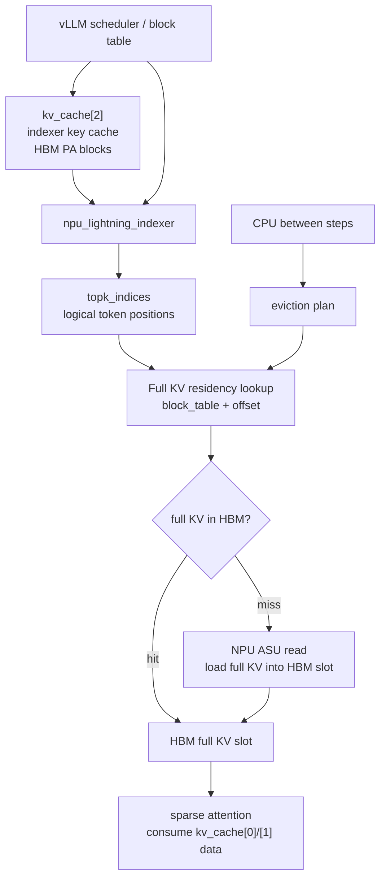
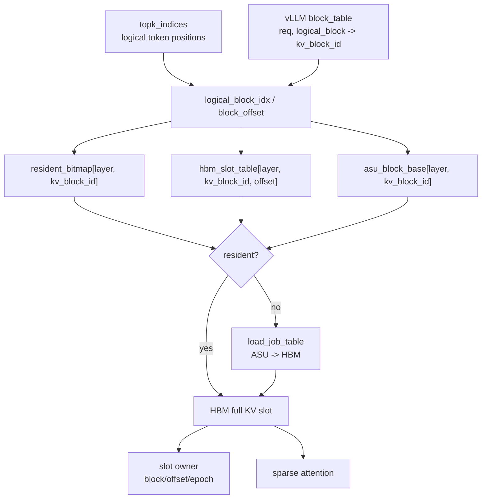
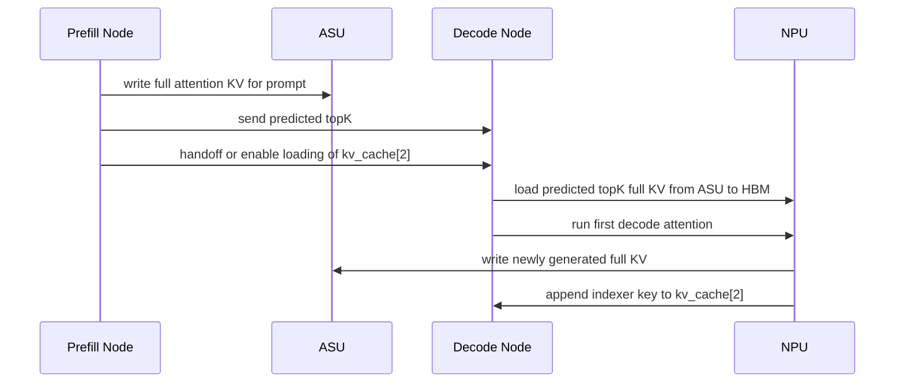
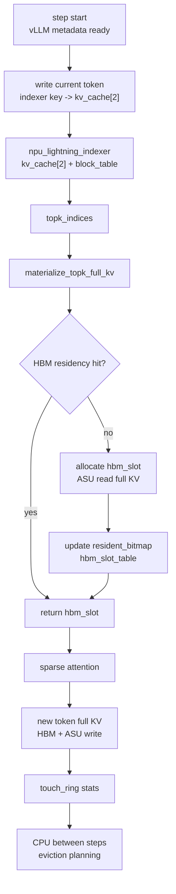
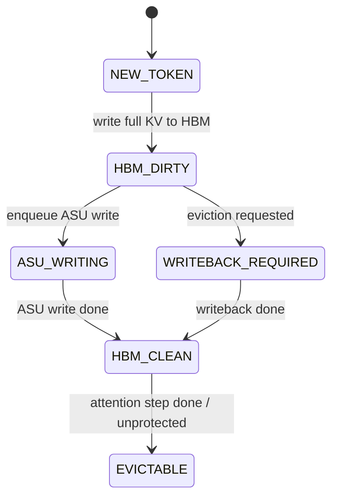
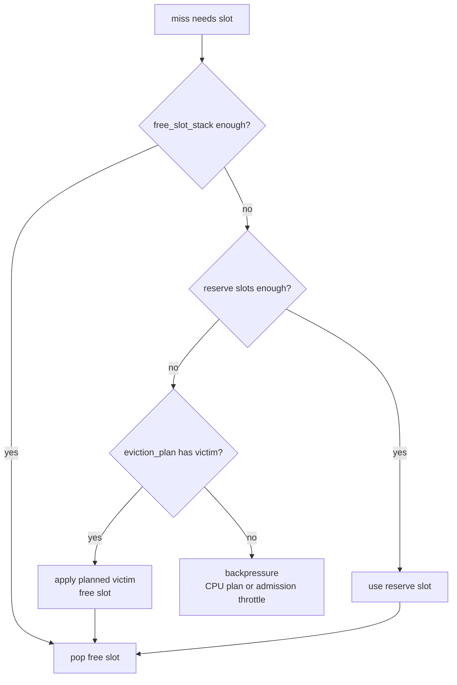
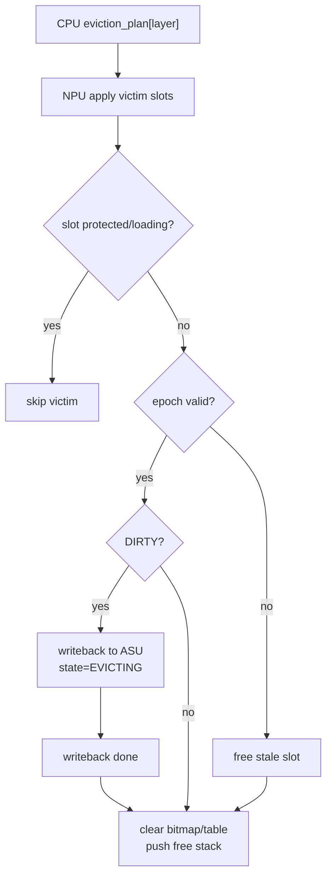
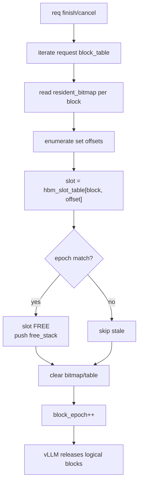

# 基于 vLLM Block Table 的 ASU-backed Decode KVCache 管理设计草稿

本文重写此前关于 HBM KVCache 管理的设计草稿。

此前草稿默认要在 NPU HBM 上重新实现一套完整 token 粒度 KVCache 管理，并让 indexer 直接对这套新索引工作。这个前提不成立：当前 vLLM-Ascend 的 Lightning Indexer 依赖 vLLM block table 和 `kv_cache[2]` 的 PA_BSND HBM block 布局。如果直接把 `kv_cache[2]` 改成 ASU-backed、token 粒度拼接的布局，现有 indexer 会读错地址，topK 语义失效。

本版设计采用新的边界：

```text
保留:
  vLLM block table
  indexer key cache: kv_cache[2]
  lightning_indexer 的精确 topK 语义

替换/增强:
  sparse attention 实际消费的 full attention KV: kv_cache[0] / kv_cache[1]
  为 full KV 增加 ASU 后端存储 + HBM residency cache
```

核心目标不是完全重写 vLLM KVCache，而是在现有 block table 机制上叠加一层 full KV 的驻留管理：

```text
block table 仍然描述逻辑 token/block 序列。
indexer 仍然基于 kv_cache[2] + block table 计算 topK logical token indices。
ASU 保存完整 full attention KV。
HBM 只缓存 topK 和近期会被 attention 使用的 full attention KV。
miss 时 NPU 通过参数面从 ASU 直接读入 HBM。
```

## 1. 设计结论

本需求在以下边界内可行：

1. **不替换 indexer key cache。** `kv_cache[2]` 必须保持现有 PA_BSND HBM block 布局，供 Lightning Indexer 使用。
2. **只替换 full attention KV 的常驻策略。** `kv_cache[0] / kv_cache[1]` 不再要求完整上下文常驻 HBM，而是由 ASU + HBM token cache 管理。
3. **vLLM block table 仍是主逻辑索引。** 新增 residency overlay 根据 `block_table + logical offset` 判断 full KV 是否在 HBM。
4. **decode 阶段生效。** 本设计只覆盖 decode 节点上的 DSA sparse attention，不重新设计 prefill attention。
5. **淘汰策略可由 CPU 在 step 间处理。** NPU step 内只执行数组查表、miss load、状态更新和 attention 所需的数据 materialize。

不可行或不建议作为第一版的边界：

```text
把 kv_cache[2] 也改成 ASU-backed token cache。
```

除非重写 Lightning Indexer，使其理解 ASU 地址、HBM residency 和 token 粒度 slot，否则不能改 `kv_cache[2]` 的布局。

## 2. 当前代码事实

### 2.1 indexer key cache 与 attention KV 是两套数据

当前 Ascend SFA 代码中，indexer key 的生成路径是：

```python
k_proj, _ = self.wk(x)        # hidden_states -> [token, 128]
k = self.k_norm(k_proj)
q, k = rope_forward_triton(...)
```

随后写入：

```python
torch_npu.npu_scatter_nd_update_(
    kv_cache[2].view(-1, k.shape[-1]),
    attn_metadata.slot_mapping.view(-1, 1),
    k.view(-1, k.shape[-1])
)
```

Lightning Indexer 调用：

```python
topk_indices = torch.ops._C_ascend.npu_lightning_indexer(
    query=q,
    key=kv_cache[2],
    weights=weights,
    actual_seq_lengths_query=actual_seq_lengths_query,
    actual_seq_lengths_key=actual_seq_lengths_key,
    block_table=attn_metadata.block_tables,
    layout_query="TND",
    layout_key="PA_BSND",
    sparse_count=2048,
    sparse_mode=3,
)
```

sparse attention 实际消费的是：

```python
attn_output = torch.ops._C_ascend.npu_sparse_flash_attention(
    query=ql_nope,
    key=kv_cache[0],
    value=kv_cache[0],
    sparse_indices=topk_indices,
    block_table=attn_metadata.block_tables,
    key_rope=kv_cache[1],
    layout_kv="PA_BSND",
)
```

因此：

| 数据 | 当前张量 | 用途 | 是否可第一版替换 |
| --- | --- | --- | --- |
| indexer key cache | `kv_cache[2]` | Lightning Indexer 计算 topK | 不替换 |
| full attention latent/value KV | `kv_cache[0]` | sparse attention 真实计算 | 可替换 |
| full attention rope KV | `kv_cache[1]` | sparse attention 真实计算 | 可替换 |

### 2.2 Lightning Indexer 强依赖 block table 物理地址语义

当前 indexer kernel 读取 PA_BSND key 时使用类似逻辑：

```cpp
s2BlkId = logical_pos / kCacheBlockSize;
s2BlkOffset = logical_pos % kCacheBlockSize;
keyGmOffset =
    block_table[batch, s2BlkId] * kCacheBlockSize * kHeadNum * headDim
    + s2BlkOffset * headDim;
```

这说明 indexer 认为：

```text
block_table 指向 kv_cache[2] 中连续可读的 HBM PA block。
```

所以本设计必须保留这条语义。

### 2.3 indexer 输出是 logical token index

Lightning Indexer 输出的 `topk_indices` 是逻辑 token 位置，不是 HBM physical slot。后续 attention 再通过 block table 找到 full KV。

这正好为本设计提供了接入点：

```text
indexer 输出 logical token id
  -> 根据 block table 定位 logical block + offset
  -> 查询 full KV residency overlay
  -> HBM hit 直接用
  -> HBM miss 从 ASU 读入 HBM
```

## 3. 总体架构

系统拆成三层。

### 3.1 vLLM 逻辑层

vLLM 继续维护请求、动态 batch、block allocation 和 block table。

```text
block_table[req, logical_block_idx] -> kv_block_id
slot_mapping[token] -> kv_block_id + block_offset
seq_lens[req] -> current visible length
```

这里的 `kv_block_id` 继续作为逻辑 block id 使用。对 `kv_cache[2]` 来说，它也是现有 HBM PA block id；对 `kv_cache[0]/[1]` 来说，它是 ASU/HBM residency overlay 的 logical block id。

### 3.2 indexer 层

indexer 层保持现状：

```text
kv_cache[2] 完整保留在 HBM
layout_key = PA_BSND
block_table 原样传给 npu_lightning_indexer
topk_indices 仍表示 logical token positions
```

这保证 indexer 的结果不因 full KV 的 HBM/ASU 迁移而变化。

### 3.3 full attention KV residency 层

新增 residency overlay 管理 `kv_cache[0]/[1]` 的 full KV：

```text
ASU:
  保存完整 full attention KV。

HBM:
  只保存 hot full KV token slots。

Residency metadata:
  logical block + block offset -> HBM slot or ASU location
```

总体路径：



## 4. 与 vLLM Block Table 的结合方式

### 4.1 block table 不被替代

本设计不新增一套 request-to-token 主索引来替代 vLLM block table。逻辑地址仍然这样计算：

```text
logical_pos
  -> logical_block_idx = logical_pos / block_size
  -> block_offset      = logical_pos % block_size
  -> kv_block_id       = block_table[req, logical_block_idx]
```

然后 full KV residency overlay 使用：

```text
(layer_id, kv_block_id, block_offset)
```

作为查询 key。

### 4.2 block table 的双重语义

同一个 `kv_block_id` 在两类 cache 中含义不同：

| cache | `kv_block_id` 含义 |
| --- | --- |
| `kv_cache[2]` | HBM PA block id，indexer 直接用它读连续 HBM block |
| `kv_cache[0]/[1]` | full KV logical block id，用于查 ASU 地址和 HBM residency |

这要求 attention 路径不能继续把原始 block table 当成 `kv_cache[0]/[1]` 的完整 HBM PA block table 使用。否则它会假设 full KV 全部在 HBM，和本设计冲突。

### 4.3 attention 接入方式

第一版有两个实现选项。

**方案 A：新增 ASU-aware sparse attention 接口。**

attention op 接收：

```text
query
topk_indices
block_table
full_kv_residency_metadata
asu_handles
hbm_slot_pool
```

op 内部或前置 materialize kernel 完成：

```text
topk logical token -> full KV HBM slot
miss -> ASU read -> HBM slot
attention compute
```

优点是数据路径清晰，不需要把 sparse indices 改写成临时 block table 语义。缺点是需要改 attention kernel 或增加一个新的 kernel group。

**方案 B：先 materialize topK KV 到临时 workspace，再调用现有 attention。**

前置 kernel 将 topK full KV gather 到一个 compact workspace：

```text
topk_indices -> compact_topk_kv_workspace
```

然后 attention 对 compact workspace 计算。这个方案可能复用部分现有 attention 代码，但需要改 sparse index 语义和 workspace block table，复杂度不一定更低。

推荐第一版按方案 A 设计接口，具体实现可以先拆成两个 kernel：

```text
kernel 1: materialize_topk_full_kv
kernel 2: sparse_attention_from_materialized_slots
```

这样可以先把 ASU/HBM residency 问题和 attention 算子问题解耦。

## 5. 数据结构

### 5.1 现有 vLLM 数据结构

这些结构继续由 vLLM/vLLM-Ascend 维护：

| 数据结构 | 粒度 | 作用 |
| --- | --- | --- |
| `block_table` | req x logical block | 逻辑 block 到 `kv_block_id` 的映射 |
| `slot_mapping` | 当前 step token | 新 token 写入现有 KV cache 的位置 |
| `seq_lens` | req | 当前可见历史长度 |
| `cum_query_lens` | batch | indexer/attention 的 query 分段 |
| `kv_cache[2]` | layer x block x token | indexer key cache，完整 HBM 常驻 |

### 5.2 新增 ASU/HBM residency 数据结构

新增结构只服务 `kv_cache[0]/[1]` 的 full KV。

第一版建议按 layer 独立管理，因为每层 indexer topK 可能不同，每层 full KV 的访问热度也不同。后续可以评估 layer-group 或 all-layer bundle，以换取更大的 ASU IO 合并粒度。

| 数据结构 | 粒度 | 推荐位置 | 作用 |
| --- | --- | --- | --- |
| `asu_block_base[layer, kv_block_id]` | block | NPU GM / Host mirrored | full KV 在 ASU 中的 block 起始地址 |
| `block_epoch[layer, kv_block_id]` | block | NPU GM | 防止 block id 复用后的 stale IO 污染 |
| `resident_bitmap[layer, kv_block_id]` | block offset bitset | NPU GM | 表示 block 内哪些 token offset 的 full KV 在 HBM |
| `hbm_slot_table[layer, kv_block_id, offset]` | token | NPU GM | resident token 对应的 HBM slot id |
| `hbm_slot_state[layer, slot]` | HBM slot | NPU GM | FREE / RESIDENT / LOADING / DIRTY / PROTECTED |
| `hbm_slot_owner_block[layer, slot]` | HBM slot | NPU GM | slot 属于哪个 logical block |
| `hbm_slot_owner_offset[layer, slot]` | HBM slot | NPU GM | slot 属于 block 内哪个 offset |
| `hbm_slot_owner_epoch[layer, slot]` | HBM slot | NPU GM | slot 写入时的 block epoch |
| `free_slot_stack[layer]` | HBM slot pool | NPU GM | 空闲 full KV HBM slot 栈 |
| `load_job_table[layer]` | IO job | NPU GM | ASU -> HBM miss load 任务 |
| `writeback_job_table[layer]` | IO job | NPU GM | HBM -> ASU dirty writeback 任务 |
| `touch_ring[layer]` | token access event | NPU GM -> CPU | NPU 上报每步 hit/miss/touch 信息 |
| `eviction_plan[layer]` | HBM slot list | CPU -> NPU GM | CPU 在 step 间生成的待淘汰 slot 列表 |
| `cache_stats[layer]` | global / req / layer | NPU GM / Host readable | hit rate、miss reason、eviction 统计 |

结构关系：



### 5.3 HBM slot 的物理含义

`hbm_slot` 表示某一层 full attention KV 的一个 token 粒度物理位置，包含该层 sparse attention 需要的 `kv_cache[0]` 和 `kv_cache[1]` 数据。

```text
hbm_slot[layer, slot_id]:
  kv_nope / latent value part  -> 对应当前 kv_cache[0] 的 token 数据
  k_rope part                  -> 对应当前 kv_cache[1] 的 token 数据
```

如果实现上仍保留两个独立 tensor，可以用同一个 `slot_id` 同时索引两份 tensor：

```text
full_kv_hbm0[layer][slot_id]  # kv_cache[0] equivalent
full_kv_hbm1[layer][slot_id]  # kv_cache[1] equivalent
```

## 6. Decode 数据流

### 6.1 第一轮 decode

第一轮 decode 的输入来自 prefill 节点。

设计要求：

1. prefill 节点将完整 full attention KV 写入 ASU。
2. prefill 节点将预测的 topK 传输给 decode 节点。
3. decode 节点根据预测 topK 从 ASU 预取 full KV 到 HBM。
4. decode 节点必须拥有当前候选范围所需的 `kv_cache[2]` indexer key cache，才能在后续 step 本地运行 Lightning Indexer。

第 4 点是关键约束。当前 Lightning Indexer 需要完整候选范围的 indexer key cache。如果 decode 节点只有 prefill 预测 topK 的 full KV，而没有完整 `kv_cache[2]`，则第一步可以使用 prefill 给出的 topK，但第二步开始无法在 decode 节点上精确重算 indexer。

因此第一版有一个硬性要求：

```text
prefill -> decode handoff 必须使 decode 节点获得完整候选范围的 kv_cache[2]。
```

实现方式可以是：

| 方式 | 描述 | 代价 |
| --- | --- | --- |
| 直接传输 `kv_cache[2]` | prefill 节点把 indexer key cache 交给 decode 节点 | 占用 HBM 和传输带宽，但不改 indexer |
| ASU 存一份 indexer key cache，decode 加载到 HBM | ASU 作为 handoff 介质 | 增加一次加载，但仍保持 indexer 不变 |
| 重写 indexer 读取 ASU indexer key | 不要求 `kv_cache[2]` 完整 HBM | 不属于第一版，复杂度高 |

第一版推荐前两种，具体取决于 prefill/decode 分离的通信代价。

第一轮 decode 流程：



### 6.2 后续 decode step

后续 step 的精确路径：

```text
1. vLLM 更新 batch metadata、block_table、seq_lens。
2. 当前 layer 根据 hidden_states 生成当前 token 的 indexer key。
3. 将当前 token 的 indexer key 写入 kv_cache[2]。
4. Lightning Indexer 读取 kv_cache[2] + block_table，输出 topk_indices。
5. materialize_topk_full_kv 根据 topk_indices 查询 full KV residency。
6. HBM hit: 返回 HBM slot。
7. HBM miss: NPU 从 ASU 读取 full KV 到 HBM slot，更新 residency。
8. sparse attention 消费 materialized HBM full KV。
9. 当前新 token 的 full KV 写入 HBM，并写穿或异步写入 ASU。
10. CPU 在 step 间根据 touch_ring 更新 eviction_plan。
```

流程图：



## 7. 新生成 token 的管理

新生成 token 会产生两类状态。

### 7.1 indexer key

保持现有路径：

```text
hidden_states -> indexer.wk/k_norm/rope -> kv_cache[2]
```

写入位置由 vLLM `slot_mapping` 和 block table 控制。它必须立即对下一步 indexer 可见。

### 7.2 full attention KV

新 token 的 full attention KV 需要同时进入 HBM 和 ASU：

```text
1. vLLM 为新 token 分配 logical block + offset。
2. residency layer 为该 token 分配 HBM slot。
3. 当前 layer full KV 写入 HBM slot。
4. resident_bitmap[layer, kv_block_id].set(offset)。
5. hbm_slot_table[layer, kv_block_id, offset] = slot。
6. slot owner 写入 block/offset/epoch。
7. full KV 写入 ASU。
8. ASU 写完成前 slot 标记 DIRTY。
9. ASU 写完成后清 DIRTY，slot 可被 clean eviction。
```

推荐策略：

```text
新生成 token 默认进入 HBM。
最近 tail window 内 token 默认 protected 或高 hotness。
ASU 写采用 write-through 或异步 write-behind，但 dirty slot 不允许直接释放。
```

原因：

1. 新 token 很可能在后续若干 step 被 indexer 选中。
2. tail window 对模型质量和命中率都重要。
3. 新 token 若不及时写 ASU，发生 eviction 或 req 迁移时会丢状态。

状态机：



## 8. 查询与 Materialize 流程

`topk_indices` 是 logical token position。materialize 阶段把它变成 attention 可消费的 HBM full KV。

### 8.1 输入输出

输入：

```text
topk_indices[layer, batch, query, k]
block_table[batch, logical_block_idx]
resident_bitmap[layer, kv_block_id]
hbm_slot_table[layer, kv_block_id, offset]
asu_block_base[layer, kv_block_id]
free_slot_stack[layer]
```

输出：

```text
materialized_slot_indices[layer, batch, query, k]
miss_job_list[layer]
touch_list[layer]
```

### 8.2 查询逻辑

```text
for each topk logical_pos:
    logical_block_idx = logical_pos / block_size
    offset = logical_pos % block_size
    kv_block_id = block_table[batch, logical_block_idx]

    if resident_bitmap[layer, kv_block_id].test(offset):
        slot = hbm_slot_table[layer, kv_block_id, offset]
        materialized_slot_indices[...] = slot
        touch_list.append(slot)
    else:
        slot = allocate_hbm_slot()
        asu_addr = asu_block_base[layer, kv_block_id] + offset * full_kv_stride
        enqueue_load(asu_addr, slot)
        materialized_slot_indices[...] = slot
```

### 8.3 Miss 去重与 IO 合并

同一个 step 内，多个 query/head 可能访问同一个 logical token。materialize 需要去重：

```text
(layer, kv_block_id, offset) unique
```

建议优先采用排序/分段压缩，而不是 hash table：

```text
1. 生成 miss candidates。
2. 按 kv_block_id、offset 排序或局部分桶。
3. 去重。
4. 对连续 offset 合并 ASU read。
```

这样更符合 Ascend NPU 的连续访问和批处理特性。

### 8.4 Free slot 不足处理

NPU step 内不应临时做复杂淘汰扫描。第一版采用水位线机制：

```text
CPU 在 step 间保证:
  free_slot_count[layer] >= next_step_miss_budget[layer] + reserve_margin
```

如果 step 内仍然 free slot 不足：

1. 优先使用 reserve slots。
2. reserve 仍不足时执行 bounded emergency eviction，只从 CPU 已下发的 `eviction_plan` 中 pop victim。
3. 如果 eviction_plan 也不足，当前 step 回退为同步等待 CPU 生成 plan 或触发 admission 降载。

也就是说，NPU 不遍历 free 表，不做链表，不做全局 LRU 更新。



## 9. 淘汰机制

淘汰逻辑放在 step 间由 CPU 处理，NPU 只应用 plan。

### 9.1 CPU 侧输入

CPU 每步读取或接收：

```text
touch_ring:
  hit slots
  miss loaded slots
  new token slots
  per-req / per-layer hit miss counters

slot state snapshot:
  FREE / RESIDENT / LOADING / DIRTY / PROTECTED
  owner block / offset / epoch

vLLM scheduler state:
  active reqs
  paused reqs
  finished reqs
  seq_lens
```

### 9.2 淘汰优先级

目标命中率 95% 时，淘汰优先级不能只看“最老”。需要保护 DSA 最可能再次访问的 token。

推荐优先级从不能淘汰到优先淘汰：

| 优先级 | 类别 | 处理 |
| --- | --- | --- |
| P0 | 当前 step topK / attention 正在使用 | 禁止淘汰，`PROTECTED` |
| P1 | 新生成 tail window | 强保护或高 hotness |
| P2 | prefill 预测 topK / next-step 预测 topK | 高 hotness，优先保留 |
| P3 | 近期多次被 indexer 选中的 token | 根据 touch 计数保留 |
| P4 | 普通 clean resident token | 可淘汰 |
| P5 | paused req 的非近期 token | 优先淘汰 |
| P6 | 超出 soft quota req 的冷 token | 优先淘汰 |
| P7 | stale epoch / finished req token | 立即释放 |

### 9.3 Baseline：CPU Windowed LRU

第一版推荐 CPU 侧 Windowed LRU，而不是 NPU 侧精确 LRU。

CPU 维护：

```text
last_touch_step[layer, slot]
touch_count_window[layer, slot]
req_resident_count[req]
layer_free_watermark[layer]
```

每个 step 间：

```text
1. 消费 touch_ring，更新 last_touch_step 和 touch_count_window。
2. 计算每层 free slot 缺口。
3. 优先选择 stale / paused / over-quota 的 clean cold slots。
4. 避开 PROTECTED / LOADING / DIRTY。
5. 生成 eviction_plan[layer]，按 slot id 数组下发给 NPU。
```

这里的 LRU 不要求每次 hit 都修改链表。hit 只写 touch ring；排序和选择在 CPU step 间完成。

### 9.4 备选：CLOCK / Hotness

如果 CPU LRU 维护成本过高，可以退化为 CLOCK / hotness：

```text
slot.hotness:
  hit/new/predicted topK -> set max
  CPU 每轮扫描候选时 hotness--
  hotness==0 且 clean 且 unprotected -> victim
```

这个方案更简单，但对 95% 命中率的可控性弱于 Windowed LRU。

### 9.5 Dirty slot 处理

dirty slot 不能直接释放。

```text
if victim is DIRTY:
    enqueue writeback to ASU
    state = EVICTING
    writeback done:
        clear resident_bitmap
        clear hbm_slot_table
        push free_slot_stack
else:
    clear resident_bitmap
    clear hbm_slot_table
    push free_slot_stack
```

推荐新 token write-through 到 ASU，尽量缩短 dirty 时间，使 eviction 大多是 clean eviction。

淘汰应用流程：



## 10. Req 变化时的数据维护

### 10.1 Admission

请求进入 decode 节点时：

```text
1. vLLM 建立 request metadata。
2. vLLM block table 描述 prompt 的 logical blocks。
3. full KV 的 ASU block base 已由 prefill 写入，或 decode 从 handoff metadata 获得。
4. 初始化 resident_bitmap = 0。
5. 如果有 prefill predicted topK，decode 预取这些 token 的 full KV 到 HBM。
6. decode 节点准备完整候选范围的 kv_cache[2]。
```

### 10.2 Batch reorder / reschedule

vLLM 动态 batch 重排时：

```text
只更新 batch metadata 和 block_table view。
不移动 ASU full KV。
不移动 HBM full KV slots。
不改变 kv_cache[2] 的 block 语义。
```

### 10.3 Append 新 block

当 decode 生成 token 导致 vLLM 分配新 logical block：

```text
1. vLLM block allocator 分配 kv_block_id。
2. block_epoch[layer, kv_block_id]++。
3. 为 full KV 分配或记录 asu_block_base[layer, kv_block_id]。
4. resident_bitmap[layer, kv_block_id] 清零。
5. 后续新 token insert 逐 offset 写入 HBM/ASU。
```

### 10.4 Finish / cancel / reset

请求结束时，不能只释放 vLLM block table，还要清理 full KV residency。

推荐按 block 清理，而不是全局扫描 slot pool：

```text
for kv_block_id in request block_table:
    epoch = block_epoch[layer, kv_block_id]
    bitmap = resident_bitmap[layer, kv_block_id]
    for each set offset in bitmap:
        slot = hbm_slot_table[layer, kv_block_id, offset]
        if hbm_slot_owner_epoch[layer, slot] == epoch:
            mark slot FREE
            push free_slot_stack
    resident_bitmap[layer, kv_block_id] = 0
    invalidate hbm_slot_table entries
    block_epoch[layer, kv_block_id]++
```

block size 通常较小，扫描一个 block 的 bitmap 是连续访问；这比维护 per-req linked list 更适合 NPU/CPU 混合控制。

reset 流程：



## 11. ASU 存储内容

ASU 至少保存完整 full attention KV：

```text
ASU full KV:
  layer
  kv_block_id
  block_offset
  kv_cache[0] equivalent
  kv_cache[1] equivalent
```

建议 ASU 也保存 indexer key cache 作为 handoff/rebuild 介质：

```text
ASU indexer key cache:
  layer
  kv_block_id
  block_offset
  kv_cache[2] equivalent
```

但第一版 runtime indexer 仍然从 HBM `kv_cache[2]` 读取，不直接从 ASU 读取 indexer key。

ASU 地址建议按 block 连续组织：

```text
asu_block_base[layer, kv_block_id]
  + block_offset * full_kv_stride
```

这样 topK miss 如果落在相邻 offset，可以合并 IO。

## 12. 容量与压力评估

### 12.1 HBM 容量拆分

HBM 中仍然需要保留：

```text
模型权重 shard
workspace / graph / communication buffers
kv_cache[2] indexer key cache
full KV HBM cache slots
residency metadata
```

因此本设计降低的是 `kv_cache[0]/[1]` 的 HBM 常驻量，不是把所有 KV 相关 HBM 全部降为零。

以 DeepSeek V3.2 近似估算：

| 项 | 估算 |
| --- | ---: |
| full attention KV | 约 656 B / token / layer |
| indexer key cache | 约 132 B / token / layer |
| 层数 | 约 61 |

则：

| 场景 | token 总数 | full KV 常驻成本 | indexer key 常驻成本 |
| --- | ---: | ---: | ---: |
| 50 req x 2K | 100K | 约 3.7 GiB | 约 0.75 GiB |
| 50 req x 32K | 1.6M | 约 59.6 GiB | 约 12.0 GiB |
| 50 req x 128K | 6.4M | 约 238 GiB | 约 48.0 GiB |

结论：

```text
在 50 req x 2K 这类目标场景下，保留 kv_cache[2] 是可接受的。
在 50 req x 128K 这类长上下文场景下，kv_cache[2] 本身也会成为 HBM 大项。
```

因此第一版设计可行，但它不是无限长上下文的最终形态。如果目标扩展到 50 并发、128K 级上下文，并且 64G HBM 内还要放权重，则后续必须继续处理 indexer key cache：

1. 压缩 `kv_cache[2]`。
2. 分层/分段保留 indexer key。
3. 重写 ASU-aware indexer。
4. 或引入近似 candidate selection。

这些不属于第一版。

### 12.2 NPU 侧压力

保留现有 indexer 后，当前 `hbm_lookup_update` 的 350us 问题不会由本设计自动消失。新的 full KV materialize 会额外引入：

```text
topK residency metadata lookup
miss 去重
ASU read job 生成
HBM slot state 更新
```

NPU 压力控制原则：

1. hit path 只读 bitmap/table，避免链表和复杂分支。
2. hit touch 不直接更新 LRU 链表，只写 touch ring。
3. miss 按 block/offset 排序去重，尽量合并 ASU IO。
4. free slot 分配只 pop 数组栈。
5. 淘汰选择放 CPU step 间，NPU 只应用 victim 数组。
6. 通过 watermark 保证 step 内大多数情况下不触发 emergency eviction。

### 12.3 命中率目标

95% hit rate 不能只靠被动 LRU。需要结合 DSA 的访问形态：

```text
保留 recent tail。
保留 prefill 预测 topK。
保留上一轮和近期高频 topK。
对 paused / over-quota / 长时间未触达 token 优先淘汰。
```

命中率统计应按层、req、step 分开记录：

```text
hit_rate[layer]
hit_rate[req]
miss_by_reason:
  cold_start
  evicted
  first_decode_not_prefetched
  dirty_writeback_blocked
  free_slot_shortage
```

## 13. 调度与内存 accounting

如果 vLLM scheduler 仍按完整 full KV HBM blocks 估算并发，则本设计不能提升并发。需要调整内存 accounting：

```text
必须计入:
  kv_cache[2] indexer key cache HBM
  full KV HBM cache budget
  metadata

不再按完整 kv_cache[0]/[1] 上下文 HBM 常驻计入:
  full attention KV 的冷数据在 ASU
```

也就是说，vLLM block allocator 仍然要分配 logical blocks，但这些 logical blocks 的 full KV 后端是 ASU，不应全部消耗 HBM full KV page。

推荐抽象：

```text
LogicalBlock:
  由 vLLM block table 管理，用于序列语义。

IndexerBlock:
  对应 kv_cache[2] HBM page，必须常驻。

FullKVResidency:
  对应 kv_cache[0]/[1] 的 ASU-backed HBM token slots。
```

## 14. 第一版落地范围

第一版建议只做以下事情：

1. 保持 `kv_cache[2]` 和 Lightning Indexer 不变。
2. 定义 full KV ASU 地址表和 residency metadata。
3. 在 indexer 输出后增加 `materialize_topk_full_kv`。
4. 改造 sparse attention 输入，使其消费 materialized HBM full KV slots。
5. 新 token full KV write-through 到 ASU，并进入 HBM recent tail。
6. CPU step 间生成 eviction plan，NPU 只应用。
7. 调整 vLLM decode 节点的 KV memory accounting，把 full KV 冷数据算到 ASU，不算 HBM 常驻。

第一版不做：

```text
不重写 Lightning Indexer。
不把 kv_cache[2] 迁移到 ASU-backed token cache。
不在 NPU 上实现精确 LRU 链表。
不让 step 内 NPU 做大范围 victim 扫描。
不改变 indexer topK 的数学语义。
```

## 15. 关键风险

### 15.1 indexer key cache 仍占 HBM

如果目标上下文很长，`kv_cache[2]` 可能成为新的 HBM 瓶颈。第一版用它换取 indexer 不重写，这是明确 trade-off。

### 15.2 sparse attention 不能完全原样复用

当前 `npu_sparse_flash_attention` 通过原始 block table 读取 `kv_cache[0]/[1]`。如果 full KV 不完整常驻 HBM，就必须改 attention 入口或增加 materialize workspace。

### 15.3 first decode handoff 不只是 predicted topK

prefill 只给 predicted topK full KV 不够。decode 节点后续要精确运行 indexer，必须拥有完整候选范围的 `kv_cache[2]`。

### 15.4 ASU miss 延迟会直接影响 step latency

即使命中率 95%，在 `50 req x topK 2048` 下，5% miss 仍可能是大量 token-layer IO。需要 prefetch、tail retention 和 CPU eviction policy 一起工作。

## 16. 最终设计摘要

```text
这不是完全重写 KVCache 管理。

vLLM block table 继续作为主逻辑索引。
kv_cache[2] 继续作为 indexer key cache 常驻 HBM。
Lightning Indexer 继续输出精确 logical topK。
ASU 保存完整 full attention KV。
HBM 只缓存 full attention KV 的 hot token slots。
topK logical token 通过 block table 查询 full KV residency。
hit 直接 attention。
miss 由 NPU 从 ASU 读入 HBM 后 attention。
CPU 在 decode step 间生成 eviction plan。
新生成 token 同时更新 kv_cache[2]、HBM full KV 和 ASU full KV。
```

这版设计的核心价值是：在不破坏现有 indexer 语义和 vLLM block table 机制的前提下，降低 `kv_cache[0]/[1]` 的 HBM 常驻量，从而提升 64G HBM 约束下的 decode 并发能力。
