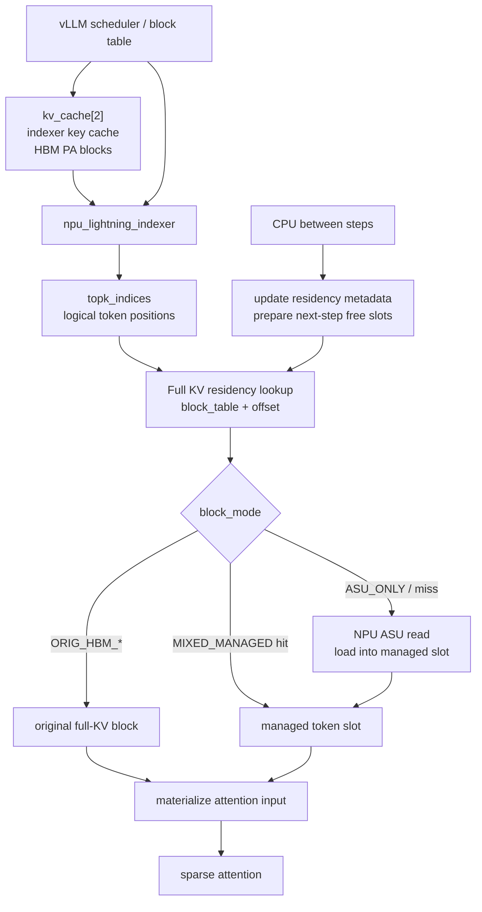
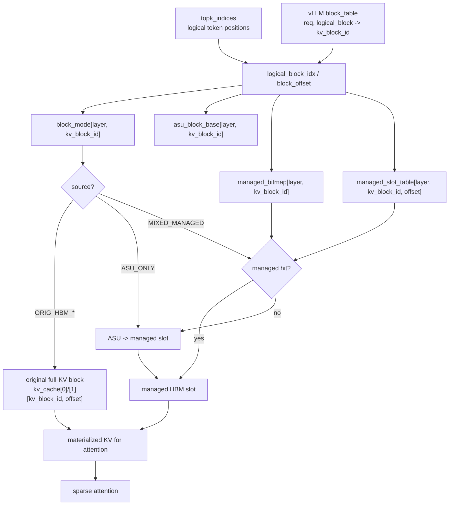
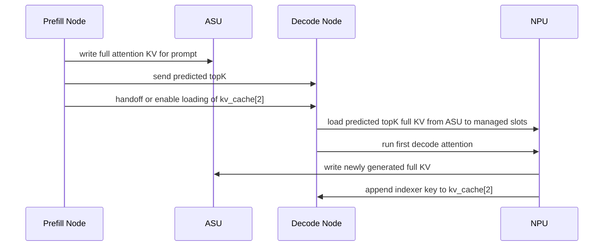
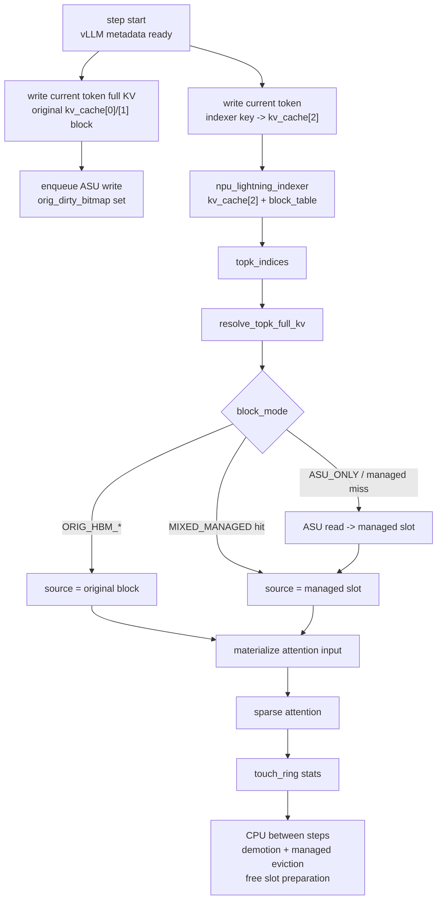
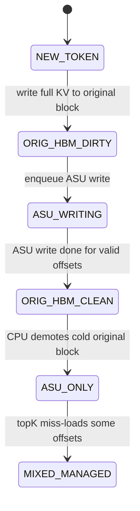
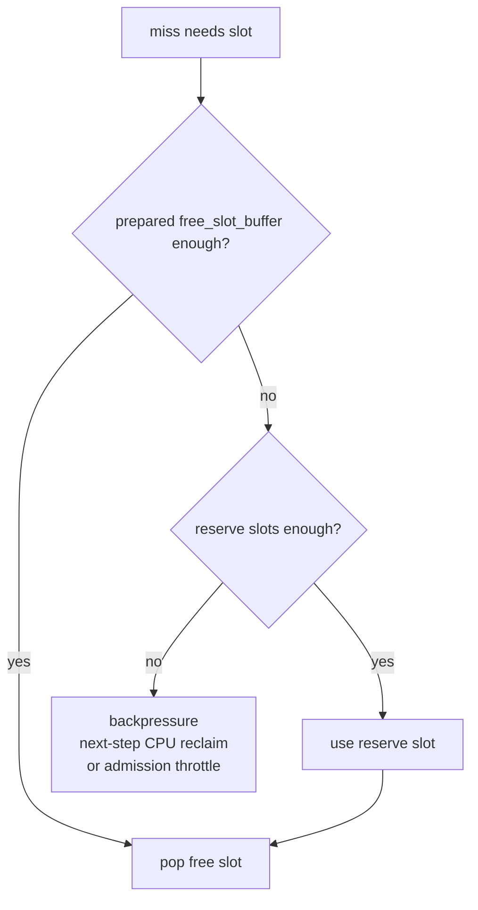
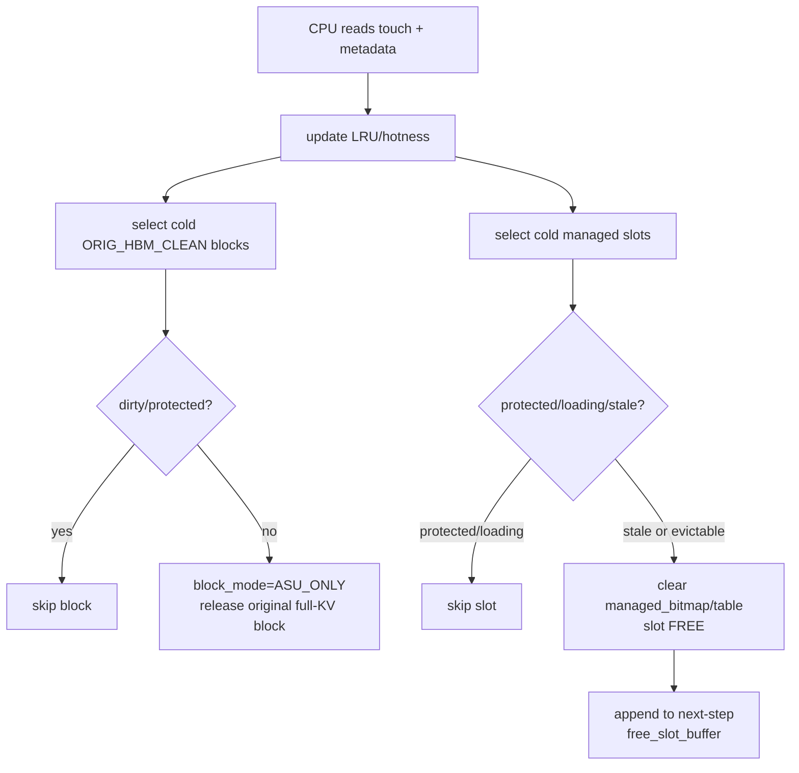
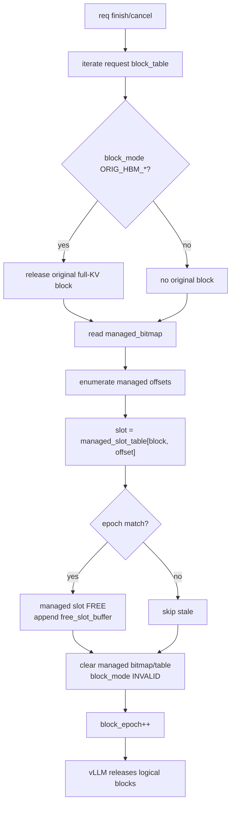

# 基于 vLLM Block Table 的 ASU-backed Decode KVCache 管理设计草稿

本文重写此前关于 HBM KVCache 管理的设计草稿。

此前草稿默认要在 NPU HBM 上重新实现一套完整 token 粒度 KVCache 管理，并让 indexer 直接对这套新索引工作。这个前提不成立：当前 vLLM-Ascend 的 Lightning Indexer 依赖 vLLM block table 和 `kv_cache[2]` 的 PA_BSND HBM block 布局。如果直接把 `kv_cache[2]` 改成 ASU-backed、token 粒度拼接的布局，现有 indexer 会读错地址，topK 语义失效。

本版设计采用新的边界：

```text
保留:
  vLLM block table
  indexer key cache: kv_cache[2]
  lightning_indexer 的精确 topK 语义

替换/增强:
  sparse attention 实际消费的 full attention KV: kv_cache[0] / kv_cache[1]
  为 full KV 增加 ASU 后端存储 + HBM residency cache
```

核心目标不是完全重写 vLLM KVCache，而是在现有 block table 机制上叠加一层 full KV 的驻留管理：

```text
block table 仍然描述逻辑 token/block 序列。
indexer 仍然基于 kv_cache[2] + block table 计算 topK logical token indices。
ASU 保存完整 full attention KV。
HBM 中的新生成 / tail token 保持原始 vLLM full-KV block layout。
HBM 中的旧 hot token 使用 managed token slots。
旧 token miss 时 NPU 通过参数面从 ASU 直接读入 managed slot。
```

## 1. 设计结论

本需求在以下边界内可行：

1. **不替换 indexer key cache。** `kv_cache[2]` 必须保持现有 PA_BSND HBM block 布局，供 Lightning Indexer 使用。
2. **只替换 full attention KV 的常驻策略。** `kv_cache[0] / kv_cache[1]` 不再要求完整上下文常驻 HBM，而是由 original full-KV blocks、managed token slots 和 ASU 共同管理。
3. **vLLM block table 仍是主逻辑索引。** 新增 residency overlay 根据 `block_table + logical offset` 判断 full KV source 是原始 block、managed slot 还是 ASU。
4. **decode 阶段生效。** 本设计只覆盖 decode 节点上的 DSA sparse attention，不重新设计 prefill attention。
5. **淘汰策略和淘汰应用都由 CPU 在 step 间处理。** NPU step 内只执行数组查表、miss load、状态更新和 attention 所需的数据 materialize，不参与 victim 选择或淘汰应用。

不可行或不建议作为第一版的边界：

```text
把 kv_cache[2] 也改成 ASU-backed token cache。
```

除非重写 Lightning Indexer，使其理解 ASU 地址、HBM residency 和 token 粒度 slot，否则不能改 `kv_cache[2]` 的布局。

## 2. 当前代码事实

### 2.1 indexer key cache 与 attention KV 是两套数据

当前 Ascend SFA 代码中，indexer key 的生成路径是：

```python
k_proj, _ = self.wk(x)        # hidden_states -> [token, 128]
k = self.k_norm(k_proj)
q, k = rope_forward_triton(...)
```

随后写入：

```python
torch_npu.npu_scatter_nd_update_(
    kv_cache[2].view(-1, k.shape[-1]),
    attn_metadata.slot_mapping.view(-1, 1),
    k.view(-1, k.shape[-1])
)
```

Lightning Indexer 调用：

```python
topk_indices = torch.ops._C_ascend.npu_lightning_indexer(
    query=q,
    key=kv_cache[2],
    weights=weights,
    actual_seq_lengths_query=actual_seq_lengths_query,
    actual_seq_lengths_key=actual_seq_lengths_key,
    block_table=attn_metadata.block_tables,
    layout_query="TND",
    layout_key="PA_BSND",
    sparse_count=2048,
    sparse_mode=3,
)
```

sparse attention 实际消费的是：

```python
attn_output = torch.ops._C_ascend.npu_sparse_flash_attention(
    query=ql_nope,
    key=kv_cache[0],
    value=kv_cache[0],
    sparse_indices=topk_indices,
    block_table=attn_metadata.block_tables,
    key_rope=kv_cache[1],
    layout_kv="PA_BSND",
)
```

因此：

| 数据 | 当前张量 | 用途 | 是否可第一版替换 |
| --- | --- | --- | --- |
| indexer key cache | `kv_cache[2]` | Lightning Indexer 计算 topK | 不替换 |
| full attention latent/value KV | `kv_cache[0]` | sparse attention 真实计算 | 可替换 |
| full attention rope KV | `kv_cache[1]` | sparse attention 真实计算 | 可替换 |

### 2.2 Lightning Indexer 强依赖 block table 物理地址语义

当前 indexer kernel 读取 PA_BSND key 时使用类似逻辑：

```cpp
s2BlkId = logical_pos / kCacheBlockSize;
s2BlkOffset = logical_pos % kCacheBlockSize;
keyGmOffset =
    block_table[batch, s2BlkId] * kCacheBlockSize * kHeadNum * headDim
    + s2BlkOffset * headDim;
```

这说明 indexer 认为：

```text
block_table 指向 kv_cache[2] 中连续可读的 HBM PA block。
```

所以本设计必须保留这条语义。

### 2.3 indexer 输出是 logical token index

Lightning Indexer 输出的 `topk_indices` 是逻辑 token 位置，不是 HBM physical slot。后续 attention 再通过 block table 找到 full KV。

这正好为本设计提供了接入点：

```text
indexer 输出 logical token id
  -> 根据 block table 定位 logical block + offset
  -> 查询 full KV residency overlay
  -> HBM hit 直接用
  -> HBM miss 从 ASU 读入 HBM
```

## 3. 总体架构

系统拆成三层。

### 3.1 vLLM 逻辑层

vLLM 继续维护请求、动态 batch、block allocation 和 block table。

```text
block_table[req, logical_block_idx] -> kv_block_id
slot_mapping[token] -> kv_block_id + block_offset
seq_lens[req] -> current visible length
```

这里的 `kv_block_id` 继续作为逻辑 block id 使用。对 `kv_cache[2]` 来说，它也是现有 HBM PA block id；对 `kv_cache[0]/[1]` 来说，它是 ASU/HBM residency overlay 的 logical block id。

### 3.2 indexer 层

indexer 层保持现状：

```text
kv_cache[2] 完整保留在 HBM
layout_key = PA_BSND
block_table 原样传给 npu_lightning_indexer
topk_indices 仍表示 logical token positions
```

这保证 indexer 的结果不因 full KV 的 HBM/ASU 迁移而变化。

### 3.3 full attention KV residency 层

新增 residency overlay 管理 `kv_cache[0]/[1]` 的 full KV：

```text
ASU:
  保存完整 full attention KV。

HBM:
  保存两类 full KV:
    1. 新生成 / tail token 所在的原始 vLLM full-KV blocks。
    2. 旧 block demote 后，从 ASU miss-load 回来的 managed token slots。

Residency metadata:
  logical block + block offset -> original block / managed slot / ASU location
```

总体路径：



## 4. 与 vLLM Block Table 的结合方式

### 4.1 block table 不被替代

本设计不新增一套 request-to-token 主索引来替代 vLLM block table。逻辑地址仍然这样计算：

```text
logical_pos
  -> logical_block_idx = logical_pos / block_size
  -> block_offset      = logical_pos % block_size
  -> kv_block_id       = block_table[req, logical_block_idx]
```

然后 full KV residency overlay 使用：

```text
(layer_id, kv_block_id, block_offset)
```

作为查询 key。

### 4.2 block table 的双重语义

同一个 `kv_block_id` 在两类 cache 中含义不同：

| cache | `kv_block_id` 含义 |
| --- | --- |
| `kv_cache[2]` | HBM PA block id，indexer 直接用它读连续 HBM block |
| `kv_cache[0]/[1]` | full KV logical block id，用于查 ASU 地址和 HBM residency |

这要求 attention 路径不能继续把原始 block table 当成 `kv_cache[0]/[1]` 的完整 HBM PA block table 使用。否则它会假设 full KV 全部在 HBM，和本设计冲突。

### 4.3 attention 接入方式

第一版有两个实现选项。

**方案 A：resolver 生成 hybrid source refs，attention 直接支持多来源。**

attention op 接收：

```text
query
topk_indices
block_table
full_kv_residency_metadata
asu_handles
original_full_kv_blocks
managed_slot_pool
```

op 内部根据 source 直接取数：

```text
topk logical token -> original block / managed slot / ASU
miss -> ASU read -> managed slot
attention compute
```

优点是少一次 compact workspace 拷贝。缺点是 attention kernel 内部要理解 source type，分支和地址生成更复杂。

**方案 B：resolver 先 materialize topK KV 到 compact workspace，再调用 attention。**

前置 kernel 将 topK full KV gather 到一个 compact workspace：

```text
topk_indices
  -> original block / managed slot / ASU load
  -> compact_topk_kv_workspace
```

然后 attention 对 compact workspace 计算。这个方案多一次 materialize，但 attention 不需要同时理解原始 block table 和 managed slot table。

推荐第一版按方案 B 落地，具体实现拆成两个 kernel：

```text
kernel 1: resolve_and_materialize_topk_full_kv
kernel 2: sparse_attention_from_compact_workspace
```

这样可以先把 ASU/HBM residency 问题和 attention 算子问题解耦。

## 5. 数据结构

### 5.1 现有 vLLM 数据结构

这些结构继续由 vLLM/vLLM-Ascend 维护：

| 数据结构 | 粒度 | 作用 |
| --- | --- | --- |
| `block_table` | req x logical block | 逻辑 block 到 `kv_block_id` 的映射 |
| `slot_mapping` | 当前 step token | 新 token 写入现有 KV cache 的位置 |
| `seq_lens` | req | 当前可见历史长度 |
| `cum_query_lens` | batch | indexer/attention 的 query 分段 |
| `kv_cache[2]` | layer x block x token | indexer key cache，完整 HBM 常驻 |

### 5.2 新增 ASU/HBM residency 数据结构

新增结构只服务 `kv_cache[0]/[1]` 的 full KV，但它不再假设所有 HBM resident token 都在 managed token slots 中。

第一版采用 hybrid residency：

```text
新生成 / tail block:
  full KV 保持原始 vLLM block layout，按 kv_cache[0]/[1][kv_block_id, offset] 读取。

已释放原始 full-KV block 的旧 token:
  full KV 在 ASU 中保留完整副本。
  如果后续 topK 命中，再 miss-load 到 managed token slot。
```

因此需要同时描述 block 级状态和 managed token slot 状态。

| 数据结构 | 粒度 | 推荐位置 | 作用 |
| --- | --- | --- | --- |
| `asu_block_base[layer, kv_block_id]` | block | NPU GM / Host mirrored | full KV 在 ASU 中的 block 起始地址 |
| `block_epoch[layer, kv_block_id]` | block | NPU GM | 防止 block id 复用后的 stale IO 污染 |
| `block_mode[layer, kv_block_id]` | block | NPU GM / Host mirrored | full KV 当前来源：原始 HBM block、ASU-only、或 managed slots |
| `orig_dirty_bitmap[layer, kv_block_id]` | block offset bitset | NPU GM / Host mirrored | 原始 HBM block 中尚未写入 ASU 的 dirty token |
| `managed_bitmap[layer, kv_block_id]` | block offset bitset | NPU GM | block 已脱离原始布局后，哪些 offset 已在 managed slot 中 |
| `managed_slot_table[layer, kv_block_id, offset]` | token | NPU GM | managed resident token 对应的 HBM slot id |
| `managed_slot_state[layer, slot]` | managed HBM slot | NPU GM | FREE / RESIDENT / LOADING / PROTECTED |
| `managed_slot_owner_block[layer, slot]` | managed HBM slot | NPU GM | slot 属于哪个 logical block |
| `managed_slot_owner_offset[layer, slot]` | managed HBM slot | NPU GM | slot 属于 block 内哪个 offset |
| `managed_slot_owner_epoch[layer, slot]` | managed HBM slot | NPU GM | slot 写入时的 block epoch |
| `free_slot_buffer[layer]` | managed HBM slot pool | NPU GM | CPU step 间准备好的下一步可用 managed slot 数组 |
| `load_job_table[layer]` | IO job | NPU GM | ASU -> managed HBM slot 的 miss load 任务 |
| `touch_ring[layer]` | token access event | NPU GM -> CPU | NPU 上报每步 source touch / miss / load 信息 |
| `cache_stats[layer]` | global / req / layer | NPU GM / Host readable | hit rate、miss reason、demotion、managed eviction 统计 |

`block_mode` 定义：

| 状态 | 含义 | attention source |
| --- | --- | --- |
| `ORIG_HBM_DIRTY` | full KV 在原始 vLLM HBM block，至少一个 valid offset 尚未写入 ASU | 原始 `kv_cache[0]/[1]` block |
| `ORIG_HBM_CLEAN` | full KV 在原始 vLLM HBM block，ASU 已有完整副本 | 原始 `kv_cache[0]/[1]` block |
| `ASU_ONLY` | 原始 full-KV HBM block 已释放，ASU 有完整副本 | miss-load 到 managed slot |
| `MIXED_MANAGED` | 原始 full-KV HBM block 已释放，ASU 有完整副本，部分 offset 已在 managed slot | managed hit 或 ASU miss-load |

结构关系：



### 5.3 两类 HBM 位置

full KV 在 HBM 中有两类物理位置。

第一类是原始 vLLM block layout：

```text
original_full_kv_block[layer, kv_block_id, offset]:
  kv_cache[0] equivalent
  kv_cache[1] equivalent
```

这类位置主要承载新生成 token 和 recent tail block。只要 `block_mode` 是 `ORIG_HBM_DIRTY` 或 `ORIG_HBM_CLEAN`，topK 命中该 block 内任意 token 时，都按原始 block 地址取数。

第二类是 managed token slot：

```text
managed_slot[layer, slot_id]:
  kv_cache[0] equivalent for one token
  kv_cache[1] equivalent for one token
```

这类位置只承载已经脱离原始 block layout 的旧 token。它由 `managed_bitmap + managed_slot_table` 管理，主要用于 ASU miss-load 后的 hot token cache。

## 6. Decode 数据流

### 6.1 第一轮 decode

第一轮 decode 的输入来自 prefill 节点。

设计要求：

1. prefill 节点将完整 full attention KV 写入 ASU。
2. prefill 节点将预测的 topK 传输给 decode 节点。
3. decode 节点根据预测 topK 从 ASU 预取 full KV 到 managed HBM slots。
4. decode 节点必须拥有当前候选范围所需的 `kv_cache[2]` indexer key cache，才能在后续 step 本地运行 Lightning Indexer。

第 4 点是关键约束。当前 Lightning Indexer 需要完整候选范围的 indexer key cache。如果 decode 节点只有 prefill 预测 topK 的 full KV，而没有完整 `kv_cache[2]`，则第一步可以使用 prefill 给出的 topK，但第二步开始无法在 decode 节点上精确重算 indexer。

因此第一版有一个硬性要求：

```text
prefill -> decode handoff 必须使 decode 节点获得完整候选范围的 kv_cache[2]。
```

实现方式可以是：

| 方式 | 描述 | 代价 |
| --- | --- | --- |
| 直接传输 `kv_cache[2]` | prefill 节点把 indexer key cache 交给 decode 节点 | 占用 HBM 和传输带宽，但不改 indexer |
| ASU 存一份 indexer key cache，decode 加载到 HBM | ASU 作为 handoff 介质 | 增加一次加载，但仍保持 indexer 不变 |
| 重写 indexer 读取 ASU indexer key | 不要求 `kv_cache[2]` 完整 HBM | 不属于第一版，复杂度高 |

第一版推荐前两种，具体取决于 prefill/decode 分离的通信代价。

第一轮 decode 流程：



### 6.2 后续 decode step

后续 step 的精确路径：

```text
1. vLLM 更新 batch metadata、block_table、seq_lens。
2. 当前 layer 按原有 vLLM full-KV insert 逻辑，将当前 token 的 `kv_cache[0]/[1]` 写入原始 HBM block。
3. 当前 layer 根据 hidden_states 生成当前 token 的 indexer key，并写入 `kv_cache[2]`。
4. Lightning Indexer 读取 `kv_cache[2] + block_table`，输出 `topk_indices`。
5. `resolve_topk_full_kv` 根据 `topk_indices + block_table + block_mode` 判断每个 topK token 的 full KV 来源。
6. 如果来源是 `ORIG_HBM_*`，直接读取原始 `kv_cache[0]/[1][kv_block_id, offset]`。
7. 如果来源是 `MIXED_MANAGED` 且 managed hit，读取 managed slot。
8. 如果来源是 `ASU_ONLY` 或 managed miss，NPU 从 ASU 读取 full KV 到 CPU 预留的 managed slot。
9. materialize 层将 original block / managed slot 的 KV 统一整理给 sparse attention。
10. 当前新 token 的 full KV 写入 ASU；写完成前对应 original block 保持 dirty，不可 demote。
11. CPU 在 step 间根据 touch_ring 完成 original block demotion、managed slot eviction，并准备下一 step 的 free slot buffer。
```

流程图：



## 7. 新生成 token 的管理

新生成 token 会产生两类状态。

### 7.1 indexer key

保持现有路径：

```text
hidden_states -> indexer.wk/k_norm/rope -> kv_cache[2]
```

写入位置由 vLLM `slot_mapping` 和 block table 控制。它必须立即对下一步 indexer 可见。

### 7.2 full attention KV

新 token 的 full attention KV 不进入 managed token slot。它继续按原有 vLLM full-KV block layout 写入原始 HBM block：

```text
1. vLLM 为新 token 分配 logical block + offset。
2. full KV writer 按原有逻辑写入 `kv_cache[0]/[1][kv_block_id, offset]`。
3. 若该 block 是新分配或仍在 tail window，`block_mode = ORIG_HBM_DIRTY`。
4. 设置 `orig_dirty_bitmap[layer, kv_block_id].set(offset)`。
5. 异步或同步将该 token 的 full KV 写入 ASU。
6. ASU 写完成后清对应 dirty bit。
7. 当 block 内 valid offsets 都已写入 ASU，`block_mode` 可变为 `ORIG_HBM_CLEAN`。
8. CPU step 间可将 cold 的 `ORIG_HBM_CLEAN` block demote 为 `ASU_ONLY`，释放原始 full-KV HBM block。
```

推荐策略：

```text
新生成 token 默认保留在原始 HBM block。
最近 tail window 内 token 默认 protected 或高 hotness。
ASU 写采用 write-through 或异步 write-behind。
dirty original block 不允许 demote。
managed 索引只接管已经 demote 的旧 block/token。
```

原因：

1. 新 token 很可能在后续若干 step 被 indexer 选中。
2. 新 token 按原始 block layout 写入，能最大限度复用 vLLM 现有写入路径。
3. tail window 对模型质量和命中率都重要，整 block 保留比逐 token 重排更简单。
4. 新 token 若不及时写 ASU，发生 demotion、req 迁移或故障恢复时会丢状态。

状态机：



## 8. 查询与 Materialize 流程

`topk_indices` 是 logical token position。检索层的职责不是简单判断 token 是否在 managed slot 中，而是解析每个 topK token 的 full KV 当前来源：

```text
logical token
  -> block_table
  -> kv_block_id + offset
  -> block_mode
  -> original full-KV block / managed slot / ASU miss-load
```

这层可以称为 `resolve_topk_full_kv`。它输出统一的 attention 输入，避免 sparse attention kernel 自己理解多套地址语义。

第一版推荐 materialize 到 compact workspace：

```text
original block source
managed slot source
ASU miss-load source
  -> compact_topk_kv_workspace
  -> sparse attention reads workspace
```

如果后续 attention kernel 支持 hybrid source，也可以不拷贝到 workspace，而是直接消费 `(source_type, source_index)`。但 draft 的基础语义仍以 resolver 为准。

### 8.1 输入输出

输入：

```text
topk_indices[layer, batch, query, k]
block_table[batch, logical_block_idx]
block_mode[layer, kv_block_id]
managed_bitmap[layer, kv_block_id]
managed_slot_table[layer, kv_block_id, offset]
asu_block_base[layer, kv_block_id]
free_slot_buffer[layer]
```

输出：

```text
resolved_source[layer, batch, query, k]
compact_topk_kv_workspace 或 materialized source refs
miss_job_list[layer]
touch_list[layer]
```

`resolved_source` 至少需要表达：

```text
source_type:
  ORIG_BLOCK
  MANAGED_SLOT
  ASU_LOAD_TO_MANAGED

source_payload:
  ORIG_BLOCK:    kv_block_id + offset
  MANAGED_SLOT:  managed_slot_id
  ASU_LOAD:      asu_addr + target_managed_slot
```

### 8.2 检索逻辑

核心逻辑：

```text
for each topk logical_pos:
    logical_block_idx = logical_pos / block_size
    offset = logical_pos % block_size
    kv_block_id = block_table[batch, logical_block_idx]
    mode = block_mode[layer, kv_block_id]

    if mode == ORIG_HBM_DIRTY or mode == ORIG_HBM_CLEAN:
        source = ORIG_BLOCK(kv_block_id, offset)
        touch_list.append(original block, kv_block_id, offset)
        materialize_from_original_block(source)
        continue

    if mode == MIXED_MANAGED:
        if managed_bitmap[layer, kv_block_id].test(offset):
            slot = managed_slot_table[layer, kv_block_id, offset]
            source = MANAGED_SLOT(slot)
            touch_list.append(managed slot, slot)
            materialize_from_managed_slot(source)
            continue

    # mode == ASU_ONLY, or mode == MIXED_MANAGED but managed miss
    slot = allocate_managed_slot_from_prepared_buffer()
    asu_addr = asu_block_base[layer, kv_block_id] + offset * full_kv_stride
    enqueue_load(asu_addr, slot)
    managed_bitmap[layer, kv_block_id].set(offset)
    managed_slot_table[layer, kv_block_id, offset] = slot
    block_mode[layer, kv_block_id] = MIXED_MANAGED
    source = ASU_LOAD_TO_MANAGED(asu_addr, slot)
    materialize_after_load(source)
```

这个逻辑直接回答新生成 token 的处理：

```text
如果 topK 命中新生成 token:
  该 token 所在 block 仍是 ORIG_HBM_DIRTY / ORIG_HBM_CLEAN。
  resolver 返回 ORIG_BLOCK。
  attention 输入从原始 kv_cache[0]/[1] block materialize。
  不查询 managed_bitmap，不占用 managed slot。
```

### 8.3 Source 去重与 IO 合并

同一个 step 内，多个 query/head 可能访问同一个 logical token。resolver 需要按来源去重。

```text
logical source unique key:
  ORIG_BLOCK:    (layer, kv_block_id, offset)
  MANAGED_SLOT:  (layer, slot_id)
  ASU_LOAD:      (layer, kv_block_id, offset)
```

建议优先采用排序/分段压缩，而不是 hash table。

```text
1. 生成 resolved candidates。
2. 按 source_type 分段。
3. ORIG_BLOCK 段按 kv_block_id、offset 排序，合并连续读。
4. MANAGED_SLOT 段按 slot_id 去重。
5. ASU_LOAD 段按 kv_block_id、offset 排序，去重并合并连续 ASU read。
```

这样更符合 Ascend NPU 的连续访问和批处理特性。

### 8.4 给 attention 的方式

第一版推荐 compact materialize：

```text
for each resolved source:
    if source is ORIG_BLOCK:
        copy/read kv_cache[0]/[1][kv_block_id, offset] -> compact workspace

    if source is MANAGED_SLOT:
        copy/read managed_slot[slot] -> compact workspace

    if source is ASU_LOAD_TO_MANAGED:
        wait/load ASU -> managed_slot[slot]
        copy/read managed_slot[slot] -> compact workspace

sparse_attention(query, compact_topk_kv_workspace)
```

这样 sparse attention 不需要同时理解原始 block table 和 managed slot table。它只消费统一 workspace。

如果后续为了减少拷贝改造 attention kernel，可以把 workspace 替换成 source refs：

```text
source_type[] = ORIG_BLOCK / MANAGED_SLOT
source_index[] = kv_block_id+offset / slot_id
```

但无论哪种方式，所有 topK token 都必须先经过 resolver，不能在 attention 内部靠 token 是否新生成来走隐式分支。

### 8.5 Free slot 预算与不足处理

这里的 free slot 只指 managed token slot，不包括原始 vLLM full-KV block。

NPU step 内不做淘汰。第一版采用水位线和预分配机制：

```text
CPU 在 step 间保证:
  managed_free_slot_count[layer] >= next_step_managed_miss_budget[layer] + reserve_margin
```

CPU 在 step 开始前把可用 slot 写入 `free_slot_buffer[layer]`，NPU miss path 只从这个连续数组中取 slot。这个动作是分配，不是淘汰。

如果 step 内仍然 free slot 不足：

1. 使用 CPU 预留的 reserve slots。
2. reserve 仍不足时，不在 NPU 上触发 emergency eviction。
3. 当前 step 进入 backpressure：等待下一 step CPU 回收更多 free slots，或由 scheduler 降低并发/减少 admission。

也就是说，NPU 不遍历 free 表，不做链表，不做全局 LRU 更新，也不应用 victim。



## 9. 淘汰机制

淘汰逻辑和淘汰应用都放在 step 间由 CPU 处理。NPU 不参与 victim 选择，不执行 eviction apply，不处理 dirty slot 的释放。NPU 只消费 CPU 已经准备好的 metadata snapshot 和 `free_slot_buffer`。

hybrid 设计下，淘汰分两类：

```text
1. original block demotion:
     ORIG_HBM_CLEAN -> ASU_ONLY
     释放原始 full-KV HBM block。
     block_table 和 kv_cache[2] 不变。

2. managed slot eviction:
     MIXED_MANAGED 中的冷 token managed slot -> FREE
     清 managed_bitmap / managed_slot_table。
```

第一类是主要 HBM 降占用手段；第二类是为后续 ASU miss-load 准备 managed token slots。

基本时序：

```text
step N 执行中:
  NPU 记录 touch_ring:
    ORIG_BLOCK touch
    MANAGED_SLOT touch
    ASU miss/load
    new token original block write

step N 结束后:
  CPU 读取 touch_ring、block_mode、orig_dirty_bitmap、managed slot metadata。
  CPU 更新 block 和 managed slot 的 LRU/hotness/req quota。
  CPU demote cold ORIG_HBM_CLEAN blocks。
  CPU evict cold managed slots。
  CPU 写入 next-step metadata snapshot 和 free_slot_buffer。

step N+1 开始:
  NPU 使用 metadata snapshot 和 free_slot_buffer。
```

### 9.1 CPU 侧输入

CPU 每步读取或接收：

```text
touch_ring:
  hit slots
  miss loaded slots
  new token slots
  per-req / per-layer hit miss counters

slot state snapshot:
  block_mode
  orig_dirty_bitmap
  managed_slot_state
  managed owner block / offset / epoch

ASU write status:
  original block / offset 的 ASU 写完成情况

vLLM scheduler state:
  active reqs
  paused reqs
  finished reqs
  seq_lens
```

### 9.2 淘汰优先级

目标命中率 95% 时，淘汰优先级不能只看“最老”。需要保护 DSA 最可能再次访问的 token。

推荐优先级从不能淘汰到优先淘汰：

| 优先级 | 类别 | 处理 |
| --- | --- | --- |
| P0 | 当前 step topK 正在使用的 source | 禁止 demote/evict，`PROTECTED` |
| P1 | `ORIG_HBM_DIRTY` block | 禁止 demote，等待 ASU 写完成 |
| P2 | 新生成 tail window 的 original block | 强保护或高 hotness |
| P3 | prefill 预测 topK / next-step 预测 topK source | 高 hotness，优先保留 |
| P4 | 近期多次被 indexer 选中的 original block / managed slot | 根据 touch 计数保留 |
| P5 | cold `ORIG_HBM_CLEAN` block | 可 demote，释放整块 full-KV HBM |
| P6 | cold managed slot | 可 evict，释放 managed token slot |
| P7 | paused req / over-quota req 的 clean original block 或 managed slot | 优先 demote/evict |
| P8 | stale epoch / finished req source | 立即释放 |

### 9.3 Baseline：CPU Windowed LRU

第一版推荐 CPU 侧 Windowed LRU，而不是 NPU 侧精确 LRU。

CPU 维护两套 recentness：

```text
last_touch_step_orig_block[layer, kv_block_id]
touch_count_window_orig_block[layer, kv_block_id]
last_touch_step_managed_slot[layer, slot]
touch_count_window_managed_slot[layer, slot]
req_resident_count[req]
orig_hbm_block_budget[layer]
managed_free_watermark[layer]
```

每个 step 间：

```text
1. 消费 touch_ring，更新 original block 和 managed slot 的 touch 信息。
2. 计算每层 original full-KV HBM block 是否超预算。
3. 计算每层 managed_free_slot 是否低于 watermark。
4. 选择 cold ORIG_HBM_CLEAN blocks 做 demotion。
5. 选择 cold managed slots 做 token 级 eviction。
6. CPU 直接更新 block_mode / managed_bitmap / managed_slot_table。
7. 将释放的 managed slots 写入 next-step free_slot_buffer[layer]。
```

这里的 LRU 不要求每次 hit 都修改链表。hit 只写 touch ring；排序和选择在 CPU step 间完成。

### 9.4 Original block demotion

original block demotion 是释放 HBM 的主要动作。它只处理 `ORIG_HBM_CLEAN` block：

```text
for block in selected_cold_original_blocks:
    if block_mode[layer, block] != ORIG_HBM_CLEAN:
        continue

    if orig_dirty_bitmap[layer, block] != 0:
        continue

    if block is protected by current/next-step policy:
        continue

    block_mode[layer, block] = ASU_ONLY
    release original full-KV HBM block for kv_cache[0]/[1]
```

注意：

```text
block_table 不变。
kv_cache[2] 不变。
kv_block_id 仍然是逻辑 block id。
只是 kv_cache[0]/[1] 的原始 HBM block 不再作为 full KV source。
```

demotion 后，如果 topK 再命中该 block：

```text
block_mode == ASU_ONLY
  -> ASU miss-load 到 managed slot
  -> block_mode = MIXED_MANAGED
```

### 9.5 Managed slot eviction

managed slot eviction 只处理已经从 ASU miss-load 回来的 token 级 cache：

```text
for victim in cpu_selected_clean_victims:
    block = managed_slot_owner_block[layer, victim]
    offset = managed_slot_owner_offset[layer, victim]
    epoch = managed_slot_owner_epoch[layer, victim]

    if epoch != block_epoch[layer, block]:
        mark slot FREE
        append victim to next_step_free_slot_buffer
        continue

    if managed_slot_state[layer, victim] is PROTECTED or LOADING:
        continue

    managed_bitmap[layer, block].clear(offset)
    managed_slot_table[layer, block, offset] = INVALID
    managed_slot_state[layer, victim] = FREE
    append victim to next_step_free_slot_buffer

    if managed_bitmap[layer, block] is empty:
        block_mode[layer, block] = ASU_ONLY
```

managed slot 不承载新生成 dirty token。新 token 的 dirty 状态只存在于 original block 的 `orig_dirty_bitmap`。因此 managed eviction 不需要 writeback。

### 9.6 Dirty original block 处理

dirty original block 不能 demote。

```text
if orig_dirty_bitmap[layer, block] != 0:
    block_mode remains ORIG_HBM_DIRTY
    not demotable
```

ASU 写完成回调或 step 间轮询更新：

```text
clear orig_dirty_bitmap[layer, block, offset]

if all valid offsets clean:
    block_mode[layer, block] = ORIG_HBM_CLEAN
```

只有 `ORIG_HBM_CLEAN` 才能进入 demotion candidate。

### 9.7 备选：CLOCK / Hotness

如果 CPU LRU 维护成本过高，可以退化为 CLOCK / hotness，但仍然按两类对象维护：

```text
original_block.hotness:
  ORIG touch / new tail / predicted topK -> set max
  CPU 每轮候选选择时 hotness--
  hotness==0 且 ORIG_HBM_CLEAN -> demote

managed_slot.hotness:
  managed touch -> set max
  CPU 每轮候选选择时 hotness--
  hotness==0 且 unprotected -> evict
```

这个方案更简单，但对 95% 命中率的可控性弱于 Windowed LRU。

淘汰应用流程：



## 10. Req 变化时的数据维护

### 10.1 Admission

请求进入 decode 节点时：

```text
1. vLLM 建立 request metadata。
2. vLLM block table 描述 prompt 的 logical blocks。
3. full KV 的 ASU block base 已由 prefill 写入，或 decode 从 handoff metadata 获得。
4. prompt block 默认初始化为 ASU_ONLY。
5. managed_bitmap / managed_slot_table 初始化为空。
6. 如果有 prefill predicted topK，decode 预取这些 token 的 full KV 到 managed slots，block_mode 变为 MIXED_MANAGED。
7. decode 节点准备完整候选范围的 kv_cache[2]。
```

### 10.2 Batch reorder / reschedule

vLLM 动态 batch 重排时：

```text
只更新 batch metadata 和 block_table view。
不移动 ASU full KV。
不移动 original full-KV blocks 或 managed slots。
不改变 kv_cache[2] 的 block 语义。
```

### 10.3 Append 新 block

当 decode 生成 token 导致 vLLM 分配新 logical block：

```text
1. vLLM block allocator 分配 kv_block_id。
2. block_epoch[layer, kv_block_id]++。
3. 为 full KV 分配或记录 asu_block_base[layer, kv_block_id]。
4. 为该 block 准备原始 full-KV HBM block。
5. block_mode[layer, kv_block_id] = ORIG_HBM_DIRTY。
6. managed_bitmap[layer, kv_block_id] 清零。
7. 后续新 token insert 逐 offset 写入原始 HBM block，并写入 ASU。
```

### 10.4 Finish / cancel / reset

请求结束时，不能只释放 vLLM block table，还要清理 full KV residency。

推荐按 block 清理，而不是全局扫描 slot pool：

```text
for kv_block_id in request block_table:
    epoch = block_epoch[layer, kv_block_id]

    if block_mode[layer, kv_block_id] is ORIG_HBM_DIRTY or ORIG_HBM_CLEAN:
        release original full-KV HBM block for kv_cache[0]/[1]

    bitmap = managed_bitmap[layer, kv_block_id]
    for each set offset in bitmap:
        slot = managed_slot_table[layer, kv_block_id, offset]
        if managed_slot_owner_epoch[layer, slot] == epoch:
            managed_slot_state[layer, slot] = FREE
            append slot to next-step free_slot_buffer

    managed_bitmap[layer, kv_block_id] = 0
    invalidate managed_slot_table entries
    block_mode[layer, kv_block_id] = ASU_ONLY or INVALID
    block_epoch[layer, kv_block_id]++
```

block size 通常较小，扫描一个 block 的 bitmap 是连续访问；这比维护 per-req linked list 更适合 NPU/CPU 混合控制。

reset 流程：



## 11. ASU 存储内容

ASU 至少保存完整 full attention KV：

```text
ASU full KV:
  layer
  kv_block_id
  block_offset
  kv_cache[0] equivalent
  kv_cache[1] equivalent
```

建议 ASU 也保存 indexer key cache 作为 handoff/rebuild 介质：

```text
ASU indexer key cache:
  layer
  kv_block_id
  block_offset
  kv_cache[2] equivalent
```

但第一版 runtime indexer 仍然从 HBM `kv_cache[2]` 读取，不直接从 ASU 读取 indexer key。

ASU 地址建议按 block 连续组织：

```text
asu_block_base[layer, kv_block_id]
  + block_offset * full_kv_stride
```

这样 topK miss 如果落在相邻 offset，可以合并 IO。

## 12. 容量与压力评估

### 12.1 HBM 容量拆分

HBM 中仍然需要保留：

```text
模型权重 shard
workspace / graph / communication buffers
kv_cache[2] indexer key cache
original full-KV tail blocks
managed full-KV token slots
residency metadata
```

因此本设计降低的是 `kv_cache[0]/[1]` 的 HBM 常驻量，不是把所有 KV 相关 HBM 全部降为零。

以 DeepSeek V3.2 近似估算：

| 项 | 估算 |
| --- | ---: |
| full attention KV | 约 656 B / token / layer |
| indexer key cache | 约 132 B / token / layer |
| 层数 | 约 61 |

则：

| 场景 | token 总数 | full KV 常驻成本 | indexer key 常驻成本 |
| --- | ---: | ---: | ---: |
| 50 req x 2K | 100K | 约 3.7 GiB | 约 0.75 GiB |
| 50 req x 32K | 1.6M | 约 59.6 GiB | 约 12.0 GiB |
| 50 req x 128K | 6.4M | 约 238 GiB | 约 48.0 GiB |

结论：

```text
在 50 req x 2K 这类目标场景下，保留 kv_cache[2] 是可接受的。
在 50 req x 128K 这类长上下文场景下，kv_cache[2] 本身也会成为 HBM 大项。
```

因此第一版设计可行，但它不是无限长上下文的最终形态。如果目标扩展到 50 并发、128K 级上下文，并且 64G HBM 内还要放权重，则后续必须继续处理 indexer key cache：

1. 压缩 `kv_cache[2]`。
2. 分层/分段保留 indexer key。
3. 重写 ASU-aware indexer。
4. 或引入近似 candidate selection。

这些不属于第一版。

### 12.2 NPU 侧压力

保留现有 indexer 后，当前 `hbm_lookup_update` 的 350us 问题不会由本设计自动消失。新的 full KV materialize 会额外引入：

```text
topK residency metadata lookup
miss 去重
ASU read job 生成
block_mode / managed slot state 更新
```

NPU 压力控制原则：

1. hit path 只读 `block_mode`、`managed_bitmap/table`，避免链表和复杂分支。
2. hit touch 不直接更新 LRU 链表，只写 touch ring。
3. miss 按 block/offset 排序去重，尽量合并 ASU IO。
4. managed free slot 分配只 pop CPU 预先准备的连续数组。
5. 淘汰选择和淘汰应用都放 CPU step 间，NPU 不参与 victim 处理。
6. 通过 watermark 保证 step 内大多数情况下不触发 managed free slot shortage；不足时走 backpressure，不在 NPU 上 emergency eviction。

### 12.3 命中率目标

95% hit rate 不能只靠被动 LRU。需要结合 DSA 的访问形态：

```text
保留 recent tail。
保留 prefill 预测 topK。
保留上一轮和近期高频 topK。
对 paused / over-quota / 长时间未触达 token 优先淘汰。
```

命中率统计应按层、req、step 分开记录：

```text
hit_rate[layer]
hit_rate[req]
miss_by_reason:
  cold_start
  evicted
  first_decode_not_prefetched
  dirty_asu_write_pending
  free_slot_shortage
```

## 13. 调度与内存 accounting

如果 vLLM scheduler 仍按完整 full KV HBM blocks 估算并发，则本设计不能提升并发。需要调整内存 accounting：

```text
必须计入:
  kv_cache[2] indexer key cache HBM
  full KV HBM cache budget
  metadata

不再按完整 kv_cache[0]/[1] 上下文 HBM 常驻计入:
  full attention KV 的冷数据在 ASU
```

也就是说，vLLM block allocator 仍然要分配 logical blocks，但这些 logical blocks 的 full KV 后端是 ASU，不应全部消耗 HBM full KV page。

推荐抽象：

```text
LogicalBlock:
  由 vLLM block table 管理，用于序列语义。

IndexerBlock:
  对应 kv_cache[2] HBM page，必须常驻。

FullKVResidency:
  对应 kv_cache[0]/[1] 的 block_mode、original full-KV blocks、managed token slots 和 ASU 地址。
```

## 14. 第一版落地范围

第一版建议只做以下事情：

1. 保持 `kv_cache[2]` 和 Lightning Indexer 不变。
2. 定义 full KV ASU 地址表和 residency metadata。
3. 在 indexer 输出后增加 `resolve_topk_full_kv / materialize_topk_full_kv`。
4. 改造 sparse attention 输入，使其消费 materialized workspace 或统一 source refs。
5. 新 token full KV 按原有逻辑写原始 HBM block，并 write-through 到 ASU。
6. CPU step 间完成淘汰并准备下一步 free slot buffer，NPU 不参与淘汰。
7. 调整 vLLM decode 节点的 KV memory accounting，把 full KV 冷数据算到 ASU，不算 HBM 常驻。

第一版不做：

```text
不重写 Lightning Indexer。
不把 kv_cache[2] 迁移到 ASU-backed token cache。
不在 NPU 上实现精确 LRU 链表。
不让 step 内 NPU 做大范围 victim 扫描。
不改变 indexer topK 的数学语义。
```

## 15. 关键风险

### 15.1 indexer key cache 仍占 HBM

如果目标上下文很长，`kv_cache[2]` 可能成为新的 HBM 瓶颈。第一版用它换取 indexer 不重写，这是明确 trade-off。

### 15.2 sparse attention 不能完全原样复用

当前 `npu_sparse_flash_attention` 通过原始 block table 读取 `kv_cache[0]/[1]`。如果 full KV 不完整常驻 HBM，就必须改 attention 入口或增加 materialize workspace。

### 15.3 first decode handoff 不只是 predicted topK

prefill 只给 predicted topK full KV 不够。decode 节点后续要精确运行 indexer，必须拥有完整候选范围的 `kv_cache[2]`。

### 15.4 ASU miss 延迟会直接影响 step latency

即使命中率 95%，在 `50 req x topK 2048` 下，5% miss 仍可能是大量 token-layer IO。需要 prefetch、tail retention 和 CPU eviction policy 一起工作。

## 16. 最终设计摘要

```text
这不是完全重写 KVCache 管理。

vLLM block table 继续作为主逻辑索引。
kv_cache[2] 继续作为 indexer key cache 常驻 HBM。
Lightning Indexer 继续输出精确 logical topK。
ASU 保存完整 full attention KV。
HBM 中的新生成 / tail token 保持原始 vLLM full-KV block layout。
HBM 中的旧 hot token 使用 managed token slots。
topK logical token 通过 block table + block_mode 查询 full KV source。
ORIG_HBM_* 命中原始 block。
MIXED_MANAGED 命中 managed slot。
ASU_ONLY 或 managed miss 由 NPU 从 ASU 读入 managed slot。
CPU 在 decode step 间完成 original block demotion 和 managed slot eviction。
新生成 token 更新 kv_cache[2]，full KV 写原始 HBM block，并写入 ASU。
```

这版设计的核心价值是：在不破坏现有 indexer 语义和 vLLM block table 机制的前提下，降低 `kv_cache[0]/[1]` 的 HBM 常驻量，从而提升 64G HBM 约束下的 decode 并发能力。
