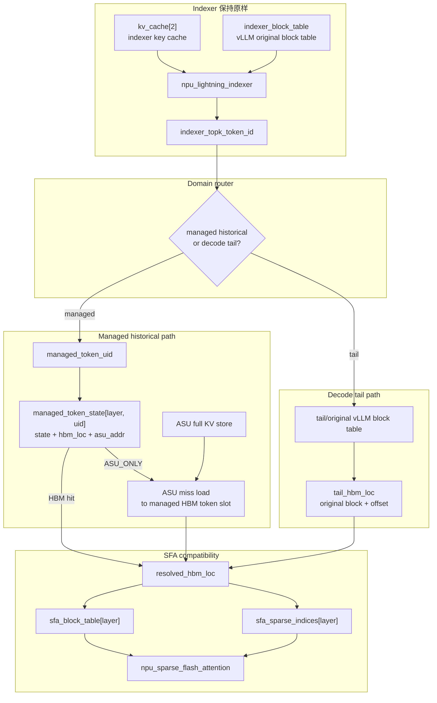
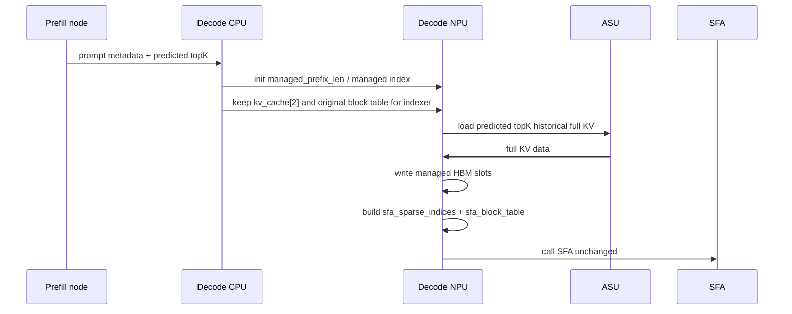
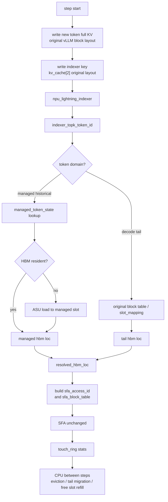
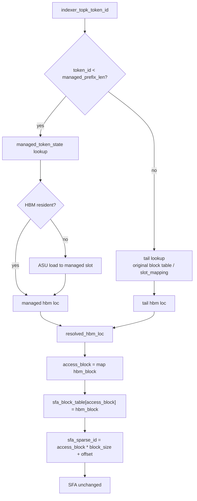
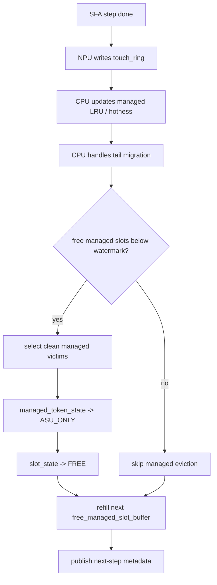
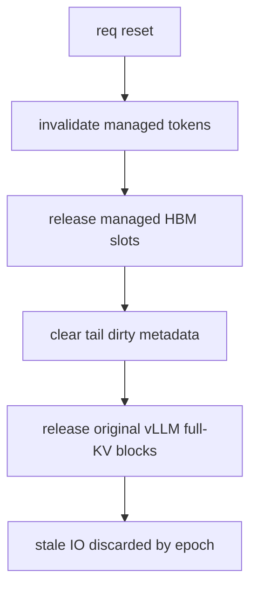

# 基于历史 token 索引与 tail 原生路径的 ASU-backed Decode KVCache 管理设计草稿

本文重写 HBM KVCache 管理设计，修正一个关键边界：

```text
我们的 token 索引不覆盖新生成 token。

managed historical token:
  已经脱离原始 vLLM full-KV block layout。
  由 ASU-backed token 索引管理。
  查询 state 可直接得到 managed HBM slot 或 ASU address。

decode tail / 新生成 token:
  不进入我们的 token 索引。
  继续按原 vLLM block table / slot_mapping 写入和查询 full KV。
  在 tail 阶段天然 HBM resident，ASU write 完成前禁止释放。
```

SFA 不改。无论 token 来自 managed 索引还是 tail 原始路径，SFA 前统一转换成它能读的形式：

```text
resolved_hbm_loc = (hbm_block_id, hbm_offset)
  -> sfa_access_block_idx
  -> sfa_block_table[layer, req, sfa_access_block_idx] = hbm_block_id
  -> sfa_sparse_id = sfa_access_block_idx * block_size + hbm_offset
```

## 1. 目标与边界

### 1.1 目标

1. 在 Ascend 910B 单卡约 64 GB HBM 限制下，降低 decode 节点 full KV 常驻 HBM 量。
2. 在相同 HBM 限制下提高并发能力，当前目标约 50 req，可按模型、topK、seq len 和 SLA 调整。
3. HBM hit rate 目标约 95%。
4. HBM miss 时由 NPU 通过参数面直接从 ASU 读取 full KV，并在 SFA 调用前放入 SFA 可访问的 HBM cache slot。

### 1.2 不改的部分

```text
Indexer:
  不改 Lightning Indexer。
  不改 kv_cache[2] 的 PA_BSND HBM block layout。
  indexer 继续使用 vLLM 原始 block table。

SFA:
  不改 npu_sparse_flash_attention operator。
  SFA 继续通过 sparse_indices + block_table 生成 KV 地址。
```

### 1.3 改的部分

```text
Full KV historical cache:
  对已经脱离 tail 的历史 token，使用 ASU-backed token 索引。
  managed token 的 HBM 位置不要求等于原始 vLLM block + offset。

SFA compatibility:
  在 SFA 前，把 topK token 解析到真实 HBM 坐标。
  再把真实 HBM 坐标 remap 成 SFA 可寻址的临时 sparse id。
```

## 2. 三个坐标系

| 坐标系 | 含义 | 使用者 |
| --- | --- | --- |
| `indexer_token_id` | indexer 输出的 req 内原始 logical token position | domain 判断、managed token uid 映射、tail block table 计算 |
| `managed_token_uid` | managed historical token 的索引身份 | managed token state / ASU addr / hotness |
| `sfa_access_id` | SFA 兼容层生成的临时 logical id | SFA sparse_indices |

必须避免把这三者混成一个概念。

```text
indexer_token_id:
  代表原始序列里的 token 位置。

managed_token_uid:
  只在 token 属于 managed domain 时存在。

sfa_access_id:
  只用于让 SFA 读到正确 HBM 地址。
  不代表原始序列位置。
```

## 3. 当前代码事实

### 3.1 indexer key cache 与 full attention KV 是两套数据

当前 Ascend SFA 路径中，indexer key 写入：

```python
torch_npu.npu_scatter_nd_update_(
    kv_cache[2].view(-1, k.shape[-1]),
    attn_metadata.slot_mapping.view(-1, 1),
    k.view(-1, k.shape[-1])
)
```

Lightning Indexer 调用：

```python
topk_indices = torch.ops._C_ascend.npu_lightning_indexer(
    query=q,
    key=kv_cache[2],
    weights=weights,
    actual_seq_lengths_query=actual_seq_lengths_query,
    actual_seq_lengths_key=actual_seq_lengths_key,
    block_table=attn_metadata.block_tables,
    layout_query="TND",
    layout_key="PA_BSND",
    sparse_count=2048,
    sparse_mode=3,
)
```

SFA 当前调用：

```python
attn_output = torch.ops._C_ascend.npu_sparse_flash_attention(
    query=ql_nope,
    key=kv_cache[0],
    value=kv_cache[0],
    sparse_indices=topk_indices,
    block_table=attn_metadata.block_tables,
    key_rope=kv_cache[1],
    layout_kv="PA_BSND",
)
```

本设计中，SFA operator 不改，但输入换成 remap 后的临时视图：

```python
attn_output = torch.ops._C_ascend.npu_sparse_flash_attention(
    query=ql_nope,
    key=kv_cache[0],
    value=kv_cache[0],
    sparse_indices=attn_metadata.sfa_sparse_indices[layer],
    block_table=attn_metadata.sfa_block_tables[layer],
    key_rope=kv_cache[1],
    layout_kv="PA_BSND",
)
```

### 3.2 为什么要分 domain

如果 full KV cache 已经按 token 粒度重排，managed historical token 的查询不应走：

```text
indexer_token_id
  -> logical block + offset
  -> indexer_block_table
  -> original kv_block + offset
  -> managed cache state
```

因为 managed cache 不保证仍在 original kv block 上。

但新生成 token 又不能强行进入 managed 索引，因为它仍处于原 vLLM block layout：

```text
new / tail token:
  full KV 由原 vLLM 写入原始 block + offset。
  ASU write 可能尚未完成。
  它在 tail 阶段应直接通过原 vLLM block table 得到 HBM 位置。
```

所以查询必须先分 domain：

```text
if token belongs to managed historical domain:
    查 managed token index
else:
    查原 vLLM block table / slot_mapping
```

## 4. 总体架构

### 4.1 数据流



### 4.2 两条查询路径

| domain | 覆盖 token | 查询方式 | 输出 |
| --- | --- | --- | --- |
| managed historical | 已脱离原始 vLLM full-KV block layout 的历史 token | `managed_token_uid -> managed_token_state` | managed HBM slot 或 ASU miss load 后的 HBM slot |
| decode tail | 新生成 / recent tail token | `indexer_token_id -> logical_block + offset -> vLLM block table` | 原始 vLLM HBM block + offset |

两条路径最终都输出：

```text
resolved_hbm_loc = (hbm_block_id, hbm_offset)
```

SFA compatibility 层只处理 `resolved_hbm_loc`，不关心它来自 managed 还是 tail。

### 4.3 SFA 寻址转换

SFA 地址生成可抽象为：

```text
logical_block_idx = sparse_index / block_size
block_offset = sparse_index % block_size
physical_block = block_table[req, logical_block_idx]
addr = kv_cache[physical_block, block_offset]
```

因此对于任意 resolved HBM location：

```text
resolved_hbm_loc = (hbm_block_id = 700, hbm_offset = 13)
```

转换为：

```text
sfa_access_block_idx = get_or_create_access_block(req, 700)
sfa_block_table[layer, req, sfa_access_block_idx] = 700
sfa_sparse_id = sfa_access_block_idx * block_size + 13
```

SFA 内部就会读到：

```text
kv_cache[700, 13]
```

## 5. 核心数据结构

### 5.1 domain 判断元数据

第一版推荐用连续边界，NPU 判断最简单：

```text
managed_prefix_len[req]

if indexer_token_id < managed_prefix_len[req]:
    managed historical domain
else:
    decode tail domain
```

含义：

```text
[0, managed_prefix_len):
  已纳入 managed token index。

[managed_prefix_len, seq_len):
  decode tail，仍按原 vLLM block table 查询 full KV。
```

如果后续出现非连续迁移需求，可以升级为 bitmap：

```text
managed_membership_bitmap[req, token_id]
```

但第一版不建议在 NPU hit path 引入 bitmap 随机查，除非 trace 证明 prefix 模型命中率不足。

### 5.2 managed token index

managed token 的身份映射：

```text
managed_token_uid = managed_token_base[req] + indexer_token_id
```

或使用 dense table：

```text
managed_token_uid = managed_uid_table[req, indexer_token_id]
```

主状态表：

```text
managed_token_state[layer, managed_token_uid]
```

字段：

| 字段 | 粒度 | 含义 |
| --- | --- | --- |
| `state` | token | `HBM_CLEAN` / `ASU_ONLY` / `LOADING` / `INVALID` |
| `hbm_block_id` | token | managed token 当前所在 HBM cache block |
| `hbm_offset` | token | managed token 当前所在 HBM cache block 内 offset |
| `asu_addr` | token | full KV 在 ASU 中的地址 |
| `token_epoch` | token | 防止 token uid 复用后的 stale IO |
| `req_id` | token | 所属请求 |
| `logical_token_id` | token | req 内原始 token id |

managed token 的状态不需要 `HBM_DIRTY` 作为主状态，因为只有 ASU write 完成、可安全从原始 tail 域迁出的 token 才进入 managed index。若实现选择复用当前 HBM slot 作为 managed slot，也必须先保证 ASU 副本已完成。

### 5.3 decode tail 元数据

tail token 不进入 managed token index。它依赖 vLLM 原始信息：

| 数据结构 | 粒度 | 作用 |
| --- | --- | --- |
| `indexer_block_table[req, logical_block]` | block | 继续给 indexer 使用，也可用于 tail token full-KV HBM 定位 |
| `tail_slot_mapping[token]` | token | 若已有 slot_mapping 可用，可直接得到 original block + offset |
| `tail_dirty_bitmap[layer, req, logical_block]` | block bitset | tail token ASU write 是否完成 |
| `tail_protect_until_step[req]` | req / token range | tail token 保护窗口，防止过早迁入 managed 或释放 |

tail 查询：

```text
logical_block = indexer_token_id / block_size
offset = indexer_token_id % block_size
hbm_block = indexer_block_table[req, logical_block]
resolved_hbm_loc = (hbm_block, offset)
```

如果 vLLM 暴露更直接的 `slot_mapping`，也可以：

```text
resolved_hbm_loc = slot_mapping[req, indexer_token_id]
```

### 5.4 HBM managed slot pool

managed historical tokens 使用统一 token slot pool：

```text
managed_hbm_slot = (hbm_block_id, hbm_offset)
```

NPU step 内不遍历 free list。CPU step 间准备：

```text
free_managed_slot_buffer[layer][i] = (hbm_block_id, hbm_offset)
```

辅助结构：

| 数据结构 | 粒度 | 作用 |
| --- | --- | --- |
| `free_managed_slot_buffer[layer]` | managed token slot | NPU ASU miss path 使用 |
| `slot_owner_token[layer, hbm_block_id, offset]` | slot | managed HBM slot 当前属于哪个 token |
| `slot_state[layer, hbm_block_id, offset]` | slot | FREE / RESIDENT / LOADING / PROTECTED |
| `load_job_table[layer]` | IO job | ASU -> managed HBM slot |
| `touch_ring[layer]` | event | NPU 上报 topK touch/hit/miss/domain |
| `cache_stats[layer]` | stats | hit rate、miss、load latency |

### 5.5 SFA compatibility scratch

每个 layer、每个 step 生成临时 SFA 视图：

| 数据结构 | 粒度 | 作用 |
| --- | --- | --- |
| `sfa_block_table[layer, req, access_block_idx]` | access block | access block -> real HBM block |
| `sfa_sparse_indices[layer, req, topk_i]` | topK token | 传给 SFA 的临时 sparse index |
| `sfa_access_block_map[layer, req, hbm_block_id]` | HBM block | 同一个 HBM block 复用同一个 access block idx |
| `sfa_access_block_count[layer, req]` | req | 当前 req 使用了多少 access block |
| `sfa_access_seq_len[layer, req]` | req | 若 SFA 检查 key length，传 access namespace 长度 |

`sfa_block_table` 是临时访问表，不是原始序列 block table：

```text
原始 block table:
  indexer 使用，覆盖原始上下文。

SFA access block table:
  SFA 使用，覆盖本 step topK 实际落到的 HBM blocks。
```

如果 SFA 检查 key length：

```text
sfa_access_seq_len = sfa_access_block_count * block_size
```

## 6. Decode 流程

### 6.1 第一轮 decode

第一轮 decode 时，prefill 节点给 decode 节点 predicted topK。decode 节点可以提前从 ASU load 这些历史 token 到 managed HBM slots。



初始化规则：

```text
prompt / historical token:
  属于 managed domain。
  managed_token_state 默认 ASU_ONLY。
  predicted topK 可提前 load 为 HBM_CLEAN。

new decode token:
  属于 decode tail domain。
  不创建 managed_token_state。
  继续按 vLLM 原始 block layout 写 full KV。
```

### 6.2 后续 decode step



NPU step 内只做：

```text
1. indexer 输出 indexer_topk_token_id。
2. 根据 managed_prefix_len 判断 domain。
3. managed token:
     查 managed_token_state。
     ASU_ONLY 时 load 到 free managed slot。
4. tail token:
     按原 vLLM block table / slot_mapping 得到 HBM block + offset。
5. 两条路径统一输出 resolved_hbm_loc。
6. resolved_hbm_loc -> sfa_sparse_indices + sfa_block_table。
7. 调用未改造的 SFA。
```

NPU step 内不做：

```text
managed victim 选择
LRU 链表维护
free list 链表遍历
tail token 迁入 managed index
dirty tail token 释放
```

## 7. SFA 前查询与 remap

### 7.1 输入输出

输入：

```text
indexer_topk_indices[req, k]
managed_prefix_len[req]
managed_token_state[layer, uid]
indexer_block_table[req, logical_block] 或 slot_mapping
free_managed_slot_buffer[layer]
```

输出：

```text
sfa_sparse_indices[layer, req, k]
sfa_block_table[layer, req, access_block_idx]
kv_cache[0]/[1][resolved_hbm_block, resolved_hbm_offset]
```

### 7.2 单 token 查询

```text
indexer_token_id = indexer_topk_indices[req, i]

if indexer_token_id < managed_prefix_len[req]:
    domain = managed historical
else:
    domain = decode tail
```

managed historical path：

```text
uid = managed_token_base[req] + indexer_token_id
state = managed_token_state[layer, uid]

if state == HBM_CLEAN:
    resolved_hbm_loc = (state.hbm_block_id, state.hbm_offset)

elif state == ASU_ONLY:
    slot = pop(free_managed_slot_buffer[layer])
    ASU read state.asu_addr -> kv_cache[0]/[1][slot.block, slot.offset]
    managed_token_state[layer, uid] = HBM_CLEAN(slot.block, slot.offset, state.asu_addr)
    resolved_hbm_loc = (slot.block, slot.offset)

elif state == LOADING:
    wait/reuse load job
    resolved_hbm_loc = loaded slot
```

decode tail path：

```text
logical_block = indexer_token_id / block_size
offset = indexer_token_id % block_size
hbm_block = indexer_block_table[req, logical_block]
resolved_hbm_loc = (hbm_block, offset)
```

如果 `slot_mapping` 能直接查询指定 token：

```text
resolved_hbm_loc = slot_mapping[req, indexer_token_id]
```

### 7.3 统一 remap

两条路径得到 `resolved_hbm_loc` 后，统一执行：

```text
hbm_block, hbm_offset = resolved_hbm_loc
access_block = get_or_create_sfa_access_block(req, hbm_block)
sfa_block_table[layer, req, access_block] = hbm_block
sfa_sparse_indices[layer, req, i] = access_block * block_size + hbm_offset
```

### 7.4 示例

managed token 示例：

```text
indexer_token_id = 1234
managed_prefix_len = 4096

1234 < 4096 -> managed
managed_token_state 查到:
  hbm_block = 700
  hbm_offset = 13

access_block = 5
sfa_block_table[5] = 700
sfa_sparse_id = 5 * 16 + 13 = 93
```

tail token 示例：

```text
indexer_token_id = 4100
managed_prefix_len = 4096

4100 >= 4096 -> tail
logical_block = 4100 / 16 = 256
offset = 4100 % 16 = 4
hbm_block = indexer_block_table[req, 256] = 812

access_block = 6
sfa_block_table[6] = 812
sfa_sparse_id = 6 * 16 + 4 = 100
```

SFA 分别读：

```text
managed token:
  kv_cache[700, 13]

tail token:
  kv_cache[812, 4]
```

### 7.5 批量伪代码

```text
clear_sfa_access_scratch(req)

for i in 0..topk-1:
    token_id = indexer_topk_indices[req, i]

    if token_id < managed_prefix_len[req]:
        uid = managed_token_base[req] + token_id
        state = managed_token_state[layer, uid]

        if state is HBM_CLEAN:
            hbm_block = state.hbm_block_id
            hbm_offset = state.hbm_offset
            source = MANAGED_HBM

        elif state is ASU_ONLY:
            slot = pop(free_managed_slot_buffer[layer])
            enqueue_asu_read(state.asu_addr, kv_cache[0]/[1][slot.block, slot.offset])
            wait_or_pipeline_load()
            managed_token_state[layer, uid] = HBM_CLEAN(slot.block, slot.offset, state.asu_addr)
            hbm_block = slot.block
            hbm_offset = slot.offset
            source = MANAGED_ASU_LOAD

        elif state is LOADING:
            wait_or_reuse(state.job)
            hbm_block = managed_token_state[layer, uid].hbm_block_id
            hbm_offset = managed_token_state[layer, uid].hbm_offset
            source = MANAGED_LOADING

        else:
            raise invalid_managed_token

    else:
        logical_block = token_id / block_size
        offset = token_id % block_size
        hbm_block = indexer_block_table[req, logical_block]
        hbm_offset = offset
        source = TAIL_ORIGINAL_HBM

    access_block = get_or_create_access_block(req, hbm_block)
    sfa_block_table[layer, req, access_block] = hbm_block
    sfa_sparse_indices[layer, req, i] = access_block * block_size + hbm_offset
    write_touch_ring(req, token_id, source, hbm_block, hbm_offset)

sfa_access_seq_len[layer, req] = sfa_access_block_count[layer, req] * block_size

npu_sparse_flash_attention(
    sparse_indices=sfa_sparse_indices[layer, req],
    block_table=sfa_block_table[layer, req],
    actual_seq_lengths_key=sfa_access_seq_len[layer, req],
    key=kv_cache[0],
    value=kv_cache[0],
    key_rope=kv_cache[1],
)
```

### 7.6 必须验证的 SFA 语义

该方案成立的关键前提是：

```text
SFA 使用 sparse_indices 主要做 KV 地址生成；
不会把 sparse_indices 当作原始绝对位置参与额外语义计算。
```

如果 SFA 内部使用 sparse index 做 causal mask、绝对位置判断、排序假设或 seq len 检查，则必须对拍验证 remap 后语义是否仍正确。

## 8. 新生成 token 管理

### 8.1 tail 写入路径

新生成 token 不进入 managed token index。

```text
1. vLLM 为新 token 分配 original logical block + offset。
2. full KV 按原逻辑写入 kv_cache[0]/[1][original_block, offset]。
3. indexer key 写入 kv_cache[2][original_block, offset]。
4. tail_dirty_bitmap[layer, req, original_block].set(offset)。
5. 异步写 ASU。
6. ASU write 完成后 clear dirty bit。
```

这部分仍由原 vLLM block table / slot_mapping 定位。

### 8.2 topK 命中新生成 token

如果 topK 中包含新生成 token：

```text
indexer_token_id >= managed_prefix_len[req]
  -> tail domain
  -> original block table / slot_mapping
  -> resolved_hbm_loc = original block + offset
  -> SFA remap
```

不查 managed token index。

### 8.3 tail token 何时迁入 managed index

CPU 在 step 间可以把 tail token 转入 managed domain，但必须满足：

```text
1. ASU write 已完成。
2. token 超出 tail protect window。
3. CPU 决定释放或复用原始 full-KV HBM backing。
```

迁移动作：

```text
for token in contiguous tail prefix ready_to_manage:
    create managed_token_state[layer, uid]
    managed_token_state.state = ASU_ONLY
    managed_token_state.asu_addr = token ASU addr

advance managed_prefix_len[req]
```

如果实现希望保留当前 HBM 内容作为 managed cache，也可以：

```text
managed_token_state.state = HBM_CLEAN
managed_token_state.hbm_block_id = current_original_block
managed_token_state.hbm_offset = current_offset
```

但这要求该 slot 的 ownership 从 tail/original domain 转给 managed slot pool，并且不能再被 vLLM 原始 block allocator 复用。

第一版建议更简单：

```text
tail -> managed 时默认设为 ASU_ONLY。
释放 original HBM backing。
后续 topK 命中再从 ASU load 到 managed slot。
```

这样元数据边界最清晰。

## 9. 淘汰机制

### 9.1 职责划分

淘汰只作用于 managed historical domain。

```text
CPU:
  消费 touch_ring。
  更新 hotness / LRU / req quota。
  选择 managed HBM_CLEAN victim。
  修改 managed_token_state 和 slot_state。
  准备下一 step 的 free_managed_slot_buffer。

NPU:
  只消费当前 step metadata snapshot。
  HBM miss 时只从 free_managed_slot_buffer 取 slot。
  不做 victim 选择。
```

tail token 不由 managed eviction 淘汰：

```text
tail token:
  由 vLLM 原始 block 生命周期和 tail migration 机制管理。
  dirty tail token 禁止释放。
```

### 9.2 managed token eviction

```text
victim = managed_token_uid
require managed_token_state[layer, victim].state == HBM_CLEAN

old_slot = (hbm_block_id, hbm_offset)
managed_token_state[layer, victim].state = ASU_ONLY
managed_token_state[layer, victim].hbm_block_id = INVALID
managed_token_state[layer, victim].hbm_offset = INVALID
slot_owner_token[layer, old_slot] = INVALID
slot_state[layer, old_slot] = FREE
append old_slot to next free_managed_slot_buffer
```

### 9.3 CPU-only LRU baseline

CPU 维护：

```text
last_touch_step[layer, managed_token_uid]
resident_lru[layer]
protected_until_step[layer, managed_token_uid]
```

流程：

```text
1. NPU 写 touch_ring(req, token_id, source, hbm_loc)。
2. CPU 只把 managed source 的 touched token 更新到 managed LRU。
3. free_managed_slot_buffer 低于 watermark 时，从 LRU cold end 选 victim。
4. 跳过当前 step topK、protected、LOADING token。
5. 对 HBM_CLEAN victim 执行 managed eviction。
```

### 9.4 Score/Watermark 方案

```text
score(token) =
    w_touch * recent_touch_count
  - w_age   * age_since_last_touch
  - w_quota * req_over_quota
```

优先级：

| 优先级 | 对象 | 操作 |
| --- | --- | --- |
| P0 | 当前 step topK managed token | 保护 |
| P1 | `LOADING` managed token | 保护 |
| P2 | 高频 topK managed token | 保留 |
| P3 | paused req / over-quota req 的 clean managed token | 优先淘汰 |
| P4 | cold `HBM_CLEAN` managed token | 淘汰为 `ASU_ONLY` |

tail token 的保护由 `tail_protect_window` 和 dirty bitmap 管理，不混入 managed eviction score。

### 9.5 free managed slot 不够时

NPU step 内不做 emergency eviction。

| 方式 | 行为 | 适用 |
| --- | --- | --- |
| watermark | CPU 提前准备足够 free managed slots | 默认 |
| host slow path | NPU 上报不足，host 同步 refill 后重放 | 功能兜底 |
| admission control | 降低并发或 topK managed miss 预算 | SLA 保护 |

第一版推荐：

```text
free_managed_slot_buffer >= expected_managed_miss_tokens + reserve_margin
```

## 10. 请求变化时的维护

### 10.1 req init

```text
1. vLLM 初始化 indexer_block_table，供 kv_cache[2] / indexer 使用。
2. cache manager 初始化 managed_prefix_len。
3. prompt historical token 默认进入 managed domain:
     managed_token_state.state = ASU_ONLY
     managed_token_state.asu_addr = ASU full KV address
4. predicted topK historical token 可提前 load 到 managed HBM slots。
5. decode tail 初始为空。
```

### 10.2 req append token

```text
1. vLLM append token，更新 seq_len 和 indexer block table。
2. 写 kv_cache[2] indexer key，保持原始布局。
3. 写 kv_cache[0]/[1] full KV 到 original full-KV block。
4. token 属于 tail domain，不创建 managed_token_state。
5. 设置 tail dirty bit。
6. 发起 ASU write。
7. ASU write 完成后清 tail dirty bit。
```

### 10.3 req finish / abort / reset

```text
managed domain:
  for each managed_token_uid owned by req:
      token_epoch += 1
      if HBM slot valid:
          slot_state = FREE
          append slot to next free_managed_slot_buffer
      managed_token_state = INVALID

tail domain:
  wait or invalidate tail ASU writes by epoch
  release original vLLM full-KV blocks according to vLLM lifecycle
  clear tail_dirty_bitmap
```

所有 inflight ASU IO 完成时必须校验 epoch，避免 stale write。

### 10.4 req pause / resume

pause：

```text
managed HBM_CLEAN token 可被 CPU 优先淘汰。
tail dirty token 等待 ASU write 完成。
clean tail token 可优先迁入 managed domain，然后释放 original HBM backing。
kv_cache[2] 的处理继续遵循 vLLM 现有策略。
```

resume：

```text
managed token 可从 ASU_ONLY 恢复。
tail token 继续按 vLLM block table 查询，直到迁入 managed domain。
```

## 11. 查询、转换、维护流程图

### 11.1 查询与 remap



### 11.2 CPU 维护



### 11.3 reset



## 12. HBM 命中率目标

### 12.1 命中率定义

整体 HBM hit：

```text
HBM hit token:
  managed token state is HBM_CLEAN
  or token is tail domain and original HBM full KV is resident

HBM miss token:
  managed token state is ASU_ONLY and this step requires ASU read
```

```text
hit_rate = hit_tokens / total_topK_tokens
```

tail token 在 tail window 内通常应视为 HBM hit，因为它本来就常驻原始 HBM block。

### 12.2 95% hit rate 的策略来源

1. 第一轮 decode 使用 prefill predicted topK 预取 managed historical token。
2. recent tail token 默认保留在原始 vLLM block 中。
3. managed miss 后恢复的 token 至少保护若干 step。
4. 高频 topK historical token 提高 hotness。
5. paused req / over-quota req 的 clean managed token 优先淘汰。

需要用 trace 校准：

```text
tail_protect_window
tail_to_managed_migration_policy
miss_protect_window
free_managed_slot_watermark
per_req_hbm_quota
LRU window
score weights
predicted topK prefetch count
```

## 13. Ascend NPU 压力评估

### 13.1 NPU step 内新增压力

| 项 | 压力来源 | 说明 |
| --- | --- | --- |
| domain check | `token_id < managed_prefix_len` | 标量比较，对 NPU 友好 |
| managed state lookup | managed token 的 `uid -> state` dense gather | 不经过 block table |
| tail lookup | tail token 的 original block table / slot_mapping | 只对 tail domain 执行 |
| ASU read | managed ASU_ONLY token full KV 读取 | 由 managed hit rate 决定 |
| SFA id remap | `(hbm_block, offset) -> sfa_access_id` | 需要 access block map |
| touch_ring write | token_id/domain/hit/miss/hbm_loc event | 连续 ring buffer |

### 13.2 对 NPU 友好的约束

```text
不用链表。
不用 NPU 维护 LRU。
不用 NPU 扫描 victim。
managed lookup 不经过 indexer block table。
tail lookup 只做原始 block table / slot_mapping 地址计算。
free_managed_slot_buffer 是 CPU 准备好的连续数组。
sfa_access_block_map 使用 dense marker 或 topK 局部 group-by。
```

### 13.3 随机访问不可完全消除

不可避免的随机性来自：

```text
indexer topK token id 本身离散。
managed_token_state gather 离散。
tail block table lookup 离散。
ASU miss token 地址离散。
HBM token slot 地址离散。
```

本设计降低的是额外 metadata 复杂度：

```text
managed token 不再 logical token -> original block table -> state。
tail token 不进入 managed index。
NPU 不扫 free list 或 victim。
SFA 不理解多套 source type。
```

### 13.4 当前 `hbm_lookup_update` 350 us 问题

50 req、query length 2K 下单算子 350 us，说明 metadata path 已经很重。新的查询路径应按以下原则实现：

```text
1. domain check 使用 managed_prefix_len，避免 bitmap 随机查。
2. managed uid 尽量用 base + token_id，避免二次 gather。
3. managed hit path 一次读出 state + hbm block + offset。
4. tail path 只做原始 block table 地址计算。
5. ASU miss path 与 hit path 分离。
6. eviction 和 tail migration 完全 CPU-only。
```

## 14. 与 vLLM 集成点

### 14.1 Python/调度层

新增：

```text
ASUFullKVCacheManager
  managed_prefix_len 管理
  managed token uid 分配
  managed_token_state 管理
  ASU address 管理
  managed HBM slot pool
  CPU eviction
  tail -> managed migration
```

`attn_metadata` 扩展：

```text
indexer_block_table              # 继续给 indexer，也供 tail path 地址计算
managed_prefix_len               # domain check
managed_token_state pointers
free_managed_slot_buffer pointers
sfa_block_tables[layer]          # 给 SFA
sfa_sparse_indices[layer]        # 给 SFA
sfa_access_seq_lens[layer]       # 若 SFA 需要 key length 检查
touch_ring pointers
```

Indexer 使用：

```python
block_table=attn_metadata.block_tables
```

SFA 使用：

```python
sparse_indices=attn_metadata.sfa_sparse_indices[layer]
block_table=attn_metadata.sfa_block_tables[layer]
actual_seq_lengths_key=attn_metadata.sfa_access_seq_lens[layer]
```

### 14.2 NPU custom op

需要新增 SFA 前置 op：

```text
asu_lookup_load_and_remap_for_sfa(
    indexer_topk_indices,
    managed_prefix_len,
    managed_token_base_or_uid_table,
    managed_token_state,
    indexer_block_table_or_slot_mapping,
    free_managed_slot_buffer,
    kv_cache_0,
    kv_cache_1,
    sfa_block_table,
    sfa_sparse_indices,
    sfa_access_block_map,
    sfa_access_seq_lens,
    load_job_table,
    touch_ring,
)
```

职责：

```text
1. 判断 topK token domain。
2. managed token: 查 managed_token_state，必要时 ASU load。
3. tail token: 通过 original block table / slot_mapping 得到 HBM loc。
4. resolved_hbm_loc -> sfa_access_id。
5. 生成 sfa_sparse_indices 和 sfa_block_table。
6. 写 touch_ring。
```

不负责：

```text
victim 选择
LRU 更新
tail -> managed migration
free slot victim refill
indexer key cache 管理
SFA 算子内部修改
```

### 14.3 CPU manager

CPU manager 在 step 间执行：

```text
consume_touch_ring()
update_managed_hotness_or_lru()
evict_clean_managed_tokens()
advance_tail_to_managed_boundary()
refill_free_managed_slot_buffer()
publish_metadata_snapshot()
```

## 15. 内存预算模型

HBM 常驻内容：

```text
必留:
  model weights
  activations / workspace
  kv_cache[2] indexer key cache
  metadata

可控:
  managed historical full-KV HBM token slots
  decode tail original full-KV blocks
```

Full KV HBM 预算：

```text
full_kv_hbm =
    managed_slot_count * per_token_full_kv_bytes
  + tail_original_block_count * block_size * per_token_full_kv_bytes
```

降低 HBM 的核心是：

```text
控制 tail window。
及时把 clean tail token 迁入 managed domain。
让 managed domain 只保留高价值 hot token 的 HBM slot。
```

## 16. 风险与待验证项

| 风险 | 说明 | 验证方式 |
| --- | --- | --- |
| SFA sparse index 是否只用于寻址 | 如果 SFA 把 sparse index 当原始绝对位置做 mask，remap 会影响语义 | NPU 对拍，检查 SFA kernel 语义 |
| `sfa_sparse_indices` 顺序要求 | SFA 可能要求 sparse indices 有序或 block 分组 | 构造乱序/排序对拍 |
| access seq length | remap 后 access id 与原始 seq len 不同 | 验证 SFA 是否检查 key length |
| domain 边界 | `managed_prefix_len` 必须与 tail migration 一致 | 单测 + trace replay |
| tail dirty 释放 | ASU write 未完成前释放 tail HBM 会丢数据 | dirty bitmap + epoch 对拍 |
| stale ASU IO | token uid 或 req 复用后旧 IO 写回 | epoch 校验 |
| hit rate 不达 95% | DSA topK 分布可能更散 | trace replay 调参 |
| NPU lookup 时延 | 50 req、topK 2K 下 lookup/remap 仍重 | profiler 分解 domain/lookup/load/remap |

## 17. 当前结论

本版设计采用：

```text
1. kv_cache[2] 和原始 block table 保持现状，只服务 indexer 和 tail token 原生路径。
2. 我们的 managed token index 只覆盖 historical managed domain，不覆盖新生成 tail token。
3. topK token 先做 domain 判断。
4. managed token 查 managed_token_state，可 ASU miss load 到 managed HBM slot。
5. tail token 走原 vLLM block table / slot_mapping，直接得到原始 HBM block + offset。
6. 两条路径统一输出 resolved_hbm_loc。
7. SFA 不改；SFA 前把 resolved_hbm_loc 转换成 sfa_sparse_indices + sfa_block_table。
8. managed eviction、tail migration、free slot refill 全部由 CPU step 间完成。
```

关键变化：

```text
删除“所有 token 都进入 token_state”的假设。
明确新生成 token 不进入 managed token index。
保留 tail token 的原 vLLM block table 查询路径。
managed 索引只控制已经脱离原始 block layout 的 historical token。
```
