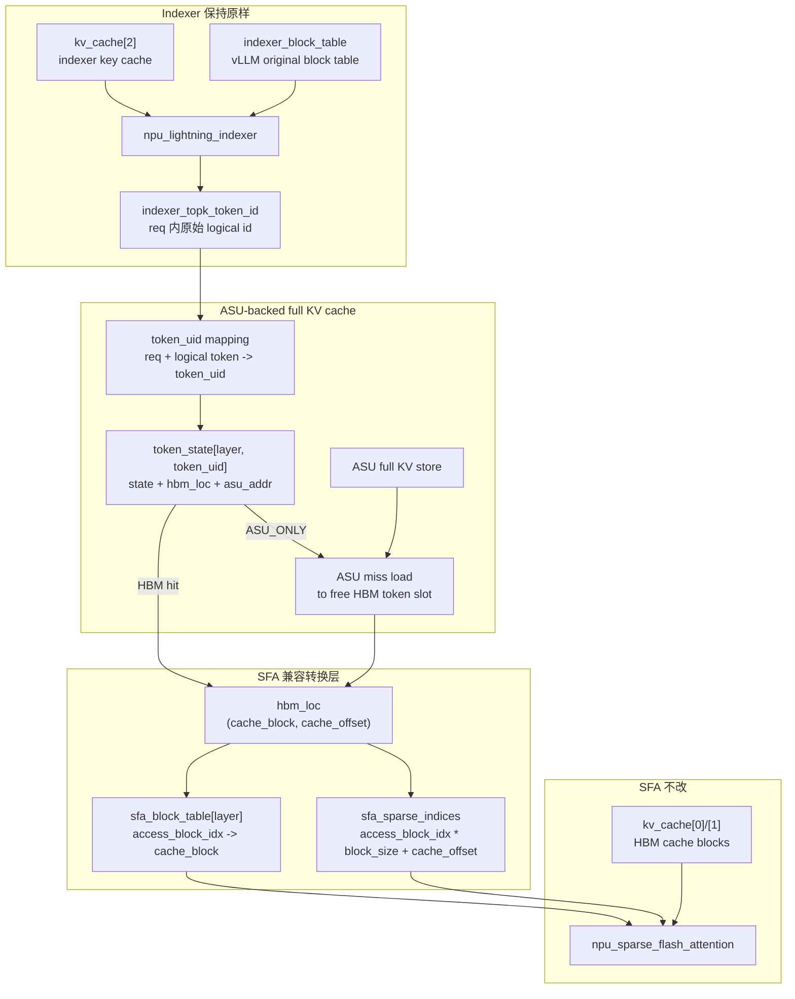
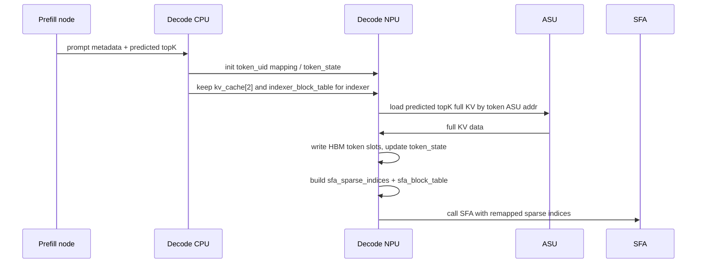
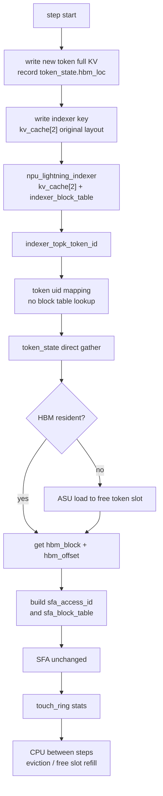
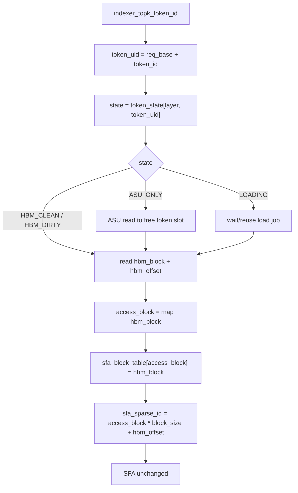
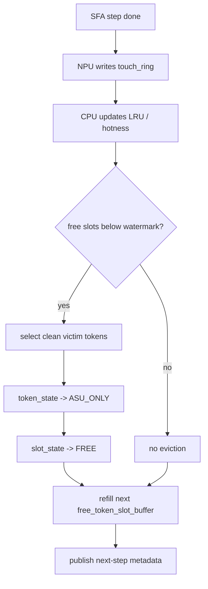
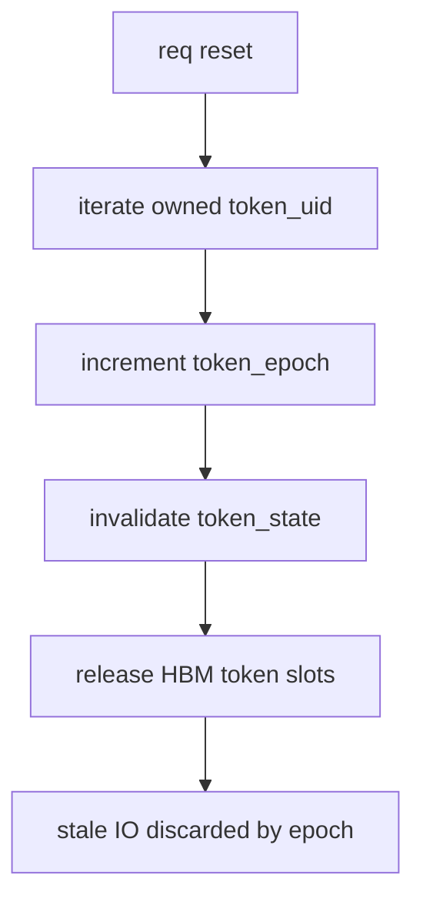

# 基于 token 状态直查的 ASU-backed Decode KVCache 管理设计草稿

本文重写此前关于 HBM KVCache 管理的设计草稿。

当前结论是：

```text
Indexer 不改:
  kv_cache[2] 继续使用 vLLM block table 和 PA_BSND HBM block layout。
  Lightning Indexer 输出原始 req 内 logical token id。

SFA 不改:
  npu_sparse_flash_attention 继续通过 sparse_indices + block_table 生成 KV 地址。

Full KV 管理改:
  kv_cache[0]/[1] 的 HBM 缓存不再要求按原始 vLLM block layout 编排。
  cache state 直接按 token 记录，并直接给出该 token 当前所在的 HBM block + offset。
  SFA 前把 token 的真实 HBM 坐标转换成 SFA 可寻址的临时 logical id。
```

核心边界：

```text
cache lookup 不经过 indexer block table。

indexer_topk_token_id
  -> token_uid
  -> token_state[layer, token_uid]
  -> hbm_loc = (hbm_block_id, hbm_offset) 或 ASU miss
  -> sfa_access_id = sfa_access_block_idx * block_size + hbm_offset
  -> SFA 使用 sfa_sparse_indices + sfa_block_table 访存
```

这里的 `sfa_access_id` 是 SFA 兼容层的临时寻址 id，不是原始序列 logical token id。原始 topK id 只作为 cache lookup 的输入和统计/维护的 token 身份。

## 1. 目标与约束

### 1.1 目标

1. 在 Ascend 910B 单卡约 64 GB HBM 限制下，降低 decode 节点 full KV 常驻 HBM 量。
2. 在相同 HBM 限制下提高并发能力，当前目标约 50 req，可按模型、topK、seq len、SLA 调整。
3. HBM hit rate 目标约 95%。
4. HBM miss 时由 NPU 通过参数面直接从 ASU 读取 full KV，并在 SFA 调用前放入 SFA 可访问的 HBM cache slot。

### 1.2 非目标

1. 不重写 Lightning Indexer。
2. 不把 `kv_cache[2]` 改成 ASU-backed token cache。
3. 不改 `npu_sparse_flash_attention` 的访存接口。
4. 不在 NPU step 内执行 victim 选择、LRU 链表维护、复杂 free list 遍历。

### 1.3 必须区分的三个 id

| 名称 | 含义 | 使用者 |
| --- | --- | --- |
| `indexer_token_id` | indexer 输出的原始 req 内 logical token position | cache lookup 输入 |
| `token_uid` | cache manager 使用的全局 token 身份 | token state / ASU addr / hotness |
| `sfa_access_id` | SFA 兼容层生成的临时 logical id | SFA sparse_indices |

关系：

```text
indexer_token_id -> token_uid:
  只做 token 身份映射，不走 block table。

token_uid -> hbm block + offset:
  直接查 token_state。

hbm block + offset -> sfa_access_id:
  根据 SFA 地址生成逻辑构造临时 id。
```

## 2. 当前代码事实

### 2.1 indexer key cache 与 full attention KV 是两套数据

当前 Ascend SFA 路径中，indexer key 的生成路径是：

```python
k_proj, _ = self.wk(x)
k = self.k_norm(k_proj)
q, k = rope_forward_triton(...)
```

随后写入：

```python
torch_npu.npu_scatter_nd_update_(
    kv_cache[2].view(-1, k.shape[-1]),
    attn_metadata.slot_mapping.view(-1, 1),
    k.view(-1, k.shape[-1])
)
```

Lightning Indexer 调用：

```python
topk_indices = torch.ops._C_ascend.npu_lightning_indexer(
    query=q,
    key=kv_cache[2],
    weights=weights,
    actual_seq_lengths_query=actual_seq_lengths_query,
    actual_seq_lengths_key=actual_seq_lengths_key,
    block_table=attn_metadata.block_tables,
    layout_query="TND",
    layout_key="PA_BSND",
    sparse_count=2048,
    sparse_mode=3,
)
```

SFA 当前调用：

```python
attn_output = torch.ops._C_ascend.npu_sparse_flash_attention(
    query=ql_nope,
    key=kv_cache[0],
    value=kv_cache[0],
    sparse_indices=topk_indices,
    block_table=attn_metadata.block_tables,
    key_rope=kv_cache[1],
    layout_kv="PA_BSND",
)
```

本设计中，SFA 调用要改为：

```python
attn_output = torch.ops._C_ascend.npu_sparse_flash_attention(
    query=ql_nope,
    key=kv_cache[0],
    value=kv_cache[0],
    sparse_indices=sfa_sparse_indices,
    block_table=attn_metadata.sfa_block_tables[layer],
    key_rope=kv_cache[1],
    layout_kv="PA_BSND",
)
```

SFA operator 本身不改，但传入的 `sparse_indices` 和 `block_table` 变成 SFA 兼容层生成的临时寻址视图。

### 2.2 为什么 cache lookup 不应过 indexer block table

Lightning Indexer 输出的是 req 内 logical token position。这个 position 对 indexer 是正确的，因为 `kv_cache[2]` 仍按 vLLM block table 布局。

但 full KV cache 不按原始 vLLM block 编排时，下面这条路径就不应成为 cache lookup 主路径：

```text
logical token id
  -> logical block + original offset
  -> indexer_block_table
  -> original kv_block_id + offset
  -> cache state
```

正确路径是：

```text
logical token id
  -> token_uid
  -> token_state[layer, token_uid]
  -> current hbm block + current hbm offset
```

原因：

1. full KV 的 HBM cache 可能是 token 粒度重排，不等于原始 vLLM block。
2. token 可能从 ASU restore 到任意 cache block/offset。
3. 同一个 cache block 可以承载来自不同 req 或不同原始 logical block 的 token。
4. `indexer_block_table` 只保证 `kv_cache[2]` 的地址语义，不保证 `kv_cache[0]/[1]` 的 cache 编排。

## 3. 总体架构

### 3.1 数据流



### 3.2 SFA 寻址公式

SFA 的地址生成逻辑可以抽象为：

```text
logical_block_idx = sparse_index / block_size
block_offset = sparse_index % block_size
physical_block = block_table[req, logical_block_idx]
addr = kv_cache[physical_block, block_offset]
```

因此，假设 cache state 查到某个 token 当前位于：

```text
hbm_block_id = 700
hbm_offset = 13
```

SFA 兼容层只需要为它分配一个临时 access block：

```text
sfa_access_block_idx = 5
sfa_block_table[layer, req, 5] = 700
sfa_access_id = 5 * block_size + 13
```

传给 SFA 后，SFA 会按原有逻辑读到：

```text
kv_cache[sfa_block_table[req, 5], 13]
  = kv_cache[700, 13]
```

这就是“查 state 直接得到 block/offset，再按 SFA 寻址逻辑转换成 logical id”。

### 3.3 SFA 兼容层的本质

```text
cache manager 的核心索引:
  token_uid -> hbm block + offset

SFA 兼容层:
  hbm block + offset -> sfa_access_id + sfa_block_table
```

`sfa_access_id` 不是原始序列位置，只是为了让未改造的 SFA 地址生成器读到正确 HBM 位置。

因此 `sfa_block_table[layer]` 是一张临时访问表，而不是原始序列 block table：

```text
原始 block table:
  indexer 使用。
  覆盖原始上下文 logical blocks。

SFA access block table:
  SFA 使用。
  覆盖本 step topK 实际落到的 HBM cache blocks。
  列数至少需要容纳 unique(topK hbm_block_id)。
```

如果 SFA kernel 会检查 `actual_seq_lengths_key` 或 block table 有效长度，则需要把 SFA 的 key length 视为 access namespace 的长度：

```text
sfa_access_seq_len = sfa_access_block_count * block_size
```

这属于 SFA 兼容层 metadata，不改变原始请求的 seq len，也不改变 indexer 的输入。

## 4. 核心数据结构

### 4.1 token 身份映射

推荐第一版使用连续 token uid：

```text
token_uid = req_token_base[req] + indexer_token_id
```

如果 req 的 token id 不方便保证连续，也可以用 dense table：

```text
token_uid = token_uid_table[req, indexer_token_id]
```

两种方式都不需要查询 `indexer_block_table`。

### 4.2 token state

主索引：

```text
token_state[layer, token_uid]
```

建议结构：

| 字段 | 粒度 | 含义 |
| --- | --- | --- |
| `state` | token | `HBM_DIRTY` / `HBM_CLEAN` / `ASU_ONLY` / `LOADING` / `INVALID` |
| `hbm_block_id` | token | token 当前所在 HBM cache block |
| `hbm_offset` | token | token 当前所在 HBM cache block 内 offset |
| `asu_addr` | token | token full KV 在 ASU 中的地址 |
| `token_epoch` | token | 防止 token uid 复用后的 stale IO |
| `req_id` | token | 所属请求，用于 reset 和统计 |
| `logical_token_id` | token | req 内原始 token id，用于 touch 回报和调试 |

状态定义：

| 状态 | 含义 | SFA 前处理 |
| --- | --- | --- |
| `HBM_DIRTY` | full KV 已在 HBM cache slot，但 ASU 副本未完成 | 可用于本 step SFA，不可淘汰 |
| `HBM_CLEAN` | full KV 已在 HBM cache slot，ASU 副本已完成 | 可用于 SFA，可被 CPU 淘汰 |
| `ASU_ONLY` | full KV 只在 ASU，HBM slot 无效 | NPU miss load 到 free token slot |
| `LOADING(job)` | ASU -> HBM token slot 正在进行 | 等待或复用 inflight job |
| `INVALID` | token 不存在或 uid 已释放 | 不可访问 |

### 4.3 HBM cache slot pool

由于 cache 不按原始 vLLM block 编排，HBM pool 是统一 token slot pool：

```text
hbm_token_slot = (hbm_block_id, hbm_offset)
```

NPU step 内不遍历 free list。CPU 在 step 间准备连续数组：

```text
free_token_slot_buffer[layer][i] = (hbm_block_id, hbm_offset)
```

NPU miss path 只做：

```text
slot = free_token_slot_buffer[layer][atomic_inc(free_slot_cursor)]
```

这不是链表，也不是 NPU 上的 victim 选择。

辅助结构：

| 数据结构 | 粒度 | 位置 | 作用 |
| --- | --- | --- | --- |
| `token_state[layer, token_uid]` | token | NPU GM / Host mirror | 主索引 |
| `free_token_slot_buffer[layer]` | token slot | NPU GM | 下一 step 可用 HBM token slots |
| `slot_owner_token[layer, hbm_block_id, offset]` | token slot | NPU GM / Host mirror | HBM slot 当前属于哪个 token |
| `slot_state[layer, hbm_block_id, offset]` | token slot | NPU GM / Host mirror | FREE / RESIDENT / LOADING / PROTECTED |
| `load_job_table[layer]` | IO job | NPU GM | ASU -> HBM token slot |
| `touch_ring[layer]` | event | NPU GM -> CPU | NPU 上报 topK touch/hit/miss |
| `cache_stats[layer]` | stats | NPU GM / Host readable | hit rate、miss、load latency |

### 4.4 SFA 兼容层 scratch

每个 layer、每个 step 生成一份 SFA 临时视图：

| 数据结构 | 粒度 | 作用 |
| --- | --- | --- |
| `sfa_block_table[layer, req, access_block_idx]` | SFA access block | 将临时 logical block 映射到真实 HBM cache block |
| `sfa_sparse_indices[layer, req, topk_i]` | topK token | 传给 SFA 的临时 sparse index |
| `sfa_access_block_map[layer, req, hbm_block_id]` | HBM block | 同一个 HBM block 复用同一个 access block idx |
| `sfa_access_block_count[layer, req]` | req | 当前 req 使用了多少 access block |
| `sfa_access_seq_len[layer, req]` | req | 若 SFA 检查 key length，传入 access namespace 长度 |

`sfa_access_block_map` 的实现可以有两种：

```text
cache block 数量不大:
  使用 dense marker array。
  查 hbm_block_id -> access_block_idx 是 O(1)。

cache block 数量较大:
  对本 step topK 的 hbm_block_id 做局部 group-by / sort。
  只处理 topK 覆盖到的 blocks。
```

第一版推荐 dense marker array 或固定大小 open-address table，避免 NPU 上链表和全局扫描。

## 5. Decode 流程

### 5.1 第一轮 decode



初始化规则：

```text
prompt 历史 token:
  token_state = ASU_ONLY。
  token_state.asu_addr 指向 ASU full KV。

prefill predicted topK:
  decode 节点在第一轮 SFA 前 load 到 HBM token slots。
  token_state = HBM_CLEAN。

new decode token:
  按原有 vLLM 写入当前可用 HBM slot。
  token_state = HBM_DIRTY。
  同时写入 ASU，完成后变成 HBM_CLEAN。
```

### 5.2 后续 decode step



NPU step 内只做：

```text
1. indexer 输出 indexer_topk_token_id。
2. token_uid = req_token_base + indexer_topk_token_id。
3. 直接查 token_state[layer, token_uid]。
4. HBM hit: 取 hbm_block_id + hbm_offset。
5. ASU miss: 从 free_token_slot_buffer 取 slot，ASU read 到该 slot，更新 token_state。
6. 将 hbm_block_id + hbm_offset 转成 sfa_access_id。
7. 调用未改造的 SFA。
```

NPU step 内不做：

```text
通过 indexer_block_table 查询 full KV state
victim 选择
LRU 链表维护
free list 链表遍历
dirty token 淘汰
```

## 6. SFA 前 token id 转换

### 6.1 输入输出

输入：

```text
indexer_topk_indices[req, k]       # indexer 输出的原始 logical token id
req_token_base[req] 或 token_uid_table
token_state[layer, token_uid]
free_token_slot_buffer[layer]
```

输出：

```text
sfa_sparse_indices[layer, req, k]       # SFA 使用的临时 logical id
sfa_block_table[layer, req, access_blk] # SFA 使用的临时 block table
kv_cache[0]/[1][hbm_block, hbm_offset]  # topK token full KV 已在此处
```

### 6.2 单个 token 的转换

```text
indexer_token_id = indexer_topk_indices[req, i]
token_uid = req_token_base[req] + indexer_token_id
state = token_state[layer, token_uid]
```

如果 HBM hit：

```text
hbm_block_id = state.hbm_block_id
hbm_offset = state.hbm_offset
```

如果 ASU miss：

```text
slot = allocate_from_free_token_slot_buffer()
asu_read(state.asu_addr, kv_cache[0]/[1][slot.block, slot.offset])

token_state[layer, token_uid].state = HBM_CLEAN
token_state[layer, token_uid].hbm_block_id = slot.block
token_state[layer, token_uid].hbm_offset = slot.offset

hbm_block_id = slot.block
hbm_offset = slot.offset
```

然后转换成 SFA access id：

```text
access_block_idx = get_or_create_sfa_access_block(req, hbm_block_id)
sfa_block_table[layer, req, access_block_idx] = hbm_block_id
sfa_sparse_indices[layer, req, i] = access_block_idx * block_size + hbm_offset
```

### 6.3 示例

假设：

```text
block_size = 16
indexer 输出 token 1234
token_uid = req_token_base[req] + 1234
token_state 查到:
  hbm_block_id = 700
  hbm_offset = 13
```

SFA 兼容层分配：

```text
access_block_idx = 5
sfa_block_table[layer, req, 5] = 700
sfa_sparse_indices[layer, req, i] = 5 * 16 + 13 = 93
```

SFA 内部访存：

```text
logical_block = 93 / 16 = 5
offset = 93 % 16 = 13
physical_block = sfa_block_table[layer, req, 5] = 700
read kv_cache[0]/[1][700, 13]
```

这会读到 token 1234 当前所在的真实 HBM 位置。

### 6.4 批量转换伪代码

```text
clear_sfa_access_scratch(req)

for i in 0..topk-1:
    indexer_token = indexer_topk_indices[req, i]
    token_uid = map_to_token_uid(req, indexer_token)
    state = token_state[layer, token_uid]

    if state is HBM_DIRTY or HBM_CLEAN:
        hbm_block = state.hbm_block_id
        hbm_offset = state.hbm_offset

    elif state is LOADING(job):
        wait_or_reuse(job)
        hbm_block = token_state[layer, token_uid].hbm_block_id
        hbm_offset = token_state[layer, token_uid].hbm_offset

    elif state is ASU_ONLY:
        slot = pop(free_token_slot_buffer[layer])
        enqueue_asu_read(state.asu_addr, kv_cache[0]/[1][slot.block, slot.offset])
        wait_or_pipeline_load()
        token_state[layer, token_uid] = HBM_CLEAN(slot.block, slot.offset, state.asu_addr)
        hbm_block = slot.block
        hbm_offset = slot.offset

    else:
        raise invalid_token

    access_block = get_or_create_access_block(req, hbm_block)
    sfa_block_table[layer, req, access_block] = hbm_block
    sfa_sparse_indices[layer, req, i] = access_block * block_size + hbm_offset

    write_touch_ring(token_uid, state, hbm_block, hbm_offset)

npu_sparse_flash_attention(
    sparse_indices=sfa_sparse_indices[layer, req],
    block_table=sfa_block_table[layer, req],
    actual_seq_lengths_key=sfa_access_seq_len[layer, req],
    key=kv_cache[0],
    value=kv_cache[0],
    key_rope=kv_cache[1],
)
```

### 6.5 需要验证的 SFA 语义

这个方案成立的关键前提是：

```text
SFA 使用 sparse_indices 主要做 KV 地址生成；
不会把 sparse_indices 当作原始绝对位置参与额外语义计算。
```

如果 SFA 内部还用 sparse_indices 做 causal mask、绝对位置判断或其他位置相关逻辑，则需要额外验证：

1. decode 场景下 topK 已由 indexer 保证是合法历史 token。
2. remapped `sfa_sparse_indices` 是否会被 SFA 的 mask 逻辑错误过滤。
3. 是否需要同时调整传入 SFA 的 `actual_seq_lengths_key` 或使用单独 access seq length。

这是必须做的 NPU 对拍项，不能只靠文档假设。

## 7. 新生成 token 管理

### 7.1 写入路径

新生成 token 仍然按 vLLM 现有流程写 indexer key：

```text
kv_cache[2][original_vllm_block, original_offset] = indexer key
indexer_block_table 继续保持原有语义
```

full KV 则写入当前 full-KV HBM cache slot，并记录到 token state：

```text
token_uid = req_token_base[req] + new_logical_token_id
slot = allocate_new_token_slot()

kv_cache[0]/[1][slot.block, slot.offset] = new full KV

token_state[layer, token_uid].state = HBM_DIRTY
token_state[layer, token_uid].hbm_block_id = slot.block
token_state[layer, token_uid].hbm_offset = slot.offset
token_state[layer, token_uid].asu_addr = token_asu_addr
```

ASU write 完成后：

```text
token_state[layer, token_uid].state = HBM_CLEAN
```

### 7.2 如果 topK 中包含新生成 token

后续 step 如果 indexer topK 中包含新生成 token：

```text
indexer_token_id -> token_uid
token_state 直接查到该 token 的 hbm_block + hbm_offset
SFA 兼容层把 hbm_block + hbm_offset 转成 sfa_access_id
SFA 从 kv_cache[0]/[1][hbm_block, hbm_offset] 读取
```

新 token 不需要走原始 vLLM block table 来定位 full KV。

### 7.3 新 token 什么时候可淘汰

```text
HBM_DIRTY:
  ASU 副本未完成，禁止淘汰。

HBM_CLEAN:
  ASU 副本完成，CPU 可在 step 间根据策略淘汰为 ASU_ONLY。
```

淘汰后：

```text
token_state.state = ASU_ONLY
token_state.hbm_block_id = INVALID
token_state.hbm_offset = INVALID
slot_state[old_slot] = FREE
old_slot 写入 next-step free_token_slot_buffer
```

## 8. 淘汰机制

### 8.1 职责划分

淘汰逻辑全部放在 CPU step 间：

```text
CPU:
  消费 touch_ring。
  更新 hotness / LRU / req quota。
  选择 victim token。
  修改 token_state 和 slot_state。
  准备下一 step 的 free_token_slot_buffer。

NPU:
  只消费当前 step 的 token_state snapshot。
  HBM miss 时只从 free_token_slot_buffer 取 slot。
  不做 victim 选择。
```

### 8.2 淘汰对象

淘汰对象是 token，不是 vLLM 原始 block：

```text
victim = token_uid
require token_state[layer, token_uid].state == HBM_CLEAN

old_slot = (hbm_block_id, hbm_offset)
token_state[layer, token_uid].state = ASU_ONLY
token_state[layer, token_uid].hbm_block_id = INVALID
token_state[layer, token_uid].hbm_offset = INVALID
slot_owner_token[layer, old_slot] = INVALID
slot_state[layer, old_slot] = FREE
append old_slot to next free_token_slot_buffer
```

因为 full KV cache 是 token 粒度重排，物理 HBM block 可以部分空洞；是否做 block-level compaction 是后续优化，不是第一版必要条件。

### 8.3 CPU-only LRU baseline

CPU 维护：

```text
last_touch_step[layer, token_uid]
resident_lru[layer]
protected_until_step[layer, token_uid]
```

流程：

```text
1. NPU 写 touch_ring(token_uid, hit/miss, hbm_loc)。
2. CPU 消费 touch_ring，把 touched token 移到 LRU hot end。
3. free_token_slot_buffer 低于 watermark 时，从 LRU cold end 选 victim。
4. 跳过 HBM_DIRTY、当前 step topK、tail protected token。
5. 对 HBM_CLEAN victim 执行 token eviction。
6. 生成下一 step free_token_slot_buffer。
```

优点：

```text
容易实现。
容易作为 baseline 评估 hit rate。
NPU 不维护链表。
```

缺点：

```text
CPU metadata 更新量可能大。
纯 LRU 不理解 DSA topK 的周期性和 req 间公平性。
```

### 8.4 Score/Watermark 方案

在 LRU baseline 基础上，CPU 可以升级为 score 策略：

```text
score(token) =
    w_touch * recent_touch_count
  - w_age   * age_since_last_touch
  + w_tail  * is_tail_token
  - w_quota * req_over_quota
```

优先级：

| 优先级 | 对象 | 操作 |
| --- | --- | --- |
| P0 | 当前 step topK token | 保护 |
| P1 | `HBM_DIRTY` token | 保护，等待 ASU write |
| P2 | recent tail token | 保护，避免新 token 反复 miss |
| P3 | 高频 topK token | 保留 |
| P4 | paused req / over-quota req 的 clean token | 优先淘汰 |
| P5 | cold `HBM_CLEAN` token | 淘汰为 `ASU_ONLY` |

### 8.5 free token slot 不够时

NPU step 内不做 emergency eviction。free token slot 不够时：

| 方式 | 行为 | 适用 |
| --- | --- | --- |
| watermark | CPU 提前准备足够 free slots | 默认 |
| host slow path | NPU 上报不足，host 同步 refill 后重放 | 功能兜底 |
| admission control | 降低并发或 topK restore 预算 | SLA 保护 |

第一版推荐：

```text
free_token_slot_buffer >= expected_miss_tokens + reserve_margin
```

## 9. 请求变化时的维护

### 9.1 req init

```text
1. vLLM 初始化 indexer_block_table，供 kv_cache[2] / indexer 使用。
2. cache manager 分配 req_token_base 或 token_uid_table。
3. prompt 历史 token 初始化:
     token_state.state = ASU_ONLY
     token_state.asu_addr = ASU full KV address
     token_state.logical_token_id = req 内 logical position
4. predicted topK 可提前 load 到 HBM token slots，state = HBM_CLEAN。
```

### 9.2 req append token

```text
1. vLLM append token，更新 seq_len 和 indexer block table。
2. 写 kv_cache[2] indexer key，保持原始布局。
3. full KV 写入 full-KV HBM cache slot。
4. token_state = HBM_DIRTY。
5. 发起 ASU write。
6. ASU write 完成后 token_state = HBM_CLEAN。
```

### 9.3 req finish / abort / reset

```text
for each token_uid owned by req:
    token_epoch[token_uid] += 1

    if token_state is HBM_DIRTY:
        wait ASU write or mark inflight IO stale by epoch

    if token_state has valid hbm slot:
        slot_state[slot] = FREE
        slot_owner_token[slot] = INVALID
        append slot to next free_token_slot_buffer

    token_state = INVALID
```

所有 inflight ASU IO 完成时必须校验 token epoch：

```text
if job.token_epoch != token_epoch[token_uid]:
    discard stale job
```

### 9.4 req pause / resume

pause：

```text
HBM_DIRTY 等待 ASU write 完成。
HBM_CLEAN 可被 CPU 优先淘汰。
kv_cache[2] 的处理继续遵循 vLLM 现有策略。
```

resume：

```text
token_state 默认可从 ASU_ONLY 恢复。
下一轮 indexer topK 输出后按正常 token lookup + ASU load 流程恢复。
```

## 10. 查询、转换、维护流程图

### 10.1 查询与转换



### 10.2 CPU 维护



### 10.3 reset



## 11. HBM 命中率目标

### 11.1 命中率定义

```text
HBM hit token:
  token_state is HBM_CLEAN or HBM_DIRTY at lookup time。

HBM miss token:
  token_state is ASU_ONLY and this step requires ASU read。

hit_rate = hit_tokens / total_topK_tokens
```

### 11.2 95% hit rate 的策略来源

1. 第一轮 decode 使用 prefill predicted topK 预取。
2. recent tail token 默认保护。
3. miss 后恢复的 token 至少保护若干 step，避免刚 load 就淘汰。
4. 高频 topK token 提高 hotness。
5. paused req / over-quota req 的 clean token 优先淘汰。

需要用 trace 校准：

```text
tail_protect_window
miss_protect_window
free_slot_watermark
per_req_hbm_quota
LRU window
score weights
predicted topK prefetch count
```

## 12. Ascend NPU 压力评估

### 12.1 NPU step 内新增压力

| 项 | 压力来源 | 说明 |
| --- | --- | --- |
| token state lookup | `topK` token 的 `token_uid -> token_state` dense gather | 不经过 indexer block table |
| ASU read | miss token full KV 读取 | 由 hit rate 决定，目标 <= 5% token miss |
| HBM write | ASU miss 写入 free token slot | token 粒度，地址来自 free buffer |
| SFA id remap | `(hbm_block, offset) -> sfa_access_id` | 需要 access block map |
| sfa_block_table patch | 每个 touched HBM block 一个 entry | 与 topK 覆盖的 HBM block 数相关 |
| touch_ring write | token_uid/hit/miss/hbm_loc event | 连续 ring buffer |

### 12.2 对 NPU 友好的约束

```text
不用链表。
不用 NPU 维护 LRU。
不用 NPU 扫描 victim。
不用 indexer_block_table 查 full KV state。
free_token_slot_buffer 是 CPU 准备好的连续数组。
token_state 是 dense array。
sfa_access_block_map 使用 dense marker 或 topK 局部 group-by。
```

### 12.3 随机访问不可完全消除

不可避免的随机性来自：

```text
indexer topK token id 本身离散。
token_state[layer, token_uid] gather 离散。
ASU miss token 地址离散。
HBM token slot 地址离散。
```

本设计降低的是额外 metadata 复杂度：

```text
不再 logical token -> block table -> block/offset -> state。
不在 NPU 上扫 free list 或 victim。
不让 SFA 理解多套 source type。
```

### 12.4 当前 `hbm_lookup_update` 350 us 问题

50 req、query length 2K 下单算子 350 us，说明 metadata path 已经很重。新的查询路径应按以下原则实现：

```text
1. token_uid 尽量用 req_base + token_id，避免 token_uid_table 二次 gather。
2. token_state 尽量结构化压缩，hit path 一次读出 state + hbm block + offset。
3. ASU miss path 与 hit path 分离，hit token 不进入复杂分支。
4. sfa_access_block_map 避免全局扫描。
5. eviction 完全 CPU-only。
```

## 13. 与 vLLM 集成点

### 13.1 Python/调度层

新增：

```text
ASUFullKVCacheManager
  token_uid 分配
  token_state 管理
  ASU address 管理
  HBM token slot pool
  CPU eviction
```

`attn_metadata` 扩展：

```text
indexer_block_table              # 继续给 indexer
sfa_block_tables[layer]          # 给 SFA
sfa_sparse_indices[layer]        # 给 SFA
sfa_access_seq_lens[layer]       # 若 SFA 需要 key length 检查，给 SFA
token_state pointers
free_token_slot_buffer pointers
touch_ring pointers
```

Indexer 使用：

```python
block_table=attn_metadata.block_tables
```

SFA 使用：

```python
sparse_indices=attn_metadata.sfa_sparse_indices[layer]
block_table=attn_metadata.sfa_block_tables[layer]
actual_seq_lengths_key=attn_metadata.sfa_access_seq_lens[layer]
```

### 13.2 NPU custom op

需要新增 SFA 前置 op：

```text
asu_lookup_load_and_remap_for_sfa(
    indexer_topk_indices,
    req_token_base_or_uid_table,
    token_state,
    free_token_slot_buffer,
    kv_cache_0,
    kv_cache_1,
    sfa_block_table,
    sfa_sparse_indices,
    sfa_access_block_map,
    sfa_access_seq_lens,
    load_job_table,
    touch_ring,
)
```

职责：

```text
1. indexer token id -> token_uid。
2. token_state direct lookup。
3. HBM hit 读取 hbm block + offset。
4. ASU miss load 到 free token slot。
5. hbm block + offset -> sfa_access_id。
6. 生成 sfa_sparse_indices 和 sfa_block_table。
7. 如果 SFA 需要长度检查，生成 sfa_access_seq_lens。
```

不负责：

```text
victim 选择
LRU 更新
free slot victim refill
indexer key cache 管理
SFA 算子内部修改
```

### 13.3 CPU manager

CPU manager 在 step 间执行：

```text
consume_touch_ring()
update_hotness_or_lru()
evict_clean_tokens()
refill_free_token_slot_buffer()
publish_metadata_snapshot()
```

## 14. 内存预算模型

HBM 常驻内容：

```text
必留:
  model weights
  activations / workspace
  kv_cache[2] indexer key cache
  token_state / slot metadata

可控:
  kv_cache[0]/[1] full-KV HBM token slots
```

Full KV HBM 预算：

```text
full_kv_hbm =
    hbm_token_slot_count * per_token_full_kv_bytes
```

因为 full KV cache 已经是 token slot pool，不再按原始 vLLM block 粒度释放。物理上仍以 block-shaped tensor 承载，只是每个 `(block, offset)` 都是独立 token slot。

## 15. 风险与待验证项

| 风险 | 说明 | 验证方式 |
| --- | --- | --- |
| SFA sparse index 是否只用于寻址 | 如果 SFA 还把 sparse index 当原始绝对位置做 mask，remap 会影响语义 | NPU 对拍，检查 SFA kernel 语义 |
| `sfa_sparse_indices` 顺序要求 | SFA 可能要求 sparse indices 有序或满足某种 block 分组 | 构造乱序/排序对拍 |
| access seq length | remap 后的 access id 可能超出原始 seq_len | 验证 SFA 是否检查 actual seq len，必要时传 access seq len |
| token_uid 映射 | req append/reset 后 token_uid 不能错配 | epoch + reset 单测 |
| stale ASU IO | token uid 复用后旧 IO 写回 | token_epoch 校验 |
| hit rate 不达 95% | DSA topK 分布可能更散 | trace replay 调参 |
| NPU lookup 时延 | topK=2K、50 req 下 token_state gather 仍重 | profiler 分解 lookup/load/remap |

## 16. 当前结论

本版设计采用：

```text
1. kv_cache[2] 和 indexer_block_table 保持现状，只服务 Lightning Indexer。
2. indexer 输出的 topK logical token id 只用于映射 token_uid。
3. full KV cache state 按 token_uid 直接查询。
4. token_state 直接返回当前 HBM block + offset，或 ASU addr。
5. SFA 不改；SFA 前把 HBM block + offset 转换成 sfa_sparse_indices + sfa_block_table。
6. 淘汰和 free slot refill 全部由 CPU step 间完成。
```

关键变化：

```text
删除 cache lookup 对 indexer_block_table 的依赖。
删除按原始 vLLM block 管理 full KV residency 的假设。
保留 token 粒度 HBM cache pool。
用 sfa_access_id 把任意 token slot 转成 SFA 可读的 logical id。
```
