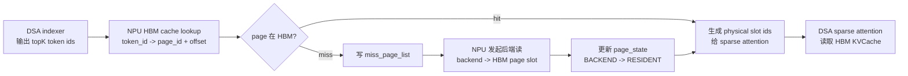
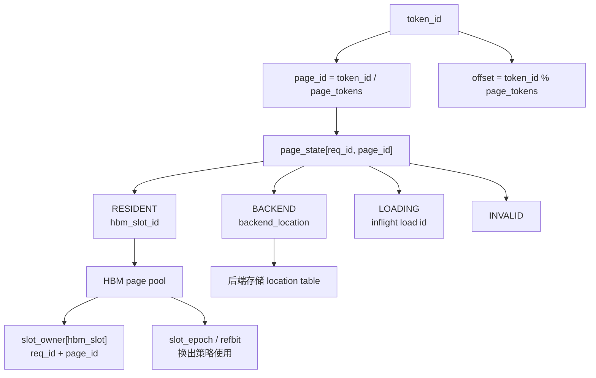
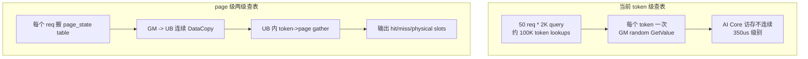
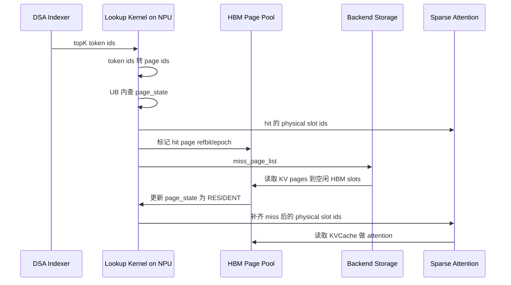
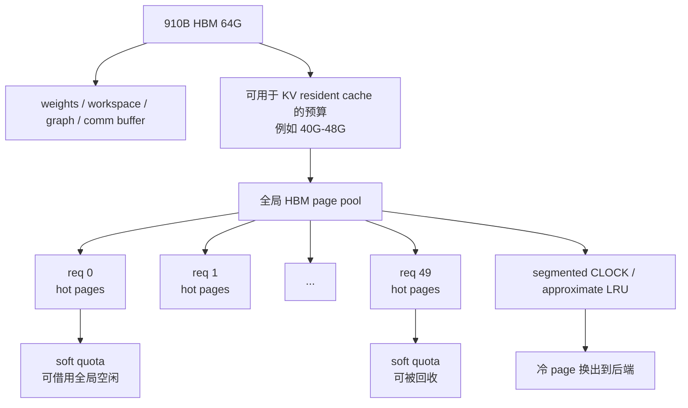

# NPU HBM KVCache 管理机制设计草稿

本文整理当前关于 vLLM + vLLM-Ascend 部署形态下，面向 DeepSeek V3/V3.2 类 DSA attention 的 NPU HBM KVCache 管理机制设计。该文档是草稿，重点描述管理机制、索引结构、换入换出策略和与 DSA indexer / sparse attention 的对接方式。

## 1. 背景与约束

目标是在 Ascend 910B 单卡 HBM 容量受限的情况下，提高 DeepSeek 类 DSA attention 的服务并发能力，同时尽量保持较高 HBM KVCache 命中率。

当前关键约束：

- 单张 Ascend 910B HBM 约 64G。
- HBM 还需要承载权重 shard、workspace、ACL graph、通信 buffer 等，不能全部用于 KVCache。
- 当前目标并发为 50，该目标可以随实际 miss 率、后端 IO 带宽和 HBM 预算动态调整。
- DSA indexer 输出 topK logical token id，典型 query 长度为 2K。
- `simu/hbm_lookup_update` 中 token 粒度 `table_states[req, token_id]` 独立 lookup，在 `50 req * 2K query` 下单算子约 350us，说明 token 粒度 GM random scalar lookup 不适合作为最终 hot path。

因此，设计目标不是让每个请求完整 KV 常驻 HBM，而是：

```text
所有活跃请求共享一个 HBM KV page pool。
每个请求只在 HBM 中保留 DSA 当前或近期高概率访问的 hot KV pages。
miss 的 KV page 由 NPU 发起从后端存储读入，并更新 HBM 索引。
```

## 2. 容量模型

DeepSeek MLA KVCache 的 per-token 成本大致为：

| KVCache 类型 | 估算成本 |
| --- | --- |
| DeepSeek V3.2 `fp8_ds_mla` | 656 B / token / layer |
| DeepSeek V4 fp8 MLA | 584 B / token / layer |
| BF16 MLA | 1152 B / token / layer |

若按 61 层、50 并发粗算：

| 可用于 KV 的 HBM | V3.2 fp8_ds_mla 可驻留 token / req | BF16 MLA 可驻留 token / req |
| --- | ---: | ---: |
| 64GiB | 约 34K | 约 19.5K |
| 48GiB | 约 25.8K | 约 14.7K |
| 40GiB | 约 21.5K | 约 12.2K |
| 32GiB | 约 17.2K | 约 9.8K |

如果目标上下文长度接近 128K，则 50 并发下 HBM 只能保存每个请求的一部分 KV。因此，缓存管理应围绕 working set，而不是完整上下文。

## 3. 总体架构

推荐把缓存层插入在 DSA indexer 输出之后、sparse attention 消费物理 KV slot 之前。



该架构有两个原则：

1. cache lookup / miss list / 状态更新尽量完全在 NPU 上完成。
2. sparse attention 只消费已解析好的 physical slot ids，不在 attention 主计算路径内承担复杂 cache 管理。

## 4. 缓存粒度

缓存对象定义为 logical KV page：

```text
cache key       = (req_id, logical_page_id)
logical_page_id = token_id / page_tokens
offset          = token_id % page_tokens
```

候选 page 粒度：

| page_tokens | 优点 | 问题 |
| --- | --- | --- |
| 64 / 128 | 容易对齐 vLLM block table 和现有 paged KVCache | DSA topK 稀疏访问时容量放大明显 |
| 16 | 容量放大较小，仍保持一定连续性 | 需要额外 micro-page 到物理 slot 的映射 |
| 8 | 更适合高并发和稀疏 topK | attention 侧最好支持 direct physical slot ids |

推荐方向：

- 原型集成可先用 64 或 128 token page，对齐现有 vLLM block。
- 面向 64G HBM + 50 并发的目标，最终应评估 8 或 16 token micro-page。

## 5. 核心数据结构

HBM 侧维护以下表：

```text
page_state[req_id, logical_page_id] -> int32 packed state
slot_owner[hbm_slot_id]             -> req_id + logical_page_id
slot_refbit[hbm_slot_id]            -> CLOCK / hot page 标记
slot_epoch[hbm_slot_id]             -> 最近访问 step 或版本号
backend_loc[req_id, logical_page_id]-> 后端存储位置
free_slot_queue                     -> 空闲 HBM page slot
miss_page_list                      -> 当前 step 需要换入的去重 page
```

`page_state` 是 hot path 的主索引。建议使用 packed int32：

```text
RESIDENT(slot_id)
BACKEND(backend_compact_id 或 marker)
LOADING(inflight_load_id)
INVALID
```

hot path 尽量只访问 `page_state`。`backend_loc` 只在 miss handling 中访问，避免 lookup kernel 每个 topK 条目携带较大状态。

核心索引关系如下：



## 6. Lookup Hot Path

当前 token 粒度 prototype 的问题是：

```text
50 req * 2K query = 约 100K token lookups
每个 token lookup 都是一次 data-dependent GM random scalar load
有效读取只有几百 KB，但耗时约 350us
```

新设计需要把访存模式改为连续 DataCopy + UB 内 gather。



lookup kernel 流程：

```text
for each req assigned to core group:
    CopyIn:
        DataCopy page_state[req, :] from GM to UB

    Compute:
        for topK token ids:
            page_id = token_id / page_tokens
            offset  = token_id % page_tokens
            state   = UB_page_state[page_id]

            if state is RESIDENT:
                physical_slot = slot_id * page_tokens + offset
                output physical_topk_indices
                set slot_refbit / update access metadata
            else:
                mark page_id in UB miss bitset
                output placeholder

    CopyOut:
        output physical_topk_indices
        output compact miss_page_list
```

示例容量：

```text
max_model_len = 128K
page_tokens   = 8
page_count    = 16K
page_state    = 16K * 4B = 64KB / req
50 req         = 3.2MB total page_state
```

单 req 的 page_state row 可按 tile 搬入 UB，避免 topK 每项随机读 GM。

## 7. Miss Handling 与换入

lookup 输出：

```text
physical_topk_indices
hit_mask
miss_page_list
```

miss handling 流程：



详细状态机：

```text
BACKEND -> LOADING -> RESIDENT
INVALID -> LOADING -> RESIDENT
RESIDENT -> BACKEND
LOADING -> BACKEND / INVALID  // load fail 或 request cancelled
```

要求：

- miss page 必须去重，避免同一 page 被重复加载。
- `LOADING` 状态必须存在，避免多个 query token 或多个 kernel 对同一 page 重复发起后端读。
- load 完成前，consumer 需要等待该 page 的 completion event 或在下一轮调度中重试。
- 如果 attention 必须同 step 完成，则 miss handling 需要在 attention 前完成；如果允许 pipeline，则可以把 miss page 放入下一 step 预取。

## 8. 换出策略

换出不放在 lookup hot path 里做，只在以下时机触发：

```text
free_slots < low_watermark
或者
current_miss_pages > free_slots
```

推荐使用 segmented CLOCK / approximate LRU：

```text
protected:
    当前 step attention 正在使用的 page
    LOADING page
    decode tail / sink / 特殊保留 page

hot:
    最近被 DSA 命中的 page，refbit = 1

cold:
    refbit = 0，可作为换出候选
```

换出流程：

```text
1. eviction kernel 扫描 slot_refbit / slot_epoch。
2. 跳过 protected / LOADING page。
3. 对 refbit=1 的 page 清零，给第二次机会。
4. 选择 refbit=0 的 cold page。
5. 若后端已有副本且 KV page clean，只更新 page_state 为 BACKEND。
6. 若 page dirty，则发起 HBM -> backend 写回，再更新 page_state。
7. 清理 slot_owner，将 slot 放回 free_slot_queue。
```

推理 KV 通常 append 后只读。对于已经成功落后端的历史 KV page，大多数换出可以视为 clean eviction，只需要更新索引。

## 9. 并发控制

并发 50 不应是固定硬门槛，而应作为目标值，由调度器根据 HBM resident budget 和 miss 压力动态调整。



admission control 建议：

```text
admit if:
    active_reqs <= target_concurrency
    and resident_pages <= HBM_budget
    and expected_miss_pages_this_step <= backend_io_budget
```

每个 request 设置 soft quota：

```text
req_soft_quota = HBM_page_budget / target_concurrency
```

但不要硬切 50 份。空闲 page 应允许被 hot request 借用；当其他 request 需要资源时，再通过 eviction 收回。

## 10. 与 vLLM / vLLM-Ascend 对接

推荐插入点：

```text
DSA indexer
    -> NPU cache lookup / miss load
    -> physical_topk_indices
    -> sparse attention
```

不推荐：

```text
DSA indexer
    -> 独立 token-level metadata lookup kernel
    -> sparse attention 内再次做 block_table / KV gather
```

原因是独立 lookup 无法和 KV gather、softmax、matmul pipeline 摊销随机 metadata 访问成本。现有 `hbm_lookup_update` 的 350us 已经说明这条路径风险很高。

更合理的集成方向：

1. 第一阶段：做 page-level lookup kernel，输出 physical_topk_indices 和 miss_page_list。
2. 第二阶段：把 lookup 与 SFA 的 MergeKv 阶段融合，让 resident KV gather 和 miss 检测共享同一轮 topK 遍历。
3. 第三阶段：加入 NPU 侧 backend load、eviction、prefetch，并把调度器的 admission control 与 HBM page budget 对齐。

## 11. 待验证参数

后续 prototype 需要重点验证：

- `page_tokens = 8 / 16 / 64 / 128` 的容量放大与 lookup latency。
- page_state 连续搬入 UB 后，50 req * 2K query 的 lookup 时间。
- miss_page_list 的 NPU 侧去重成本。
- eviction kernel 扫描 slot_refbit / epoch 的成本。
- 后端读 page 的延迟、带宽和并发度。
- hit rate 与 DSA topK 分布的关系。
- direct physical slot ids 是否能被当前 SFA 路径高效消费。
- 如果仍需保持 vLLM block_table 语义，micro-page 与 block_table 的兼容方式。

## 12. 当前设计结论

当前推荐设计为：

```text
NPU resident page-level KVCache manager
    + HBM global page pool
    + per-request page_state table
    + NPU-side lookup / miss list / load completion update
    + segmented CLOCK eviction
    + scheduler-side soft quota and admission control
```

该设计直接服务两个核心指标：

1. 相同 HBM 限制下支持更高并发：通过 page-level working set cache 避免完整 KV 常驻。
2. HBM 命中率尽量高：通过 DSA topK 访问反馈、refbit/epoch 和 request soft quota 保留 hot pages。

最关键的工程判断是：

```text
不要把 token 粒度 GM random scalar lookup 作为最终 hot path。
索引结构必须适配 Ascend NPU 的连续 DataCopy + UB 内计算模型。
```
