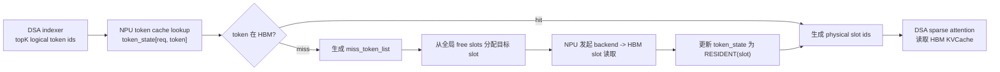
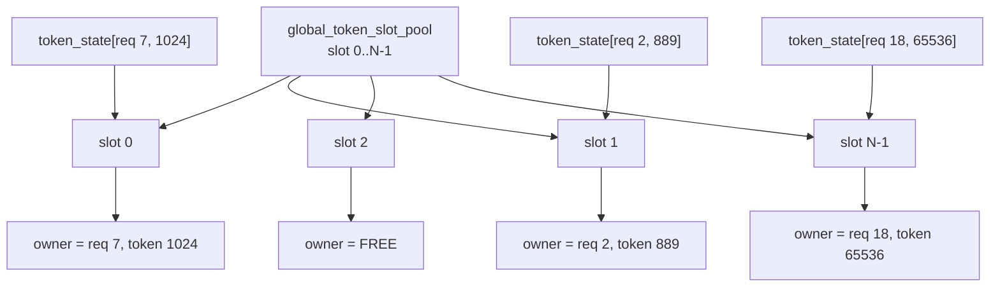
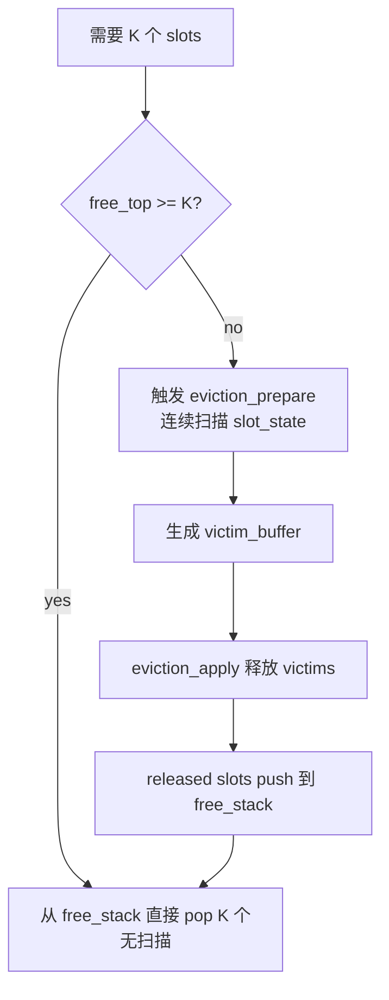
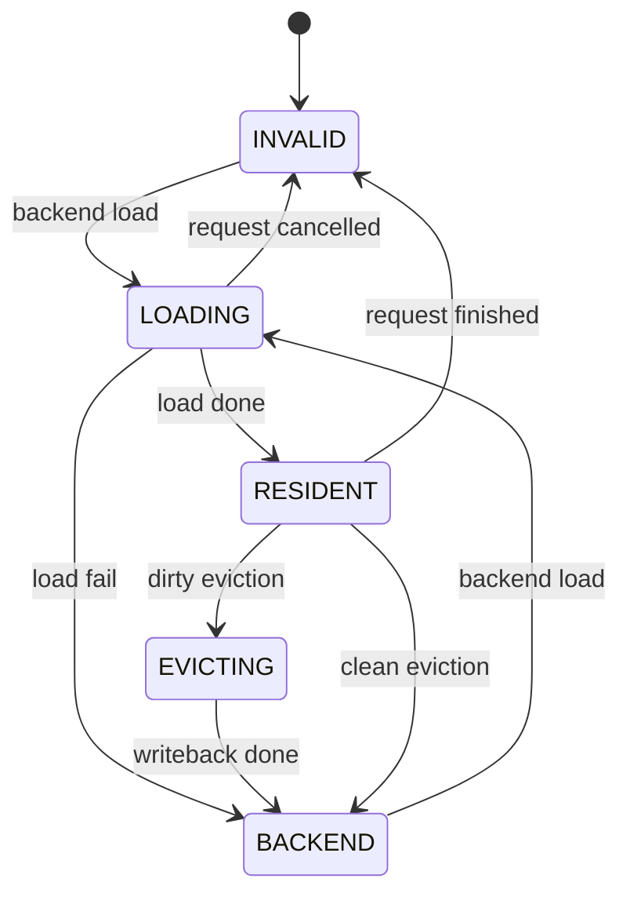
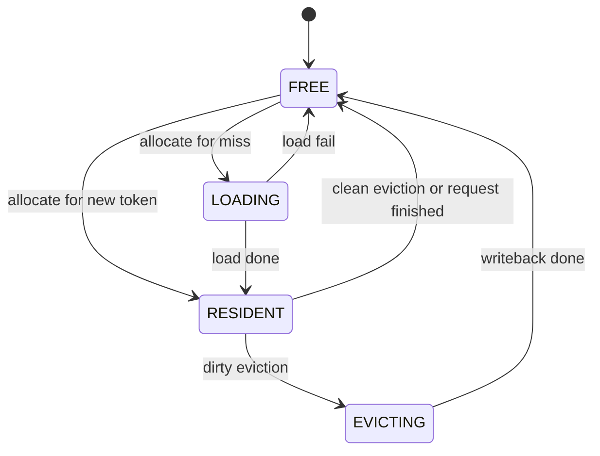
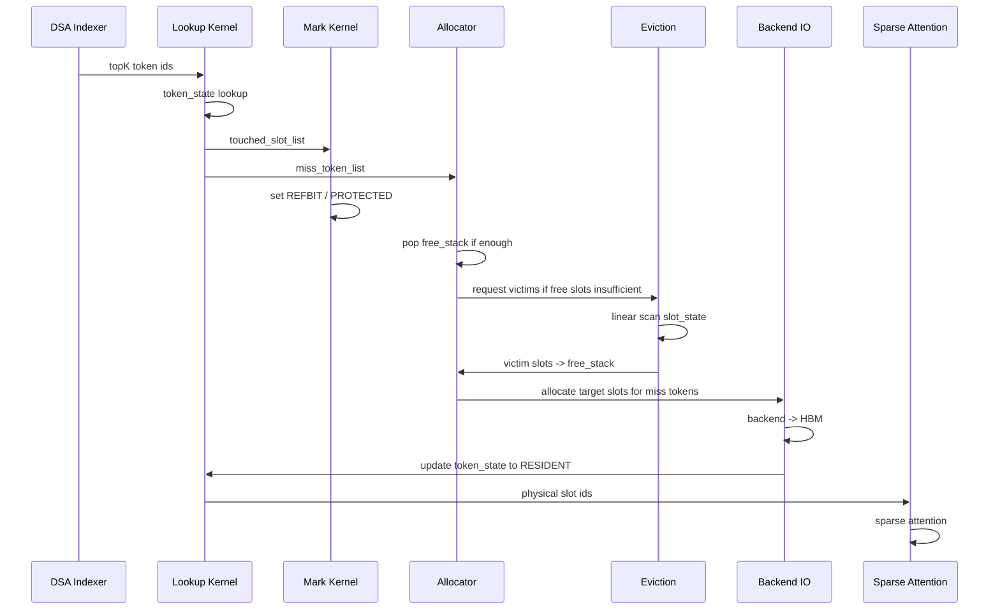

# NPU HBM Token 粒度 KVCache 管理机制设计草稿

本文整理当前关于 vLLM + vLLM-Ascend 部署形态下，面向 DeepSeek V3/V3.2 类 DSA attention 的 NPU HBM KVCache 管理机制设计。

当前设计口径已经调整为：

```text
token 粒度管理
+ 全局 HBM KVCache token slot pool
+ 每 req dense token_state 索引表
+ 数组栈 / 环形队列管理 free slots
+ 全局 CLOCK 连续扫描淘汰
+ per-req soft quota 防止单个请求占满 HBM
```

本文暂时不把 token 粒度索引查询时延作为核心约束。`simu/hbm_lookup_update` 中 `50 req * 2K query` 的 token lookup 约 350us，说明后续仍需要优化 lookup hot path；但本草稿先完善 token 粒度的缓存语义、空间管理、换入换出和 free slot 分配机制。

## 1. 背景与目标

目标是在 Ascend 910B 单卡 HBM 容量受限的情况下，提高 DeepSeek 类 DSA attention 的并发能力，同时尽量保持较高 HBM KVCache 命中率。

关键约束：

- 单张 Ascend 910B HBM 约 64G。
- HBM 还需要承载权重 shard、workspace、ACL graph、通信 buffer 等，不能全部用于 KVCache。
- 当前目标并发为 50，该目标可以根据 HBM 预算、后端 IO 压力和 miss rate 调整。
- DSA indexer 输出 logical token id，因此 token 粒度管理与 indexer 输出语义最直接匹配。
- 所有请求共享同一个物理 HBM KVCache pool，不能给每个 req 固定切一块 pool。

核心目标：

```text
在 HBM 中只保留所有活跃请求的 hot tokens。
miss token 由 NPU 侧触发从后端读回 HBM。
eviction 和 free slot 分配尽量使用连续数组扫描和批处理，避免链表、复杂分支、随机指针跳转。
```

## 2. 容量模型

DeepSeek MLA KVCache 的 per-token 成本大致为：

| KVCache 类型 | 估算成本 |
| --- | ---: |
| DeepSeek V3.2 `fp8_ds_mla` | 656 B / token / layer |
| DeepSeek V4 fp8 MLA | 584 B / token / layer |
| BF16 MLA | 1152 B / token / layer |

若按 61 层、50 并发粗算：

| 可用于 KV 的 HBM | V3.2 fp8_ds_mla 可驻留 token / req | BF16 MLA 可驻留 token / req |
| --- | ---: | ---: |
| 64GiB | 约 34K | 约 19.5K |
| 48GiB | 约 25.8K | 约 14.7K |
| 40GiB | 约 21.5K | 约 12.2K |
| 32GiB | 约 17.2K | 约 9.8K |

如果目标上下文长度接近 128K，则 50 并发下 HBM 只能保存每个请求的一部分 KV。因此，全局 pool 的作用是保存跨请求的 hot token working set，而不是完整上下文。

## 3. 总体架构

缓存层插入在 DSA indexer 输出之后、sparse attention 消费物理 KV slot 之前。



设计原则：

1. HBM 物理空间使用全局 token slot pool。
2. 每个 req 只维护逻辑 token 到物理 slot 的状态映射。
3. free slot 分配走数组栈或环形队列，不通过链表。
4. free slot 不足时才触发 eviction，eviction 使用连续扫描生成 victim buffer。
5. 精确 LRU 不适合 NPU，使用 CLOCK / second-chance 近似淘汰。

## 4. 全局 HBM Token Slot Pool

所有请求共享一组物理 token slots：

```text
global_token_slot_pool:
    slot 0
    slot 1
    ...
    slot N-1
```

每个 slot 表示一个 token 的 KVCache 物理位置：

```text
slot_id -> kv_cache[:, slot_id, ...]
```

如果后续存在多个 attention group 或不同 KV 布局，可以扩展为：

```text
pool_id + slot_id
```

第一版建议保持一个统一 token slot pool，降低管理复杂度。

全局 pool 与 req 的关系：



## 5. 每 Req Token State 表

每个请求维护一张 dense token_state 表：

```text
token_state[req_id, token_id] -> int32 packed state
```

以 `max_model_len = 128K` 估算：

```text
128K * 4B = 512KB / req
50 req = 25MB
```

索引容量可以接受。该表与 DSA indexer 输出 token id 直接对接。

`token_state` 推荐编码：

```text
bits 31..28: state
bits 27..0 : slot_id / backend_id / inflight_id
```

状态定义：

| 状态 | 含义 |
| --- | --- |
| `INVALID` | token 尚未产生或不可访问 |
| `BACKEND(id)` | token KV 不在 HBM，后端有副本 |
| `LOADING(id)` | token 正在从后端换入 |
| `RESIDENT(slot)` | token KV 在 HBM slot 中 |
| `EVICTING(id)` | token 正在写回后端或释放 HBM slot |

## 6. 全局 Slot 元数据

物理 slot 需要反查 owner 和维护淘汰状态。建议使用 SoA 连续数组，而不是结构体链表。

```text
slot_state[N]       uint32
slot_owner_req[N]   int32
slot_owner_token[N] int32
slot_backend[N]     int32
```

`slot_state` 可打包：

```text
bit 0      FREE
bit 1      RESIDENT
bit 2      LOADING
bit 3      EVICTING
bit 4      PROTECTED
bit 5      REFBIT
bit 6      DIRTY
bits 8..15 AGE / segment
```

核心要求：

- 连续数组便于 NPU 做线性扫描。
- `slot_owner_req/token` 只在 eviction apply 冷路径中用于回写 `token_state[req, token]`。
- hit hot path 不维护链表，不做 per-hit LRU 移动。

## 7. Lookup 与 Miss 流程

DSA indexer 输出：

```text
topk_token_ids[req, query, topk]
```

lookup kernel 语义：

```text
for each topK token:
    state = token_state[req, token_id]

    if state is RESIDENT:
        slot = decode(state)
        physical_topk_indices.append(slot)
        touched_slot_list.append(slot)

    elif state is LOADING:
        wait_token_list.append(req, token_id, inflight_id)

    elif state is BACKEND or INVALID:
        miss_token_list.append(req, token_id)
```

输出：

```text
physical_topk_indices
hit_mask
miss_token_list
wait_token_list
touched_slot_list
```

命中标记不要每个 token 都随机写 `slot_state`。建议在 UB 内先对 `touched_slot_list` 去重，再由单独 mark kernel 批量设置：

```text
slot_state[slot].REFBIT = 1
```

这把随机写数量从 topK token 数降低到本 step 唯一命中的 slot 数。

## 8. 新 Token 写入

decode 或 prefill 新产生 KV 时，流程如下：

```text
1. 申请 free slot。
2. KV insert 将新 token KV 写入该 slot。
3. token_state[req, token] = RESIDENT(slot)。
4. slot_owner_req[slot] = req。
5. slot_owner_token[slot] = token。
6. slot_state[slot] = RESIDENT | REFBIT。
7. req_resident_count[req] += 1。
```

如果 free slot 不足，先触发 eviction 生成可用 slot。

## 9. Miss 换入

miss token 从后端读回 HBM：

```text
1. miss_token_list 去重。
2. 对每个 miss token:
      if token_state 已经是 LOADING:
          复用 inflight load。
      else:
          token_state = LOADING(inflight_id)。

3. 从全局 free slot 管理器分配目标 slots。
4. NPU 发起 backend -> HBM slot 读取。
5. load 完成:
      token_state[req, token] = RESIDENT(slot)
      slot_owner_req[slot] = req
      slot_owner_token[slot] = token
      slot_state[slot] = RESIDENT | REFBIT
      req_resident_count[req] += 1
```

load 失败时：

```text
token_state 回退 BACKEND 或 INVALID
slot_state[slot] = FREE
slot 释放回 free slot 管理器
```

## 10. Free Slot 分配

free slot 分配不通过链表，也不应该每次遍历 free bitmap。

推荐使用数组栈：

```text
free_stack[N] int32
free_top      int32
```

分配 K 个 slot：

```text
slots = free_stack[free_top - K : free_top]
free_top -= K
```

释放 K 个 slot：

```text
free_stack[free_top : free_top + K] = released_slots
free_top += K
```

这是连续数组尾部读写，不是链表。

也可以使用环形队列：

```text
free_queue[N]
free_head
free_tail
```

但第一版建议使用数组栈，接口更简单。

free slot 处理分为 fast path 和 slow path：



关键点：

```text
分配空位不遍历。
只有 free slots 不足时，才连续扫描 slot_state 生成 victims。
```

`free_bitmap` 可以保留用于 debug、一致性检查、异常恢复，但不作为运行时主分配结构。

## 11. 为什么不用链表

不建议使用 global LRU linked list、per-req linked list 或 pointer-based free list。

链表的问题：

```text
1. next / prev 指针跳转是 data-dependent random access。
2. 插入删除需要多次随机读写 next / prev。
3. 命中时维护精确 LRU 会把 hot path 变成随机写元数据。
4. 多 kernel 并发更新需要 atomic / CAS / lock，复杂度高。
5. 与 Ascend NPU 的连续 DataCopy + UB 批处理模型不匹配。
```

数组栈和环形队列不是链表。它们是连续数组：

```text
free_stack[index]
free_queue[index]
```

访问位置由 `free_top`、`free_head`、`free_tail` 控制，不需要通过 slot 内部指针跳转。

## 12. 淘汰策略

不做精确 LRU。推荐全局 CLOCK / second-chance。

元数据：

```text
clock_hand          int32
victim_buffer[M]    int32
victim_count        int32
scan_len            fixed, e.g. 4K / 8K / 16K slots
```

淘汰只在 free slots 不足或低水位时触发：

```text
if free_top < needed_slots:
    eviction_prepare()

if free_top < low_watermark:
    background_eviction_prepare()
```

`eviction_prepare` 连续扫描：

```text
scan range = [clock_hand, clock_hand + scan_len)

for slot in scan range:
    state = slot_state[slot]

    if slot is not RESIDENT:
        skip

    if slot is LOADING or EVICTING or PROTECTED:
        skip

    if REFBIT == 1:
        clear REFBIT
        skip

    if REFBIT == 0:
        append slot to victim_buffer
```

向量化条件可写成：

```text
candidate =
    RESIDENT
    & !LOADING
    & !EVICTING
    & !PROTECTED
    & !REFBIT
```

`REFBIT=1` 的 slot 只清零，给第二次机会。

## 13. Eviction Apply

`eviction_prepare` 只生成 victim slot 列表，不直接完成所有状态更新。

`eviction_apply` 批量处理：

```text
for slot in victim_buffer:
    req   = slot_owner_req[slot]
    token = slot_owner_token[slot]

    if DIRTY:
        token_state[req, token] = EVICTING(writeback_id)
        enqueue HBM -> backend writeback
    else:
        token_state[req, token] = BACKEND(slot_backend[slot])
        slot_state[slot] = FREE
        released_slots.append(slot)
        req_resident_count[req] -= 1
```

writeback 完成后：

```text
token_state[req, token] = BACKEND(new_backend_loc)
slot_state[slot] = FREE
released_slots.append(slot)
req_resident_count[req] -= 1
```

最后：

```text
free_stack[free_top : free_top + released_count] = released_slots
free_top += released_count
```

这里对 `token_state[req, token]` 的更新是随机写，但它只发生在冷路径，数量等于 victim token 数，不是 topK token 数。

## 14. Protected 与 Refbit

`PROTECTED` 用于避免正在被 attention 或 IO 使用的 slot 被淘汰。

建议批量设置：

```text
当前 step attention 需要的 hit slots -> PROTECTED = 1
LOADING slots                        -> PROTECTED = 1
EVICTING slots                       -> PROTECTED = 1
decode tail / sink tokens             -> PROTECTED = 1
```

attention 完成后批量清理：

```text
PROTECTED = 0
REFBIT    = 1
```

`REFBIT` 是近似热度。它不记录精确访问顺序，只记录最近是否被访问过。

## 15. Per-Req Soft Quota

全局 pool 不固定切给每个 req，但需要防止单个请求占满 HBM。

维护：

```text
req_resident_count[req]
req_soft_quota[req] = total_slots / target_concurrency
```

这是 soft quota，不是 hard partition：

```text
1. 全局 free slots 充足时，长请求可以超过 soft quota。
2. free slots 紧张时，淘汰优先从超过 soft quota 的 req 里选 cold tokens。
3. 未超过 quota 的 req 仍可能被淘汰，但优先级更低。
```

在 `eviction_prepare` 连续扫描时，可加入简单偏好：

```text
owner_req = slot_owner_req[slot]
over_quota = req_resident_count[owner_req] > req_soft_quota[owner_req]
```

推荐生成两个 victim buffer：

```text
victim_over_quota[]
victim_normal[]
```

分配时优先使用 `victim_over_quota`。这样不需要 per-req 链表，也能实现 quota 约束。

## 16. 状态机

token_state 状态机：



slot_state 状态机：



## 17. NPU 友好的批处理流程

推荐 step 级流程：



该流程把复杂操作拆成批处理 kernel：

```text
lookup:       生成 hit/miss/touched 列表
mark:         批量设置 REFBIT / PROTECTED
allocator:    从数组栈批量分配 free slots
eviction:     连续扫描 slot_state，生成 victim buffer
apply:        批量更新 token_state / slot_state / free_stack
```

## 18. 待验证问题

后续 prototype 需要验证：

- token_state dense lookup 在真实 DSA topK 分布下的时延。
- `touched_slot_list` 去重的成本。
- `free_stack` 批量分配是否需要单 kernel 串行化，还是可用原子加减。
- `eviction_prepare` 的 scan_len 取值，避免扫描不足或扫描过量。
- `victim_over_quota` 与 `victim_normal` 双 buffer 是否能稳定控制单 req 占用。
- clean eviction 比例。如果大多数 token 已有后端副本，淘汰只需更新索引。
- writeback 和 backend load 与 attention 的同步方式。
- request finished 时如何批量释放该 req 的 resident slots。

## 19. 当前设计结论

当前推荐设计为：

```text
token 粒度 KVCache manager
    + global HBM token slot pool
    + per-req dense token_state table
    + SoA slot metadata arrays
    + array-based free_stack
    + CLOCK linear-scan eviction
    + victim_buffer batch apply
    + per-req soft quota
```

明确不推荐：

```text
per-req 固定 pool
global linked-list LRU
per-req linked-list LRU
pointer-based free list
每次分配遍历 free bitmap
每次 token hit 都维护精确 LRU
```

关键判断：

```text
空位分配不遍历，直接从 free_stack pop。
空位不足时，才连续扫描 slot_state 生成 victim_buffer。
淘汰使用近似 CLOCK，不使用链表维护精确 LRU。
```
