# NPU HBM Token 粒度 KVCache 管理机制设计草稿

本文整理当前关于 vLLM + vLLM-Ascend 部署形态下，面向 DeepSeek V3/V3.2 类 DSA attention 的 NPU HBM KVCache 管理机制设计。

当前设计口径：

```text
token 粒度管理
+ 全局 HBM KVCache token slot pool
+ 每 req dense token_state 索引表
+ 数组栈管理 free slots
+ CLOCK / hotness 作为 baseline 淘汰方案
+ Windowed LRU / Batched LRU 作为备选淘汰方案
+ per-req soft quota 防止单个请求长期占满 HBM
+ req generation 防止 reset 后异步 IO 写回污染新请求
```

本文暂时不把 token 粒度索引查询时延作为第一优先级约束。当前 `simu/hbm_lookup_update` 在 `50 req * 2K query` 场景下单算子约 350us，说明 token lookup hot path 后续仍需要优化；但本草稿先把 token 粒度缓存语义、辅助数据结构、索引维护、查询、reset、换入换出和 Ascend NPU 压力评估明确下来。

## 1. 目标与约束

目标是在 Ascend 910B 单卡 HBM 容量受限的情况下，提高 DeepSeek 类 DSA attention 的并发能力，同时尽量保持较高 HBM KVCache 命中率。

关键约束：

- 单张 Ascend 910B HBM 约 64G。
- HBM 还需要承载权重 shard、workspace、ACL graph、通信 buffer 等，不能全部用于 KVCache。
- 当前目标并发为 50，该目标可以根据 HBM 预算、后端 IO 压力和 miss rate 调整。
- DSA indexer 输出 logical token id，因此 token 粒度管理与 indexer 输出语义最直接匹配。
- 所有请求共享一个物理 HBM KVCache pool，不给每个 req 固定切分 pool。
- 主要逻辑应在 NPU 上运行，控制面只做 req admission、finish、batch mapping 等必要调度信息下发。

核心目标：

```text
在 HBM 中只保留所有活跃请求的 hot tokens。
miss token 由 NPU 侧触发从后端读回 HBM。
eviction 和 free slot 分配尽量使用连续数组扫描和批处理。
避免链表、复杂分支、频繁随机指针跳转、per-hit 精确 LRU 维护。
```

## 2. 容量模型

DeepSeek MLA KVCache 的 per-token 成本大致为：

| KVCache 类型 | 估算成本 |
| --- | ---: |
| DeepSeek V3.2 `fp8_ds_mla` | 656 B / token / layer |
| DeepSeek V4 fp8 MLA | 584 B / token / layer |
| BF16 MLA | 1152 B / token / layer |

若按 61 层、50 并发粗算：

| 可用于 KV 的 HBM | V3.2 fp8_ds_mla 可驻留 token / req | BF16 MLA 可驻留 token / req |
| --- | ---: | ---: |
| 64GiB | 约 34K | 约 19.5K |
| 48GiB | 约 25.8K | 约 14.7K |
| 40GiB | 约 21.5K | 约 12.2K |
| 32GiB | 约 17.2K | 约 9.8K |

如果目标上下文长度接近 128K，则 50 并发下 HBM 只能保存每个请求的一部分 KV。因此，全局 pool 的作用是保存跨请求的 hot token working set，而不是完整上下文。

## 3. 总体架构

缓存层插入在 DSA indexer 输出之后、sparse attention 消费物理 KV slot 之前。

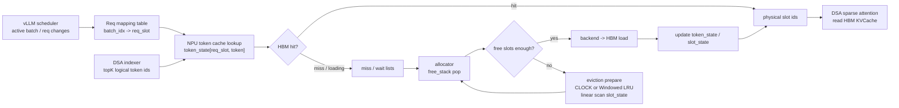

设计原则：

1. HBM 物理空间使用全局 token slot pool。
2. 每个 req 只维护逻辑 token 到物理 slot 的状态映射。
3. free slot 分配走数组栈，不通过链表，也不遍历 free bitmap。
4. free slot 不足或低水位时才触发 eviction，eviction 使用连续扫描生成 victim buffer。
5. 精确链表 LRU 不适合 NPU，默认使用 CLOCK / hotness，备选评估 Windowed LRU / Batched LRU。
6. req reset 使用 generation 隔离异步 IO，避免旧请求 load/writeback 完成后污染复用后的 req slot。

## 4. 辅助数据结构总览

### 4.1 全局 HBM Token Slot Pool

所有请求共享一组物理 token slots：

```text
global_token_slot_pool:
    slot 0
    slot 1
    ...
    slot N-1
```

每个 slot 表示一个 token 的 KVCache 物理位置：

```text
slot_id -> kv_cache[:, slot_id, ...]
```

逻辑 token 通过 `token_state[req_slot, token_id]` 指向物理 slot。物理 slot 通过 `slot_owner_req/token/generation` 反查 owner，供 eviction/reset 冷路径更新索引。

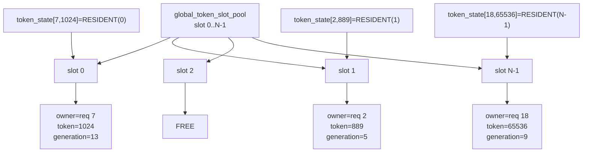

如果后续存在多个 attention group 或不同 KV layout，可以扩展为：

```text
pool_id + slot_id
```

第一版建议保持一个统一 token slot pool，降低管理复杂度。

### 4.2 数据结构清单

所有运行期核心元数据都按 SoA 连续数组组织。粒度需要分清，否则容易把 req 级、token 级和 slot 级状态混在一起。

| 数据结构 | 粒度 | 推荐位置 | 主要字段 | 作用 |
| --- | --- | --- | --- | --- |
| `req_slot_free_stack` | req slot | NPU/Host mirrored | `req_slot_id` | 分配内部 req slot，避免直接使用 vLLM request id 做数组索引 |
| `req_table` | req | NPU GM | `state`, `seq_len`, `generation`, `backend_ctx`, `resident_count`, `soft_quota` | 描述一个活跃请求的缓存管理状态 |
| `batch_req_slots` | batch item | NPU GM | `batch_idx -> req_slot` | vLLM 每步调度后下发，lookup 通过它找到 req_slot |
| `token_state` | logical token | NPU GM | packed `state + slot_id/backend_id/inflight_id` | 逻辑 token 到 HBM slot 或后端位置的主索引 |
| `backend_loc_table` | logical token 或 backend record | NPU GM / 后端元数据 | backend offset / object id | 当 `token_state` payload 不够表达后端位置时作为 side table |
| `slot_state` | physical token slot | NPU GM | `FREE/RESIDENT/LOADING/EVICTING/PROTECTED/DIRTY/hotness` | 描述 HBM 物理 slot 状态 |
| `slot_owner_req` | physical token slot | NPU GM | `req_slot` | eviction apply 时反查 owner req |
| `slot_owner_token` | physical token slot | NPU GM | `token_id` | eviction apply 时反查 logical token |
| `slot_owner_generation` | physical token slot | NPU GM | `generation` | 防止 req_slot reset 后旧 slot 更新新 req |
| `slot_backend` | physical token slot | NPU GM | backend id / offset | clean eviction 后写回 token_state 的 backend 引用 |
| `free_stack` | physical token slot | NPU GM | `slot_id[]`, `free_top` | O(1) 批量 pop/push free slots |
| `clock_state` | global pool | NPU GM | `clock_hand`, `scan_len` | CLOCK 淘汰连续扫描游标 |
| `last_access_step` | physical token slot | NPU GM，可选 | recent access timestamp | Windowed LRU 备选方案使用 |
| `victim_buffers` | eviction candidate | NPU GM/UB staging | `victim_over_quota[]`, `victim_normal[]` | eviction_prepare 输出候选 slot |
| `load_job_table` | IO job | NPU GM | `(req, token, generation, target_slot, backend)` | backend -> HBM 换入任务 |
| `writeback_job_table` | IO job | NPU GM | `(slot, req, token, generation, backend)` | dirty slot HBM -> backend 写回任务 |
| `step_buffers` | inference step | NPU GM/UB staging | hit/miss/wait/touched/released lists | 每步 lookup、mark、alloc、apply 的临时列表 |
| `cache_stats` | global / req | NPU GM/Host readable | hit/miss/evict/reuse counters | 命中率、miss reason、quota 调参依据 |

结构关系：

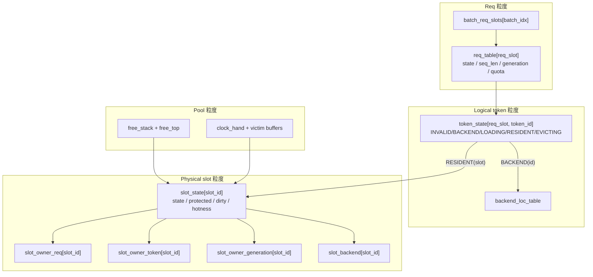

## 5. 状态编码与不变量

`token_state[req_slot, token_id]` 推荐使用 int32 packed state：

```text
bits 31..28: state
bits 27..0 : slot_id / backend_id / inflight_id
```

状态定义：

| 状态 | 含义 |
| --- | --- |
| `INVALID` | token 尚未产生、请求已 reset，或该 token 不可访问 |
| `BACKEND(id)` | token KV 不在 HBM，后端有副本 |
| `LOADING(id)` | token 正在从后端换入 |
| `RESIDENT(slot)` | token KV 在 HBM slot 中 |
| `EVICTING(id)` | token 正在写回后端或等待释放 HBM slot |

`slot_state[slot_id]` 推荐使用 bitset 或小整数：

```text
bit 0      FREE
bit 1      RESIDENT
bit 2      LOADING
bit 3      EVICTING
bit 4      PROTECTED
bit 5      DIRTY
bits 8..11 HOTNESS / second-chance counter
bits 16..31 optional segment / debug flags
```

必须满足的不变量：

```text
1. token_state == RESIDENT(slot) 时:
      slot_state[slot] 必须是 RESIDENT，且 owner(req, token, generation) 匹配。

2. slot_state == FREE 时:
      slot_owner_req/token/generation 不参与语义判断，可置为 -1 便于 debug。

3. LOADING / EVICTING 的 job 必须携带 req_generation。
      完成回调只在 generation 匹配时更新 token_state。

4. req reset 后 generation 必须递增。
      旧 generation 的 inflight IO 完成后只能释放 slot，不能写入新 req 的 token_state。

5. PROTECTED、LOADING、EVICTING slot 不允许被 eviction 选中。
```

状态机：

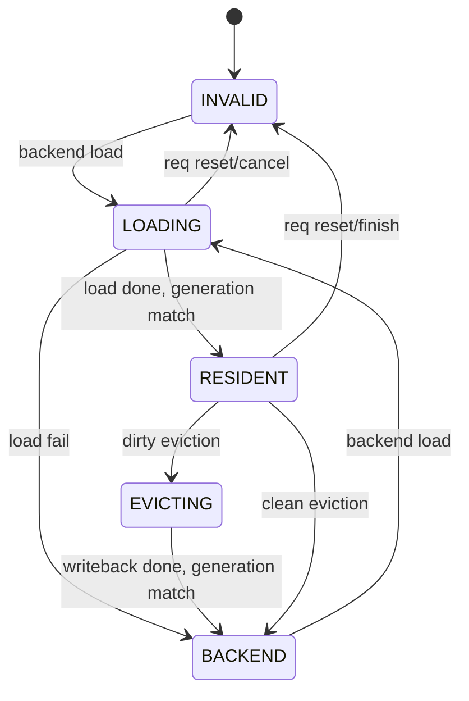

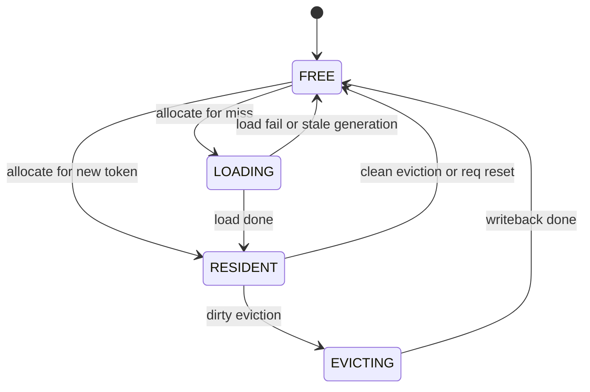

## 6. vLLM Req 变化时的数据维护

vLLM scheduler 每步可能改变 batch 内 req 的集合和顺序。KVCache manager 不能依赖 batch_idx 稳定，只能依赖内部 `req_slot`。

### 6.1 新 req admission

新请求进入时：

```text
1. 从 req_slot_free_stack 分配 req_slot。
2. req_generation[req_slot] += 1。
3. 初始化 req_table[req_slot]:
      state = ACTIVE
      seq_len = prompt_len 或 0
      resident_count = 0
      soft_quota = current_global_quota
      backend_ctx = request backend handle
4. token_state[req_slot, 0:max_model_len] 置 INVALID。
5. Host/vLLM 侧记录 vllm_request_id -> req_slot。
6. 当前 step 的 batch_req_slots[batch_idx] 写入 req_slot。
```

如果 prompt 的部分 KV 已由 prefill 直接写入 HBM，则在 prefill insert 阶段逐 token 更新 `token_state` 和 slot owner；如果 prompt KV 先落后端，则将对应 token 置为 `BACKEND(id)`。

### 6.2 batch reorder / reschedule

batch 顺序变化时只更新：

```text
batch_req_slots[batch_idx] = req_slot
```

不移动 KV，不移动 `token_state` row，不改变 `slot_owner_*`。这是配合 vLLM 动态 batching 的关键点。

### 6.3 decode append 新 token

每个 req decode 生成新 token KV 后：

```text
1. allocator 申请一个 free slot。
2. KV insert 写入 kv_cache[:, slot, ...]。
3. token_state[req, token] = RESIDENT(slot)。
4. slot_owner_req[slot] = req。
5. slot_owner_token[slot] = token。
6. slot_owner_generation[slot] = req_generation[req]。
7. slot_state[slot] = RESIDENT | PROTECTED | hotness=max。
8. req_resident_count[req] += 1。
9. attention 使用完成后清 PROTECTED。
```

### 6.4 pause / preempt

请求被 vLLM 暂停或抢占时：

```text
1. req_table[req].state = PAUSED。
2. 清理该 req 当前 step 的 PROTECTED 标记。
3. 不立即扫描释放全部 token。
4. 后续 eviction 可自然淘汰该 req 的 cold tokens。
```

这样可以避免 pause 时出现一次性大规模随机更新。若后端压力允许，也可在低优先级 stream 中主动扫描该 req 的 `token_state` row，把超 quota 的 resident token 逐步释放。

### 6.5 finish / cancel / reset

请求结束或取消时进入 reset 流程。reset 是 req slot 复用前必须执行的索引清理流程，详见第 9 节。

Req 生命周期：

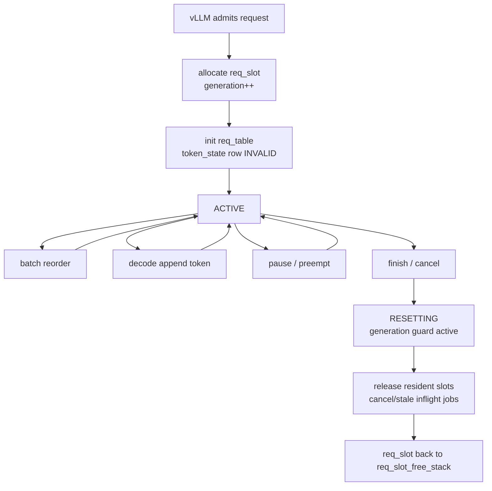

## 7. 索引查询流程

查询输入来自 DSA indexer：

```text
topk_token_ids[batch_idx, query_idx, k]
batch_req_slots[batch_idx]
```

查询输出：

```text
physical_topk_indices
hit_mask
miss_token_list
wait_token_list
touched_slot_list
```

查询 kernel 语义：

```text
for each (batch_idx, query_idx, k):
    req = batch_req_slots[batch_idx]
    token = topk_token_ids[batch_idx, query_idx, k]
    state = token_state[req, token]

    if state is RESIDENT(slot):
        physical_topk_indices[...] = slot
        hit_mask[...] = 1
        touched_slot_list.append(slot)

    elif state is LOADING(inflight_id):
        hit_mask[...] = 0
        wait_token_list.append(req, token, inflight_id)

    elif state is BACKEND(backend_id):
        hit_mask[...] = 0
        miss_token_list.append(req, token, backend_id)

    else:
        hit_mask[...] = 0
        miss_token_list.append(req, token, INVALID_BACKEND)
```

查询流程图：

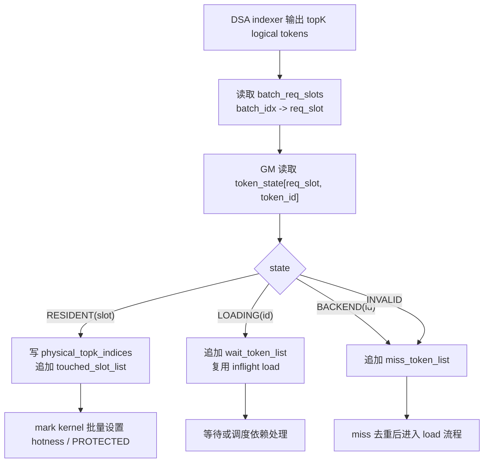

NPU 友好约束：

- lookup hot path 只读 `token_state`，不做链表移动。
- hit 不立即随机写 `slot_state`，先生成 `touched_slot_list`。
- `touched_slot_list` 在 UB 或临时 GM buffer 中按 step 去重，再批量 mark。
- `miss_token_list` 建议按 `(req, token)` sort/unique 或分段去重，避免 hash 表随机探测。
- `wait_token_list` 用于处理同一 token 被多 query 命中但 load 尚未完成的情况。

## 8. 索引维护流程

索引维护分四类：hit mark、miss load、new token insert、eviction apply。原则是 hot path 少写，冷路径批量写。

### 8.1 Hit mark

lookup 生成 `touched_slot_list` 后：

```text
1. 对 touched_slot_list 去重。
2. 批量读取 slot_state。
3. 对仍然 RESIDENT 且 generation 匹配的 slot:
      hotness = max_hotness
      PROTECTED = 1
4. attention 完成后:
      PROTECTED = 0
```

流程图：

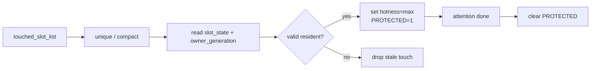

### 8.2 Miss load 与索引更新

miss token 从后端读回 HBM：

```text
1. miss_token_list 按 (req, token) 去重。
2. 对每个 miss:
      如果 token_state 已经是 LOADING，复用 inflight load。
      否则设置 token_state = LOADING(inflight_id)。
3. 从 free_stack 分配 target slots。
4. free slots 不足时触发 eviction_prepare + eviction_apply。
5. NPU 发起 backend -> HBM slot 读取。
6. load 完成后检查 req_generation。
7. generation 匹配:
      token_state[req, token] = RESIDENT(slot)
      slot_owner_req/token/generation 更新
      slot_backend[slot] = backend_id
      slot_state[slot] = RESIDENT | PROTECTED | hotness=max
      req_resident_count[req] += 1
8. generation 不匹配:
      slot_state[slot] = FREE
      slot push 回 free_stack
      不更新 token_state
```

流程图：

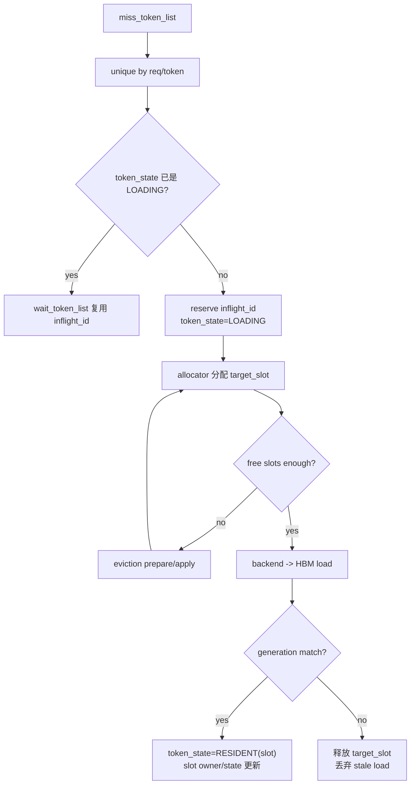

### 8.3 New token insert

decode append 或 prefill 产生新 KV 时，本质上是直接写入 HBM 的 load：

```text
1. allocator 分配 slot。
2. KV writer 写 kv_cache[:, slot, ...]。
3. token_state[req, new_token] = RESIDENT(slot)。
4. slot_owner_req/token/generation 更新。
5. slot_state = RESIDENT | PROTECTED | DIRTY | hotness=max。
6. 如果后端立即有副本，可清 DIRTY 并设置 slot_backend。
```

如果新 token 尚未落后端，则 DIRTY 表示 eviction 时需要 writeback。

### 8.4 Eviction apply 与索引回写

`eviction_prepare` 只生成 victim slot，不直接改 `token_state`。`eviction_apply` 批量处理 victim：

```text
for slot in victim_buffer:
    req = slot_owner_req[slot]
    token = slot_owner_token[slot]
    gen = slot_owner_generation[slot]

    if gen != req_generation[req]:
        slot_state[slot] = FREE
        released_slots.append(slot)
        continue

    if DIRTY:
        token_state[req, token] = EVICTING(writeback_id)
        enqueue writeback_job(slot, req, token, gen)
    else:
        token_state[req, token] = BACKEND(slot_backend[slot])
        slot_state[slot] = FREE
        released_slots.append(slot)
        req_resident_count[req] -= 1
```

writeback 完成后：

```text
if generation match:
    token_state[req, token] = BACKEND(new_backend_loc)

slot_state[slot] = FREE
released_slots.append(slot)
free_stack push released_slots
```

流程图：

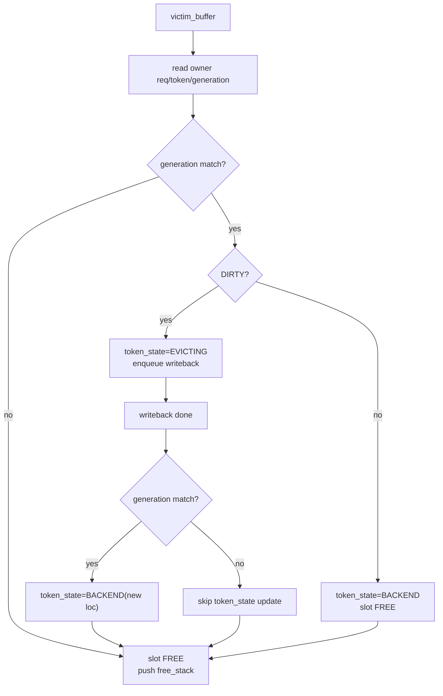

## 9. Reset 流程

reset 用于 req finish/cancel 后释放 HBM slot 并复用 req_slot。reset 不能依赖 per-req linked list，因此推荐扫描该 req 的 dense `token_state` row。该扫描是连续访问，适合放在非关键 stream 或分 chunk 执行。

reset 输入：

```text
req_slot
old_generation = req_generation[req_slot]
seq_len
```

reset 步骤：

```text
1. req_table[req].state = RESETTING。
2. req_generation[req] += 1，使旧 inflight IO 立即变成 stale。
3. 分 chunk 扫描 token_state[req, 0:seq_len]。
4. 对 RESIDENT(slot):
      如果 slot_owner_generation[slot] == old_generation:
          slot_state[slot] = FREE
          released_slots.append(slot)
5. 对 LOADING/EVICTING:
      标记 job stale；完成回调只释放 slot，不更新 token_state。
6. token_state[req, 0:seq_len] 置 INVALID。
7. released_slots 批量 push 到 free_stack。
8. req_resident_count[req] = 0。
9. req_table[req].state = FREE。
10. req_slot push 回 req_slot_free_stack。
```

reset 流程图：

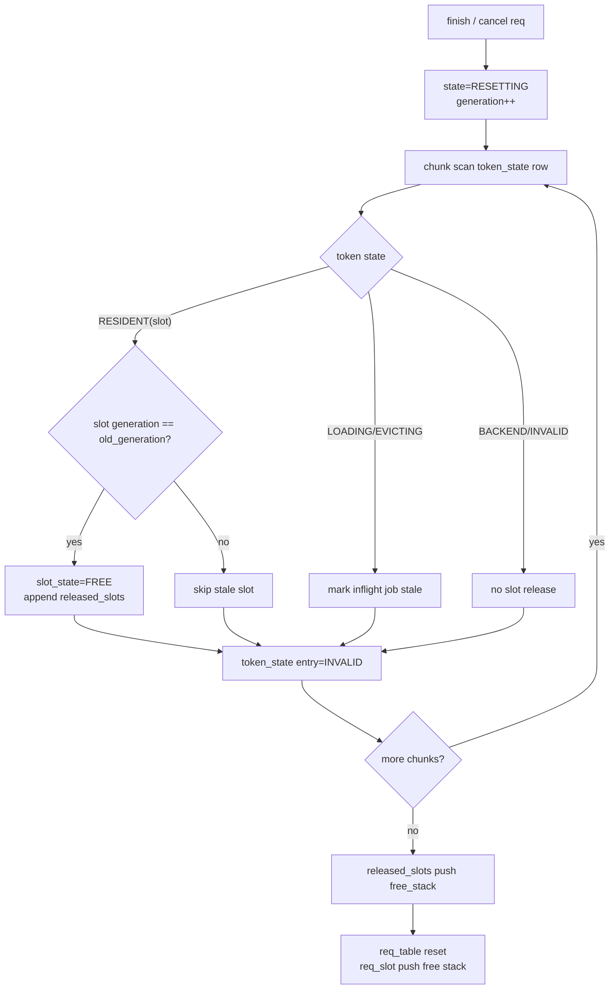

reset 的关键风险是异步 IO 完成与 req_slot 复用乱序。因此 `generation` 是必须的数据结构，不建议省略。

## 10. Free Slot 分配与淘汰

free slot 分配不通过链表，也不应该每次遍历 free bitmap。

推荐使用数组栈：

```text
free_stack[N] int32
free_top      int32
```

分配 K 个 slot：

```text
slots = free_stack[free_top - K : free_top]
free_top -= K
```

释放 K 个 slot：

```text
free_stack[free_top : free_top + K] = released_slots
free_top += K
```

这是连续数组尾部读写，不是链表。

### 10.1 分配 fast path

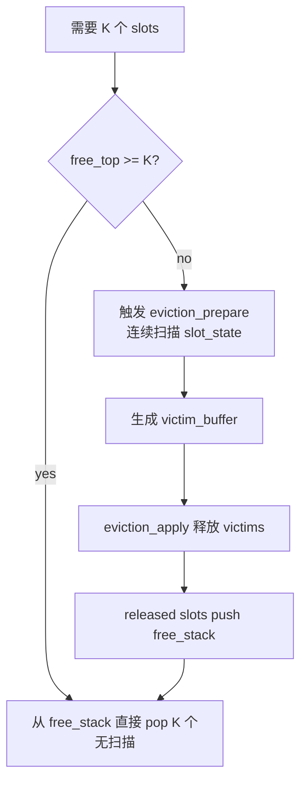

关键点：

```text
分配空位不遍历。
只有 free slots 不足或低水位时，才连续扫描 slot_state 生成 victims。
```

`free_bitmap` 可以保留用于 debug、一致性检查、异常恢复，但不作为运行时主分配结构。

### 10.2 淘汰策略

淘汰策略保留两套可评估方案：

```text
方案 A: CLOCK / hotness
    当前推荐 baseline。逻辑简单，NPU 友好，牺牲一部分 LRU 精度。

方案 B: Windowed LRU / Batched LRU
    LRU 备选方案。用 last_access_step 表达最近访问时间，
    淘汰时在连续扫描窗口内选择最老 token。
```

严格 global linked-list LRU 只作为对照方案，不建议作为 NPU 第一版实现。

两套方案共享相同的触发条件：

```text
if free_top < needed_slots:
    eviction_prepare()

if free_top < low_watermark:
    background_eviction_prepare()
```

其中：

```text
needed_slots = unique_miss_tokens_to_load + decode_new_tokens_to_write
shortage = max(0, needed_slots - free_top)
target_victims = shortage + refill_margin
```

`refill_margin` 用于避免刚释放完马上再次触发淘汰。

扫描方式不是随机选一段，而是确定性的环形顺序扫描：

```text
start = clock_hand
end = clock_hand + scan_len

if end <= total_slots:
    scan slot_state[start:end]
else:
    scan slot_state[start:total_slots]
    scan slot_state[0:end % total_slots]

clock_hand = end % total_slots
```

这保证 `eviction_prepare` 的主访问是连续 GM 读，适合 Ascend NPU 做 tile、vector mask 和 compact。

#### 10.2.1 方案 A: CLOCK / hotness

CLOCK / hotness 方案用小整数近似访问热度。命中时把 `hotness` 设置到最大值；淘汰扫描时遇到热 token 只递减热度，不立即淘汰。

额外元数据：

```text
clock_hand
scan_len
slot_state[slot].hotness     2-bit 或 3-bit counter
victim_over_quota_clean[]
victim_normal_clean[]
victim_over_quota_dirty[]
victim_normal_dirty[]
```

hit mark 流程：

```text
1. lookup 只输出 touched_slot_list，不直接写 slot_state。
2. mark kernel 对 touched_slot_list 去重。
3. 对 unique touched slot:
      hotness = max_hotness
      PROTECTED = 1
4. attention 完成后:
      PROTECTED = 0
```

`eviction_prepare` 连续扫描：

```text
scan range = [clock_hand, clock_hand + scan_len)

for slot in scan range:
    state = slot_state[slot]

    if slot is not RESIDENT:
        skip

    if slot is LOADING or EVICTING or PROTECTED:
        skip

    if hotness > 0:
        hotness -= 1
        skip

    owner_req = slot_owner_req[slot]
    over_quota = req_resident_count[owner_req] > req_soft_quota[owner_req]

    if over_quota and clean:
        append victim_over_quota
    elif clean:
        append victim_normal
    elif over_quota and dirty:
        append victim_dirty_over_quota
    else:
        append victim_dirty_normal
```

CLOCK / hotness 的淘汰优先级：

```text
1. cold + over_quota + clean
2. cold + normal_quota + clean
3. cold + over_quota + dirty
4. cold + normal_quota + dirty
5. emergency: warm + over_quota
```

优先级原则：

```text
安全状态 > hotness > req quota > clean/dirty > scan age
```

`hotness` 建议先使用 2-bit 或 3-bit counter，而不是单 bit refbit。命中后设置到 max，淘汰扫描每轮递减。这样比单次 second-chance 更接近 DSA token 重用模式，但仍然保持连续扫描和简单分支。

流程图：

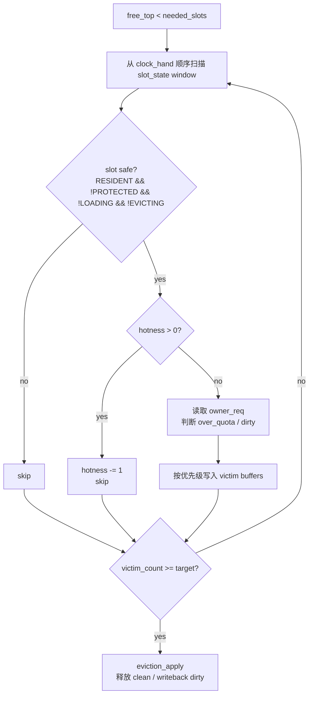

该方案的 NPU 压力主要在：

```text
1. eviction_prepare 对 slot_state/owner 数组做连续读。
2. hotness > 0 时需要写回 hotness--，这是连续窗口内的批量写。
3. eviction_apply 对 victim 对应的 token_state[req, token] 做随机写。
```

优点：

```text
1. 数据结构简单。
2. 不需要 per-hit 维护 LRU 链表。
3. 扫描和 hotness 衰减都发生在连续窗口内。
4. 容易控制每 step 最大扫描预算。
```

缺点：

```text
1. 只能近似 recency，无法严格选择最久未访问 token。
2. hotness counter 粒度有限，可能无法区分多个较老 token 的先后顺序。
3. 如果 hotness 设置过高，会导致扫描效率下降。
```

#### 10.2.2 方案 B: Windowed LRU / Batched LRU

Windowed LRU 不维护全局 LRU 链表，而是给每个 physical slot 记录最近访问 step。淘汰时仍然顺序扫描一个窗口，只是在窗口候选里选择 `last_access_step` 最老的 slot。

额外元数据：

```text
global_cache_step          uint64
last_access_step[N]        uint32 / uint64
last_mark_step[N]          uint32，可选，用于同 step 重复 touch 过滤
lru_candidate_slots[M]     int32
lru_candidate_score[M]     int32
lru_victim_buffer[K]       int32
```

hit mark 流程：

```text
1. lookup 输出 touched_slot_list。
2. touched_slot_list 去重。
3. 对 unique touched slot:
      last_access_step[slot] = global_cache_step
      PROTECTED = 1
4. attention 完成后:
      PROTECTED = 0
5. step 完成:
      global_cache_step += 1
```

Windowed LRU 的关键点是：hit hot path 仍然不做链表移动，只做批量 timestamp 写入。

淘汰候选过滤：

```text
candidate =
    RESIDENT
  & !PROTECTED
  & !LOADING
  & !EVICTING
```

候选评分：

```text
age = global_cache_step - last_access_step[slot]

score =
    age
  + over_quota_bonus
  - dirty_penalty
  - protected_penalty
```

其中 `protected_penalty` 在正常情况下不需要，因为 `PROTECTED` 已经过滤掉；保留该项主要用于 emergency 策略。

victim 选择可以有两种实现：

```text
1. topK select:
      在候选窗口内选 score 最大的 K 个。
      精度更高，但需要 selection / partial sort。

2. bucket select:
      按 age 高位或 age range 分桶。
      先取 oldest bucket，再按 quota/dirty 优先级取 victim。
      精度略低，但更适合 NPU vector compact。
```

建议第一版 Windowed LRU 使用 bucket select，不做完整排序。

流程图：

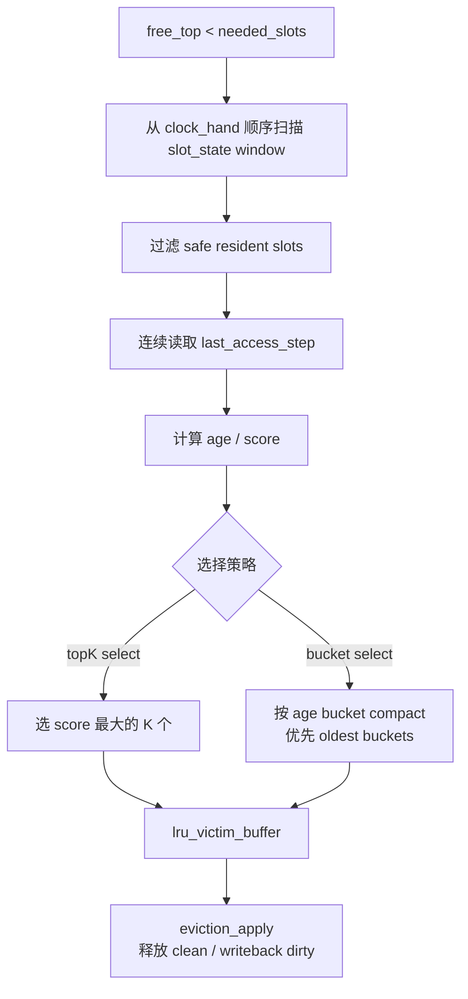

该方案的 NPU 压力主要在：

```text
1. mark kernel 需要随机批量写 last_access_step[slot]。
2. eviction_prepare 需要连续读取 last_access_step window。
3. topK select 或 bucket compact 比 CLOCK 判断更重。
4. eviction_apply 仍然有 token_state[req, token] 随机写。
```

优点：

```text
1. 比 CLOCK 更接近 LRU，能区分更细的 recency。
2. 在 DSA working set 有明显时间局部性时，可能提升命中率。
3. 仍然避免链表，淘汰扫描仍然是连续窗口。
4. 可通过 age bucket 限制 NPU 上的 selection 复杂度。
```

缺点：

```text
1. hit mark 多一个 last_access_step 随机批量写。
2. eviction_prepare 需要读 timestamp 并计算 score。
3. 如果 touched_slot_list 很大，timestamp 写放大可能明显。
4. topK select 实现复杂度高于 CLOCK。
```

#### 10.2.3 严格 Global LRU 对照方案

严格 LRU 需要维护全局双向链表：

```text
lru_prev[N]
lru_next[N]
lru_head
lru_tail
```

每次 hit 都要把 slot 移到链表头：

```text
prev = lru_prev[slot]
next = lru_next[slot]

lru_next[prev] = next
lru_prev[next] = prev
lru_prev[old_head] = slot
lru_next[slot] = old_head
lru_prev[slot] = INVALID
lru_head = slot
```

这个方案语义最精确，但不适合作为 Ascend NPU 首版：

```text
1. 每次 hit 都有多次 data-dependent random read/write。
2. topK hit 数量大时，LRU 更新会进入 hot path。
3. 并发 mark 同一 slot 或相邻节点需要 atomic/CAS/lock。
4. 链表节点跳转破坏连续访存。
5. request reset/eviction 时链表删除也需要随机更新前后节点。
```

因此严格 LRU 只建议用于 CPU simulator 或离线评估，作为判断 CLOCK/Windowed LRU 命中率差距的 upper bound。

#### 10.2.4 两种可实现方案对比

| 维度 | CLOCK / hotness | Windowed LRU / Batched LRU |
| --- | --- | --- |
| 访问热度表达 | 2-bit/3-bit hotness counter | `last_access_step` timestamp |
| hit 维护 | unique touch 后设置 hotness=max | unique touch 后写 last_access_step=current_step |
| 淘汰扫描 | 连续扫描 slot_state | 连续扫描 slot_state + last_access_step |
| victim 选择 | hotness==0 后按 quota/dirty 分 buffer | 在窗口内选 age 最大或 oldest bucket |
| NPU 实现复杂度 | 低 | 中 |
| 随机写压力 | touched slot 写 hotness | touched slot 写 timestamp |
| 命中率潜力 | 中 | 中高 |
| 适合作为第一版 | 是 | 可作为对比实验 |

推荐策略：

```text
1. 第一版实现 CLOCK / hotness。
2. 同时保留 last_access_step 的可选编译/运行开关。
3. 通过真实 DSA trace 对比:
      CLOCK hit rate
      Windowed LRU hit rate
      eviction scan efficiency
      mark kernel 写放大
4. 如果 Windowed LRU 命中率提升明显，且 mark/selection 成本可接受，再切为默认。
```

### 10.3 Per-Req Soft Quota

全局 pool 不固定切给每个 req，但需要防止单个请求占满 HBM。

维护：

```text
req_resident_count[req]
req_soft_quota[req] = total_slots / target_concurrency
```

这是 soft quota，不是 hard partition：

```text
1. 全局 free slots 充足时，长请求可以超过 soft quota。
2. free slots 紧张时，淘汰优先从超过 soft quota 的 req 里选 cold tokens。
3. 未超过 quota 的 req 仍可能被淘汰，但优先级更低。
```

## 11. 推理中的 step 级维护流程

推荐 step 级流程：

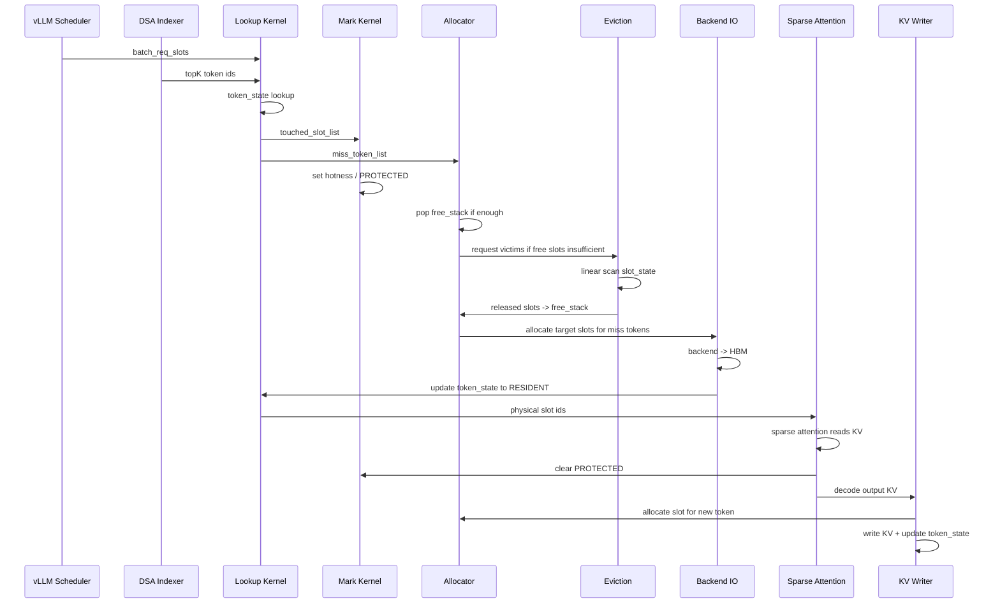

拆分成批处理 kernel：

```text
lookup:          生成 hit/miss/wait/touched 列表
mark:            批量设置 hotness / PROTECTED
allocator:       从数组栈批量分配 free slots
evict_prepare:   连续扫描 slot_state，生成 victim buffers
evict_apply:     批量更新 token_state / slot_state / free_stack
io_submit:       生成 backend load/writeback jobs
io_complete:     generation check 后更新索引
reset:           chunk 扫描 token_state row，释放 req slots
stats:           汇总 hit/miss/evict/reuse 指标
```

## 12. Ascend NPU 压力评估

### 12.1 元数据容量压力

元数据容量相对 KV 本体较小。

```text
token_state = max_req_slots * max_model_len * 4B

50 req, 128K max_model_len:
    50 * 128K * 4B = 25MB
```

物理 slot 元数据估算：

```text
slot_meta ~= 24B 到 32B / slot
free_stack = 4B / slot
```

以 48GiB KV、61 层、V3.2 fp8_ds_mla 估算，总 slot 数约 1.28M：

```text
slot_meta 约 31MB 到 41MB
free_stack 约 5MB
```

因此 HBM 容量压力主要来自 KV 本体，不是索引元数据。

### 12.2 算子与访存压力

| 压力点 | 来源 | 风险 | 缓解 |
| --- | --- | --- | --- |
| `token_state` 随机 GM 读 | indexer 输出 token id 离散 | lookup hot path 时延高，当前已观测到 350us 级别 | int32 packed state、按 req/query 分 tile、减少返回字段、后续再做 token id 排序/分桶优化 |
| hit 后随机 GM 写 | 每个命中 token 更新热度 | 写放大严重，影响 lookup | lookup 只产出 `touched_slot_list`，mark kernel 去重后批量写 |
| miss list 去重 | 同 token 可能被多个 query 访问 | 重复 load、重复分配 slot | 使用 sort/unique 或分段 compact，避免 hash 随机探测 |
| free slot 分配 | 多 token 同时申请 slot | `free_top` 原子竞争 | 每 step 单 allocator kernel 批量 pop，避免 per-token atomic |
| eviction scan | free slots 不足时扫描 slot_state | 扫描过多影响 step latency | low_watermark 后台预淘汰，固定 scan_len，victim buffer 复用 |
| eviction apply 随机写 `token_state` | victim slot owner 分散 | 冷路径随机写 | 只在 free 不足时发生，按 victim buffer 批量处理 |
| reset 扫描 | finish/cancel 时扫描 req row | 长上下文 reset 可能阻塞 | chunk reset，非关键 stream，generation 先递增 |
| backend IO | miss load / dirty writeback | IO latency 影响 attention | IO job batch 化，双 buffer，prefetch，loading 状态复用 |
| PROTECTED 同步 | attention 与 eviction 并发 | 正在使用的 slot 被释放 | step 级 mark/clear，eviction 跳过 PROTECTED/LOADING/EVICTING |

### 12.3 对 Ascend 友好的设计点

当前设计刻意保留以下 NPU 友好特征：

```text
1. 所有主数据结构都是连续数组。
2. free 分配是 free_stack 尾部批量 pop，不遍历。
3. 淘汰是 slot_state 连续扫描，不使用链表。
4. hit hot path 不维护精确 LRU，不做 per-hit slot_state 写。
5. reset 扫描 token_state row，是连续地址访问。
6. 复杂状态更新拆成 lookup / mark / apply / complete 多个批处理 kernel。
7. generation check 把异步 IO 的一致性问题变成简单整数比较。
```

仍然不友好的部分：

```text
1. token_state[req, token] 查询本质上是随机读。
2. eviction apply 回写 token_state 是随机写。
3. IO completion 更新 token_state/slot_state 是随机写。
4. miss 去重如果使用 hash，会引入随机探测。
```

第一版接受这些压力，因为它们要么是语义必需，要么发生在冷路径。后续优化重点仍然应放在 lookup hot path：按 req 分组、按 token id 分桶、topK 排序、查询批量化、减少输出写回量。

## 13. 命中率目标与调参

95% HBM 命中率不能只靠淘汰策略保证，取决于 DSA indexer 的 working set、上下文长度、并发、KV HBM 预算和后端 load latency。

必须维护以下统计：

```text
global_hit_count
global_miss_count
per_req_hit_count[req]
per_req_miss_count[req]
miss_reason:
    never_loaded
    evicted_then_reused
    loading_inflight
    backend_load_failed
evicted_reused_count
reuse_distance_histogram
topK_overlap_between_steps
free_top_watermark
eviction_scan_efficiency = victims / scanned_slots
```

调参判断：

```text
1. 如果 miss 主要是 never_loaded:
      淘汰策略帮助有限，需要预取、admission control 或降低并发。

2. 如果 miss 主要是 evicted_then_reused:
      提高 hotness max，降低 hotness 衰减速度，增大 low_watermark，
      或提高该类 req 的 soft_quota。

3. 如果 eviction_scan_efficiency 很低:
      protected/hot token 太多，说明 HBM working set 已接近容量上限，
      需要降低并发或扩大 KV 预算。

4. 如果 loading_inflight 占比高:
      IO latency 成为瓶颈，需要复用 inflight、提前 prefetch、增加 IO batch。
```

## 14. 待验证问题

后续 prototype 需要验证：

- token_state dense lookup 在真实 DSA topK 分布下的时延。
- `touched_slot_list` 去重的成本。
- `miss_token_list` 使用 sort/unique 还是分段 compact 更适合 Ascend。
- `free_stack` 批量分配是否需要单 kernel 串行化，还是可用低开销原子加减。
- `eviction_prepare` 的 scan_len 取值，避免扫描不足或扫描过量。
- `victim_over_quota` 与 `victim_normal` 多 buffer 是否能稳定控制单 req 占用。
- clean eviction 比例。如果大多数 token 已有后端副本，淘汰只需更新索引。
- dirty token writeback 与 backend load 的流控方式。
- request reset 的 chunk 大小与调度 stream，避免影响 decode step latency。
- 50 并发目标下，为达到 95% 命中率需要的 KV HBM 预算和实际 DSA working set。

## 15. 当前设计结论

当前推荐设计为：

```text
token 粒度 KVCache manager
    + global HBM token slot pool
    + per-req dense token_state table
    + req generation guard
    + SoA slot metadata arrays
    + array-based free_stack
    + CLOCK / hotness linear-scan eviction as baseline
    + optional Windowed LRU / Batched LRU eviction for comparison
    + victim_buffer batch apply
    + per-req soft quota
    + chunk reset by token_state row scan
```

明确不推荐：

```text
per-req 固定 pool
global linked-list LRU
per-req linked-list LRU
pointer-based free list
每次分配遍历 free bitmap
每次 token hit 都维护精确 LRU
reset 时依赖 per-req resident linked list
```

关键判断：

```text
空位分配不遍历，直接从 free_stack pop。
空位不足时，才连续扫描 slot_state 生成 victim_buffer。
索引查询只读 token_state，hit mark 延后到批处理 kernel。
req reset 使用 generation + chunk scan，避免异步 IO 污染复用后的 req_slot。
Ascend NPU 压力的核心仍是 token_state 随机读和后端 IO，不是元数据容量。
```
