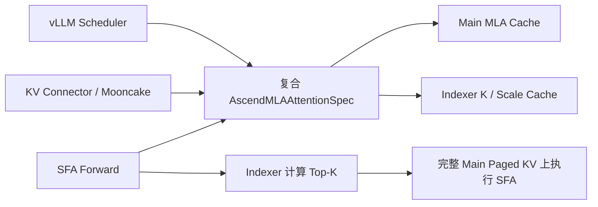
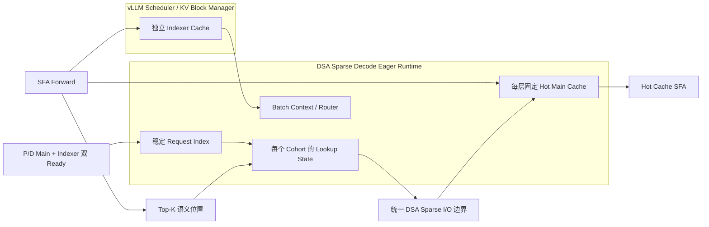

# vLLM-Ascend DSA Sparse 框架变更分析

> 状态：Analysis<br>
> 分析仓库：`/home/solidyang/workspace/vllm-ascend`<br>
> 当前分支：`dsa-sparse-0.23-eager`<br>
> 基线：`v0.23.0rc1`（`f4a08bddd0cc65a0bd8c3d377b158ae5ca7527db`）<br>
> 当前 HEAD：`74f00dddc7fd76411058acd1d798084c65dc05ef`<br>
> 比较范围：`v0.23.0rc1..HEAD`<br>
> 排除范围：算子算法、tiling、kernel 实现和算子性能<br>
> 分析日期：2026-08-03

> 行号口径：下文的 `Lx-Ly` 均是分析 HEAD `74f00dddc7fd76411058acd1d798084c65dc05ef` 中、按 `nl -ba` 得到的 1-based 行号；比较范围固定为 `v0.23.0rc1..74f00dddc7fd76411058acd1d798084c65dc05ef`。如果工作树已经前移到后续提交，源码行号可能发生偏移，应先切换到该分析 HEAD 再核对。

本文分析 `dsa-sparse-0.23-eager` 相对 `v0.23.0rc1` 的框架层变化，重点回答：

1. 修改前后的框架架构差异；
2. 数据结构变化及其显存增减；
3. 修改文件、关键修改点及修改目的。

算子文件只在变更清单中列出，不分析其算法或实现细节。文中的显存数字均为代码公式推导结果，不是 NPU 实测结果。

## 1. 结论摘要

本次修改最根本的变化不是新增某个算子，而是重构 SFA Main Cache 与 Indexer Cache 的所有权，并为 DSA Sparse Decode 建立独立的 eager runtime：

1. 原来 SFA 的 Main MLA Cache 与 Indexer Cache 共用一个 `AscendMLAAttentionSpec` 和一个复合 KV Cache tuple；现在拆成独立的 `AscendMLAAttentionSpec` 与 `AscendSFAIndexerCacheSpec`。
2. 普通 SFA 路径仍由 scheduler 同时管理 Main 和 Indexer，forward 时再把两个独立 cache tuple 临时拼回原有执行接口，名义 payload 大小基本不变。
3. DSA Sparse Decode consumer 进一步把 Main Cache 移出 vLLM scheduler 和普通 KVConnector 管理，改由固定大小的 per-layer Hot Cache 承载；scheduler 和 Mooncake 只分配、注册和传输 Indexer Cache。
4. 新增稳定 Request Index、按 Indexer cohort 共享的 Lookup State、batch context/router、P/D 双 ready 生命周期，以及固定 HBM 预算管理。
5. Decode step 变成：写入最新 Main token、产生 Top-K 语义位置、映射到 Hot Cache slot、经过统一 I/O 边界补齐 miss payload，再在 Hot Cache 上执行现有 SFA。
6. 当前实现仍是开发里程碑：配置只接受 `io_backend="mock"`，mock I/O 不搬运 Main/history payload，因此只能验证框架控制流和执行拓扑，不能证明端到端推理正确性。

## 2. Diff 范围与规模

`v0.23.0rc1` 是当前分支 HEAD 的祖先，因此使用直接区间 `v0.23.0rc1..HEAD`，不存在 merge-base 偏移问题。

总体规模：

| 项目 | 数量 |
|---|---:|
| 提交 | 33 |
| 修改文件 | 65 |
| 新增文件 | 45 |
| 修改已有文件 | 20 |
| 新增行 | 10,815 |
| 删除行 | 574 |

按范围分类：

| 范围 | 文件数 | 新增 | 删除 |
|---|---:|---:|---:|
| 框架生产代码 | 19 | 3,785 | 459 |
| 非算子框架测试 | 13 | 2,765 | 110 |
| 示例与验证脚本 | 2 | 964 | 0 |
| 构建与 CI | 2 | 18 | 2 |
| 算子、算子测试与工具 | 29 | 3,283 | 3 |

## 3. 修改前的框架架构

### 3.1 Main 与 Indexer 使用复合 Cache Spec

在基线中，`AscendMLAAttentionSpec` 同时描述：

- Main MLA latent cache；
- RoPE cache；
- Indexer K cache；
- 可选的 Indexer scale cache；
- Main C8、LI C8 与 DCP replication 信息。

因此一个 SFA layer 的 `kv_cache` tuple 可能是：

```text
普通布局：
  (main_k, main_v, indexer_k)

LI C8：
  (main_k, main_v, indexer_k, indexer_scale)

Main C8：
  (packed_main, indexer_k[, indexer_scale])
```

对应架构如下：



### 3.2 基线运行特征

- scheduler 和 KV block manager 按复合 page size 统一分配 Main + Indexer。
- Mooncake/KVConnector 注册并传输复合缓存中的所有 payload。
- `IndexerWrapper` 会删除 upstream indexer 自身的 `k_cache`，因为 Indexer Cache 已经嵌入 Main attention layer 的缓存 tuple。
- SFA 直接使用原始 `block_table` 和完整 Main Paged KV Cache。
- 不存在 Hot Cache、请求稳定索引、Lookup State、miss I/O 或 per-cohort runtime。

## 4. 修改后的框架架构

修改后可以分成两个层次：通用的 Main/Indexer 拆分，以及 DSA Decode consumer 的 Main Graph-out。

### 4.1 第一层：拆分 Main Cache 与 Indexer Cache

`vllm_ascend/core/kv_cache_interface.py:L19-L144,L200-L209` 中：

- `AscendMLAAttentionSpec` 现在只描述 Main Cache；
- 新增 `AscendSFAIndexerCacheSpec`，单独描述 Indexer K、scale、LI C8 和 DCP replication；
- `AscendSFAIndexerCacheSpec` 注册到 `FullAttentionManager`；
- 删除原来依赖复合 Cache 的 `sparse_head_dim`、`sparse_kv_cache_ratio` 和混合 page size 计算。

新增 `vllm_ascend/attention/indexer.py:L17-L73`：

- 提供 cache-only `AscendSFAIndexerBackend`；
- Indexer group 可参与 KV Cache 分配和 metadata 初始化；
- backend 本身没有 attention forward。

`vllm_ascend/ops/mla.py:L39-L61` 的 `IndexerWrapper` 不再清空 upstream `k_cache`。SFA forward 在 `vllm_ascend/attention/sfa_v1.py:L1604-L1610` 通过 `_compose_sfa_kv_cache()` 将：

```text
Main Cache tuple + self.indexer.k_cache.kv_cache
```

临时组合成旧执行路径所需要的 tuple。因此普通非 DSA 路径的执行语义基本保持不变。

### 4.2 第二层：Decode consumer 外置 Main Cache

在 DSA Sparse KV consumer 上，`vllm_ascend/worker/model_runner_v1.py:L5205-L5347` 的 `NPUModelRunner.get_kv_cache_spec()`：

1. 把 Main spec 保存到 `DSASparseExternalMainSpecs`；
2. 返回给 scheduler 的 KV Cache spec 只包含 Indexer；
3. scheduler 只为 Indexer 分配 blocks；
4. KVConnector 也只注册 Indexer Cache。

初始化 attention backend 时，`vllm_ascend/worker/model_runner_v1.py:L4168-L4204` 会复制一份 scheduler 的 `KVCacheConfig`；`vllm_ascend/worker/dsa_sparse_external_main.py:L22-L115` 负责 external Main 映射，然后将 Main spec 作为 runner-only metadata 投影回唯一的 Indexer group：

- `kv_cache_groups` 可以看见 Main 和 Indexer spec；
- `kv_cache_tensors` 仍然只包含 Indexer；
- Main layer 加入 `runner_only_attn_layers`；
- Main layer 只绑定 shape 第一维为 0 的 placeholder；
- 真正 Main 存储由 DSA Sparse Hot Cache 提供。

Prefill producer 不使用 external Main，仍然由 scheduler 管理完整 Main + Indexer Cache。

### 4.3 修改后的整体架构



### 4.4 Decode step 执行流程

`vllm_ascend/worker/model_runner_v1.py:L884-L920` 的 `_begin_dsa_sparse_eager_execution()` 只接受：

- `DecodeOnly` batch；
- 每请求每 step 恰好一个 token；
- 非 microbatch metadata；
- 非 speculative decode。

运行流程：

1. 根据 request ID 获取稳定的 `request_index`。
2. `vllm_ascend/worker/model_runner_v1.py:L725-L821` 根据 layer 顺序和 `skip_topk` 识别 Indexer cohort；不跳过 Top-K 的 layer 是 cohort leader，后续 `skip_topk=True` 的 layer 复用该 cohort。
3. `vllm_ascend/attention/dsa_sparse.py:L266-L280,L382-L598,L829-L1007` 让所有 cohort 共享一份 `DSASparseStepMetadata`，每个 cohort 建立一个 `DSASparseEagerBatchContext`。
4. SFA preprocessing 将当前 token 的 Main payload 写入本请求 Hot Cache 的 live-tail block。
5. Indexer 产生 2048 个语义 Top-K token positions。
6. cohort leader 对 Top-K 做一次位置解析；follower 复用结果，不重复解析。
7. `vllm_ascend/attention/dsa_sparse.py:L600-L768` 使每个 Main layer 调用一次统一 I/O 边界；I/O 协议与 mock 在 `vllm_ascend/attention/dsa_sparse_io.py:L110-L211`，生产实现应负责把 miss 对应的 Main 历史 payload 装入 Hot Cache。
8. SFA 使用 Hot Cache、Hot block table 和重映射后的 indices 执行。
9. step 成功则 finish；异常则 abort，并从 attention metadata 上解绑 context。

没有 `dsa_sparse_context` 时，SFA 仍走原有完整 Paged KV 路径。

## 5. P/D 生命周期变化

新增 `vllm_ascend/attention/dsa_sparse_pd.py:L84-L294` 的 `DSASparsePDLifecycle`，将请求进入 Decode running 的条件从“普通 KV 已 ready”扩展为：

```text
Main external region ready
  AND
Indexer KV ready
```

主要状态包括：

- `generation`：防止 request ID 复用后，旧 completion 污染新请求；
- `transfer_id`：标识当前 handoff；
- `main_region_handle`：外部 Main 区域句柄；
- `main_region_ready`；
- `indexer_ready`；
- `ready_notified`；
- `admitted`；
- `request_index`；
- `failed_reason`。

只有 Main 和 Indexer 都 ready 后，才会分配稳定 `request_index`。finish、preempt、abort 都会释放 region 和 request index。迟到或 generation 不匹配的 completion 会被忽略，迟到的 Main region handle 会立即释放。

当前 runner 真正接入的是 `vllm_ascend/worker/dsa_sparse_eager.py:L313-L437` 的 mock lifecycle：新请求和 resumed 请求被模拟为双 ready；`vllm_ascend/worker/model_runner_v1.py:L1057-L1121` 对 finished、preempted、resumed 请求先 retire，再根据 scheduler 状态重新 admission。

## 6. 数据结构变化

### 6.1 Cache Spec 变化

| 数据结构 | 修改前 | 修改后 | 目的 |
|---|---|---|---|
| `AscendMLAAttentionSpec` | Main、Indexer、scale、LI C8、DCP replication 混合描述 | 只描述 Main（`vllm_ascend/core/kv_cache_interface.py:L19-L87`） | 解耦缓存生命周期和分配策略 |
| `AscendSFAIndexerCacheSpec` | 不存在 | 独立描述 Indexer K/scale（`vllm_ascend/core/kv_cache_interface.py:L90-L144,L200-L209`） | 允许 scheduler 和 connector 单独管理 Indexer |
| `IndexerWrapper.k_cache` | 被置空 | 保留并绑定独立 Cache（`vllm_ascend/ops/mla.py:L39-L61`） | 让 SFA 从 indexer module 获取 Cache |
| `DSASparseExternalMainSpecs` | 不存在 | worker-local Main spec 映射（`vllm_ascend/worker/dsa_sparse_external_main.py:L22-L115`） | Main 对 scheduler 隐藏、对 runner metadata 可见 |

原 `AscendMLAAttentionSpec` 删除的主要字段和逻辑：

- `sparse_head_dim`；
- `cache_sparse_li_c8`；
- `c8_k_cache_dtype`；
- `c8_k_scale_cache_dtype`；
- `sfa_dcp_replicated_indexer_size`；
- `sparse_kv_cache_ratio`。

这些 Indexer 相关信息被迁移到 `AscendSFAIndexerCacheSpec`。

### 6.2 DSA Runtime 数据结构

| 数据结构 | 生命周期 | 作用 |
|---|---|---|
| `DSASparseCacheConfig` | worker 生命周期 | 固化 max seq、max model length、block size 和 Top-K（`vllm_ascend/attention/dsa_sparse.py:L41-L106`） |
| `RequestIndexManager` | worker 生命周期 | request ID 到 `[0, max_num_seqs)` 稳定 row 的映射（`vllm_ascend/attention/dsa_sparse.py:L109-L153`） |
| `DSASparseCohortKey` | worker 生命周期 | 标识共享同一 Indexer 的 target/draft cohort（`vllm_ascend/attention/dsa_sparse.py:L157-L168`） |
| `DSASparseLookupState` | worker 生命周期 | 持久位置映射和 free-slot 状态（`vllm_ascend/attention/dsa_sparse.py:L171-L250`） |
| `DSASparseLayerLayout` | 初始化阶段 | 描述每层 Main Cache plane dtype/shape（`vllm_ascend/attention/dsa_sparse.py:L283-L291`） |
| `DSASparseLayerHotCache` | worker 生命周期 | 每层固定地址的 Main Hot Cache tensors（`vllm_ascend/attention/dsa_sparse.py:L292-L320`） |
| `DSASparseLayerBinding` | worker 生命周期 | 绑定 layer、cohort、Hot Cache 和 I/O resource（`vllm_ascend/attention/dsa_sparse.py:L334-L351`） |
| `DSASparseStepMetadata` | 一个 model forward | batch 共享的 compact metadata（`vllm_ascend/attention/dsa_sparse.py:L253-L280`） |
| `DSASparseEagerStep` | 一个 cohort 的一个 forward | lookup、I/O 和 layer 完成状态（`vllm_ascend/attention/dsa_sparse.py:L367-L379`） |
| `DSASparseEagerBatchContext` | 一个 model forward | 单 cohort 的操作入口（`vllm_ascend/attention/dsa_sparse.py:L829-L930`） |
| `DSASparseEagerContextRouter` | 一个 model forward | 将各 layer 路由到所属 cohort context（`vllm_ascend/attention/dsa_sparse.py:L932-L1007`） |
| `DSASparseEagerExecution` | `with forward` 作用域 | finish/abort 和 metadata detach（`vllm_ascend/worker/dsa_sparse_eager.py:L231-L310`） |

### 6.3 Lookup State

每个 cohort 持有四张 NPU int32 tensor。设 `S=max_num_seqs`：

| Tensor | Shape | 含义 |
|---|---|---|
| `index` | `[S, 131072]` | 全局 token position 到 Hot Slot 的映射 |
| `slot_to_index` | `[S, 10240]` | Hot Slot 到全局位置的反向映射 |
| `free_slots` | `[S, 2048]` | 2K 可替换 slot 列表 |
| `free_head` | `[S, 16]` | free-list 头及对齐空间 |

请求 admission 时，`vllm_ascend/attention/dsa_sparse.py:L223-L250` 对每个 cohort 的 request row 执行 reset，并把前 8K resident positions 初始化为一一映射；`vllm_ascend/attention/dsa_sparse.py:L448-L466` 负责 coordinator 级 request acquire/release。请求释放时再次 reset，防止状态泄漏到后续复用该 row 的请求。

### 6.4 Step Metadata

`vllm_ascend/attention/dsa_sparse.py:L266-L280` 定义的 `DSASparseStepMetadata` 包含：

```text
request_ids
req_pool_entries
query_positions
seq_lens
block_table
dense_tail_starts
resident_tail_starts
write_global_slots
write_destination_slots
write_valid_mask
hot_block_table
```

该对象在同一个 batch 的所有 target cohort 间共享，避免每个 cohort 重复创建一份 batch metadata。

## 7. 显存变化

### 7.1 固定 Hot Cache 公式

设（对应 `vllm_ascend/attention/dsa_sparse.py:L41-L106,L171-L320` 的配置和状态表）：

- `S`：`max_num_seqs`；
- `L`：本 NPU 上的 Main layer 数量；
- `C`：Indexer cohort 数量；
- `B`：block size；
- `r_l`：第 `l` 个 Main layer 每个 token-row 的字节数；
- `A`：I/O backend 辅助显存，当前传入 0。

每请求的 Hot Cache 区域包含：

```text
8K resident slots
+ 2K free slots
+ 1 个长度为 B 的 live-tail block
```

因此：

```text
H = 8192 + 2048 + B = 10240 + B
```

固定 Main Hot Cache：

```text
M_hot = S × H × Σ(r_l)
```

每个 layer 的 `r_l` 由它的 Main Cache plane shape 与 dtype 决定：

```text
r_l = Σ(dtype_size_i × product(row_shape_i))
```

### 7.2 Lookup State 公式

每请求、每 cohort 的 lookup state：

```text
M_lookup_per_request_per_cohort
  = 4 × (131072 + 10240 + 2048 + 16)
  = 573504 bytes
  = 0.546936 MiB
```

总固定预留：

```text
M_fixed
  = S × (10240 + B) × Σ(r_l)
  + S × C × 573504
  + A
```

`vllm_ascend/worker/worker.py:L532-L611` 的 `NPUWorker.determine_available_memory()` 在把显存交给 scheduler 计算 KV blocks 前，先扣除 `M_fixed`；显式指定 `kv_cache_memory_bytes` 时也会做同样扣减。预算公式和 breakdown 实现在 `vllm_ascend/worker/dsa_sparse_memory.py:L24-L126`，runner 的布局收集在 `vllm_ascend/worker/model_runner_v1.py:L671-L821`。

### 7.3 常见布局示例

取测试中常见配置：

```text
B = 128
kv_lora_rank = 512
qk_rope_head_dim = 64
H = 10240 + 128 = 10368 token rows / request
```

普通 BF16 Main：

```text
row_bytes = (512 + 64) × 2 = 1152 B

Hot Main
  = 10368 × 1152
  = 11943936 B
  = 11.390625 MiB / 请求 / Main 层
```

A5 packed-C8 Main：

```text
packed row_bytes
  = kv_lora_rank
  + qk_rope_head_dim × sizeof(BF16)
  + scale_metadata
  = 512 + 64 × 2 + 4 × 4
  = 656 B

Hot Main
  = 10368 × 656
  = 6801408 B
  = 6.486328 MiB / 请求 / Main 层
```

因此每个 Decode worker/NPU 的核心固定显存近似为：

```text
BF16 Main:
  S × (11.390625 MiB × L + 0.546936 MiB × C)

A5 packed-C8 Main:
  S × (6.486328 MiB × L + 0.546936 MiB × C)
```

### 7.4 Indexer Cache 拆分本身的显存影响

单纯把 Main 和 Indexer 拆成两个 spec，并不会改变名义 payload 字节数：

```text
修改前：combined_page_bytes = main_page_bytes + indexer_page_bytes
修改后：main_page_bytes + indexer_page_bytes
```

改变的是：

- Cache tensor 的所有权；
- scheduler 分组；
- allocator 调用数量和 tuple 结构；
- Mooncake 注册的 cache 对象；
- DSA consumer 是否继续分配 Main blocks。

实际 allocator 粒度和对齐可能产生小幅差异，但不在现有 `page_size_bytes` 公式中体现。

### 7.5 DSA Decode 相对基线的净变化

若对比相同 scheduler Main block 数量 `N`：

```text
修改前 Main payload
  = N × B × Σ(r_l)

修改后 Main payload
  = S × (10240 + B) × Σ(r_l)

净变化
  = 修改后固定 Main
  + Lookup State
  - 修改前完整 Main blocks
```

忽略 Lookup State 后，Main payload 的近似分界点是每请求 `10240+B` 个 token。`B=128` 时为 10,368 token：

| 每请求上下文规模 | Main payload 变化 |
|---:|---:|
| 4K | 固定 Hot Main 约为完整 4K Main 的 2.53 倍，增加 |
| 32K | 约减少 68.36% |
| 128K | 约减少 92.09% |

需要注意：vLLM 通常会把剩余显存继续分配给 Indexer KV blocks，所以进程总 HBM 目标不会自动下降。这次修改更准确的效果是：

```text
将随 Main block pool 增长的显存
转换为固定 Hot Main + 更大的 Indexer block capacity
```

即显存用途重分配，而不是保证进程占用变小。

### 7.6 Step-Lifetime 额外显存

不考虑临时计算 tensor，新增并在 step 中保留的主要 tensor 包括：

- `lookup_mask`：`[S, 2048]`, int32；
- `slot_out`：`[S, 2048]`, int32；
- `miss_out`：`[S, 2048]`, int32；
- `attention_indices`：`[S, 2048]`, int32；
- `hot_block_table`：`[S, (10240+B)/B]`, int32；
- 若干 `[S]` int32/bool metadata。

`B=128` 时，核心 step-lifetime 增量约为 32.34 KiB/活跃请求。Top-K `query_index` 由现有 Indexer 输出，不重复计入。

### 7.7 当前显存预算未覆盖的部分

代码中的 `fixed_hbm_bytes` 只计算核心持久 tensor payload，没有覆盖：

- PyTorch allocator block rounding；
- tensor/storage 元数据；
- 算子 workspace；
- 未来真实 I/O backend 的 region registration、plan 和 completion buffers；
- future backend 的 host-pinned 或 device auxiliary buffers。

当前 runner 调用 `calculate_dsa_sparse_fixed_hbm_bytes()` 时，`backend_auxiliary_bytes=0`。因此现有结果不是生产环境峰值显存上界。

## 8. 配置与支持范围变化

配置入口由 `vllm_ascend/dsa_sparse_config.py:L38-L131` 解析，并由 `vllm_ascend/platform.py:L450-L513` 做平台/运行模式校验：

```json
{
  "dsa_sparse_config": {
    "io_backend": "mock",
    "io_backend_options": {}
  }
}
```

启用后强制要求：

| 项目 | 当前要求 |
|---|---|
| 模型 | `model_type="glm_moe_dsa"` |
| 设备 | Ascend A5 |
| Model runner | V1 |
| 执行模式 | eager，`cudagraph_mode=NONE` |
| P/D | 必须配置 KV connector，role 为 producer 或 consumer |
| Decode load failure | 必须为 `fail`，不允许本地 prefill recompute |
| PP | 1 |
| DCP | 1 |
| PCP | 1 |
| Speculative decode | 不支持 |
| Sequence padding | 不支持 FlashComm1、SP bypass、shared expert DP 相关 padding |
| Top-K | 固定 2048（`vllm_ascend/dsa_sparse_config.py:L147-L156`、`vllm_ascend/dsa_sparse_constants.py:L4-L11`） |
| Max model length | 不超过 128K |
| Block size | 必须同时整除 8K 和 2K 区域 |
| I/O backend | 只允许 `mock` |

上述配置项的字段白名单、mock-only I/O、P/D role 和 eager/parallel/speculative 限制集中在 `vllm_ascend/dsa_sparse_config.py:L59-L131,L158-L177`；DSA Sparse consumer 还要求：

- `DecodeOnly`；
- 每请求每 forward 一个 token；
- 不支持 attention microbatch；
- 不支持 D-side prefill 或 mixed batch；
- 不支持 context-parallel SFA。

## 9. 关键文件与修改目的

### 9.1 框架生产代码

| 文件 | 状态 | 关键修改 | 目的 |
|---|:---:|---|---|
| `vllm_ascend/dsa_sparse_config.py:L21-L177` | A | 新增 DSA 配置解析和严格能力校验 | 避免不支持的模式静默回退 |
| `vllm_ascend/dsa_sparse_constants.py:L4-L11` | A | 固化 128K、8K、2K、2K Top-K 等维度 | 建立统一框架/算子 ABI |
| `vllm_ascend/ascend_config.py:L23,L44` | M | 将 DSA 配置纳入 `AscendConfig` | 提供全局配置入口 |
| `vllm_ascend/platform.py:L450-L514` | M | 校验 A5、V1、eager、P/D、无 SP/CP 等条件 | 启动时 fail-fast |
| `vllm_ascend/core/kv_cache_interface.py:L19-L144,L200-L209` | M | Main/Indexer spec 拆分；新增 Indexer spec registry | 解耦缓存分配与生命周期 |
| `vllm_ascend/attention/indexer.py:L17-L73` | A | 新增 cache-only Indexer backend | 让 Indexer 成为独立 scheduler cache layer |
| `vllm_ascend/attention/dsa_sparse.py:L41-L1007` | A | Hot Cache、Lookup State、request index、cohort、step coordinator | DSA eager 数据面框架主体 |
| `vllm_ascend/attention/dsa_sparse_io.py:L25-L258` | A | 定义 I/O backend/operator 协议与 mock 实现 | 为真实外部 Main 存储预留边界 |
| `vllm_ascend/attention/dsa_sparse_pd.py:L8-L294` | A | Main/Indexer 双 ready、generation 和 retire 生命周期 | 防止迟到 completion 和 request row 泄漏 |
| `vllm_ascend/attention/sfa_v1.py:L1534-L1610,L1630-L1682,L1990-L2044` | M | 重组独立 Indexer、写 Hot tail、接入 context、在 Hot Cache 上调用现有 SFA | 将新缓存架构接入现有 SFA forward |
| `vllm_ascend/worker/dsa_sparse_eager.py:L37-L505` | A | 分配 runtime、cohort、Hot Cache；attach/detach context | 建立 batch 级 eager 执行生命周期 |
| `vllm_ascend/worker/dsa_sparse_external_main.py:L22-L115` | A | Main spec 对 scheduler 隐藏、对 runner metadata 可见 | 不给 Main 分配 scheduler tensors |
| `vllm_ascend/worker/dsa_sparse_memory.py:L24-L126` | A | 计算固定 Hot Cache/Lookup State HBM | 避免 runtime 初始化后 OOM |
| `vllm_ascend/worker/model_runner_v1.py:L359-L367,L625-L821,L884-L920,L1057-L1121,L2618-L2625,L4168-L4370,L5205-L5347` | M | spec 构建、Cache 分配、external Main、runtime、request state 和 forward 集成 | 整体集成中心 |
| `vllm_ascend/worker/worker.py:L75-L76,L136-L137,L532-L658` | M | 自动 profile 和显式 KV budget 中扣除固定 HBM | 将固定 Hot Cache 纳入显存规划 |
| `vllm_ascend/distributed/kv_transfer/kv_p2p/mooncake_connector.py:L928-L936` | M | 测试模式下保留控制面但跳过 payload transfer | 支持 mock P/D probe |
| `vllm_ascend/dsa_sparse_probe.py:L17-L44` | A | 输出同步、机器可读 runtime event | 验证真实执行路径和 tensor 地址 |
| `vllm_ascend/envs.py:L113-L122` | M | 注册 Mooncake mock skip 与 runtime probe 开关 | 集中管理测试环境变量 |
| `vllm_ascend/utils.py:L113-L132,L1715-L1719` | M | 删除依赖旧复合 spec 的 LI C8/indexer helper | 清理已失效的数据结构假设 |

### 9.2 位于 ops 目录但属于框架胶水的修改

`vllm_ascend/ops/mla.py:L39-L61` 中 `IndexerWrapper` 不再将 upstream `k_cache` 置空，而是保留引用，供独立 `AscendSFAIndexerCacheSpec` 分配和绑定。该变化是 Cache 所有权重构的必要胶水，不涉及本报告排除的算子算法分析。

### 9.3 构建、CI 和验证入口

| 文件 | 状态 | 目的 |
|---|:---:|---|
| `.github/workflows/scripts/test_config.yaml:L99-L103` | M | 将 `attention/indexer.py` 和 `test_indexer.py` 纳入 SFA 测试路由 |
| `setup.py:L454-L475`（导入位于 `L32`） | M | `setuptools_scm` 只匹配 `v[0-9]*` release tag，避免 checkpoint tag 误判版本；与 DSA 主体无关 |
| `examples/dsa_sparse_pd_mock_probe.sh:L3-L534`（启动参数/环境变量见 `L50-L66,L305-L323`，启动见 `L346-L392`，校验见 `L519-L534`） | A | 启动同机 1P1D mock probe，验证路由、执行拓扑和 Hot Cache SFA |
| `examples/dsa_sparse_probe_validate.py:L12-L430` | A | 校验 probe event、每 cohort lookup 次数、每层 Hot Cache 地址和 profile 记录 |

### 9.4 非算子框架测试

| 文件 | 状态 | 主要覆盖 |
|---|:---:|---|
| `tests/ut/attention/a2/test_sfa_v1.py:L109-L272` | M | Main/Indexer 重组、Hot Cache SFA 路由与 shape |
| `tests/ut/attention/test_dsa_sparse.py:L23-L108` | A | 固定维度、四张状态表、request index 稳定复用 |
| `tests/ut/attention/test_dsa_sparse_eager.py:L54-L287` | A | leader/follower、lookup once、I/O failure、coordinator poison |
| `tests/ut/attention/test_dsa_sparse_io.py:L24-L144` | A | I/O registry、ABI、mock no-op 行为 |
| `tests/ut/attention/test_dsa_sparse_pd.py:L40-L233` | A | 双 ready、generation、迟到 completion、finish/preempt |
| `tests/ut/attention/test_indexer.py:L16-L56` | A | cache-only backend 和 metadata builder |
| `tests/ut/kv_offload/test_mooncake_connector.py:L833-L920` | M | mock skip Mooncake payload |
| `tests/ut/test_dsa_sparse_config.py:L54-L141` | A | 配置能力边界和错误条件 |
| `tests/ut/test_dsa_sparse_probe_validate.py:L110-L173` | A | probe 结果验证和 Hot Cache 地址检查 |
| `tests/ut/test_platform.py:L86-L157` | M | A5、V1、eager、P/D 等平台校验 |
| `tests/ut/worker/a2/test_model_runner_v1.py:L172-L519` | M | spec 拆分、四种 Cache layout、external Main、runtime 集成 |
| `tests/ut/worker/test_dsa_sparse_eager_runtime.py:L80-L151` | A | runtime/context attach、shared metadata、默认 lookup adapter |
| `tests/ut/worker/test_dsa_sparse_memory.py:L22-L159` | A | 固定 HBM 公式和 worker reservation |

### 9.5 算子范围文件

以下 29 个文件属于算子、算子测试或独立 benchmark 范围，本报告仅列出，不分析实现：

```text
csrc/attention/dsa_sparse_lookup_update/CMakeLists.txt:L1-L13
csrc/attention/dsa_sparse_lookup_update/dsa_sparse_lookup_update_torch_adpt.h:L1-L104
csrc/attention/dsa_sparse_lookup_update/op_host/CMakeLists.txt:L1-L28
csrc/attention/dsa_sparse_lookup_update/op_host/dsa_sparse_lookup_update_def.cpp:L1-L53
csrc/attention/dsa_sparse_lookup_update/op_host/dsa_sparse_lookup_update_infershape.cpp:L1-L60
csrc/attention/dsa_sparse_lookup_update/op_host/dsa_sparse_lookup_update_tiling.cpp:L1-L310
csrc/attention/dsa_sparse_lookup_update/op_host/dsa_sparse_lookup_update_tiling.h:L1-L19
csrc/attention/dsa_sparse_lookup_update/op_host/op_api/aclnn_dsa_sparse_lookup_update.cpp:L1-L74
csrc/attention/dsa_sparse_lookup_update/op_host/op_api/aclnn_dsa_sparse_lookup_update.h:L1-L41
csrc/attention/dsa_sparse_lookup_update/op_kernel/arch35/dsa_sparse_lookup_update_simt.h:L1-L395
csrc/attention/dsa_sparse_lookup_update/op_kernel/dsa_sparse_lookup_update.cpp:L1-L75
csrc/attention/dsa_sparse_lookup_update/op_kernel/dsa_sparse_lookup_update_common.h:L1-L36
csrc/build_aclnn.sh:L1-L319
csrc/torch_binding.cpp:L1-L2982
csrc/torch_binding_meta.cpp:L1-L1906
vllm_ascend/ops/dsa_sparse.py:L1-L65
vllm_ascend/ops/mla.py:L1-L213
tests/ut/ops/dsa_sparse_lookup_update_reference.py:L1-L215
tests/ut/ops/test_dsa_sparse_lookup_update_kernel_source.py:L1-L102
tests/ut/ops/test_dsa_sparse_lookup_update_reference.py:L1-L154
tests/ut/ops/test_dsa_sparse_lookup_update_torch.py:L1-L97
tests/ut/ops/test_mla.py:L1-L170
tools/dsa_sparse_lookup_update/.gitignore:L1-L3
tools/dsa_sparse_lookup_update/README.md:L1-L84
tools/dsa_sparse_lookup_update/benchmark_operator.py:L1-L335
tools/dsa_sparse_lookup_update/build_and_install.sh:L1-L133
tools/dsa_sparse_lookup_update/common.py:L1-L256
tools/dsa_sparse_lookup_update/profile_operator.py:L1-L290
tools/dsa_sparse_lookup_update/test_correctness.py:L1-L292
```

## 10. 提交演进

33 个提交可以按框架目标分成以下阶段：

| 阶段 | 代表提交 | 作用 |
|---|---|---|
| Cache 解耦 | `a99b89ab` | 拆分 SFA Indexer KV Cache |
| 状态与 I/O 契约 | `4b6ebc0d`、`c9b09581` | 建立 Hot Cache 状态和统一 I/O flow |
| 配置与 P/D 生命周期 | `e24f1aba`、`ac089495` | eager/P-D gate、双 ready 生命周期 |
| Batch context 与 Hot Cache SFA | `ac1440e1`、`1647d61b` | cohort context、将 SFA 路由到 Hot Cache |
| Runner 集成 | `83fbf7bf`、`55eb3401` | runtime、model forward 入口 |
| Main externalization 与显存预算 | `923e2ae8`、`aac21b73` | Decode Main 移出 scheduler、固定 HBM |
| Graph-out 框架闭环 | `4ac6006f` | 完成 mock I/O、runtime 与验证链路 |
| 请求稳定索引与 ASU contract | `fa5e02d7`、`97e26f4a` | 使用稳定 request row，适配最终 Lookup contract |
| 后续修正和验证 | 其余提交 | dtype、rank、探针、benchmark 和构建修复 |

## 11. 当前完成度与风险

### 11.1 已完成

- Main/Indexer Cache Spec 解耦；
- Indexer 独立 scheduler cache layer；
- Decode Main 从 scheduler/KVConnector 外置；
- per-layer 固定 Hot Cache；
- per-cohort Lookup State；
- 稳定 Request Index；
- P/D 双 ready 和 generation 生命周期；
- eager batch context/router；
- 固定 HBM 预算；
- SFA Hot Cache 接入；
- mock P/D probe 和结构化事件验证；
- 原非 DSA SFA 路径保留。

### 11.2 未完成或受限

- 没有真实 DSA Main I/O backend；
- mock I/O 不搬运 resident/history/miss payload；
- Hot Cache 使用 `torch.empty`，未被真实 I/O 填充的历史区域没有有效模型数据；
- 当前 probe 不验证模型准确率；
- 脚本明确说明第二个及后续 Decode token 可能不稳定；
- 不支持图模式、speculative decode、PP/CP、D-side prefill、mixed batch、microbatch；
- 未来 I/O backend 辅助显存未纳入预算；
- 当前显存结论只有代码公式，没有 NPU 峰值实测。

## 12. 最终判断

该分支完成的是一套面向 DSA Sparse Decode 的框架骨架和缓存所有权重构，而不是完整生产功能：

```text
复合 Main + Indexer Paged KV
        ↓
独立 Indexer Paged KV
+ 外置 Main Storage
+ 固定 Decode Hot Cache
+ 按 Cohort 的位置映射状态
+ 统一 I/O 边界
```

其核心价值是让 Main Cache 可以脱离 vLLM scheduler block pool，通过 Hot Cache 和外部存储按需驻留，同时继续复用现有 Indexer 与 SFA 执行路径。长上下文下，Main payload 的固定 10K+B token window 可以显著降低驻留 Main 数据量；短上下文或较大 `max_num_seqs` 下，固定预留可能反而增加显存。

在真实 I/O backend、端到端 payload correctness、准确率测试和 NPU 显存实测完成之前，更合适的定位是：**DSA Sparse eager Graph-out 框架里程碑**。
